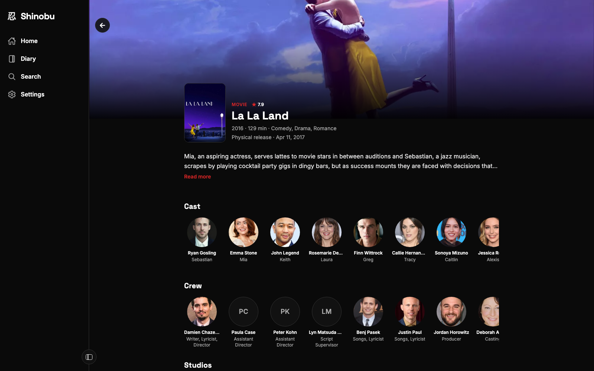
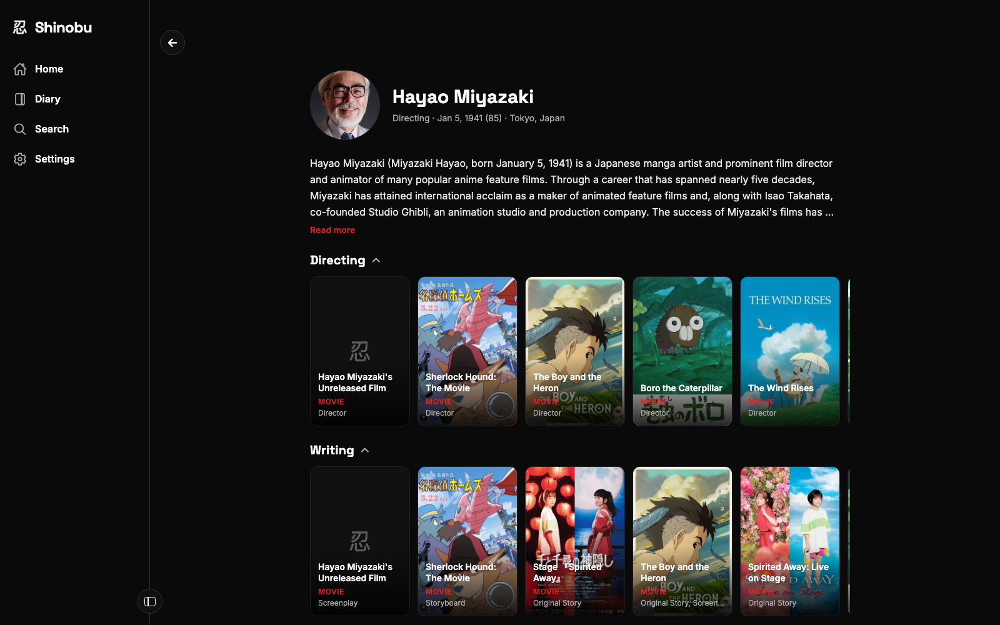

<p align="center">
  
</p>

<h1 align="center">Shinobu (忍)</h1>

<p align="center">A DB-less, cross-platform harness for your media trackers — log a movie, show, or anime once and every one you've connected stays in sync.</p>

<p align="center">
  
</p>

<p align="center">
  
  <br />
  <sub>Detail and person screens, both TMDB-first — no tracker connected.</sub>
</p>

## ✨ What it does

- 📝 **Log once** — mark something watched a single time and Shinobu writes it to every connected tracker it applies to, in parallel. If one write fails, you're told exactly which one.
- 📰 **One unified feed** — your history from every connected tracker, merged into a single timeline. A tracker having a bad day degrades to a missing row, never a blank screen.
- 📔 **A unified diary** — every watch and read log from every connected tracker in one reverse-chronological list, with same-day cross-tracker entries collapsed into a single row.
- 🔌 **Bring your own trackers** — connect any subset of your media trackers through each service's own sign-in flow. There is no Shinobu account to create.
- 🕶️ **No backend, no database** — your tokens (encrypted, on device) *are* the session. Nothing about you is stored anywhere else.
- ⏭️ **Up Next, timezone-correct** — an episode only counts as watchable once it has actually aired in *your* timezone, not the show's.
- 🔔 **Release notifications, local-only** — upcoming episodes for what you track are scheduled ahead of time on-device (iOS/Android). No push server, ever.
- 🚪 **Never a dead end** — if a write is impossible or fails on some tracker, you get a one-tap link to log it there yourself instead of an error.
- 📱 **Four platforms, one codebase** — Web, iOS, iPadOS, and Android from a single Expo project.

## 🛠️ Tech stack

| | |
| --- | --- |
| ⚛️ [Expo](https://expo.dev) + [Expo Router](https://docs.expo.dev/router/introduction/) | One codebase for all four platforms, file-based routing, [CNG](https://docs.expo.dev/workflow/continuous-native-generation/) — native projects are generated, never committed |
| 🎨 [Uniwind](https://docs.uniwind.dev) | Tailwind CSS for React Native, from the Unistyles team — theme tokens, light/dark variants |
| 🔄 [TanStack Query](https://tanstack.com/query) | Every read and write — caching, invalidation, and the cross-tracker write path |
| 🧬 [Effect](https://effect.website) | Typed errors, retries, and rate-limit backoff — contained to the provider service layer, never leaks into components |
| 🧵 [better-all](https://github.com/shuding/better-all) | `Promise.all` with automatic dependency optimization — how the write fan-out and the feed aggregation stay maximally parallel |
| ⚡ [Nitro Modules](https://nitro.margelo.com) | [`react-native-mmkv`](https://github.com/mrousavy/react-native-mmkv) (encrypted token storage), [`react-native-nitro-fetch`](https://github.com/margelo/react-native-nitro-fetch) (Cronet/URLSession networking on native), [`nitro-webview`](https://github.com/l2hyunwoo/nitro-webview) (the tracker sign-in and write-bridge WebViews) |
| 📜 [Legend List](https://github.com/LegendApp/legend-list) | Virtualized lists everywhere — pure TS, works on web, behind a single `components/List` wrapper |
| 🖼️ [expo-image](https://docs.expo.dev/versions/latest/sdk/image/) + [galeria](https://github.com/nandorojo/galeria) | Memory/disk-cached posters so long grids don't thrash memory; tap-to-zoom on posters and headshots |
| 👆 [pressto](https://github.com/enzomanuelmangano/pressto) | Every tappable surface — debounced, animated presses on gesture-handler + reanimated |
| 📳 [pulsar](https://github.com/software-mansion/pulsar) | Haptics on press and on log outcomes (native only — iOS Safari has no equivalent) |
| 🍎 [@expo/ui](https://docs.expo.dev/versions/latest/sdk/ui/) + [bottom sheet](https://github.com/software-mansion-labs/react-native-bottom-sheet) | Platform-native SwiftUI/Compose controls (date pickers, switches) and the sheets behind card actions & log confirmation |
| 📋 [react-hook-form](https://react-hook-form.com) + [zod](https://zod.dev) | Every connect form — validated client ids, tokens, and credentials before a single request goes out |
| 🔤 [torph](https://torph.lochie.me) | Text that morphs in place when your own state changes it — progress counts, watched lines (web only, a pure enhancement) |
| ⌨️ [react-native-keyboard-controller](https://github.com/kirillzyusko/react-native-keyboard-controller) | Consistent keyboard avoidance on every platform |
| 🔔 [expo-notifications](https://docs.expo.dev/versions/latest/sdk/notifications/) + [expo-background-task](https://docs.expo.dev/versions/latest/sdk/background-task/) | Locally scheduled release reminders, refreshed in the background — no push server |
| 🎬 [TMDB](https://www.themoviedb.org) | Metadata source (never a tracker) — powers detail screens, cast/crew, and the person/studio routes |
| ☁️ [Cloudflare Workers](https://developers.cloudflare.com/workers/) | Hosts the web build, plus two narrow, path-allowlisted relays for the calls a browser origin isn't allowed to make itself |
| 🧠 [React Compiler](https://react.dev/learn/react-compiler) | Automatic memoization — `useMemo`/`useCallback` are lint-banned |
| 🥟 [bun](https://bun.sh) | Package manager, script runner, and test runner (`bun:test` — no Jest) |
| 🦀 [oxlint](https://oxc.rs) | Conventions enforced as lint rules, not prose |

## 🚀 Getting started

> [!NOTE]
> Shinobu links native Nitro modules, so it can't run in plain Expo Go — iOS/Android need a custom dev client.

```sh
bun install

bun web            # run in the browser
bun ios            # build & run the iOS dev client
bun android        # build & run the Android dev client

bun ios.clean      # regenerate the native project first — needed after
bun android.clean  # app.json / config-plugin / native-dependency changes
```

Web dev also wants the Worker running alongside it, since `/api/*` doesn't exist
on Metro:

```sh
bun run dev:worker  # wrangler dev on :8787 — the Serializd/Letterboxd read proxies
```

### ✅ Checks

```sh
bun lint        # oxlint — conventions, import rules, filename casing
bun typecheck   # tsc --noEmit
bun test        # bun:test
bun check:links # probe the provider URLs the app depends on for rot
```

`lint`, `typecheck`, and `test` are the merge gate
([`ci.yml`](.github/workflows/ci.yml)) and run on every PR. `check:links` is
time-driven rather than diff-driven, so it runs daily on a schedule instead
([`link-health.yml`](.github/workflows/link-health.yml)) — plus on PRs that touch
the provider layer.

### 🌐 Web

```sh
bun run build:web   # static export
bun run deploy:web  # export + wrangler deploy
```

Deployed at [shinobu.glpecile.xyz](https://shinobu.glpecile.xyz).

## 📦 Releases

Android releases are cut from a tag on free GitHub-hosted runners — no EAS.
`bun release:bump patch|minor|major|X.Y.Z` moves `expo.version` and
`expo.android.versionCode` together, and pushing the matching `vX.Y.Z` tag
triggers [`release.yml`](.github/workflows/release.yml), which builds a signed
universal and arm64-v8a APK, checksums both, and publishes a GitHub Release with
auto-categorized notes. Full runbook: [`docs/releasing.md`](docs/releasing.md).

## 📚 Docs

- [`AGENTS.md`](AGENTS.md) — the conventions everything here is held to.
- [`plan.md`](plan.md) — product vision and architecture rationale.
- [`docs/plans/`](docs/plans/) — one blueprint per feature, written before building it.
- [`docs/solutions/`](docs/solutions/) — one file per solved bug or non-obvious pattern.
- [`docs/brainstorms/`](docs/brainstorms/) — raw exploration notes.

## ⚖️ License

[GPL-3.0-only](LICENSE).
