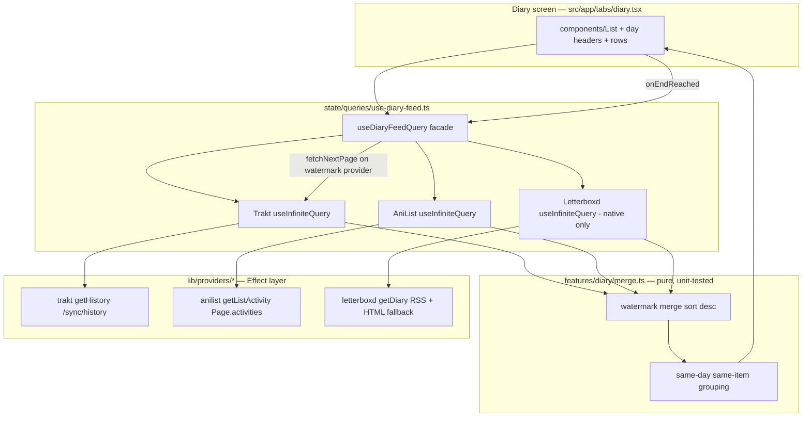

# Unified Diary - Plan

## Goal Capsule

- **Objective:** Ship a Diary route — a fourth navigation destination on mobile (native tab) and web (sidebar item) — showing a unified, reverse-chronological, infinitely-scrolling list of watch/read logs aggregated from every connected provider, with same-day cross-provider entries collapsed into one row.
- **Authority:** AGENTS.md conventions override this plan where they conflict; this plan overrides implementer preference; details the plan leaves open are implementer judgment.
- **Execution profile:** All changes are JS/TS-only (no new native modules, no `app.json` changes) — hot reload, no prebuild. Gates: `bun test`, `bun lint`, `bun run typecheck`.
- **Stop conditions:** Surface (don't guess) if a provider history endpoint's live response shape contradicts the directional shapes in U1–U3, or if the merge watermark design (KTD3) proves unable to prevent ordering gaps. If the Letterboxd HTML diary-page verification spike (U3) fails, ship the RSS window only and record the finding — that is a scope reduction, not a blocker.

---

## Product Contract

### Summary

A Diary page aggregates per-log history from all connected providers into one unified list, linked as a top-level destination in both navigation surfaces. Every log made through Shinobu appears there (the fan-out lands in provider history), alongside logs made in the providers directly — consistent with the DB-less, providers-are-the-store architecture.

### Problem Frame

Shinobu's core promise is "log once, it lands everywhere" — but after logging there is nowhere in the app to see what you've logged. The home feed shows in-progress and trending rows, not history. Users must open Trakt/AniList/Letterboxd individually to review their diary, which is exactly the fragmentation Shinobu exists to remove.

### Requirements

**Diary content**

- R1. The diary aggregates per-log watch/read history from every connected provider (Trakt, AniList, Letterboxd) into one reverse-chronological list. Provider history is the source — there is no local journal (DB-less; app-made logs appear because the fan-out writes them to providers).
- R2. Entries for the same media item on the same local calendar day collapse **across providers** into one entry showing the icons of every contributing provider. Collapse never merges two logs from the same provider: a binge day or a same-day rewatch stays as distinct entries, each keeping its R3 detail.
- R3. Entries carry enough log detail to be meaningful: the media item, the watch date, and for TV/anime/manga the episode/chapter detail (e.g. "S2E5", "Ep 3–5", "Ch 41").
- R4. All timestamps are treated as instants (parsed with offset/Z or converted from epoch), and day grouping uses the user's local timezone — the same correctness principle as Up Next (AGENTS.md "Up Next & Timezones").

**Navigation & route**

- R5. Diary is a top-level destination: a `NativeTabs` trigger on iOS/Android and a sidebar `NAV_ITEMS` entry on web, following the platform-native nav idioms already established.
- R6. Tapping a diary row opens the existing details screen for that item.

**Presentation**

- R7. The list is virtualized (`components/List`) and paginated via infinite scroll — histories run to thousands of entries.
- R8. Entries are grouped under day headers (e.g. "Today", "July 20"); the header appends the year whenever the entry's local calendar year differs from the current year (e.g. "July 20, 2025"), since multi-year scroll-back otherwise repeats identical headers.
- R9. The zero-entry screen has four distinct states, in precedence order: (1) no providers connected → a connect prompt linking to Settings; (2) providers connected but none readable on this platform (e.g. Letterboxd-only on web) → a "connect on mobile" message reusing the established CORS-policy framing, never the generic prompts; (3) every connected, platform-capable provider failed on initial load → a load-failure state with a retry action, never "no logs yet"; (4) loads succeeded with zero entries → a "no logs yet" tile. States (1), (2), and (4) render through a new shared empty-state tile component (icon + headline + optional CTA, sized for in-list embedding) that the Home zero-providers case also adopts — the codebase has no reusable empty-state component today, only Home's bespoke full-screen hero.

**Resilience & platform**

- R10. Per-provider partial failure: one provider's history read failing degrades to a notice over the entries that did load — never a blank screen (same contract as the feed and the fan-out). The notice is a persistent (non-dismissible) banner at the top of the list naming the failed provider(s), with tap-to-retry, re-evaluated whenever any provider's initial or pagination fetch fails — not shown once and forgotten.
- R11. Letterboxd diary reads are native-only on web (`docs/solutions/web-cors-letterboxd.md`) — the web diary aggregates Trakt + AniList only, silently, with no proxy.
- R12. All provider payloads are normalized before reaching components (new `NormalizedDiaryEntry` contract); components never see raw history payloads.

### Acceptance Examples

- AE1. **Fan-out collapse.** Given a movie logged through Shinobu that fanned out to Trakt and Letterboxd, when the diary loads, then the movie appears as one entry for that day with both provider icons — not two rows.
- AE2. **Partial failure.** Given Trakt and AniList connected, when the AniList history read fails (e.g. 429), then Trakt entries still render with a notice that some content could not be loaded.
- AE3. **Web degradation.** Given Letterboxd connected, when the diary is opened on web, then only Trakt/AniList entries appear and nothing errors.
- AE4. **Timezone day boundary.** Given a Trakt entry watched at `2026-07-20T23:30:00Z` and a user in UTC−05:00, when the diary groups by day, then the entry appears under July 20 local (18:30), not July 21.
- AE5. **Total failure is not emptiness.** Given Trakt and AniList connected, when every provider's initial history read fails (e.g. the device is offline), then the diary shows the load-failure state with a retry action — never the "no logs yet" tile.
- AE6. **Same-provider logs never collapse.** Given three Trakt episode entries of one show on the same local day, when the diary groups entries, then three rows render (each with its episode detail) — not one.

### Scope Boundaries

**Out of scope**

- Editing or deleting diary entries (provider writes beyond the existing log fan-out).
- Displaying or entering ratings/reviews in the diary.
- Any backend, proxy, or push infrastructure.

**Deferred to Follow-Up Work**

- Filters (by provider, media type, date range) and a search-within-diary.
- A "logged via Shinobu" badge backed by a device-local MMKV journal (considered and deferred — device-local only, so it can't be accurate cross-device).
- Stats/heatmap views over diary data.
- Trakt episode entries could deep-link to the show's season accordion instead of the show details root.
- Letterboxd history deeper than the RSS window, if the HTML diary-page verification spike (U3) fails — the RSS-sourced recent window ships regardless.

---

## Planning Contract

### Key Technical Decisions

- KTD1. **Source = provider history endpoints.** Trakt `GET /sync/history` (authenticated, paginated), AniList `Page.activities` GraphQL (type `MEDIA_LIST` for the viewer, sorted newest-first), and for Letterboxd the **already-verified public RSS feed** (`{username}/rss/`, confirmed working in `docs/solutions/letterboxd-no-api-fallback.md`; each entry carries `tmdb:movieId`, `watchedDate`, and a rewatch flag) as the primary source for the recent ~50-entry window. Deeper Letterboxd history via HTML diary pages (`{username}/films/diary/page/N/`) only **after** a verification spike (fetch + markup inspection, no Cloudflare challenge — the same pre-code verification the watchlist got), recorded in `docs/solutions/`. Rationale: DB-less and cross-device; a local journal would miss logs from other devices and die on reinstall; RSS gives real TMDB ids where the HTML scrape has only slug/title/year.
- KTD2. **New `NormalizedDiaryEntry` in `src/types/media.ts`.** Directionally: a stable per-log `id` (`${provider}-${nativeLogId}`), `provider`, `watchedAt` (ISO instant; Letterboxd carries date-only precision — see KTD4), an embedded `NormalizedMediaItem`, and episode/chapter numbers as a set (an AniList "watched episode 3 - 5" activity is one entry carrying {3,4,5}; a movie carries none). The presentation-side grouped shape (day + merged entry with `providers[]` and the union of episode numbers) is derived by pure functions, not stored; a pure `formatEpisodeRange` helper renders contiguous runs as "3–5" and gaps as "2, 5".
- KTD3. **Pagination = per-provider infinite queries + watermark merge.** Each provider gets its own `useInfiniteQuery` cursor (Trakt page number, AniList page number, Letterboxd page number). A pure merge function first **deduplicates by entry id, keeping the newest occurrence** — all three providers paginate by page number over prepend-mutable histories, so a log made between fetches shifts pages and page N+1 re-returns the tail of page N — then sorts all loaded entries descending by `watchedAt` and only exposes entries at or after the *watermark* — the newest "oldest-loaded" timestamp among providers that still have more pages — so the unified list never shows a gap that a not-yet-fetched page would fill. `fetchNextPage` advances the provider(s) sitting at the watermark. Failed or exhausted providers drop out of the watermark computation. This is the core algorithm of the feature; it lives in `src/features/diary/` as pure, unit-tested functions.
- KTD4. **Grouping = cross-provider only, id-matched, detail-preserving.** Bucket by (local calendar day, item identity), where item identity is matched by shared `tmdb` id (RSS supplies it for Letterboxd — see KTD1), else shared `imdb` id, else normalized title+year as the residual fallback (HTML-scraped deep-history rows only). Within a bucket, an entry merges only with entries from **other** providers whose episode/chapter set matches (the fan-out signature); movies match on "no episodes". Two entries from the same provider never merge (R2/AE6 — binge days and rewatches stay distinct rows), and cross-provider entries whose episode sets differ (provider-side batching asymmetry) stay separate rows rather than guessing. A merged entry's display fields follow the app's established `applyPrimaryMetadata` precedence (`lib/providers/merge-metadata.ts`) so the richest metadata wins deterministically regardless of match order. Date-only Letterboxd entries group by their diary date directly, parsed with the local-midnight helper exported from `src/lib/time/has-aired.ts` (reuse, not a second implementation — AGENTS.md centralizes this exact comparison), and sort after instant-bearing entries within the same day.
- KTD5. **Effect containment unchanged.** New reads are Effects in `lib/providers/*` with tagged errors, run via `Effect.runPromise` inside `queryFn` — no Effect types in hooks or components.
- KTD6. **Row art via lazy recovery.** Trakt sync endpoints return no images (`docs/solutions/trakt-watched-endpoints-2026-api-changes.md`) — diary rows consume `useTraktMediaImages` per rendered card, exactly like the watched rows; never bulk-enrich the history.
- KTD7. **Details resolution.** `src/app/details/[id].tsx` resolves items from feed slots → search cache → TMDB cache; diary items are in none of these. Add a diary-cache scan (mirroring `findInSearchCache`) to that chain so R6 works for any diary row.
- KTD8. **Loading/error posture.** The diary's initial-load skeleton and the R10 notice are computed from several queries at once — the cross-provider aggregate case AGENTS.md explicitly allows; single-query `isLoading`/`isError` branching stays banned.
- KTD9. **Rate-limit discipline.** AniList pages at ~50 per request with a generous `staleTime` (history is append-mostly), inside the 30 req/min budget (`docs/solutions/anilist-rate-limit-retry-storm.md`). `invalidateAfterLog` in `use-log-media.ts` additionally invalidates diary query keys so a fresh log appears on next diary visit. The diary infinite queries set `maxPages` (with `getPreviousPageParam` so scroll-back still works) — otherwise invalidation or remount replays every accumulated page sequentially, and a deep-scrolled AniList history would burn the whole rate budget in one refetch.

### High-Level Technical Design

### Sources & Research

- `docs/solutions/trakt-watched-endpoints-2026-api-changes.md` — Trakt sync endpoints: pagination mandatory, images removed; the lazy art-recovery pattern KTD6 reuses.
- `docs/solutions/letterboxd-no-api-fallback.md` — the verified Letterboxd read surfaces: RSS feed (tmdb ids, watched dates, rewatch flags, ~50-entry window) and watchlist HTML; also documents which endpoints are Cloudflare-walled — the reason U3's HTML diary pages need a verification spike before code.
- `docs/solutions/web-cors-letterboxd.md` + `docs/solutions/letterboxd-web-proxy.md` — Letterboxd reads native-only on web; no proxy; platform gate lives in `state/queries/letterboxd.ts`, not the registry.
- `src/lib/time/has-aired.ts` — the local-midnight date-only parse helper KTD4 reuses (export it rather than re-implementing).
- `docs/solutions/anilist-rate-limit-retry-storm.md` — 30 req/min budget; staleTime discipline KTD9 follows.
- `src/lib/providers/letterboxd/watchlist.ts` — the scrape-and-parse pattern U3 mirrors (fixture-based parser tests included).
- `src/features/log-media/use-log-media.ts` (`invalidateAfterLog`) — where diary invalidation hooks in.
- `src/app/details/[id].tsx` (`findItemById` → `findInSearchCache` → `findInTmdbCache`) — the resolution chain KTD7 extends.
- `src/state/queries/use-unified-feed.ts` — the per-slot query-options + aggregate-hook shape `use-diary-feed.ts` follows.

### Open Questions

All deferred — none blocks implementation; the implementer applies the stated default and flags disagreement rather than stalling.

- **Cold-start posture.** Whether first render shows the fastest provider's page immediately or waits for every connected provider's first page. Default: render as pages arrive behind the watermark (skeleton until the first page lands).
- **AniList activity visibility.** AniList users can hide list activity per-account or per-entry, so an AniList history can be sparse or empty despite real logs, and the app cannot detect why. Default: accept the limitation; the U2 caveat records it, and the "no logs yet" tile stays generic.
- **Backdated logs.** Trakt/Letterboxd place a backdated log at its historical date while AniList activity timestamps the log moment — the same fanned-out log can land on different days and never collapse. Default: accept the divergence for now.
- **Diary tab at zero providers.** Default: the destination stays visible and shows the R9 connect state, rather than hiding the tab.

---

## Implementation Units

### U1. Diary contract + Trakt history read

- **Goal:** Define `NormalizedDiaryEntry` and land the first provider read so the contract is proven against the richest source.
- **Requirements:** R1, R3, R4, R12
- **Dependencies:** none
- **Files:** `src/types/media.ts`, `src/lib/providers/trakt/reads.ts`, `src/lib/providers/trakt/normalize.ts`, `src/lib/providers/trakt/normalize.test.ts`, `src/state/queries/trakt.ts` (query-key builder entry)
- **Approach:** `getHistory(deps, { page, limit })` → `GET /sync/history?extended=full&page=N&limit=50`. Each history item carries a unique log `id`, `watched_at` (ISO instant), `action`, and `type` (`movie` | `episode`); episode items embed both `episode` and `show` objects — normalize those to a diary entry whose media item is the *show* with episode detail attached. End-of-history is a short page (same loop contract as `getWatchedShows`, but here one page per infinite-query cursor, no internal loop). Verify the live response shape against current Trakt docs at implementation — the 2026 changes prove this API churns.
- **Patterns to follow:** existing reads in `trakt/reads.ts` (Effect, tagged errors, pagination params), `normalize.ts` naming.
- **Test scenarios:**
  - Movie history item → entry with `trakt-${historyId}` id, instant `watchedAt`, item type MOVIE.
  - Episode history item → entry whose item is the show, with season+episode detail preserved.
  - Covers AE4: `watched_at` parsed as an instant, not a bare date.
  - Empty page → empty array (signals exhaustion).
  - Malformed payload → tagged provider error, not a throw.
- **Verification:** `bun test` green; new read callable behind a query key.

### U2. AniList activity read

- **Goal:** AniList's diary equivalent — the viewer's media-list activity — normalized to the same contract.
- **Requirements:** R1, R3, R4, R12
- **Dependencies:** U1 (contract)
- **Files:** `src/lib/providers/anilist/reads.ts`, `src/lib/providers/anilist/normalize.ts`, `src/lib/providers/anilist/normalize.test.ts` (or a dedicated test file beside the read), `src/state/queries/anilist.ts` (query keys)
- **Approach:** `getListActivity(deps, { page, perPage })` → `Page(page,perPage){ activities(userId:$viewer, type: MEDIA_LIST, sort: ID_DESC) { ...on ListActivity { id status progress createdAt media {...} } } }`, reusing `getViewerId`. Keep only watch/read-shaped statuses (`watched episode`, `rewatched`, `read chapter`, `completed`); drop plan/pause/drop activities. `createdAt` is epoch seconds → ISO instant. `progress` strings like `"3 - 5"` become the entry's episode/chapter number set (KTD2). Honest caveats, recorded here: AniList activity reflects *list updates* (including manual progress edits) — the closest diary analogue the API offers — and per-account/per-entry activity-visibility settings can hide entries entirely, so an empty AniList slice is not proof of no history (see Open Questions).
- **Patterns to follow:** `getCurrentAnime` GraphQL read shape; `anilistQueryKeys` builder.
- **Test scenarios:**
  - Watched-episode activity → ANIME entry with episode detail.
  - Completed-movie activity (`isFilm`) → entry without episode detail.
  - Read-chapter activity → MANGA entry with chapter detail.
  - Plans-to-watch activity → filtered out.
  - Epoch `createdAt` → correct ISO instant (covers AE4's instant discipline).
- **Verification:** `bun test` green; page size and staleTime respect the 30 req/min budget (KTD9).

### U3. Letterboxd diary read

- **Goal:** Read the public diary — RSS first (verified, id-bearing), HTML pages only for deeper history after verification — so Letterboxd logs (including Shinobu's own fanned-out writes) appear.
- **Requirements:** R1, R3, R11, R12
- **Dependencies:** U1 (contract)
- **Files:** `src/lib/providers/letterboxd/diary.ts`, `src/lib/providers/letterboxd/diary.test.ts`, `src/state/queries/letterboxd.ts` (query keys + web gate)
- **Approach:** Primary source is the already-verified RSS feed `https://letterboxd.com/{username}/rss/` (`docs/solutions/letterboxd-no-api-fallback.md`): parse entries into diary entries carrying the TMDB id (`tmdb:movieId`), title/year, `watchedDate` (day precision — normalize with the date-only marker per KTD4), and the rewatch flag; entry id from the RSS item guid. Detect a private/nonexistent profile (feed absent or empty page markers) and surface it as a tagged provider error — rendered under the R10 banner — never as silent exhaustion. Deeper history beyond the RSS window comes from `https://letterboxd.com/{username}/films/diary/page/N/` HTML **only after a verification spike** (fetch a real diary page, confirm parseable markup and no Cloudflare challenge; record the outcome in `docs/solutions/` either way); if the spike fails, the RSS window is the whole Letterboxd diary (Scope Boundaries). The HTML parser, when built, follows the `watchlist.ts` fixture-driven pattern with tagged parse errors on markup drift. Native-only: the web `webFetch` dep is undefined, and the diary query is disabled on web via the same gate style as the watchlist query (gate in `state/queries/letterboxd.ts`, registry `canRead` untouched).
- **Execution note:** Run the HTML verification spike before writing the HTML parser — the RSS path is not blocked on it.
- **Patterns to follow:** `parseWatchlistPage` + its fixture tests; `letterboxdReadsAvailable`.
- **Test scenarios:**
  - RSS fixture → entries with tmdb id, title, year, diary date, and rewatch flag.
  - RSS item without a tmdb id (edge) → entry still normalizes with title+year identity.
  - Private/absent profile fixture → tagged provider error, not empty-success.
  - Multi-entry day (same film twice) → distinct entries with distinct ids.
  - HTML fixture (if the spike passes): parse page → entries; next-link → cursor advances; last page → exhaustion; unrecognizable markup → tagged parse error.
  - Covers AE3 (with U4): query disabled on web, no error surfaced.
- **Verification:** `bun test` green; RSS read runs on native, silently absent on web; spike outcome recorded in `docs/solutions/`.

### U4. Merge, grouping, and the diary feed hook

- **Goal:** The unified feed logic: per-provider cursors merged into one gapless, grouped, reverse-chronological stream.
- **Requirements:** R1, R2, R4, R7, R10, R11
- **Dependencies:** U1, U2, U3 (U4 can land with any subset wired; the merge is provider-count-agnostic)
- **Files:** `src/features/diary/merge.ts`, `src/features/diary/merge.test.ts`, `src/state/queries/use-diary-feed.ts`, `src/features/log-media/use-log-media.ts` (extend `invalidateAfterLog`), `src/lib/time/has-aired.ts` (export the date-only parse helper)
- **Approach:** Pure functions first (KTD3/KTD4): `mergeDiaryEntries(pages per provider, providerStates)` dedups by entry id (newest occurrence wins), applies the watermark cut, and sorts descending; `groupDiaryEntries(entries, localTimeZone)` produces day buckets with cross-provider collapse (matching episode sets only, never same-provider), `providers[]`, unioned episode numbers, and `applyPrimaryMetadata`-precedence display fields per merged entry; `formatEpisodeRange` renders the detail line. Date-only parsing reuses the helper exported from `lib/time/has-aired.ts`. `useDiaryFeedQuery` composes one `useInfiniteQuery` per connected+platform-capable provider (query options defined once, `use-unified-feed.ts` style; `maxPages` + `getPreviousPageParam` per KTD9), exposes `{ days, isLoading, errors, hasNextPage, fetchNextPage, refetch }`, and routes `fetchNextPage` to the watermark provider(s). Extend `invalidateAfterLog` to invalidate diary keys for the providers that succeeded.
- **Execution note:** Build the merge/grouping functions test-first — the watermark, dedup, and identity edge cases are the risk core of the whole feature; the hook is thin plumbing around them.
- **Test scenarios:**
  - Watermark: provider A loaded to July 1, provider B to July 10 with more pages → entries older than July 10 from A are held back; after B exhausts, they release.
  - Exhausted provider excluded from watermark; single-provider case degenerates to plain pagination.
  - Failing provider: excluded from watermark, surfaced in `errors` (covers AE2; all providers failing → zero entries + all-error state for AE5).
  - Dedup: consecutive pages overlapping by one entry after a simulated prepend → no duplicate rows, newest occurrence kept.
  - Covers AE1: Trakt + Letterboxd entries, same tmdb-matched film, same local day → one merged entry, two providers.
  - Covers AE6: three same-day Trakt episode entries of one show → three rows; two same-day Trakt logs of one movie (double feature/rewatch) → two rows.
  - Cross-provider entries with mismatched episode sets (Trakt {3} vs AniList {3,4,5}) → not merged.
  - `formatEpisodeRange`: {3,4,5} → "3–5"; {2,5} → "2, 5".
  - Identity fallback: no shared ids, matching normalized title+year → merged; different year → not merged.
  - Different local days → not merged.
  - Covers AE4: UTC-evening instant groups into the previous local day for a negative-offset zone.
  - Date-only (Letterboxd) entry sorts within its day after instant entries and never advances the watermark past its day.
- **Verification:** `bun test` green; hook exposes no Effect types (containment rule).

### U5. Diary screen + navigation

- **Goal:** The user-facing page, reachable from both navigation surfaces.
- **Requirements:** R5, R6, R7, R8, R9, R10
- **Dependencies:** U4
- **Files:** `src/app/(tabs)/diary.tsx`, `src/features/diary/diary-list.tsx` (rows/headers as needed), `src/components/empty-state-tile.tsx` (new shared component, adopted by Home's zero-provider case too), `src/app/(tabs)/_layout.tsx`, `src/components/app-shell/index.web.tsx`, `src/app/(tabs)/index.tsx` (consume the shared tile), `src/lib/routes.ts`, `src/app/details/[id].tsx`, `src/state/queries/use-diary-feed.ts` (cache-scan helper), `src/features/diary/merge.test.ts` or a sibling test for the helper
- **Approach:** Add `routes.diary`; a `NativeTabs.Trigger` for `diary` between Home and Settings (icon: a book/journal glyph — verify exact `md`/`sf` names at implementation; Search keeps its `role="search"` last slot); a `NAV_ITEMS` entry (`book-outline`) after Home on web. The screen renders `useDiaryFeedQuery` through `components/List` with day headers (year appended per R8), rows of poster (`components/image` + `useTraktMediaImages`), title, `formatEpisodeRange` detail line, provider icons (`components/provider-icon`) — the icon cluster carries a wrapping accessibility label enumerating the providers (e.g. "Logged via Trakt, Letterboxd"), since unlike every other `ProviderIcon` call site no adjacent visible text names them — and `Presstable*` press → `routes.details(item.id)`. `onEndReached` → `fetchNextPage` with a footer spinner; pull-to-refresh wired to refetch every provider's diary query, mirroring the sibling screens' `RefreshableScrollView` pattern. Initial-load skeleton per KTD8; the R10 failure banner (persistent, names failed providers, tap-to-retry); the four R9 states via the shared empty-state tile. For R6, add a diary-cache scan (exported helper beside `use-diary-feed.ts`) to the details resolution chain after the search-cache step (KTD7).
- **Patterns to follow:** home screen (`src/app/(tabs)/index.tsx`) + `feed-rows.tsx` for screen composition; `media-card.tsx` for art recovery; existing empty-state tiles; kebab-case filenames; no direct `@legendapp/list`/`Pressable`/`expo-image` imports (oxlint enforces).
- **Test scenarios:**
  - Diary-cache scan helper: id present in cached diary pages → returns the embedded media item; absent → undefined.
  - Remaining UI is presentation wiring — behavior covered by U4's tests. `Test expectation: none` for the layout/nav files themselves (styling/wiring).
- **Verification:** Diary reachable via mobile tab and web sidebar; rows open details; `bun lint` and `bun run typecheck` green; manual smoke on web (`bun web`) and the dev client — hot reload only, no prebuild.

---

## Verification Contract

| Gate | Command | Applies to |
|---|---|---|
| Unit tests | `bun test` | U1–U5 (merge/normalize/parse suites are the proof core) |
| Lint | `bun lint` | all units (wrapper/import rules are oxlint-enforced) |
| Types | `bun run typecheck` | all units |
| Web smoke | `bun web` — diary renders, AE3 holds, no CORS errors | U4, U5 |
| Native smoke | dev client — Letterboxd entries present, tab nav works | U3, U5 |

Manual partial-failure check before calling the feature done: disconnect one provider (or force a failure) and confirm AE2's degraded rendering.

---

## Definition of Done

- All five units landed; every gate above green.
- AE1–AE6 each verifiably hold (unit tests for AE1/AE2/AE4/AE5/AE6 via U4; manual web check for AE3).
- Diary is reachable from both navigation surfaces and rows resolve to working detail screens.
- No abandoned experimental code in the diff; no new hardcoded colors (theme tokens only); no direct imports of wrapped libraries.
- Any network anomaly discovered against the three history endpoints is written to `docs/solutions/` in the same PR (AGENTS.md compound-knowledge rule).
