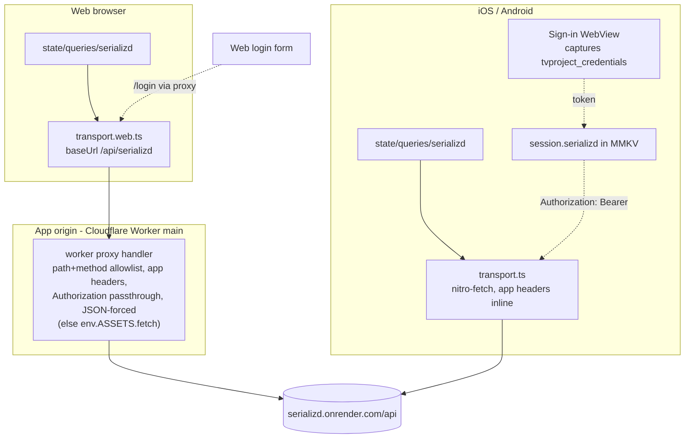
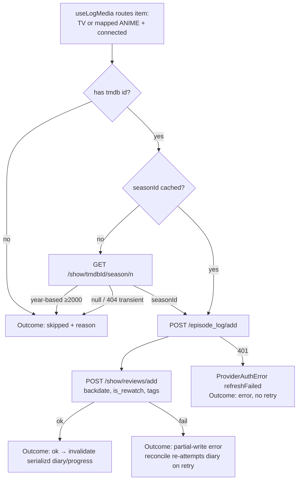

# Serializd Provider - Plan

## Goal Capsule

- **Objective:** Add Serializd (serializd.com, TV tracking) as Shinobu's fourth symmetric opt-in provider: registry-declared TV read+write capability, WebView sign-in capture on mobile, email/password login on web through a new stateless same-origin Cloudflare Worker proxy, episode/season/diary writes in the `useLogMedia` fan-out, and diary reads merged into the unified diary.
- **Authority:** AGENTS.md conventions override this plan where they conflict — except the Web & CORS "never proxied" rule, which U4 amends by owner decision; this plan overrides implementer preference; details the plan leaves open are implementer judgment.
- **Execution profile:** JS/TS throughout (no new native modules — the WebView component Letterboxd uses is already linked; hot reload on native). The web build stays `web.output: "static"`; the proxy ships as a `main` entrypoint added to the existing `wrangler.jsonc` (owner decision 2026-07-21), so the static export and Workers Builds pipeline are untouched. Gates: `bun test`, `bun lint`, `bun run typecheck`.
- **Stop conditions:** Surface (don't guess) if live responses contradict the endpoint shapes in the Appendix; if a dev-client nitro-fetch GET with the app headers does not return 200 (native transport dead — see U3 verification); if the `tvproject_credentials` cookie never appears in the mobile WebView cookie jar after sign-in (fall back to a spike on localStorage/response interception before building further); or if `/show/reviews/add` rejects the documented payload — in that case ship watched-only writes (`/episode_log/add`, `/watched_v2`) and record the finding as a scope reduction, not a blocker.

---

## Product Contract

### Summary

Serializd becomes a fourth provider alongside Trakt, AniList, and Letterboxd. Its unofficial JSON API (reverse-engineered by serializd-py and two sibling projects) is TMDB-keyed and token-authenticated, which makes it a natural TV write target: logging a TV episode (or a mapped anime series episode) fans out to it, and its diary feeds the unified diary. Web support arrives via the repo's first CORS proxy — a Cloudflare Worker `main` handler added to the existing static-assets Worker, a deliberate, recorded exception to the "never proxied" policy.

### Problem Frame

Shinobu logs TV to Trakt only; Serializd users must double-log. Serializd has no official API, but its private API is stable enough that at least three open-source clients (serializd-py, unserializd, trakt-serializd-sync) build on it, it needs no OAuth app registration, and — unlike Letterboxd — its writes work from plain HTTP clients with a replayed bearer token (no Cloudflare fingerprint wall). The only hard wall is browser CORS: the API's `Access-Control-Allow-Origin` allowlist echoes only serializd.com origins, so Shinobu web cannot call it directly (verified 2026-07-21; `Origin` is browser-controlled and unspoofable in JS).

### Requirements

**Provider & routing**

- R1. Serializd is registered in the provider registry as `{ mediaTypes: ['TV'], canRead: true, canWrite: true }`; routing derives everything from the registry (no inline provider checks at call sites).
- R2. Anime series fan out to Serializd exactly as they do to Trakt: `effectiveTypes` already maps non-film `ANIME` to `TV` when the item carries movie/TV ids, so a TMDB-id-enriched anime series routes to Serializd with no routing-code change.
- R3. Per-provider partial failure is preserved: a Serializd write failure surfaces as its own `ProviderLogOutcome` while other providers' writes succeed; a Serializd read failure degrades only its slice of the unified diary.

**Sessions & auth**

- R4. Mobile connect: the user signs into serializd.com inside a modal WebView; Shinobu captures the `tvproject_credentials` cookie (its value is the access token), validates it via `/validateauthtoken`, and stores `{ accessToken, username }`.
- R5. Web connect: an email/password form posts to `/login` through the same-origin proxy; the returned token is validated and stored identically. The password is exchanged for the token and discarded — never persisted.
- R6. The session persists in MMKV under `session.serializd` (auto-appears in `connectedProviderIds()`); disconnect purges all queries rooted at `['serializd']`.
- R7. Serializd has no refresh token: a 401 maps to `ProviderAuthError({ refreshFailed: true })`, surfacing the established per-provider "reconnect" failure, and is never retried.

**Writes (log fan-out)**

- R8. Logging a TV/anime episode to Serializd marks it watched (`/episode_log/add`) then adds a dated diary entry (`/show/reviews/add` with `backdate` set to the watch instant), matching how a Shinobu log lands as a diary entry on other providers. Whole-season logs use `/watched_v2`. The two writes are not atomic: if the episode-watched call succeeds but the diary call fails, the outcome is a distinct partial-write error (not `ok`), and reconcile must not treat the episode as fully logged on retry (see R12).
- R9. Episode/season writes resolve the Serializd `seasonId` via `GET /show/{tmdbId}/season/{n}` first; a write that cannot proceed produces a `skipped` outcome carrying a reason — never a silent drop and never a hard error that fails the fan-out. Skip reasons: year-based season numbers (≥ 2000, permanently unmappable), a routed item with no `externalIds.tmdb` (no join key), or a transient season-unavailable result (`seasonId: null` / 404) that self-heals (see KTD6).
- R10. The log sheet's existing tags field applies to Serializd (its diary payload accepts `tags`), alongside `is_rewatch` from the existing rewatch flow.

**Reads**

- R11. The unified diary gains a fourth provider slice: `GET /user/{username}/diary?page=N` is a real paginated infinite query (unlike Letterboxd's single RSS window), normalized to `NormalizedDiaryEntry`. `backdate` is the displayed watch instant, but the diary is not guaranteed sorted by it (Appendix) — so watermark-merge ordering keys on the server's page order (`dateAdded`), not `backdate` (see KTD8).
- R12. `providerHasWatch` answers for Serializd via `GET /user/{username}/show/{tmdbId}/progress` so reconcile/skip semantics work in the fan-out. Because a Serializd log is a two-call sequence (R8), progress alone (episode watched) does not prove the diary entry landed: reconcile treats a Serializd episode as fully logged only when its diary entry is present, not on progress alone — otherwise a retry after a partial write silently drops the diary entry.
- R13. Serializd reads and writes work on web through the proxy — the Letterboxd-style `EXPO_OS !== 'web'` gate must NOT be copied.

**Web proxy**

- R14. A stateless Cloudflare Worker `main` handler on the app's own origin forwards an allowlisted set of Serializd API path+method pairs, attaching the required `Origin`/`Referer`/`X-Requested-With` headers server-side and passing through only `Authorization` (no incoming cookies or other client headers forwarded upstream). It caps request body size and upstream latency, forces `Content-Type: application/json` + `X-Content-Type-Options: nosniff` on every relayed response (never relaying an HTML upstream error body verbatim under the app origin), emits no `Access-Control-Allow-Origin`, stores nothing, logs no request bodies or `Authorization`, and holds no credentials. All other request paths fall through to the existing static-asset serving.
- R15. The policy change is recorded: AGENTS.md's Web & CORS section gains the Serializd exception with the proxy's abuse-containment invariants written as a contract (path+method allowlist, no ACAO, no cookies either direction, no body logging, size/timeout caps), so future edits to the handler are reviewed against it and the next planning pass doesn't re-litigate it.

**Platform & resilience**

- R16. Session reads are SSR-safe (`getServerSnapshot` returns disconnected; no module-top-level MMKV reads in web-reachable code).
- R17. Serializd queries declare explicit staleTimes (diary ~5 min, progress ~5 min, season-id lookups cached forever) and its errors map to the tagged `Provider*Error` types so the global retry predicate never retries auth/rate-limit failures.

### Acceptance Examples

- AE1. **Anime fan-out.** Given AniList + Serializd connected and a non-film anime series enriched with a TMDB id, when the user logs episode 5, then the fan-out targets include Serializd and the episode lands in the Serializd diary with the correct backdate.
- AE2. **Partial failure.** Given Trakt + Serializd connected, when the Serializd write 401s (revoked token), then Trakt's write succeeds, the outcome list shows Serializd failed with a reconnect hint, and nothing is retried.
- AE3. **Web write path.** Given a user connected on web via the email/password form, when they log a TV episode, then the write goes browser → same-origin proxy → Serializd and succeeds without any CORS error.
- AE4. **Unresolvable season.** Given a show whose Serializd season lookup returns `seasonId: null`, when the user logs it, then Serializd's outcome is `skipped` with a season-unavailable reason and other providers still receive the write.
- AE5. **Disconnect hygiene.** Given a connected Serializd session with cached diary pages, when the user disconnects, then all `['serializd', …]` queries are purged and the diary re-renders without Serializd entries.
- AE6. **Partial-write recovery.** Given an episode whose `/episode_log/add` succeeded but `/show/reviews/add` failed, when the user retries the log, then reconcile re-attempts the diary write (does not skip on progress alone) and the outcome is not reported as a prior success.

### Scope Boundaries

**Deferred to Follow-Up Work**

- **Letterboxd credential login via the v0 API (strong follow-up candidate).** The Letterboxd v0 API (`https://api.letterboxd.com/api/v0/`) supports the OAuth2 **password grant** — `POST auth/token` with `grant_type=password` + username/password (form-urlencoded), returning `{access_token, token_type: Bearer, expires_in, refresh_token}`, with every request signed HMAC-SHA256 over method+URL+body plus `apikey`/`nonce`/`timestamp`/`signature` params (confirmed in `swizzlevixen/letterboxd` `letterboxd/api.py` + `services/auth.py` and `boxdot/letterboxd-rs` `src/client.rs`). This is the same credential-login shape as Serializd's `/login` but with a real refresh token — if adopted it would replace Letterboxd's fragile always-mounted hidden write-WebView and `cf_clearance` dance entirely (writes would replay from plain HTTP / the proxy, and web parity — abandoned in `todos/011`/plan 0015 — becomes reachable). The blocker is the API **key + secret**: either official approval (`api@letterboxd.com`, which excludes "personal projects" — the existing AGENTS.md access risk) or the APK-embedded key/secret path (`lumaaaaaa/letterboxdAPI`, reverse-engineered, ToS-gray). Worth a dedicated spike/plan that reuses this plan's transport-swap + credential-form patterns.
- Serializd watchlist / currently-watching / paused / dropped feed slots in the home feed (endpoints exist — see Appendix — but the unified feed slot design is its own piece of work).
- Ratings and review text in the log sheet (the diary payload accepts them; UI is a separate feature).
- History import/backfill from Serializd.
- At-rest MMKV encryption (`todos/003`) — the Serializd token inherits the existing plaintext caveat; do not add `encryptionKey` piecemeal here.

**Outside this product's identity**

- Serializd as a metadata source: TMDB remains the metadata source for detail screens; Serializd catalogue endpoints are used only to resolve `seasonId` for writes.
- A general-purpose proxy: the API route forwards Serializd paths only, and only because CORS blocks the browser — it must not grow into a backend.

---

## Planning Contract

### Key Technical Decisions

- KTD1. **Bearer-token auth, two capture paths, one session shape.** The API accepts the token as `Authorization: Bearer` or as the `tvproject_credentials` cookie; Shinobu always sends the header and stores `{ accessToken, username }` in the existing `ProviderSession` (no new fields). Mobile captures the token from the WebView cookie jar; web obtains it from `/login` via the proxy. Login response shape varies across clients (`{username, token}` vs `{token, user: {username}}`) — parse both.
- KTD2. **TMDB is the join key; no `externalIds.serializd` field.** Serializd keys shows by TMDB id, so `externalIds.tmdb` is sufficient. Consequence: the ani.zip enrichment gate in `src/features/log-media/enrich.ts` currently runs only when Trakt is connected — widen it to Trakt-or-Serializd, or an AniList+Serializd-only user never gets the TMDB id that routing needs (repo research finding).
- KTD3. **Stateless Cloudflare Worker `main` handler, not an Expo API route (owner decision 2026-07-21).** The web build stays `web.output: "static"`; the proxy is a hand-written Worker entrypoint added via `main` in the existing `wrangler.jsonc`, which `docs/solutions/cloudflare-workers-static-web-deploy.md` pre-plots verbatim ("add a `main` entrypoint … the Worker becomes full-stack … a real Letterboxd write path"). The handler matches `/api/serializd/*` against a path+method allowlist (`GET` for `show/*` and `user/*`; `POST` for `login`, `validateauthtoken`, `episode_log/*`, `watched_v2`, `watched/remove_v2`, `show/reviews/add`) and otherwise falls through to `env.ASSETS.fetch(request)` (unchanged static serving). It sets `Origin`/`Referer: https://www.serializd.com` and `X-Requested-With: serializd_vercel`, forwards method/body and only the `Authorization` header, and relays the upstream status with `Content-Type: application/json` forced. This keeps the static export, Workers Builds automation, and auto-provisioned custom domain intact — no `web.output` flip, no EAS cost. The alternative (Expo `+api.ts` + server output) was rejected: it forces a hand-written Worker adapter *anyway* plus a pipeline rework, for one forwarding endpoint. Server-side fetch has no CORS and Serializd has no fingerprint wall (unlike Letterboxd — `docs/solutions/letterboxd-web-proxy.md`), so this works; plan 0015's failure mode does not apply. Trade-off: the Expo dev server does not serve the Worker handler, so local web dev of the Serializd path runs under `wrangler dev`.
- KTD4. **Transport platform split, one upstream-base constant.** `SerializdDeps` carries `fetch` + `baseUrl`: native resolves to the upstream host directly (nitro-fetch attaches the spoofed headers); web resolves to the same-origin `/api/serializd` (browser sends no special headers; the proxy adds them). The upstream host lives as a single constant in `serializd/config.ts` consumed by both the native transport and the Worker proxy, so re-pointing it (see KTD-fallback in the Appendix) is a one-line change. Platform files `transport.ts` / `transport.web.ts` per the repo convention; provider modules and `state/queries/*` never branch on platform.
- KTD5. **Connect-time-only WebView; no write bridge; second consumer guaranteed.** Letterboxd's always-mounted hidden WebView exists because its writes must run inside the browser session. Serializd writes replay fine with the token, so the WebView is only a sign-in surface: extract the modal sign-in + cookie-poll pattern from `src/components/connect-letterboxd-button/index.native.tsx` into a reusable `provider-signin-webview` parameterized by URL + cookie predicate + capture callback, and migrate the Letterboxd button onto it in the same unit so the abstraction ships with two real consumers, not one (U5 owns both). Do not touch or generalize `letterboxd/webview-bridge.ts`. Note Letterboxd's capture also carries a CSRF token and spoofed user-agent for Cloudflare binding that Serializd doesn't need — the component's captured-session shape must stay a provider-specific payload the predicate returns, not a fixed struct.
- KTD6. **Season-id resolution as a cached query; cache hits forever, misses briefly.** `GET /show/{tmdbId}/season/{n}` → `seasonId`, resolved values cached forever under `['serializd', 'season-id', tmdbId, n]` (mirrors `state/queries/mapping.ts`). But a `null`/404 miss is often transient catalogue lag (a currently-airing season Serializd hasn't ingested yet — Shinobu's mainline logging case), so misses get a short staleTime (~1 h) and re-resolve rather than caching forever; only the year-based (≥ 2000) heuristic skip is permanent. Without this split, logging episode 1 of a new season before Serializd lists it would forever-skip every later episode of that season.
- KTD7. **Politeness over configuration.** No documented rate limit exists; write bursts run sequentially (episode log, then diary entry — order matters, and R8's partial-failure contract depends on the ordering) and diary pagination fetches one page per scroll increment. No artificial delay machinery unless 429s appear in practice (then map to `ProviderRateLimitError`, which the global predicate already refuses to retry).
- KTD8. **Diary watermark keys on page order, not display order.** The unified-diary watermark merge (`src/features/diary/merge.ts`) is only correct when a provider's unfetched pages hold strictly older entries than its loaded slice. Serializd diary pages are not guaranteed sorted by `backdate` (Appendix; and backdated logs make `backdate` non-monotone regardless), so watermark participation keys on the field the server actually pages by (`dateAdded`), while `backdate` is the displayed watch instant. A backdated entry surfaces when its page loads rather than jumping to its true chronological slot — an accepted tradeoff, verified against live ordering in U7's first probe.

### High-Level Technical Design

Transport topology — who talks to Serializd and how:

Write sequence for one episode log (per fan-out target rules):

### Assumptions

- The `tvproject_credentials` cookie is set on `.serializd.com` when a user signs in through the website (inferred from trakt-serializd-sync, which authenticates by setting that cookie to the raw token; the reverse — the site setting it at login — is verified at implementation time by U5's first manual test, with the U-stop-condition fallback if it never appears).
- nitro-fetch (Cronet on Android, URLSession on iOS) forwards caller-set `Origin`/`Referer` headers to the upstream. Both stacks generally allow arbitrary request headers, but `Origin` is one native stacks sometimes manage — U3's verification step (a dev-client GET returning 200) falsifies this before the write layer is built; a strip/override there is a stop condition.
- The unofficial API remains shaped as the Appendix documents; three active open-source consumers (updated within the last month) are the drift canaries.
- Render cold starts on `serializd.onrender.com` can add multi-second first-request latency; the Worker proxy sets an explicit upstream timeout (R14) and existing client query/mutation timeouts tolerate the rest.

### Risks & Dependencies

- **Unofficial API drift** — endpoints can change without notice. Mitigation: the error taxonomy fails loudly per provider (never corrupting other providers' writes), the Appendix pins observed shapes with dates, and three active open-source consumers serve as canaries. Residual risk accepted; this is the same posture as Letterboxd.
- **Proxy abuse** — a deployed open relay invites third-party use, and its `/login` path could launder credential-stuffing traffic against Serializd through Shinobu's egress IP. Mitigation: path+method allowlist, no ACAO emission, body-size and timeout caps (U4); the proxy grants nothing a non-browser client can't already do directly. Watch the hosting bill after launch; add per-IP throttling only if abuse appears. Shared-fate note: if Serializd rate-limits or bans the proxy's IP, Serializd features break for all Shinobu web users at once — reason enough not to relay high-volume traffic.
- **Credential trust boundary** — the web form sends real user email/passwords to an unofficial, reverse-engineered API through Shinobu's proxy. A Serializd-side compromise or a malicious change to the `/login` handler would harvest credentials; the drift canaries detect shape changes, not compromise, and password-reusers bear the blast radius. Accepted as inherent to credential login against an unofficial API; the mobile WebView path (where the user types into serializd.com directly) avoids it and is the primary connect path.
- **Terms-of-service exposure** — Serializd has no API terms to comply with; personal-volume logging traffic imitating the official web client is the same posture every existing Serializd integration takes. Accepted; keep request volume polite (KTD7).
- **Cloudflare wall could appear** — the "no fingerprint wall" claim is a 2026-07-21 observation, not a guarantee. If Serializd adds one, the integration degrades to the Letterboxd posture (plan 0015's failure mode); the transport-swap seam (KTD4) contains the blast radius to one layer.
- **WebView capture fragility** — the cookie name or login page structure can change. Mitigation: capture failure is visible at connect time (not silent data loss), and the Goal Capsule stop condition covers the fallback spike.
- **Policy-erosion precedent** — the AGENTS.md "never proxied" exception (R15) is the first; each future CORS-walled provider can cite it. Mitigation: R15 records the exception as a bounded contract (Serializd only, stateless, allowlisted), not a general license.

---

## Implementation Units

### U1. Widen the provider unions and registry

- **Goal:** `'serializd'` exists as a `ProviderId` with a registry descriptor, icon, and merge priority; routing tests prove TV and mapped anime reach it.
- **Requirements:** R1, R2.
- **Dependencies:** none.
- **Files:** `src/lib/providers/types.ts`, `src/lib/providers/registry.ts`, `src/components/provider-icon.tsx`, `src/assets/providers/serializd.svg`, `src/state/session/provider-config.ts`, `src/features/diary/merge.ts`, `src/lib/providers/routing.test.ts`.
- **Approach:** Add the union member and let the compiler surface every exhaustive `Record<ProviderId, …>`; descriptor `{ mediaTypes: ['TV'], canRead: true, canWrite: true }`. `provider-config.ts` gets empty-string thunks (no OAuth client). `PROVIDER_PRIORITY` in `merge.ts` ranks Serializd directly after Trakt (its diary rows carry show/season/episode detail; richer than Letterboxd RSS). `routing.ts` itself is untouched — that's the point of the registry.
- **Patterns to follow:** the Letterboxd registry entry and its comment style in `registry.ts`.
- **Test scenarios:** TV item + connected `['trakt','serializd']` → both returned by `providersForLog`; non-film ANIME with `tmdb` id + `['anilist','serializd']` → both; ANIME without movie/TV ids → AniList only; MOVIE → Serializd excluded; `providersForFeed` includes Serializd when connected.
- **Verification:** `bun test src/lib/providers/routing.test.ts`; typecheck passes with every widened Record satisfied.

### U2. Serializd provider library

- **Goal:** `src/lib/providers/serializd/` speaks the whole API surface as Effects with tagged errors, independent of platform transport.
- **Requirements:** R7, R8, R9, R11, R12, R17 (error mapping half).
- **Dependencies:** U1. Shares one type with U6: the `LogWriteResult` shape (`{ status: 'ok' } | { status: 'skipped'; reason: string }`) and the `ProviderLogOutcome.skipped.reason` field are the `fan-out.ts` contract widening described in U6 — land that small type change first (it's the head of U6's work), then this unit imports the result type. Not a full dependency on U6; only its type edit precedes this unit.
- **Files:** `src/lib/providers/serializd/{config.ts,deps.ts,auth.ts,season-id.ts,writes.ts,diary.ts,progress.ts,normalize.ts,index.ts}` + co-located `*.test.ts` (`auth.test.ts`, `writes.test.ts`, `diary.test.ts`, `season-id.test.ts`).
- **Approach:** Mirror the Letterboxd module layout (`deps.ts` deps-injection without Layers; a `SerializdDeps` of `{ fetch, baseUrl, session? }`; `config.ts` holds the upstream-base constant per KTD4). `auth.ts`: login (tolerant of both response shapes per KTD1) and `validateauthtoken`. `writes.ts`: `logToSerializd(deps, item, options)` returning `Effect<LogWriteResult, ProviderError>` where `LogWriteResult = { status: 'ok' } | { status: 'skipped'; reason: string }` — a skip is a success value, not an error, so it never fails the fan-out (see the fan-out contract in U6). Flow: skip if no `externalIds.tmdb`; resolve seasonId (skip on year-based/transient-miss per KTD6); `/episode_log/add`; then `/show/reviews/add` with `backdate`/`is_rewatch`/`tags`; season-level logs via `/watched_v2`. If the episode call succeeds but the diary call fails, surface a distinct partial-write error (per R8) so reconcile knows the diary entry is absent — do not report `ok`. Map 401 → `ProviderAuthError({ refreshFailed: true })`, 429 → `ProviderRateLimitError`, malformed JSON → `ProviderDecodeError`, else `ProviderNetworkError`. `diary.ts`: page fetch + `normalizeDiaryItem` — `backdate` is the displayed watch instant; each entry needs a stable unique `id`: use the response's review id if present (verify against serializd-py models on the first live probe), else synthesize `serializd:{showId}:{seasonId}:{episodeNumber}:{dateAdded}`. Entries may be season-level (no `episodeNumber`) or episode-level. `progress.ts`: `watchedSeasons[].watchedEpisodes[]` → `ProviderWatchRecord` shape for reconcile.
- **Patterns to follow:** `src/lib/providers/letterboxd/writes.ts` (guard-then-interpret response shape), `letterboxd/diary.ts` (normalize + page param semantics), `src/lib/providers/errors.ts` taxonomy.
- **Test scenarios:** login parses both response shapes; invalid token → `ProviderAuthError`; write happy path posts episode log then diary entry with ISO `backdate` (fake `HttpFetch` capturing requests, assert order and payload field names from the Appendix); seasonId `null` → `{ status: 'skipped', reason }` value, not throw and not `ok`; item with no `externalIds.tmdb` → skipped with a no-tmdb reason; episode-log ok + diary-add failure → partial-write error, not `ok`; 401 mid-write → auth error naming serializd; diary page maps `reviews[]` to `NormalizedDiaryEntry` with `tmdb` external id and a stable `id`, `totalPages` drives `getNextPageParam`, last page → undefined; two identical same-day logs produce distinct `id`s (no silent dedup collision); rewatch flag surfaces from `isRewatched`; progress response answers has-watch for a logged episode and false for an unlogged one.
- **Verification:** `bun test src/lib/providers/serializd/`.

### U3. Platform transports

- **Goal:** One `SerializdDeps.fetch`+`baseUrl` per platform: native hits the upstream host with app headers; web hits the same-origin proxy path.
- **Requirements:** R13, R14 (client half).
- **Dependencies:** U2 (deps type).
- **Files:** `src/lib/providers/serializd/transport.ts`, `src/lib/providers/serializd/transport.web.ts`, plus a shared `transport.test.ts` for the header/url composition.
- **Approach:** `transport.ts` (native): `baseUrl` from the `serializd/config.ts` constant (KTD4), wraps the platform `HttpFetch` from `lib/http/client` adding `Origin`/`Referer`/`X-Requested-With` per request. `transport.web.ts`: `baseUrl = '/api/serializd'`, plain platform fetch, no extra headers (browser forbids them; proxy owns them). Bundler resolves the variant — no runtime `EXPO_OS` branch in provider code.
- **Execution note:** Before U2's write layer is built, run the native-transport falsification from the dev client — a nitro-fetch `GET /show/1396` with the three app headers must return 200 on both iOS and Android. If `Origin` is stripped/overridden and it 401s, the whole native path is blocked (stop condition); resolve before continuing.
- **Patterns to follow:** `lib/http/client.ts` / `client.web.ts` single-interface split; Trakt's per-request header block in `src/lib/providers/trakt/http.ts`.
- **Test scenarios:** native transport adds the three app headers and joins paths against the upstream base constant; web transport targets `/api/serializd/...` and adds no spoofed headers; `Authorization` header attaches when a session token is present on both.
- **Verification:** `bun test src/lib/providers/serializd/transport.test.ts`; dev-client 200 on the native app-header GET (execution note).

### U4. Cloudflare Worker proxy handler and policy amendment

- **Goal:** Shinobu web can reach Serializd: the stateless allowlisted Worker proxy exists on the app origin, the static build still serves everything else, and the policy exception is written down as a contract.
- **Requirements:** R14, R15.
- **Dependencies:** none (parallel with U2/U3; web E2E needs all three). No dependency on `web.output` — it stays `"static"`.
- **Files:** `worker/index.ts` (new Worker `main` entrypoint; keep the proxy logic in pure helpers in a sibling `worker/serializd-proxy.ts` + co-located `serializd-proxy.test.ts`), `wrangler.jsonc` (add `main`), `AGENTS.md` (Web & CORS section), `docs/solutions/web-cors-serializd.md` (new: probe evidence + Worker-proxy rationale). `app.json` is NOT changed.
- **Approach:** The Worker `main` fetch handler: if `url.pathname` starts with `/api/serializd/`, run the proxy; else `return env.ASSETS.fetch(request)` (unchanged static serving — the `assets` binding stays as in `docs/solutions/cloudflare-workers-static-web-deploy.md`). Proxy: match path+method against the KTD3 allowlist (405 on wrong method for an allowlisted path, 404 on an unlisted path, reject `../`/absolute-URL traversal); reject bodies over 64 KB with 413; forward method + body + **only** the `Authorization` header (never the incoming `Cookie` or other client headers); attach `Origin`/`Referer: https://www.serializd.com` + `X-Requested-With: serializd_vercel`; `fetch` upstream with a ~30 s `AbortSignal.timeout` (504 on abort). Relay the upstream status but force `Content-Type: application/json` + `X-Content-Type-Options: nosniff` and, on a non-JSON upstream body (cold-start 502 HTML), substitute a generic JSON error preserving the status — never relay HTML verbatim under the app origin. Emit no `Access-Control-Allow-Origin` (same-origin needs none; its absence blocks other sites' browsers from using the relay as a CORS bypass). No cookies, no state; error/catch paths must contain neither request body nor `Authorization`. Keep the allowlist+header composition in pure helpers for unit testing. AGENTS.md edit: amend "never proxied" to name the bounded Serializd exception and write its invariants as a contract (path+method allowlist, no ACAO, no cookies either direction, no body logging, size/timeout caps, Serializd-only). The solutions doc records the 2026-07-21 probe matrix (dynamic ACAO allowlist; foreign origins and localhost refused; server processes foreign-origin requests) and the Worker-`main` choice.
- **Execution note:** Thin handler + config; unit-test the pure helpers (the security boundary), then smoke via `wrangler dev` (the Expo dev server does not serve the Worker).
- **Test scenarios:** allowlisted path+method pairs pass (`GET user/x/diary`, `POST login`, `POST episode_log/add`); wrong method on an allowlisted path → 405; `../`, absolute URLs, and unlisted paths (`admin`, traversal tricks) → 404; body over 64 KB → 413; upstream request carries the three app headers + forwarded `Authorization` and nothing else (an incoming `Cookie`/extra header is not forwarded); an HTML upstream body is never relayed verbatim (forced JSON + `nosniff`); response status passes through (401 stays 401); Covers AE3 indirectly — responses carry no `Access-Control-Allow-Origin`; a failing `/login` forward logs neither the request body nor the `Authorization` header (assert captured error output).
- **Verification:** `bun test` for the helpers; manual: `wrangler dev`, `curl localhost:8787/api/serializd/show/1396` returns Breaking Bad JSON and `curl` of the root still serves the app.

### U5. Sessions and connect UI

- **Goal:** Users connect Serializd on mobile via WebView sign-in capture and on web via an email/password form; the session lands in MMKV and the connect screen shows the row.
- **Requirements:** R4, R5, R6, R16.
- **Dependencies:** U1, U2, U3; U4 for the web login path.
- **Files:** `src/state/session/serializd.ts` (+ `serializd.test.ts`), `src/components/provider-signin-webview/{index.native.tsx,index.tsx}` (new reusable component; web variant renders null), `src/components/connect-serializd-button/{index.tsx,index.native.tsx}`, `src/components/connect-letterboxd-button/index.native.tsx` (migrate onto the new component), `src/app/(tabs)/connect.tsx`.
- **Approach:** Extract the modal-WebView + cookie-poll mechanics of `connect-letterboxd-button/index.native.tsx` into `provider-signin-webview` (props: `uri`, `cookieDomain`, `extractSession(cookies) → captured | null`, `onCaptured`) with the same one-shot `capturedRef` guard, where `extractSession` returns a provider-specific captured-session payload (Letterboxd's carries cookie + CSRF + user-agent for Cloudflare binding; Serializd's carries just the token) — the component stays agnostic to the payload shape. Per KTD5, migrate the Letterboxd button onto it in this unit so the abstraction ships with two consumers; this migration is part of U5's Definition of Done, not an optional follow-up. `connect-serializd-button/index.native.tsx` mounts it against `https://www.serializd.com/login`, extracts `tvproject_credentials`, validates via U2's auth effect, stores `{ accessToken, username }`. `index.tsx` (web/default): zod email/password form (mirror the react-hook-form + zod shape of the Letterboxd username form) calling U2 login through the web transport; discard the password after exchange. Session module follows `state/session/letterboxd.ts` (`connectSerializd`, `getSerializdSession`, change-notify) with SSR-safe snapshots. Add `SerializdConnectRow` to the hardcoded row list in `connect.tsx` — the disconnected list does not iterate the registry (repo research finding).
- **Test scenarios:** `extractSession` finds the token cookie among unrelated cookies and returns null when absent; the Letterboxd `extractSession` still returns its cookie+CSRF payload through the shared component (migration regression guard); capture fires once despite repeated cookie polls; connect stores under `session.serializd` and `connectedProviderIds()` picks it up; invalid-credential login surfaces the API's message without storing anything; disconnect removes the key. UI-level: manual.
- **Verification:** `bun test src/state/session/`; manual: connect Serializd on iOS simulator with a real account (token captured, row flips to connected), reconnect Letterboxd through the migrated component (still works), connect on `bun web` via the form.

### U6. Log fan-out integration

- **Goal:** `useLogMedia` writes to Serializd with reconcile, invalidation, tags, and the anime TMDB-id enrichment gap closed.
- **Requirements:** R2, R3, R8, R9, R10, R12.
- **Dependencies:** U2, U5.
- **Files:** `src/features/log-media/fan-out.ts` (contract change — the load-bearing edit), `src/features/log-media/use-log-media.ts`, `src/features/log-media/enrich.ts`, `src/features/log-media/log-confirm-sheet.tsx`, `src/features/log-media/use-log-targets.ts`, extensions to `src/features/log-media/fan-out.test.ts` and `reconcile.test.ts`.
- **Approach:** First widen the fan-out contract in `fan-out.ts`: today `LogAdapter` is `(variables) => Promise<void>` and `fanOutLog` reads resolve as `ok`, reject as `error`, with no adapter-driven skip and a reason-less `skipped` outcome variant. Change `LogAdapter` to resolve a `LogWriteResult` (`{ status: 'ok' } | { status: 'skipped'; reason: string }`), have `fanOutLog` map that through to `ProviderLogOutcome`, and add an optional `reason: string` to the `skipped` outcome variant — so an adapter can report R9 skips through the contract instead of throwing. Then add the `serializd` entry to `LOG_ADAPTERS` running U2's `logToSerializd` via `Effect.runPromise` (its `LogWriteResult` maps straight through), with deps assembled from session + transport. Extend `providerHasWatch` using U2 progress; per R12, Serializd's reconcile requires diary-entry evidence, not just episode-watched progress, so a partial write re-attempts the diary call rather than skipping. Extend `invalidateAfterLog` to `['serializd']` diary/progress keys. Widen the ani.zip enrichment gate per KTD2 (`connected.includes('trakt') || connected.includes('serializd')`). `showTagsField` gates on Letterboxd-or-Serializd. Missing-session case follows the fan-out contract: loud `ProviderAuthError` outcome, not a silent skip.
- **Patterns to follow:** the existing Letterboxd adapter wiring in `use-log-media.ts`; `reconcileLogTargets` duplicate-over-drop semantics; the existing `ProviderLogOutcome` union in `fan-out.ts`.
- **Test scenarios:** Covers AE1 — mapped anime series routes to and writes through the Serializd adapter; Covers AE2 — Serializd auth failure yields a per-provider error outcome while Trakt succeeds; Covers AE4 — season resolution failure yields `skipped` with reason (carried through the new contract); Covers AE6 — episode-watched-but-diary-failed reconciles by re-attempting the diary write, not skipping on progress; TVDB-only anime (movie/TV ids but no `tmdb`) yields a skipped-no-tmdb outcome, not a silent drop or hard error; already-watched episode with a confirmed diary entry reconciles to skip unless rewatch; enrichment: AniList+Serializd-only user gets TMDB ids attached before routing; tags pass through to the diary payload; a missing adapter still surfaces the existing loud "not implemented" outcome (contract-change regression guard).
- **Verification:** `bun test src/features/log-media/`; manual: log an episode on device, confirm it appears on serializd.com.

### U7. Unified diary reads

- **Goal:** Serializd diary entries appear in the unified diary with correct merge behavior and platform availability on both web (proxy) and native.
- **Requirements:** R11, R13, R16, R17, R3 (read half).
- **Dependencies:** U2, U3, U5; U4 for web.
- **Files:** `src/state/queries/serializd.ts` (+ `serializd.test.ts` for key builders/options), `src/state/queries/use-diary-feed.ts`, `src/state/queries/diary-cache.ts` (add the serializd root to `DIARY_QUERY_ROOTS`), extension to `src/features/diary/merge.test.ts`.
- **Approach:** New query module: `serializdQueryKeys` rooted at `['serializd', …]` including the username (so reconnecting as a different account never serves stale entries, matching Letterboxd's key), `useSerializdDiaryInfiniteQuery` (page param from `totalPages`, staleTime 5 min, enabled when connected — on every platform, per R13), plus the season-id query (KTD6: hits cached forever, misses ~1 h staleTime) and progress query. Add the fourth unconditional `useInfiniteQuery` + `wired` entry in `use-diary-feed.ts` (fixed hook count pattern). Add a `serializd` root to `DIARY_QUERY_ROOTS` in `diary-cache.ts` — it is a plain object literal, not a `Record<ProviderId, …>`, so the typecheck will NOT flag its absence; without this, tapping a Serializd-only diary row falls through `findInDiaryCache` (`src/app/details/[id].tsx`) to the cold deep-link path. Verify the live diary page-ordering field on the first probe and drive the watermark off it per KTD8 (display `backdate`, order by `dateAdded`). Merge priority landed in U1; the watermark merge already tolerates a provider exhausting early.
- **Patterns to follow:** `state/queries/letterboxd.ts` deps assembly and username-scoped keys; the per-provider wiring pattern inside `use-diary-feed.ts`; `DIARY_QUERY_ROOTS`/`findInDiaryCache` in `diary-cache.ts`; staleTime discipline from `docs/solutions/anilist-rate-limit-retry-storm.md`.
- **Test scenarios:** query keys all start with `'serializd'` and include the username; `findInDiaryCache` scans the serializd root (a Serializd diary entry resolves on the details screen, not the cold path); page 1 of 3 yields next-page param 2, page 3 yields undefined; a backdated entry arriving in a later page surfaces on that page's load without breaking the day-group ordering of already-rendered days (KTD8); diary entries merge into day groups alongside Trakt entries and same-day same-item cross-provider entries collapse with both icons; a failing Serializd read leaves other providers' entries rendered (partial-failure notice path); episode-level vs season-level entries normalize with/without episode detail.
- **Verification:** `bun test src/state/queries/ src/features/diary/`; manual: diary screen shows Serializd entries on device and on `bun web`, and a Serializd row opens the details screen.

### U8. Deployment and docs

- **Goal:** The full-stack Worker (static assets + Serializd proxy) deploys through the existing pipeline, and the compound-knowledge trail is complete.
- **Requirements:** R15 (docs half).
- **Dependencies:** U4 (Worker handler + `wrangler.jsonc` `main`), U7 (what ships).
- **Files:** `docs/solutions/cloudflare-workers-static-web-deploy.md` (annotate: the Worker gained a `main` proxy handler; `assets` + `main` now coexist as the doc anticipated), `AGENTS.md` (Tech Stack + Providers sections mention Serializd where the other three are named), `todos/` (new done-marked item for the provider, per repo convention).
- **Approach:** The `main` entrypoint and any bundling step for the Worker (the handler is TS — confirm Workers Builds compiles it, or add an esbuild/wrangler build step) are the only pipeline delta; `web.output` stays `"static"`, `build:web`/`deploy:web` and the Workers Builds dashboard config are otherwise unchanged. Confirm the auto-provisioned custom domain and static serving still work with `main` present. Annotate the deploy solutions doc to record that the `main`-handler path it pre-plotted is now realized. AGENTS.md provider prose changes from "three symmetric providers" phrasing to four where it enumerates. Keep edits surgical — AGENTS.md's Serializd-relevant policy text was already amended in U4.
- **Test expectation:** none — documentation and deploy configuration; verified by the deployed URL serving both the app and a working `/api/serializd/show/1396`.
- **Verification:** production web URL loads the app AND `/api/serializd/show/1396` returns JSON through the deployed Worker; Serializd connect + diary work in the deployed build.

---

## Verification Contract

| Gate | Command | Applies to |
|---|---|---|
| Unit tests | `bun test` | U1–U7 (all new/changed modules have co-located tests) |
| Lint (conventions incl. import bans, kebab-case) | `bun lint` | all units |
| Types (exhaustive `Record<ProviderId>` widening) | `bun run typecheck` | all units |
| Native transport falsification | dev client (iOS + Android): nitro-fetch `GET /show/1396` with app headers returns 200 | U3 (before U2 write layer) |
| Native smoke | dev client: connect via WebView → log episode → entry on serializd.com + in unified diary; Letterboxd reconnect still works through the migrated component | U5, U6, U7 |
| Web smoke | `wrangler dev`: proxy `curl`, form connect, diary renders, log write | U4, U5, U7 |
| Deploy smoke | deployed URL: app + `/api/serializd/show/1396` through the Worker | U8 |

Quality gates beyond commands: no `Effect<...>` type escapes `lib/providers/`/`lib/http` into hooks or components; no direct `@legendapp/list`, `Pressable`, raw `fetch` imports in new UI (oxlint enforces); the Worker proxy logs no request bodies or `Authorization`; every new network-anomaly discovery lands in `docs/solutions/` in the same PR.

## Definition of Done

- All eight units land with their tests; `bun test`, `bun lint`, `bun run typecheck` green.
- AE1–AE6 demonstrably hold (AE1/AE2/AE4/AE6 in tests; AE3/AE5 at least manually).
- The native-transport falsification passed (dev-client app-header GET returns 200 on iOS + Android) before the write layer was built.
- The `provider-signin-webview` abstraction ships with two real consumers: both Serializd and the migrated Letterboxd button use it, and Letterboxd sign-in still works.
- A real account can: connect on mobile (WebView) and web (form), log a TV episode and a mapped anime episode from either platform, see both in the unified diary, tap a Serializd row to the details screen, and disconnect cleanly.
- AGENTS.md reflects the bounded proxy exception (as a contract) and the fourth provider; `docs/solutions/web-cors-serializd.md` exists with the probe evidence.
- No dead spike code: abandoned transport/auth experiments are removed from the diff.

---

## Appendix — Serializd unofficial API reference (as of 2026-07-21)

Compiled from `Velocidensity/serializd-py` (client.py, consts.py, models/), `skyth3r/unserializd` (Go, read endpoints), and `VanillaChief/trakt-serializd-sync` (clients/serializd.py, models.py — dated diary writes, cookie auth, progress). Base: `https://serializd.onrender.com/api` (front: `https://www.serializd.com`). Required app headers on every non-proxied request: `Origin: https://www.serializd.com`, `Referer: https://www.serializd.com`, `X-Requested-With: serializd_vercel` (requests without them get generic 401s even for public data).

| Endpoint | Method | Auth | Payload / params | Response (essentials) |
|---|---|---|---|---|
| `/login` | POST | none | `{email, password}` | `{token, username}` or `{token, user:{username}}` |
| `/validateauthtoken` | POST | none | `{token}` | `{isValid, username}` |
| `/show/{tmdbId}` | GET | headers only | — | show + `seasons[{id, seasonNumber, episodeCount, …}]` |
| `/show/{tmdbId}/season/{n}` | GET | headers only | — | `{seasonId, episodes[{episodeNumber, airDate, …}]}`; `seasonId: null` = unavailable |
| `/watched_v2` | POST | token | `{season_ids: [], show_id}` | success/error `{message}` |
| `/watched/remove_v2` | POST | token | `{season_ids: [], show_id}` | 〃 |
| `/episode_log/add` | POST | token | `{episode_numbers: [], season_id, show_id, should_get_next_episode: false}` | 〃 |
| `/episode_log/remove` | POST | token | `{episode_numbers: [], season_id, show_id}` | 〃 |
| `/show/reviews/add` | POST | token | `{show_id, season_id, episode_number, backdate: ISO8601, review_text: "", rating: 0-10, contains_spoiler, is_log: true, is_rewatch, tags: [], allows_comments, like}` | diary entry created |
| `/user/{username}/diary` | GET | headers only | `?page=N` | `{reviews[{showId, seasonId, seasonName, episodeNumber, dateAdded, backdate, rating, reviewText, isRewatched, isLogged, showName, …}], totalPages, totalReviews}` |
| `/user/{username}/show/{tmdbId}/progress` | GET | headers only | — | `{watchedSeasons[{seasonNumber, watchedEpisodes: []}]}` |
| `/user/{username}/watchedpage_v2/{n}`, `/watchlistpage_v2/{n}`, `/currently_watching_page/{n}`, `/paused_shows_page/{n}`, `/dropped_shows_page/{n}`, `/reviewspage_v3/`, `/tags`, `/lists` | GET | headers only | `?sort_by=…` | list pages (deferred scope) |

Auth transport: `Authorization: Bearer {token}` header (serializd-py) or cookie `tvproject_credentials={token}` on `.serializd.com` (trakt-serializd-sync; also what the website sets — the mobile capture source). Tokens are long-lived; no refresh endpoint is known — invalid token = reconnect. Diary ordering is not guaranteed sorted (trakt-serializd-sync paginates fully and sorts client-side). Season quirk: year-based season numbers (≥ 2000) generally have no TMDB equivalent and should be skipped. CORS: dynamic allowlist echoing only serializd.com origins; foreign origins (including localhost) receive no ACAO headers — the browser is the wall, the server itself processes foreign-origin requests.

Base-URL fallback: `serializd.onrender.com` is Serializd's hosting-provider domain, chosen because the vanity `www.serializd.com/api` alias returned 404 on POST in the 2026-07-21 probe. It is a hosting implementation detail — if Serializd migrates off Render or changes the subdomain, re-probe `www.serializd.com/api` as the first fallback. Keep the base in one `serializd/config.ts` constant (KTD4) so the swap is one line.
