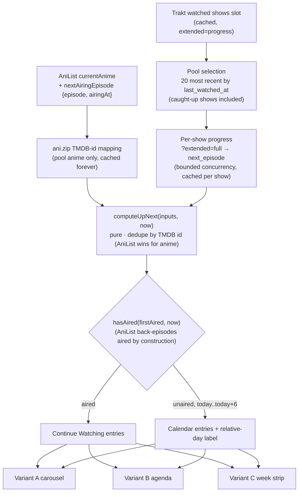
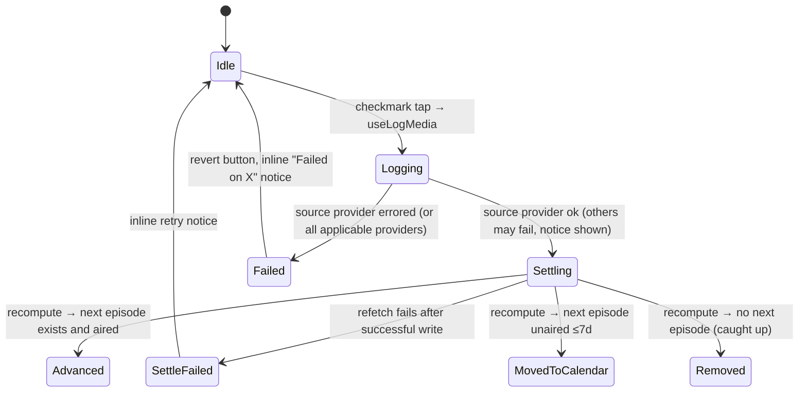

# Continue Watching + Calendar Home Feed - Plan

## Goal Capsule

- **Objective:** Ship two new home-feed sections — Continue Watching (next unwatched episode that has already aired, with a quick-log checkmark that fires the cross-provider fan-out) and Calendar (upcoming episodes ≤7 days with relative-day badges) — rendered as three complete UI variants stacked on the home route for the owner to compare with real data. Closes the surface half of `todos/006-pending-p2-up-next-timezone-correctness.md`.
- **Authority:** AGENTS.md conventions override implementation choices in this plan; this plan overrides implementer preference on scope and sequencing; the owner's live decisions override both.
- **Execution profile:** `execution: code`. Pure computation units are test-first; UI variant units are smoke-verified (web headless + dev client).
- **Stop conditions:** Stop and surface — do not guess — if (a) Trakt's `/shows/:id/progress/watched?extended=full` does not return `next_episode.first_aired` as assumed (KTD-1), (b) AniList rejects or rate-limits the widened `MEDIA_FIELDS` query, or (c) any change would touch the Worker proxies or provider registry semantics (out of scope).
- **Tail ownership:** Implementer lands the work per repo convention (branch + PR); the variant winner decision and loser deletion are an explicitly separate follow-up owned by the owner.

---

## Product Contract

### Summary

Add an "Up Next" data layer that computes, per tracked show/anime, the single next unwatched episode from Trakt and AniList, split by `hasAired` into Continue Watching (aired → watch now, quick-loggable) and Calendar (unaired, ≤7 days out). Render both sections in three visual treatments — screenshot-style landscape carousel, day-grouped agenda timeline, and 7-day week strip — stacked on the home route simultaneously so the owner picks a winner against real data.

### Problem Frame

Shinobu's home feed shows what the user tracks (Your Shows, Your Anime) but not what to do next: there is no "next episode ready for you" surface and no view of what airs this week. The hard prerequisite — timezone-correct airing comparison — was already solved in `src/lib/time/has-aired.ts` (todos/006); what's missing is the per-show next-episode computation and the UI. The owner also wants to explore three UI mental models before committing to one, using their real library rather than mockups.

### Requirements

**Data**

- R1. Continue Watching lists, per tracked show/anime, the next unwatched episode whose air instant has passed in the user's local timezone. Every air-instant comparison goes through `hasAired` (no second date-comparison implementation); the single bounded exception is AniList episodes strictly below the next-airing pointer, which count as aired by construction (KTD-3) because AniList exposes no instants for past episodes.
- R2. Calendar lists, per tracked show/anime, the next unwatched episode that has not yet aired and falls in the current local 7-day window — today through today+6, max label "In 6 days" — with a relative-day label (Today / Tomorrow / In N days). The window boundary is the same local-day logic the badges and Variant C's strip use.
- R3. One shared computation feeds both sections; an entry appears in exactly one section (aired → Continue Watching, unaired → Calendar).
- R4. Data aggregates Trakt shows and AniList currently-watching anime; one provider failing or being disconnected never blanks the other's entries (per-section suspense/error boundaries, matching `src/features/feed/feed-rows.tsx`).
- R5. Same-show duplicates across Trakt and AniList are deduped by TMDB id. AniList exposes no TMDB id, so the up-next query layer resolves one per pool anime via the existing ani.zip mapping (bounded to the pool, cached forever) — best-effort: an unresolvable mapping leaves the duplicate standing. The AniList entry wins for anime (it carries the user's anime progress and airing schedule), Trakt otherwise.
- R6. Provider budgets are respected: no unbounded per-show request fans. Trakt per-show progress calls are capped to the ~20 most recently watched shows; AniList airing data comes from a single widened list query, never a per-media N+1 (30 req/min budget).

**Quick-log**

- R7. The Continue Watching checkmark logs that specific episode via the existing `useLogMedia` fan-out (`episodes: [{season, number}]`) — never a single-provider write.
- R8. On success the card advances from query data after invalidation settles (no optimistic local counter): to the following aired episode, to Calendar if the next one is unaired, or out of the section entirely if none exists. The card advances only when the entry's *source* provider (the one whose data feeds its computation) succeeded — `invalidateAfterLog` only refetches succeeded providers' keys, so a failed source write cannot produce new data. In-place text changes animate via `MorphText`.
- R9. Per-provider partial failure is surfaced on the card (which provider failed), reusing the inline-notice pattern from `src/features/log-media/log-media-button.tsx`; the card does not advance on all-provider failure or when its source provider failed (notice only).

**Variants & platform**

- R10. Three variants render stacked on `src/app/(tabs)/index.tsx`, above the existing rows, each showing both sections from the same data hook: A — landscape-card horizontal carousel close to the reference screenshot; B — vertical agenda timeline grouped by day; C — horizontal 7-day week strip filtering episode cards.
- R11. Everything works on web and native (dark and light themes); no native module additions, so the whole feature is hot-reloadable.
- R12. Each sub-section (Continue Watching, Calendar) hides independently when its own array is empty — the per-array self-hide `media-carousel.tsx` already uses — and a variant's whole mount hides when both are empty. Entries apply the hidden-items filter (`useVisibleItems`), and the sections participate in pull-to-refresh and boundary retry exactly like existing rows (`resetKey={refreshCount}`).

### Scope Boundaries

**Deferred to Follow-Up Work**

- Winner selection: deleting the two losing variants, promoting the winner, and removing comparison-only `collapseKey` prefs.
- TMDB per-episode still images (cards use show `backdropImage` with lazy recovery for now).
- Relaxing the R3 exclusivity if the owner finds during comparison that Calendar should also show tonight's episode for shows the user is behind on (recorded in Open Questions).
- Release notifications built on this data (`todos/007`).

**Out of scope**

- Upcoming movie releases in Calendar (episode tracking only).
- Feed-time cross-provider id enrichment via ani.zip beyond the up-next anime pool (log-time enrichment stays as is; the up-next dedupe's bounded, cached-forever mapping lookups per R5 are the only feed-path use).
- AniList `REPEATING` (rewatch) entries — invisible to `getCurrentAnime` today and stays that way.
- Multiple upcoming episodes per show in Calendar (AniList exposes a single `nextAiringEpisode` node; one entry per show everywhere).

---

## Planning Contract

### Key Technical Decisions

- KTD-1. **Trakt next-episode source: `/shows/:id/progress/watched?extended=full`, capped.** Extend the existing `getShowWatchedProgress` (`src/lib/providers/trakt/reads.ts`) to request `extended=full` and keep the upstream `next_episode` (season, number, title, `first_aired`) that the code currently discards. One authed call per show, already invalidated after logs via `traktQueryKeys.showProgress(id)`, so quick-log advance works with existing plumbing. Rejected: per-show `getShowSeasons` (2 public calls/show, no next pointer) and Trakt `/calendars/*` (can't drive Continue Watching; as a Calendar-only source it would add a second data path for the same instants — see KTD-2).
- KTD-2. **Cap before spending budget.** The candidate pool is the ~20 most recently watched shows by `last_watched_at` from the already-cached watched-shows list — *including* shows caught up on all aired episodes, whose upcoming `next_episode` is exactly what Calendar surfaces. Ended or unscheduled shows cost one capped call and yield no entry. Calendar and Continue Watching share the pool; shows outside the cap silently don't surface — accepted trade-off against the 1000-req/5-min budget (`docs/solutions/trakt-watched-endpoints-2026-api-changes.md`, `todos/009`). Rejected: a "not caught up" eligibility filter (it would structurally empty the Trakt half of Calendar — caught-up-on-aired shows are Calendar's population) and `/calendars/my/shows` as a second Calendar source (two sources for the same air instants reintroduces the parallel-comparison risk KTD-4 exists to prevent).
- KTD-3. **AniList airing data in one request.** Add `nextAiringEpisode { episode airingAt }` to `MEDIA_FIELDS` in `getCurrentAnime` (`src/lib/providers/anilist/reads.ts`). Next unwatched = `progress + 1`. Classification precedence: episodes strictly below `nextAiringEpisode.episode` are aired by construction (AniList has no per-episode instants for them — they are exempt from the Trakt-side `firstAired`-null exclusion); the frontier episode (`progress + 1 == nextAiringEpisode.episode`) carries `airingAt` as its air instant and is gated by `hasAired`, which wins over the count arithmetic when a stale cached pointer disagrees. When `nextAiringEpisode` is null: aired iff `episodes` is non-null and `progress + 1 <= episodes`; both null → excluded (unknowable — hiatus/unconfirmed schedule). Rejected: per-media `getAnimeEpisodes` N+1 (30 req/min budget, `docs/solutions/anilist-rate-limit-retry-storm.md`).
- KTD-4. **One airing comparison path.** AniList `airingAt` (Unix seconds) converts to an ISO instant and goes through `hasAired` / the shared computation exactly like Trakt's `first_aired` — no second date-comparison implementation (todos/006 acceptance criteria).
- KTD-5. **Pure selector with injected `now`.** `computeUpNext(inputs, now)` is a pure, unit-tested function over cached query data; `now` is never baked into a `queryFn`, so day rollover and airs-while-app-open transitions correct themselves on re-render/refetch rather than being frozen at fetch time (pattern: `src/features/diary/merge.ts` takes `now`/`timeZone`).
- KTD-6. **No optimistic advance.** The checkmark shows a pending state from mutation start until the invalidated queries settle; the card then advances/moves/exits purely from recomputed data. Settle detection: pending holds while the mutation is pending *or* the up-next slot query is fetching (`useIsFetching` on the slot key) — `invalidateAfterLog` stays fire-and-forget. If the refetch itself fails after a successful write, the card exits pending with an inline retry notice (Settling → SettleFailed) instead of spinning indefinitely. Avoids the flicker/revert race with `invalidateAfterLog`'s watched-shows refetch and keeps `MorphText` animating a single data-driven change.
- KTD-7. **Anime season convention preserved.** Anime quick-logs use `{season: 1, number}` as everywhere else; the fan-out's existing rule (AniList dropped when season ≠ 1) stays, and a resulting skipped/failed provider surfaces via R9 rather than silently diverging.
- KTD-8. **Variant architecture: shared data + shared primitives, sibling variant components.** One `useSuspenseUpNextQuery` + shared card building blocks (landscape episode card, badge pill, quick-log button) under `src/features/up-next/`; each variant is a sibling component consuming the same `UpNextData`, mounted in its own `SuspenseSection`. Comparison `collapseKey`s are prefixed `up-next-variant-` so loser cleanup is greppable.
- KTD-9. **Landscape art = show backdrop, lazily recovered.** Cards use `backdropImage` with the existing `useTraktMediaImages` per-rendered-card recovery (`staleTime: Infinity`), falling back to `coverImage`, then the dark placeholder. No section-wide art prefetch. Trakt watched payloads carry no images at all since the 2026 API change.
- KTD-10. **Relative-day labels live in `src/lib/time/`.** New `formatRelativeDay` utility (Today / Tomorrow / In N days) beside `has-aired.ts`, reusing `parseLocalInstant`; the diary's past-facing `formatDayHeader` stays untouched. Variant B's day grouping reuses `localDayKey`-style local-date bucketing.

### High-Level Technical Design

Data flow — providers to variants:

Continue Watching card lifecycle around quick-log:

Diagrams are directional guidance; unit approach text is authoritative where they differ.

### Assumptions

- Trakt's `/shows/:id/progress/watched?extended=full` returns `next_episode` with `first_aired` — believed true from Trakt API docs, but unverified in this codebase (it currently calls the endpoint bare). U1 verifies against a real captured payload first; stop condition fires if false.
- The widened AniList `MEDIA_FIELDS` stays within normal query complexity limits (it's one scalar object per entry).
- "~20 shows" is a starting cap, tunable as a named constant; not a product commitment.
- ani.zip mappings resolve TMDB ids for most seasonal anime; where one doesn't resolve, the duplicate card persists (accepted — R5 is best-effort).

---

## Implementation Units

Sequencing: U1 and U2 are independent; U3 depends on both shapes; U4 on U3; U5 on U4; U6–U8 depend on U5 and are independent of each other.

### U1. Trakt next-episode in show progress

- **Goal:** `getShowWatchedProgress` returns the show's next unwatched episode with its air instant, alongside the existing watched-episode key set.
- **Requirements:** R1, R2, R6 (Trakt half).
- **Dependencies:** none.
- **Files:** `src/lib/providers/trakt/reads.ts`, `src/lib/providers/trakt/normalize.ts` (+ the trakt types/test files beside them — mirror existing naming), plus the three existing consumers of the changed return shape: `src/features/log-media/use-log-media.ts` (`providerHasWatch`/`traktHasEpisodes`), `src/state/queries/trakt.ts` (`useTraktShowProgressQuery`), `src/features/show-seasons/seasons-section.tsx`.
- **Approach:** Add `extended=full` to the progress request; model `next_episode` (`season`, `number`, `title`, `first_aired` nullable) in `TraktShowProgress` and the normalized return (watched-key `Set` plus a `nextEpisode` field). The return shape changes from a bare `ReadonlySet<string>` to an object — update the three consumer files above to read the set off the new shape. Respect the documented gotcha: progress episodes carry no `season` field — season comes from the enclosing season object only (`docs/solutions/trakt-progress-episodes-have-no-season-field.md`); `next_episode` itself does carry `season`. First step: capture one real response and check the KTD-1 assumption.
- **Execution note:** Fixture tests from a real captured payload, not hand-built from our own interfaces (per the solutions doc), written before the normalization change.
- **Test scenarios:** payload with `next_episode` → normalized season/number/title/ISO `first_aired`; `next_episode: null` (caught up) → `nextEpisode` undefined; `first_aired: null` on next_episode → carried as null, not dropped; existing `"${season}-${number}"` watched-key behavior unchanged through the new shape (regression covering the season-accordion and reconcile consumers); specials (season 0) still excluded from progress counts.
- **Verification:** `bun test` green; typecheck clean; a manual call against a live show behind by ≥1 episode returns the expected next episode.

### U2. AniList nextAiringEpisode on currently watching

- **Goal:** `getCurrentAnime` entries carry airing info sufficient to classify the next unwatched episode without extra requests.
- **Requirements:** R1, R2, R6 (AniList half).
- **Dependencies:** none.
- **Files:** `src/lib/providers/anilist/reads.ts` (+ its normalize/test siblings).
- **Approach:** Add `nextAiringEpisode { episode airingAt }` to `MEDIA_FIELDS`; expose it (and the already-fetched `episodes` total) on the normalized entry — as an extension of the AniList normalized shape, not a change to `NormalizedMediaItem`'s public contract for other providers. Convert `airingAt` seconds → ISO instant at normalization (KTD-4).
- **Test scenarios:** releasing show with schedule → episode + ISO instant present; FINISHED show (`nextAiringEpisode: null`, `episodes: 12`) → airing info null, total kept; hiatus (`nextAiringEpisode: null`, `episodes: null`) → both null; airingAt conversion produces a UTC instant `hasAired` parses (round-trip test).
- **Verification:** `bun test` green; live currently-watching list still loads on web (30 req/min budget untouched — same single request).

### U3. Up-next computation and relative-day utility

- **Goal:** The pure core: per-show next-episode classification, dedupe, split, and day labels — fully unit-tested with injectable `now`.
- **Requirements:** R1, R2, R3, R5, R6 (eligibility/cap logic), R12 (empty results).
- **Dependencies:** U1, U2.
- **Files:** `src/features/up-next/compute.ts`, `src/features/up-next/compute.test.ts`, `src/features/up-next/types.ts` (`UpNextEntry`: the source `NormalizedMediaItem` + next episode `{season, number, title?, firstAired?}` + `status: 'aired' | 'upcoming'`), `src/lib/time/relative-day.ts`, `src/lib/time/relative-day.test.ts`.
- **Approach:** Two pure pieces with one owner each: `selectUpNextPool(watchedShows)` applies KTD-2's cap/ordering (called by U4 *before* the per-show fetch fan), and `computeUpNext(trakt, anilist, now)` applies KTD-3's classification precedence, dedupes by TMDB id (attached to AniList inputs by U4's ani.zip mapping step; AniList wins for anime), splits via `hasAired(firstAired, now)` with AniList back-episodes aired by construction, and windows Calendar entries to today..today+6. The `firstAired`-null exclusion applies to Trakt-sourced instants only. `formatRelativeDay(instant, now)` returns Today/Tomorrow/In N days using local calendar days (KTD-10). Anime entries carry `season: 1` (KTD-7).
- **Execution note:** Test-first; this unit is where todos/006's boundary acceptance criteria are discharged.
- **Test scenarios:** Covers the todos/006 boundary criteria — episode aired in origin TZ but not locally stays `upcoming`; aired locally across a date-line boundary counts `aired` (fixed `now` + representative instants). Trakt show behind by 3 → single entry for the *next* episode only; show caught up on all aired episodes with a scheduled `next_episode` → Calendar entry (the KTD-2 case); show with `nextEpisode` undefined (ended/unscheduled) → excluded; unaired next episode 2 days out → Calendar with correct label; Trakt `firstAired` null → excluded from both (unknowable); AniList back-episode (progress+1 below the airing pointer) → `aired` despite no instant; AniList frontier episode with stale pointer (`airingAt` already passed) → `aired` (hasAired wins over arithmetic); pool: 21 candidate shows → 20, ordered by `last_watched_at`; dedupe: same TMDB id from both providers → one entry, AniList-sourced, and differing progress between providers doesn't produce two cards; AniList entry with no resolvable TMDB id → passes through un-deduped (best-effort); AniList hiatus (both nulls) excluded; relative-day: later-today → Today, local-midnight-crossing instant → Tomorrow (not In 1 day off-by-one), 6 days out → In 6 days, 7 days out → excluded from the window.
- **Verification:** `bun test` green; any newly discovered timezone edge case written to `docs/solutions/up-next-*.md` (todos/006 requirement).

### U4. Query layer: up-next feed slot

- **Goal:** `useUpNextQuery` / `useSuspenseUpNextQuery` deliver `UpNextData` (both section arrays) wired into the feed's refresh and invalidation machinery.
- **Requirements:** R4, R6, R12; enables R8.
- **Dependencies:** U3.
- **Files:** `src/state/queries/use-unified-feed.ts` (new slot in `feedOptions` + `activeFeedConfigs`), `src/state/queries/trakt.ts` and/or a new `src/state/queries/up-next.ts` (follow the one-query-key-builder-per-domain convention), `src/features/log-media/use-log-media.ts` (`invalidateAfterLog` addition).
- **Approach:** The slot's `queryFn` runs an Effect at the boundary (containment rule): read the cached watched-shows/currentAnime slots via `fetchQuery`, select the pool via U3's `selectUpNextPool`, fetch per-show Trakt progress with bounded concurrency — each under `traktQueryKeys.showProgress(id)` with a named staleTime constant (~15 min, `CATALOGUE_STALE_MS` rationale; `invalidateAfterLog`'s `showProgress(id)` invalidation forces freshness after a log) — and resolve TMDB ids for pool anime via ani.zip mapping lookups (cached `staleTime: Infinity`, decode only the mapping fields per `docs/solutions/web-cors-anizip.md`). Return raw inputs and run `computeUpNext` in a selector (so `now` stays render-time, KTD-5). The slot payload is not `NormalizedMediaItem[]`, so do not force it through the existing `activeFeedConfigs`/`useUnifiedFeed` aggregate typing: exclude it from `useQueries`/`bySlot` (details-screen by-id resolution never needs it — the per-show fan must not fire on details mounts), widen `FeedQueryConfig` (or register a sibling config) so `useRefetchUnifiedFeed` includes the slot for pull-to-refresh. Add the slot key to `invalidateAfterLog` so a quick-log recomputes the sections, not just the per-show progress. Per-provider partial failure: one provider's inputs failing yields the other's entries plus a surfaced error, matching the unified-feed contract — not a thrown slot.
- **Test scenarios:** slot with Trakt connected only → AniList absence isn't an error; per-show progress failure for one show → that show omitted, others returned; after `invalidateAfterLog` runs, the slot key is among invalidated keys (unit-level assertion on the key list); no `Effect<...>` type appears in any hook signature (typecheck-level, review).
- **Verification:** `bun test` + `bun typecheck` green; on device/web, pull-to-refresh visibly refetches the new sections.

### U5. Shared UI primitives and home-route scaffolding

- **Goal:** The building blocks every variant consumes, plus the three labeled comparison mounts on the home screen.
- **Requirements:** R7, R8, R9, R10 (scaffold), R11, R12.
- **Dependencies:** U4.
- **Files:** `src/features/up-next/ui/episode-card.tsx`, `src/features/up-next/ui/badge.tsx`, `src/features/up-next/ui/quick-log-button.tsx`, `src/features/up-next/variants/` (empty mounts wired), `src/app/(tabs)/index.tsx`, `src/components/feed-skeleton.tsx` (landscape skeleton variant if needed).
- **Approach:** Landscape card: 16:9 `components/image` art (KTD-9 fallback chain), title, `S{n}E{n} · {episode title}` line, badge slot; all tappables via `components/presstable`; theme tokens only (no new hex). Badge: small pill for runtime / New / relative-day text — feature-local until a second feature needs it. Quick-log button: `useLogMedia` with `episodes: [{season, number}]`, pending until settle per KTD-6 (`useIsFetching` on the slot key), advances only when the entry's source provider succeeded (R8/R9), inline failure notice naming failed providers, SettleFailed retry notice, `MorphText` on the advancing episode text (in-place change only); `accessibilityLabel` ("Log episode {n} of {title}") and pending/disabled `accessibilityState`, mirroring the collapse-toggle convention in `media-carousel.tsx`. One-tap is deliberate — it copies the reference behavior — and deviates from the confirm-sheet rule every other log entry point follows (`log-media-button.tsx`); pressto's leading-edge debounce guards double-taps, and the deviation is an Open Question for the comparison verdict. Home route: three `SuspenseSection`s (`resetKey={refreshCount}`, skeleton fallbacks) above `YourShowsRow`, each with a small "Variant A/B/C — {name}" header; each sub-section self-hides per R12 and a variant renders null when both arrays are empty; entries pass through `useVisibleItems`; `onItemPress` routes to details, `onItemActions` opens the shared card-actions sheet.
- **Execution note:** Mostly composition — prefer runtime smoke verification (web + dev client, dark and light) over unit coverage; component behavior tests only where logic lives (quick-log button states).
- **Test scenarios:** quick-log button: success → pending → settles (mocked mutation) without local counter mutation; all-provider failure → reverts and shows failed provider names; source provider ok + other provider error → advances and names the failed provider; source provider error + other ok → does not advance, shows notice; refetch failure after successful write → exits pending with retry notice. `Test expectation: none` for the pure-layout card/badge/scaffold pieces — verified by smoke.
- **Verification:** `bun lint` (wrapper-import rules), `bun typecheck`; web smoke per `docs/solutions/web-headless-smoke-test-playwright.md` shows three labeled empty-capable mounts without breaking existing rows.

### U6. Variant A — reference-style carousel

- **Goal:** The screenshot-faithful treatment: horizontal landscape-card carousels, one per section.
- **Requirements:** R10 (A), R1, R2 presentation.
- **Dependencies:** U5.
- **Files:** `src/features/up-next/variants/variant-carousel.tsx`.
- **Approach:** Two rows ("Continue Watching", "Calendar") of landscape cards in a horizontal `ScrollView` (the `media-carousel.tsx` precedent for short capped lists — the List wrapper is unnecessary at ≤20 items). Continue Watching cards: runtime badge + New badge (episode aired within the last 7 days) + checkmark; Calendar cards: relative-day badge, no checkmark. Collapse headers via `collapseKey: 'up-next-variant-a-*'`.
- **Test scenarios:** `Test expectation: none — presentation-only composition over tested primitives; covered by web/native smoke.`
- **Verification:** Visual smoke against the reference screenshot on web + iOS, both themes.

### U7. Variant B — agenda timeline

- **Goal:** Vertical day-grouped agenda: Continue Watching entries first ("Ready to watch"), then Calendar entries bucketed under Today / Tomorrow / weekday headers.
- **Requirements:** R10 (B).
- **Dependencies:** U5.
- **Files:** `src/features/up-next/variants/variant-agenda.tsx`.
- **Approach:** Compact rows (small landscape thumb, title, S/E line, trailing checkmark or day label) grouped by local day via the U3 day utilities; headers echo the diary's day-header typography. Vertical, non-virtualized (≤~25 rows) inside the home scroll.
- **Test scenarios:** `Test expectation: none — grouping logic already tested in U3; presentation covered by smoke.`
- **Verification:** Visual smoke; day buckets match `formatRelativeDay` output.

### U8. Variant C — week strip

- **Goal:** A horizontal 7-day date strip (starting today) that filters the cards beneath; Continue Watching renders above the strip as a constant row.
- **Requirements:** R10 (C).
- **Dependencies:** U5.
- **Files:** `src/features/up-next/variants/variant-week-strip.tsx`.
- **Approach:** Strip of 7 day cells covering today..today+6 — the same window boundary as R2, so every Calendar entry has a selectable day (weekday + date, badge dot when that day has entries); each cell `accessibilityRole="button"` with `accessibilityState={{ selected }}`. Selected day is local component state defaulting to today; below it, that day's Calendar cards (empty state: "Nothing airing" line). Selection is ephemeral UI state — not persisted.
- **Test scenarios:** `Test expectation: none — day membership comes from U3; selection/rendering covered by smoke.`
- **Verification:** Visual smoke: tapping days filters correctly; days derive from the same local-day logic as badges (no drift).

---

## Verification Contract

| Gate | Command | Applies to |
|---|---|---|
| Unit tests | `bun test` | U1–U5 (U3 is the largest suite) |
| Lint (incl. wrapper/import rules) | `bun lint` | all units |
| Types | `bun typecheck` | all units |
| Web smoke | `bun web` + `bun run dev:worker`, headless flow per `docs/solutions/web-headless-smoke-test-playwright.md` | U5–U8 |
| Native smoke | dev client (hot reload only — no native changes in this plan) | U5–U8 |

Quality gates: no Effect types outside `lib/providers`/`lib/http` boundaries; no new hex colors; no direct `@legendapp/list`/`Pressable`/`expo-image` imports (oxlint enforces); anime fan-out season rule preserved.

## Definition of Done

- All eight units land; `bun test`, `bun lint`, `bun typecheck` green.
- All three variants visible on the home route with the owner's real Trakt + AniList data, on web and iOS, both themes.
- A live quick-log from a Variant A card writes to every applicable connected provider and the card advances/moves/exits correctly after settle.
- Todos/006 boundary test criteria are covered in U3's suite; any new timezone or provider anomaly discovered during implementation is written to `docs/solutions/` (AGENTS.md compound-knowledge rule); `todos/006` updated to reflect the shipped surface.
- No abandoned experimental code: the three variants are intentional, but dead ends within units are removed before merge.

---

## Open Questions

- Deferred (owner decides during comparison): should Calendar also show this week's airing episode for shows the user is behind on (currently excluded by R3 exclusivity — those shows live in Continue Watching only)?
- Deferred (owner decides during comparison): should quick-log stay one-tap (the reference behavior), or gain an undo grace period or confirm sheet, given every other log entry point confirms before writing (design-review flag)?
- Deferred: final cap value for the Trakt pool (starts at 20, named constant) — re-evaluate jointly for both sections once caught-up shows share the pool.

## Sources & Research

- `docs/solutions/trakt-watched-endpoints-2026-api-changes.md` — mandatory pagination, `extended=progress`, no images, 1000/5-min budget, lazy art recovery pattern.
- `docs/solutions/trakt-progress-episodes-have-no-season-field.md` — progress payload shape + fixture-test rule.
- `docs/solutions/anilist-rate-limit-retry-storm.md`, `docs/solutions/web-cors-anilist.md` — 30 req/min real budget, staleTime discipline, retry predicate.
- `todos/006-pending-p2-up-next-timezone-correctness.md` — acceptance criteria this plan discharges; `todos/009` — pre-registered Trakt N+1 mitigation.
- `src/state/queries/use-unified-feed.ts` (`feedOptions` triple-consumption pattern), `src/features/log-media/use-log-media.ts` (`LogMediaVariables`, `invalidateAfterLog`), `src/features/diary/merge.ts` (day-grouping precedents), `src/components/media-carousel.tsx` / `media-card.tsx` (carousel + lazy-art precedents).
- `docs/solutions/web-cors-anizip.md` — ani.zip mapping shape, `staleTime: Infinity`, decode-only-what-you-need (responses can be ~1 MB).
- CORS: Trakt, AniList, TMDB, ani.zip all browser-callable (`docs/solutions/web-cors-*.md`) — no proxy work anywhere in this plan.
