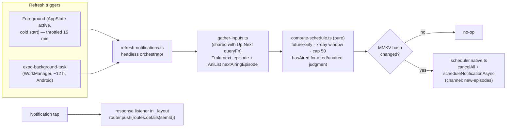

# Release Notifications (Local, Android-First) - Plan

## Goal Capsule

- **Objective:** Ship local, serverless release notifications — "new episode aired" alerts for tracked shows/anime — scheduled ahead of time from known air dates, refreshed on app foreground *and* by a periodic Android background task (otraku parity: `workmanager` + `flutter_local_notifications`). Closes `todos/007-pending-p3-release-notifications.md`.
- **Authority:** AGENTS.md conventions (no backend, `hasAired` centralization, CNG rebuild rules) override this plan; this plan overrides implementer preference on scope and sequencing; the owner's live decisions override both.
- **Execution profile:** `execution: code`. Pure computation units are test-first; native scheduling/background units are smoke-verified on an Android dev client.
- **Stop conditions:** Stop and surface — do not guess — if (a) any design would require a push server, FCM tokens, or any remote relay (hard no per todos/007), (b) `expo-background-task`/`expo-notifications` turn out incompatible with Expo SDK 57 as installed, (c) provider reads cannot run headless outside React (they can today — `traktDeps()`/`anilistDeps()` are module-level), or (d) the change would touch the Worker proxies or provider registry write semantics.
- **Tail ownership:** Implementer lands the work per repo convention (branch + PR) and states clearly that this feature **requires a clean native rebuild** (`bun android.clean`); the owner runs the on-device verification pass.

---

## Product Contract

### Summary

On app foreground (throttled) and via a periodic Android background task, compute the upcoming-episode set for tracked shows/anime from the same provider inputs Up Next uses, and replace the batch of scheduled local notifications (expo-notifications) covering the next 7 days. Notifications are opt-in via a settings toggle, fire at the episode's real air instant (timezone-correct by construction), and tap through to the item's details page. Web schedules nothing.

### Problem Frame

Shinobu computes upcoming episodes (plan 0019 Calendar) but never tells the user about them unless the app is open. todos/007 already fixed the delivery decision — local-only scheduled notifications, no push server — and its prerequisite (`src/lib/time/has-aired.ts`, todos/006) is done. What's missing is the scheduling pipeline, the staleness mitigation (otraku solves this with a periodic background worker), and the permission/settings UX. Android is the primary target; iOS gets the same foreground scheduling with best-effort background refresh.

### Requirements

**Scheduling correctness**

- R1. The scheduled set covers, per tracked show/anime from every connected provider with airing data (Trakt `next_episode`, AniList `nextAiringEpisode`), the next unwatched episode whose air instant falls within the next 7 local days. Air instants are treated as instants (ISO with offset / epoch), never bare dates; anything needing an aired/unaired judgment goes through `src/lib/time/has-aired.ts`.
- R2. A notification never fires before its episode's air instant, and instants already in the past at schedule time are not scheduled (no immediate-fire burst on refresh).
- R3. Each refresh **replaces** the previously scheduled batch (cancel-then-schedule) so there are no duplicates and no orphans for unfollowed/disconnected/caught-up shows. The batch is capped at 50 notifications (iOS hard limit is 64 pending; Android AlarmManager ~500), nearest-first.
- R4. Disconnecting a provider removes its contributions on the next refresh with no special-case code (falls out of recompute-and-replace).

**Refresh & staleness**

- R5. Refresh runs on app foreground (cold start + AppState background→active), throttled to at most once per 15 minutes via an MMKV timestamp.
- R6. On Android, a periodic background task (expo-background-task on WorkManager, ~12 h interval) runs the same refresh headlessly so the schedule stays fresh when the app isn't opened for days. iOS registers the same task but treats execution as opportunistic (BGTaskScheduler is best-effort) — foreground refresh remains iOS's primary path.
- R7. A refresh that computes an identical candidate set to the currently scheduled one is a no-op (content-hash guard in MMKV), so WorkManager churn doesn't cancel/reschedule identical alarms every run.

**UX & control**

- R8. Notifications are opt-in: a toggle on the Manage Trackers screen (`src/app/(tabs)/connect.tsx`), default off, persisted in MMKV under `state/prefs/`. Enabling requests the OS permission (Android 13+ `POST_NOTIFICATIONS` runtime prompt); a denial shows guidance to enable in system settings and leaves the toggle off. Disabling cancels all scheduled notifications.
- R9. Notification copy identifies the show and episode (e.g. title "Frieren: Beyond Journey's End", body "S2E5 aired — ready to watch"). Android uses a dedicated "New episodes" channel; the small icon is the monochrome adaptive icon tinted with the accent color.
- R10. Tapping a notification (foreground, background, or cold start) navigates to that item's details route (`routes.details(id)`). Tracked items resolve there once the feed query lands — the details screen already shows its skeleton while the feed loads.
- R11. A dev-facing "Send test notification" affordance (visible only when the toggle is on) schedules a one-off notification ~5 s out, so permission + channel + tap-through are verifiable on device without waiting for a real air time.

**Platform**

- R12. Web schedules nothing and pretends nothing (todos/007): the scheduler module has a `.web.ts` no-op variant, and the settings toggle does not render on web (Up Next is web's surface).

### Scope Boundaries

**Deferred to Follow-Up Work**

- Movie release-date notifications (todos/007 mentions them; Trakt/TMDB release dates need their own source decision — episodes only for now).
- A stateless push relay if local-schedule staleness proves painful in practice (docs/plans/0005 leaves this door open; not part of this work).
- Per-show notification muting.

**Out of scope**

- Any push server, FCM/APNs registration, or remote notification path.
- Serializd/Letterboxd as notification sources (no airing data).
- AniList's server-side `Notification` feed (otraku also polls that; Shinobu computes locally from airing schedules, which covers Trakt too).

---

## Planning Contract

### Key Technical Decisions

- KTD-1. **Reuse the Up Next input pipeline, headless.** The candidate computation must run without React (the background task has no component tree). Extract the provider input gathering in `src/state/queries/up-next.ts` into a non-hook module (e.g. `src/features/up-next/gather-inputs.ts`) that both the existing `queryFn` and the notification refresher call. Provider reads already run via `Effect.runPromise(read(deps()))` with module-level deps builders and MMKV-stored tokens, so nothing blocks headless execution. Rejected: a second, notification-only fetch path (would drift from Up Next and double provider budget spend — AniList is 30 req/min, `docs/solutions/anilist-rate-limit-retry-storm.md`).
- KTD-2. **expo-notifications + expo-task-manager + expo-background-task.** All are Expo SDK packages compatible with SDK 57; expo-background-task is the current API (expo-background-fetch is deprecated) and maps to WorkManager on Android / BGTaskScheduler on iOS — the exact shape otraku uses on Flutter. All three ship native code: **clean rebuild required** (`bun android.clean` / `bun ios.clean`), and the expo-notifications config plugin entry in `app.json` sets `icon` (monochrome) + `color` (`#DC2626`). Per the Nitro-preference rule: no Nitro alternative exists for notifications/background scheduling, so Expo's own modules are the right call.
- KTD-3. **Cancel-then-schedule with a hash guard.** Idempotency comes from full-batch replacement, not per-notification diffing; the MMKV content hash (sorted `itemId/season/episode/instant` lines) skips the whole replace when nothing changed (R7). Rejected: per-notification identifiers + diffing (more states to get wrong for zero user-visible gain at ≤50 notifications).
- KTD-4. **The task definition lives at module scope and is imported from the root layout.** `TaskManager.defineTask` must execute during bundle evaluation for headless launches; define it in the scheduler feature module and import that module from `src/app/_layout.tsx` (side-effect import), registering with `BackgroundTask.registerTaskAsync` (~720 min minimum interval) only when the toggle is on and platform is native.
- KTD-5. **Connected-provider detection headless.** The refresher derives the connected set from the session token getters (`src/state/session/tokens.ts` and siblings), not from the `useConnectedProviders` hook; add a non-hook `getConnectedProviders()` next to the hook if one doesn't already exist.
- KTD-6. **Notification payload carries `itemId` only.** The response listener routes `router.push(routes.details(itemId))`; no media payload is serialized into the notification (stale data risk, size limits). Cold-start taps are handled via `Notifications.getLastNotificationResponseAsync()` (or the equivalent `useLastNotificationResponse` hook) in the root layout.

### High-Level Technical Design

### Assumptions

- `expo-notifications`' local-only usage does not require FCM configuration (no `googleServicesFile`); if the Android build demands one for local notifications, that contradicts current Expo docs — stop and surface (also relevant to plan 0021's F-Droid analysis).
- The 7-day window matches plan 0019's Calendar window; widening to 14 days is a constant change, not a design change.

---

## Implementation Units

### U1. Dependencies and native configuration

**Goal:** Install `expo-notifications`, `expo-task-manager`, `expo-background-task`; add the expo-notifications config plugin entry (monochrome icon + `#DC2626` color) to `app.json`.
**Requirements:** R9 (channel/icon groundwork), KTD-2.
**Dependencies:** none.
**Files:** `package.json`, `app.json`.
**Approach:** `bunx expo install` the three packages so versions match SDK 57. Do not create a notification icon asset if `assets/images/adaptive-icon-monochrome.png` is reusable — reuse it.
**Test scenarios:** Test expectation: none — dependency/config unit; proven by U4–U6 smoke and a successful `bun android.clean` prebuild.
**Verification:** `bunx expo prebuild --platform android` succeeds; generated manifest (inspected, not committed) contains the notification icon/color meta-data. State in the PR that a clean rebuild is required.

### U2. Headless Up Next input gathering

**Goal:** Make the provider input gathering callable outside React so the background task and the existing Up Next query share one pipeline.
**Requirements:** R1, R4, KTD-1, KTD-5.
**Dependencies:** none.
**Files:** `src/state/queries/up-next.ts`, new `src/features/up-next/gather-inputs.ts` (or colocated module — implementer's call), `src/state/session/` (non-hook `getConnectedProviders()` if missing), tests alongside as `*.test.ts`.
**Approach:** Pure extraction — the Up Next `queryFn` must keep byte-identical behavior (its existing tests in `src/state/queries/up-next.test.ts` are the characterization net). The extracted function takes the connected-provider list as an argument; per-provider failure keeps degrading to that provider contributing zero inputs plus an error entry.
**Execution note:** Run the existing up-next tests before and after the extraction; add characterization coverage first if the seam isn't already tested.
**Test scenarios:** (1) gathering with both providers connected merges inputs exactly as the query did; (2) one provider throwing yields the other's inputs plus an error entry, never a rejection; (3) empty connected list yields empty inputs without network calls; (4) `getConnectedProviders()` agrees with the hook for each token-presence combination.
**Verification:** `bun test` green including untouched up-next tests.

### U3. Pure schedule computation

**Goal:** `computeNotificationSchedule(inputs, now)` — inputs → capped, deduped, future-only candidates `{ itemId, title, season, episode, fireInstant }`.
**Requirements:** R1, R2, R3 (cap), KTD-3 (hash input shape).
**Dependencies:** U2.
**Files:** `src/features/notifications/compute-schedule.ts`, `src/features/notifications/compute-schedule.test.ts`.
**Approach:** Deterministic given `(inputs, now)` — no clock reads inside. Window = `now` → `now + 7 days`; instants at-or-before `now` excluded; sort ascending by instant, truncate to 50; same-show cross-provider duplicates dedupe by TMDB id following plan 0019 R5's precedence (AniList wins for anime). Export a stable `hashSchedule(candidates)` string for KTD-3.
**Execution note:** Test-first — this unit is the timezone-correctness core.
**Test scenarios:** (1) episode airing in 3 days → included with exact instant; (2) episode aired 1 min before `now` → excluded; (3) episode 8 days out → excluded; boundary at exactly `now + 7d` → excluded (half-open window); (4) 60 candidates → 50 nearest kept; (5) same show from Trakt and AniList with shared TMDB id → one candidate; (6) hash is order-insensitive on input but changes when any candidate's instant changes; (7) a DST-crossing instant keeps its absolute epoch value (no local-date math).
**Verification:** `bun test`, `bun typecheck`, `bun lint`.

### U4. Notification scheduler service (platform-split)

**Goal:** `scheduler` module: replace-batch scheduling, cancel-all, channel setup, hash guard; `.web.ts` variant is a no-op.
**Requirements:** R2, R3, R7, R9, R12.
**Dependencies:** U1, U3.
**Files:** `src/features/notifications/scheduler/index.native.ts`, `src/features/notifications/scheduler/index.web.ts`, `src/features/notifications/scheduler/hash-guard.ts` (pure, tested), `src/features/notifications/scheduler/hash-guard.test.ts`.
**Approach:** Native: ensure the `new-episodes` Android channel, compare `hashSchedule` output against the MMKV-stored hash (skip when equal), else `cancelAllScheduledNotificationsAsync()` then one `scheduleNotificationAsync` per candidate with a date trigger and `data: { itemId }`. MMKV access follows existing `state/prefs/` patterns. Platform split per the AGENTS.md directory convention — no `Platform.OS` branches in callers.
**Test scenarios:** hash-guard pure logic: (1) same schedule twice → second call reports "skipped"; (2) changed schedule → "replaced" and stored hash updated; (3) empty schedule after a non-empty one → cancel path taken. (Native module calls themselves are smoke-verified, not unit-mocked.)
**Verification:** `bun test`; web: `bun run build:web` succeeds and the web bundle contains no expo-notifications import (no-op variant resolves).

### U5. Refresh orchestrator: foreground + background task

**Goal:** One `refreshNotifications()` entry point wired to (a) cold start + AppState active with 15-min throttle, (b) the background task definition/registration.
**Requirements:** R4, R5, R6, R8 (respects toggle), KTD-4, KTD-5.
**Dependencies:** U2, U3, U4.
**Files:** `src/features/notifications/refresh.ts`, `src/features/notifications/background-task.ts`, `src/app/_layout.tsx` (side-effect import + AppState listener + toggle-aware registration).
**Approach:** `refreshNotifications()` short-circuits when the toggle is off or platform is web; otherwise gathers (U2) → computes (U3) → schedules (U4), swallowing per-provider errors (a broken provider must not kill the batch for the others). `defineTask` at module scope (KTD-4); register/unregister `BackgroundTask` when the toggle flips. Throttle timestamp in MMKV, checked only on the foreground path (WorkManager already paces the background path).
**Test scenarios:** (1) toggle off → no gather call; (2) throttle: two foreground triggers 1 min apart → one refresh; (3) provider read rejection → remaining providers' candidates still scheduled. (Extract the orchestration decisions into a testable pure/injected function; the AppState wiring is smoke-verified.)
**Verification:** `bun test`; Android dev client: backgrounding + reopening logs one refresh; `adb shell dumpsys jobscheduler` (or expo-background-task's `getStatusAsync`) shows the registered task.

### U6. Settings toggle, permission flow, test notification

**Goal:** Opt-in UI on Manage Trackers: toggle (default off), permission request on enable, cancel-all on disable, "Send test notification" affordance.
**Requirements:** R8, R11, R12 (hidden on web).
**Dependencies:** U4, U5.
**Files:** `src/app/(tabs)/connect.tsx` (or an extracted `src/features/notifications/notifications-settings.tsx` section), `src/state/prefs/notifications.ts` (+ test for the pref accessor).
**Approach:** Follow the screen's existing section styling; pressables via `components/presstable`; copy follows theming/typography tokens. Enable → `requestPermissionsAsync()`; granted → persist + immediate `refreshNotifications()`; denied → toggle stays off with a short "enable in system settings" hint. Test button schedules a one-off notification ~5 s out through the same scheduler module (bypassing the hash guard).
**Test scenarios:** pref accessor: default off; set/get round-trip. UI states (off / requesting / on / denied) smoke-verified on device.
**Verification:** Android dev client: toggle → OS prompt appears; test notification arrives with correct channel, icon, accent color; disabling cancels pending notifications (`getAllScheduledNotificationsAsync()` returns empty via a temporary debug log).

### U7. Tap-through navigation

**Goal:** Notification taps open the item's details page in all three app states.
**Requirements:** R10, KTD-6.
**Dependencies:** U4.
**Files:** `src/app/_layout.tsx` (response listener + cold-start last-response check).
**Approach:** `addNotificationResponseReceivedListener` → `router.push(routes.details(data.itemId))`; on cold start read `getLastNotificationResponseAsync()` once after the router is ready. Guard against double-navigation (the leading-edge press debounce doesn't cover this path).
**Test scenarios:** Test expectation: none — pure navigation wiring over native listeners; covered by the on-device matrix below.
**Verification:** On-device matrix: tap with app foregrounded, backgrounded, and killed — each lands on the correct details page (test notification from U6 with a real tracked item's id).

---

## Verification Contract

- `bun test`, `bun typecheck`, `bun lint` — green at every unit boundary.
- `bun run build:web` — web bundle builds; no notification native module reaches the web bundle.
- Android dev client (`bun android.clean` once after U1): U6's on-device checklist (permission prompt, test notification, cancel-on-disable) and U7's three-state tap matrix.
- Background task: registered task visible via `BackgroundTask.getStatusAsync`/`adb`; a forced task run (`expo-background-task` test trigger where available) executes `refreshNotifications` without a foregrounded app.

## Definition of Done

- All R1–R12 satisfied; todos/007 updated to `done` with a pointer to this plan.
- No push/remote-notification code path exists anywhere in the diff.
- Every air-time judgment routes through `has-aired.ts` or compares stored instants — zero bare-date comparisons (review grep: `new Date(` on provider date strings in the new modules).
- A `docs/solutions/` entry exists if any non-obvious native/scheduling quirk was hit (per AGENTS.md compound-knowledge rule).
- Abandoned experiments removed from the diff; PR states the clean-rebuild requirement.
