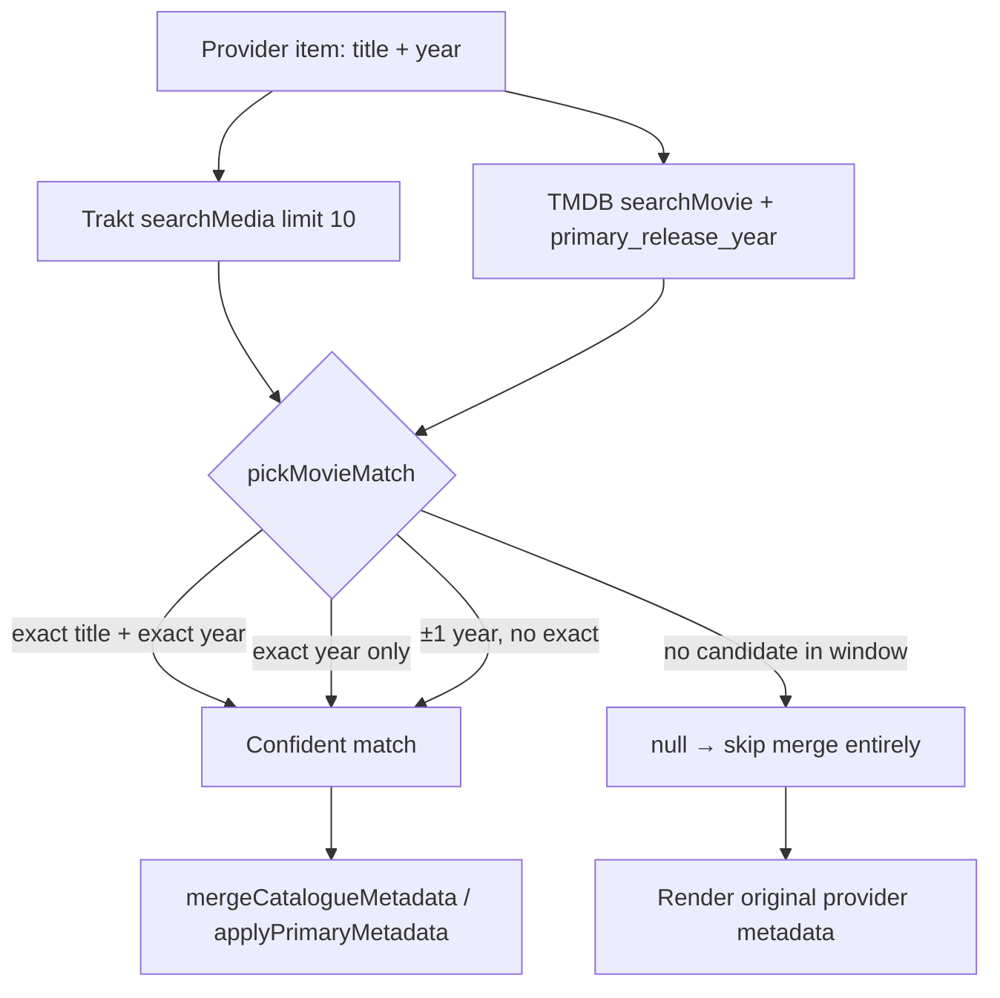
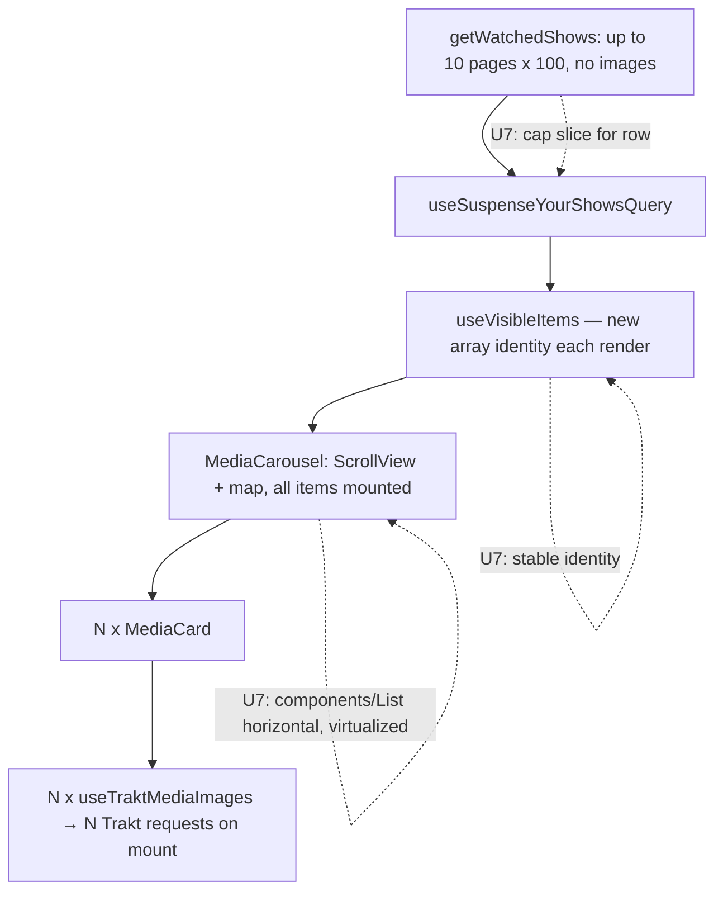

# Issue Swarm Batch (13 fixes and features) - Plan

## Goal Capsule

- **Objective:** land the 13 user-reported fixes/features below as one batch PR on branch `fix/issue-swarm-jul25`, targeting `main`.
- **Authority hierarchy:** AGENTS.md conventions > this plan > implementer judgment. `docs/solutions/` entries cited per unit are load-bearing constraints, not suggestions.
- **Stop conditions:** surface (don't guess) if a fix requires a new native dependency, a change to a Worker proxy contract, or contradicts a routing/registry invariant in AGENTS.md. Product behavior questions the plan leaves open are implementer judgment.
- **Execution profile:** units are independently committable; U4 and U7 both edit `src/components/media-card.tsx` and U1/U3 both touch the search focus path — do those pairs sequentially or under one owner. The same applies to U1/U2 (`src/app/(tabs)/search.tsx`), U7/U9 (`src/features/feed/feed-rows.tsx`), and U8/U12 (`src/app/details/[id].tsx`).

---

## Product Contract

### Summary

A batch of quality fixes across search, metadata correctness, feed performance, Android platform behavior, and provider surfaces, plus two web-only affordances (Cmd+K, Cmd+click). No new providers, no schema changes, no backend.

### Problem Frame

Daily-driver testing surfaced 13 issues: two produce wrong data (stale same-title metadata overriding correct provider data; anime films missing their AniList log target), one makes the app unusable while scrolling (Your Shows row), and the rest are platform-fit gaps (Android keyboard/notch/back, search ergonomics, manga 404, truncated watchlist, missing TMDB key entry, missing web shortcuts).

### Requirements

**Search and shortcuts**

- R1. Pressing the search tab while it is already active focuses the search input and opens the soft keyboard (Android included; iOS `role="search"` behavior preserved).
- R2. The search input shows a clear (X) button when non-empty; pressing it resets the immediate input, the debounced query, and the `?q=` route param.
- R3. Web only: Cmd/Ctrl+K on any screen navigates to search and focuses the input.
- R4. Web only: Cmd/Ctrl+click on a media card opens its details route in a new tab; plain click keeps in-app navigation and the press debounce.

**Metadata correctness**

- R5. A movie with a known year never adopts metadata or external ids from a same-title candidate with a non-matching year; when no confident candidate exists, the item renders with its original provider metadata instead of a wrong merge. Regression cases: Labyrinth (2025), Motor City (2025).
- R6. An anime film opened from a TMDB/Trakt-first details page fans out to AniList (in addition to Trakt + Letterboxd) when AniList is connected — the ChaO (2025) case. Serializd stays excluded for films; non-anime routing is unchanged.

**Performance**

- R7. The Your Shows row scrolls smoothly without lagging the rest of the app: horizontally virtualized cards, a bounded number of mounted items, and no unbounded per-card network fan-out on mount.

**Android platform**

- R8. The tags input in the log-to-diary sheet stays visible above the keyboard on Android.
- R9. The pull-to-refresh spinner on the details screen renders below the status bar/notch on Android; iOS is unchanged.
- R10. Android 13+ predictive back gesture is enabled.

**Provider surfaces**

- R11. Manga search results open a basic details view (poster, title, synopsis, format/status, chapter count where available) resolved from AniList; no TMDB lookup is attempted for manga, and log targets show AniList only.
- R12. The Letterboxd watchlist row gains a "View all" affordance leading to a full-screen infinite-scroll grid over the paginated watchlist; the existing carousel row keeps its current cap.
- R13. Settings/Connect shows a "TMDB token" section only when `EXPO_PUBLIC_TMDB_TOKEN` is unset; a user-entered v4 read token persists via MMKV, is clearable, takes effect without app restart, is never logged, and is ignored whenever the env token exists.

### Scope Boundaries

- One batch PR from `fix/issue-swarm-jul25`; no per-issue branches.
- **Deferred to follow-up work:** manga cast/credits enrichment beyond the AniList payload; logging manga (chapters) from the details page beyond showing correct targets; a generic by-id details fetch fallback (plan 0007 deferral stands — U8 only widens cache scanning); batched Trakt image fetching; middle-click (auxclick) support on cards.
- Not in scope: Letterboxd writes, Worker proxy contract changes beyond U9's bounded watchlist page-suffix widening, new providers or MediaTypes, design changes to the feed.

---

## Planning Contract

### Key Technical Decisions

- **KTD1 — Match confidence beats tolerance.** `pickMovieMatch` prefers exact-title (case/diacritic-insensitive) + exact-year candidates; the existing ±1 year window applies only when no exact-year candidate exists, and never lets a further-year candidate beat an exact one. With a known year and no candidate inside the window, return `null` — and callers treat `null` as "skip merge", not "take first". TMDB `searchMovie` passes `primary_release_year` when the caller knows the year, fixing recall (the true film often isn't on page 1). This extends the fix documented in `docs/solutions/trakt-text-search-wrong-movie-match.md`.
- **KTD2 — External-id adoption is part of the match, not the merge.** The poisoning vector is `mergeCatalogueMetadata` adopting a wrong candidate's `externalIds.tmdb/trakt`, which then keys every downstream details query. Guard at the match layer (KTD1) so no unconfident candidate reaches the merge; `applyPrimaryMetadata`'s TMDB-wins field policy stays as designed.
- **KTD3 — AniList discovery fallback for films.** ani.zip's `themoviedb_id` index is TV-oriented and misses many anime films. When enrichment runs for a `MOVIE` item with AniList connected and the ani.zip lookup misses, fall back to an AniList GraphQL search (title + year, format `MOVIE`) with a strict year match before accepting — same confidence discipline as KTD1. A discovered id widens `effectiveTypes` via the existing `externalIds.anilist != null` branch in `routing.ts`; no routing changes needed.
- **KTD4 — Virtualize the carousel; don't band-aid with memo.** `MediaCarousel` moves from `ScrollView` + `map` to the shared `components/List` wrapper (Legend List, horizontal) per AGENTS.md. Bound the data too: the Your Shows row renders a capped slice (match the trending rows' 30) — up to 1000 mounted cards is unreasonable in any renderer, and per-card image queries (`useTraktMediaImages`) are the N+1 amplifier that virtualization plus the cap contains. Fix `useVisibleItems` returning a new array identity every render so React Compiler memoization can hold.
- **KTD5 — Cmd+click via press-event modifier keys, not anchors.** pressto pressables render `div[role="button"]` and RNGH kills `onPress` for any other role (`docs/solutions/web-pressto-accessibility-role-kills-onpress.md`), so cards cannot become `<a>` elements. Read `metaKey`/`ctrlKey` from the web press event and open via the existing `lib/open-external-url` (`window.open(..., 'noopener')`).
- **KTD6 — TMDB stays a non-provider; its key gets a dedicated store.** TMDB has no `ProviderId` (deliberate, per registry design). The user key lives in the session MMKV store as a dedicated key beside `clientId.*` — not by widening `ProviderId`. `tmdbToken()` resolves env-first, then stored key; reads become reactive (`useSyncExternalStore` over `onSessionChange`) because `details/[id].tsx` gates person/studio routes on it at render time. SSR-safe lazy reads per `docs/solutions/expo-web-ssr-mmkv-storage-on-server.md`.
- **KTD7 — Predictive back is an `app.json` change under CNG.** Set `android.predictiveBackGestureEnabled: true` in `app.json` (Expo SDK 57 supports it; the generated manifest currently carries `enableOnBackInvokedCallback="false"`). Never hand-edit `android/` — the change lands via clean prebuild and requires a native rebuild (`bun android.clean`).

### High-Level Technical Design

Movie metadata resolution after KTD1/KTD2 — both text-search paths funnel through the same guard:

Your Shows data/render chain and where U7 intervenes:

### Assumptions

- Single PR for the whole batch (the branch already exists for this purpose).
- The Your Shows carousel may cap rendered items at the trending-row count; the full collection remains reachable via existing surfaces (no new "all shows" screen in this batch).
- The TMDB settings input accepts the v4 read token only (the shape `tmdbDeps` already consumes); v3 api-key support is out.
- Manga details showing AniList-sourced fields without cast/credits is acceptable for the "basic view".
- The Cmd+K target is the existing `/search` screen, not a command palette overlay.

---

## Implementation Units

| U-ID | Title | Key files | Depends on |
|---|---|---|---|
| U1 | Search tab double-press focus | `src/app/(tabs)/_layout.tsx`, `src/app/(tabs)/search.tsx`, `src/features/search/focus-signal.ts` | — |
| U2 | Search clear button | `src/app/(tabs)/search.tsx` | — |
| U3 | Web Cmd+K | `src/components/app-shell/index.web.tsx` | U1 (shares focus path) |
| U4 | Web Cmd+click new tab | `src/components/media-card.tsx` | — (collides with U7) |
| U5 | Movie match confidence | `src/lib/providers/pick-movie-match.ts`, `src/lib/providers/tmdb/reads.ts`, `src/state/queries/mapping.ts`, `src/state/queries/media-details.ts` | — |
| U6 | Anime film AniList fallback | `src/features/log-media/enrich.ts`, `src/lib/providers/anilist/` | U5 |
| U7 | Your Shows perf | `src/components/media-carousel.tsx`, `src/state/prefs/hidden-items.ts`, `src/features/feed/feed-rows.tsx`, `src/components/media-card.tsx` | U4 (same file) |
| U8 | Manga details resolution | `src/app/details/[id].tsx`, `src/lib/providers/media-details.ts` | — |
| U9 | Letterboxd watchlist pagination + View All | `src/lib/providers/letterboxd/watchlist.ts`, `src/state/queries/letterboxd.ts`, `src/app/watchlist/letterboxd.tsx` (new), `src/features/feed/feed-rows.tsx`, `src/lib/routes.ts` | — |
| U10 | Settings BYO TMDB token | `src/app/(tabs)/connect.tsx`, `src/lib/providers/tmdb/config.ts`, `src/state/session/tokens.ts` | — |
| U11 | Log sheet keyboard avoidance (Android) | `src/features/log-media/log-confirm-sheet.tsx`, `src/components/sheet/index.tsx` | — |
| U12 | Refresh spinner below notch (Android) | `src/components/refreshable-scroll-view.tsx`, `src/app/details/[id].tsx` | — |
| U13 | Android predictive back | `app.json` | — |

### U1. Search tab double-press focuses input

- **Goal:** second press on the active search tab focuses the input and raises the keyboard (R1).
- **Files:** `src/app/(tabs)/_layout.tsx`, `src/app/(tabs)/search.tsx`, `src/features/search/focus-signal.ts`.
- **Approach:** the plumbing already exists — `NativeTabs.Trigger` fires `emitSearchTabPressed()` and `search.tsx` subscribes via `onSearchTabPressed` to call `inputRef.current?.focus()`. The gap is behavioral: verify the `tabPress` listener fires on Android for an already-active tab, and that `.focus()` raises the soft keyboard when the input already has focus (likely needs blur-then-focus or a deferred focus past the tab transition). `autoFocus` on the input can fight re-focus on remount — reconcile.
- **Patterns:** keep the signal module pattern; don't move focus logic into the layout.
- **Test scenarios:** `Test expectation: none — behavior lives in native tab listeners and soft-keyboard raising; not capturable in bun:test.`
- **Verification:** on an Android dev client — tap search tab from another tab (navigates), tap again (input focused, keyboard visible). iOS retains current `role="search"` behavior.

### U2. Search clear (X) button

- **Goal:** clear button empties the query end-to-end (R2).
- **Files:** `src/app/(tabs)/search.tsx`.
- **Approach:** absolutely-positioned `PresstableOpacity` with an Ionicons close icon inside the input's wrapper, visible only when `input !== ''`. Clearing must reset `input`, the debounced `query`, and drop `?q=` via `router.setParams`, then refocus the input — otherwise the debounce effect re-fires the old query.
- **Patterns:** icon-button shape from `src/components/media-card.tsx` (round icon + `useCSSVariable('--color-muted')`); `accessibilityRole` stays `"button"` (`docs/solutions/web-pressto-accessibility-role-kills-onpress.md`); `accessibilityLabel` required.
- **Test scenarios:** `Test expectation: none — UI wiring on an existing screen; no exported pure logic.`
- **Verification:** type a query, press X — results clear, URL param gone, input focused and empty, on web and one native platform.

### U3. Web Cmd/Ctrl+K opens search

- **Goal:** global keyboard shortcut to search on web (R3).
- **Requirements:** R3. **Dependencies:** U1 (reuses the focus path).
- **Files:** `src/components/app-shell/index.web.tsx`.
- **Approach:** mirror the existing Cmd+B keydown listener in `AppShell` (already mounted globally with `router` in scope): on Cmd/Ctrl+K, `preventDefault`, `router.push(routes.search)`; when already on search, emit the focus signal instead. `focus-signal.ts` is platform-neutral — have `search.tsx`'s subscription cover web focus.
- **Test scenarios:** `Test expectation: none — DOM event wiring.`
- **Verification:** Cmd+K from home and from details navigates to search with the input focused; typing "k" in an input elsewhere doesn't hijack (modifier guard); Cmd+B still toggles the sidebar.

### U4. Web Cmd/Ctrl+click card opens new tab

- **Goal:** modifier-click on a media card opens details in a new tab (R4).
- **Files:** `src/components/media-card.tsx`.
- **Approach:** per KTD5 — in the card's press handler on web, read `metaKey`/`ctrlKey` from the event and call the existing `lib/open-external-url` web helper with the app's own `/details/<id>` URL instead of invoking `onPress`. Native path untouched; press debounce untouched. If pressto's press event doesn't expose modifier keys, capture them via the card's existing web-only pointer handlers.
- **Patterns:** `MediaCard` already platform-branches via `process.env.EXPO_OS === 'web'`; `src/lib/open-external-url/index.web.ts` is the `window.open` precedent.
- **Test scenarios:** `Test expectation: none — browser event integration.`
- **Verification:** Cmd+click opens `/details/<id>` in a new tab (route loads standalone); plain click still navigates in-app exactly once per double-tap (debounce intact).

### U5. Movie match confidence (Labyrinth/Motor City regression)

- **Goal:** stop same-title wrong-year candidates from winning the match (R5).
- **Files:** `src/lib/providers/pick-movie-match.ts` + `pick-movie-match.test.ts`, `src/lib/providers/tmdb/reads.ts`, `src/state/queries/mapping.ts`, `src/state/queries/media-details.ts` + `media-details.test.ts`.
- **Approach:** per KTD1/KTD2 — inside `pickMovieMatch`, rank exact-title+exact-year above exact-year above ±1; add `primary_release_year` to TMDB `searchMovie` when the caller has a year (thread the param from `resolveTmdbId`/`cachedTmdbMovieIdByTitle`); confirm both `null`-consumers (`movieSearchQuery`, `resolveTmdbId`) skip the merge rather than degrade to `movies[0]`. Yearless items keep current first-result behavior.
- **Patterns:** extend the existing `movie(id, title, year)` test factory; read `docs/solutions/trakt-text-search-wrong-movie-match.md` first and update it after (the compound step).
- **Test scenarios:**
  - Two same-title candidates, years 1986 and 2025, item year 2025 → picks 2025 even when 1986 is first (higher popularity).
  - Same-title candidates at 2024 and 2026, item year 2025, no 2025 candidate → picks neither over an exact match elsewhere; picks the ±1 candidate only when it is the sole in-window option.
  - Known year, no candidate within ±1 → `null`; caller merges nothing and item keeps provider metadata and original `externalIds`.
  - Exact-title match at exact year beats a title-substring match at exact year.
  - Yearless item → first MOVIE-type result (unchanged).
  - `searchMovie` builds the URL with `primary_release_year` when year passed, without it otherwise (fakeFetch route assertion).
- **Verification:** `bun test src/lib/providers` green; manually search Labyrinth / Motor City on a connected build — details show 2025 metadata or clean provider-only data, never the older film's.

### U6. Anime film AniList enrichment fallback (ChaO)

- **Goal:** TMDB/Trakt-first anime films acquire their AniList id so the fan-out includes AniList (R6).
- **Requirements:** R6. **Dependencies:** U5 (shares the year-confidence discipline).
- **Files:** `src/features/log-media/enrich.ts`, `src/lib/providers/anilist/` (search read), `src/features/log-media/fan-out.test.ts`, `src/lib/providers/routing.test.ts`.
- **Approach:** per KTD3 — in `enrich.ts`'s movie/TV block, when the ani.zip `tmdbId` lookup misses for a `MOVIE` item and AniList is connected, run an AniList GraphQL search (title + year, `format: MOVIE`) and accept only a strict year match. Discovered id flows into `externalIds.anilist`, which `effectiveTypes` already widens on. Respect the AniList rate budget (`docs/solutions/anilist-rate-limit-retry-storm.md`): cache the lookup like `cachedAniZipIds`, including negative results. Effect stays inside `lib/providers`; the fallback is a miss-path addition, not a replacement for ani.zip.
- **Test scenarios:**
  - MOVIE item, anizip miss, AniList search returns exact-year anime film → enriched ids include anilist; `providersForLog` yields trakt + letterboxd + anilist; serializd excluded.
  - AniList search returns only a different-year same-title entry → no anilist id adopted; targets stay trakt + letterboxd.
  - AniList not connected → no AniList search call made (fakeFetch asserts absence).
  - Non-anime movie whose title matches nothing on AniList → unchanged targets, lookup cached as negative.
- **Verification:** `bun test src/features/log-media src/lib/providers` green; on a connected build, ChaO's log sheet lists AniList.

### U7. Your Shows scroll performance

- **Goal:** scrolling Your Shows no longer drops frames app-wide (R7).
- **Requirements:** R7. **Dependencies:** U4 (both edit `media-card.tsx` — sequence them).
- **Files:** `src/components/media-carousel.tsx`, `src/state/prefs/hidden-items.ts`, `src/features/feed/feed-rows.tsx`, `src/components/media-card.tsx`, `src/components/List`.
- **Approach:** per KTD4, three coordinated fixes: (a) `MediaCarousel` renders through `components/List` horizontal instead of `ScrollView`+`map` — leave `recycleItems` off unless measurably needed (recycling gotcha: `MediaCard` holds `hovered` local state, which would leak across recycled rows); (b) cap the Your Shows row's data at the trending-row count via a slice in the row/query layer, collapsing the up-to-1000-card mount and the matching `useTraktMediaImages` request storm; (c) make `useVisibleItems` return the input array identity when nothing is hidden so memoization holds. Do not change the per-card art policy (`src/features/up-next/ui/use-card-art.ts` documents it) — bounding mounted cards is what contains it.
- **Patterns:** `components/List` usage in `src/app/(tabs)/search.tsx` and `src/features/diary/diary-list.tsx`; posters already go through `components/image`.
- **Test scenarios:**
  - `useVisibleItems` with no hidden items returns the same array reference it was given; with hidden items, filters correctly.
  - Row-cap slice: query/row helper yields at most the cap with order preserved (pure-function test if the slice lands in an exported helper).
- **Verification:** on Android dev client, fling the Your Shows row with 100+ watched shows — no app-wide jank, and the network inspector shows a bounded number of image requests; other carousels (trending, watchlist) visually unchanged; `bun lint` confirms no direct `@legendapp/list` import outside the wrapper.

### U8. Manga details resolution (404 fix)

- **Goal:** manga search results open a basic AniList-sourced details view (R11).
- **Files:** `src/app/details/[id].tsx`, `src/state/queries/anilist.ts`, `src/lib/providers/media-details.ts` + `media-details.test.ts`.
- **Approach:** root cause is cache-scan coverage: the details screen's resolver scans Trakt search, feed, diary, and TMDB caches but never `anilistQueryKeys.search`, and manga appears in no feed row — so `item == null` → "Not found". Add an AniList search-cache scan beside `findInSearchCache` (same `getQueriesData` + `flatMap` shape). `MANGA` is already fully modeled (`MediaType`, chapter counts, `progressUnit: 'chapter'`) and `tmdbKindFor` already returns `null` for it, so no TMDB lookup can fire — keep it that way. `getMediaDetails`' `providerFallback` has no MANGA branch and returns `EMPTY` credits; acceptable for the basic view (Scope Boundaries) — ensure the screen degrades to hiding the credits/seasons sections rather than erroring, per the existing `SuspenseSection` granularity.
- **Test scenarios:**
  - Resolver finds a manga item cached under an AniList search key by `anilist-<id>`.
  - `getMediaDetails` for a MANGA item performs no TMDB request (fakeFetch asserts no TMDB route hit) and returns without error.
  - Log-target split for MANGA yields AniList only (extend `routing.test.ts` if uncovered).
- **Verification:** search a manga title, open the result — poster/title/synopsis/format/chapters render, no 404 branch, no seasons UI, log button shows AniList only.

### U9. Letterboxd watchlist pagination + View All

- **Goal:** full watchlist reachable via an infinite-scroll grid (R12).
- **Files:** `src/lib/providers/letterboxd/watchlist.ts` + `watchlist.test.ts`, `src/state/queries/letterboxd.ts`, `src/lib/routes.ts`, `src/app/watchlist/letterboxd.tsx` (new), `src/features/feed/feed-rows.tsx`, `worker/letterboxd-proxy.ts` + its tests.
- **Approach:** `getWatchlist` currently fetches only page 1 (28 films). Add a paged variant fetching `/{username}/watchlist/page/{n}/` reusing `parseWatchlistPage` per page; short page ⇒ end of list (the `getHistory` cursor contract). New `useInfiniteQuery` hook in `state/queries/letterboxd.ts` following `use-diary-feed.ts`'s shape, with a query-key builder entry. New route renders a `components/List` grid with `onEndReached` pagination and its own error/retry UI — a dedicated screen must not degrade to a blank page: initial-load failure shows a centered message with a retry action, and a mid-scroll page failure shows a footer error/retry affordance mirroring `src/features/diary/diary-list.tsx`'s failure-banner pattern, keeping loaded pages visible. `YourWatchlistRow` keeps its capped carousel and gains a "View all" affordance navigating to the new route. Web requests stay on the GET-only proxy path via `letterboxdDeps()`. The Worker's watchlist rule today rejects page paths (its regex anchors at `watchlist/$`), so U9 includes one bounded allowlist widening in `worker/letterboxd-proxy.ts`: accept an optional `page/N/` suffix on the watchlist rule (e.g. `/^[A-Za-z0-9_-]{1,39}\/watchlist\/(page\/[1-9][0-9]{0,3}\/)?$/`) with every other invariant unchanged — GET-only, unauthenticated, username-locked, content-type allowlist, CSP + nosniff, no `Access-Control-Allow-Origin`. Record the decision in `docs/solutions/letterboxd-web-proxy.md`.
- **Test scenarios:**
  - Paged fetch: page 2 URL built as `/{user}/watchlist/page/2/`; fixture HTML parses to items (extend `watchlist.test.ts` fixtures).
  - Full page (28 items) ⇒ `hasNextPage` true; short page ⇒ false; empty page ⇒ false.
  - Fetch error on page N surfaces the tagged error, pages 1..N-1 retained.
  - Worker allowlist: `/{user}/watchlist/page/2/` accepted; `page/0/`, traversal attempts, and page suffixes on non-watchlist paths rejected (extend the Worker tests).
- **Verification:** `bun test src/lib/providers/letterboxd` green; on web with the dev Worker running (`bun run dev:worker`), scroll the View All page past 28 items on a large watchlist.

### U10. Settings BYO TMDB token

- **Goal:** user-supplied TMDB v4 read token when the build ships none (R13).
- **Files:** `src/app/(tabs)/connect.tsx`, `src/lib/providers/tmdb/config.ts`, `src/state/session/tokens.ts`, `src/state/session/index.ts`.
- **Approach:** per KTD6 — dedicated MMKV key in the session store (beside `clientId.*`, firing `onSessionChange`); `tmdbToken()` returns env value when set, else stored value; all four call sites (`tmdbDeps`, `resolveTmdbId` guard, the two `details/[id].tsx` render gates) need the render-time reads made reactive via a `useSyncExternalStore` hook in `state/session`. The Connect screen section renders only when the env token is empty, modeled on `connect-anilist-button.tsx` (react-hook-form + zod, `Collapsible` + `Steps` how-to, edit/clear escape hatch, SSR-safe lazy `useState` initializer). Validate before persisting: fire a lightweight authenticated TMDB request and surface failure inline (the `connect-serializd-button` status/error pattern) in addition to the zod format check. On save and clear, invalidate the media-details and TMDB query caches — the details `queryFn` reads the token outside the query key under a 1-hour staleTime, so without invalidation an already-visited screen keeps serving provider-only data and R13's no-restart requirement appears to fail. Never log the token; theme tokens only.
- **Test scenarios:**
  - Token precedence: env set ⇒ stored value ignored; env empty ⇒ stored value used; neither ⇒ empty string (pure test on the resolution function with injected sources).
  - Clearing the stored token returns the resolution to empty.
- **Verification:** with no env token: section visible, saving a real token makes detail screens TMDB-first and person/studio routes open without restart; clearing reverts; with env token set the section is absent. Web (localStorage fallback) and native both checked.

### U11. Log sheet tags input keyboard avoidance (Android)

- **Goal:** tags field visible above the keyboard (R8).
- **Files:** `src/features/log-media/log-confirm-sheet.tsx`, `src/components/sheet/index.tsx`.
- **Approach:** the native `Sheet` (`ModalBottomSheet`, `detents={[0, 'content']}`) has no keyboard handling. Wrap the sheet content (or the tags/watched-at field cluster) in the mandated `components/keyboard-avoiding-view` (`react-native-keyboard-controller`; `KeyboardProvider` already mounted). Check interaction with the bottom-sheet's own layout on Android `adjustResize` — if the wrapper alone double-compensates, scope it to padding the focused input into view. `WatchedAtField` gains the same benefit; iOS behavior must not regress.
- **Test scenarios:** `Test expectation: none — keyboard/layout behavior on device.`
- **Verification:** on Android, open the log sheet for a Letterboxd/Serializd target, focus tags — input stays visible while typing; iOS sheet unchanged.

### U12. Refresh spinner below the notch (Android)

- **Goal:** pull-to-refresh spinner clears the status bar on details (R9).
- **Files:** `src/components/refreshable-scroll-view.tsx`, `src/app/details/[id].tsx`.
- **Approach:** add an opt-in prop on `RefreshableScrollView` that sets Android's `progressViewOffset` from `useSafeAreaInsets().top` (context provided by the navigation stack; precedent in `provider-signin-webview/index.native.tsx`). Details opts in because its content is full-bleed under the status bar; header-padded screens (`index.tsx`, `connect.tsx`) don't need it. iOS ignores `progressViewOffset` — unchanged.
- **Test scenarios:** `Test expectation: none — visual offset on device.`
- **Verification:** pull-to-refresh on a movie details screen on Android — spinner appears below the notch; home/connect refresh unchanged.

### U13. Android predictive back

- **Goal:** predictive back gesture on Android 13+ (R10).
- **Files:** `app.json`.
- **Approach:** per KTD7 — `android.predictiveBackGestureEnabled: true` in `app.json`. CNG rule: no `android/` edits; regenerate with `bun android.clean`. **Native rebuild required** — flag it in the PR description. Sanity-check in-app back behavior (sheets, WebView sign-in, details stack) with the gesture since `react-native-screens` 4.26 handles it but custom back handling can misbehave.
- **Test scenarios:** `Test expectation: none — native config.`
- **Verification:** after clean rebuild on an Android 13+ device with predictive back enabled in developer options, back-swipe from details shows the predictive animation; sheet dismissal and tab back-behavior still correct.

---

## Verification Contract

| Gate | Command / method | Applies to |
|---|---|---|
| Lint | `bun lint` | all units |
| Unit tests | `bun test` | all; new coverage mandatory in U5, U6, U7, U8, U9, U10 |
| Web smoke | `bun web` + `bun run dev:worker`, manual pass (pattern: `docs/solutions/web-headless-smoke-test-playwright.md`) | U2, U3, U4, U9, U10 |
| Android device pass | dev client via `bun android` (`bun android.clean` after U13) | U1, U7, U11, U12, U13 |
| iOS non-regression | spot-check search focus, sheet, refresh | U1, U11, U12 |

Fan-out/routing invariants (AGENTS.md): partial-failure surfacing and manual-link fallback untouched; `routing.test.ts` and `fan-out.test.ts` must stay green.

## Definition of Done

- All 13 requirements verifiably addressed; each unit's Verification satisfied on its target platforms.
- `bun lint` and `bun test` clean on the branch tip.
- No direct imports of banned modules (raw `FlatList`, `@legendapp/list` outside the wrapper, RN `KeyboardAvoidingView`, `Pressable`); no new hardcoded hex colors; no `useMemo`/`useCallback`.
- PR from `fix/issue-swarm-jul25` states which changes require a native rebuild (U13; any dependency changes).
- `docs/solutions/trakt-text-search-wrong-movie-match.md` updated for U5's extension; new solution docs written for any non-obvious discovery during U6 (ani.zip film coverage) and U9 (proxy path behavior).
- Abandoned experiments removed from the diff before review.
