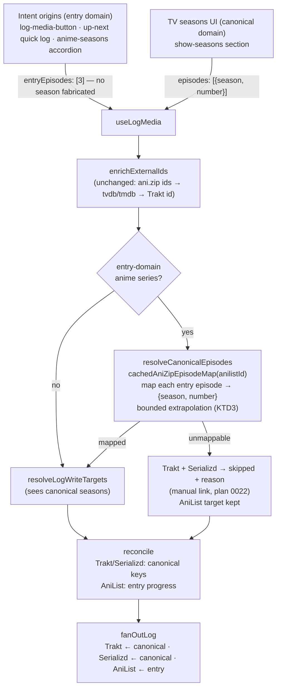

# fix: Map AniList season entries to canonical Trakt/Serializd seasons

## Summary

AniList models every anime season as a separate series entry, but Trakt, Serializd, and TMDB model one show with numbered seasons. Today every AniList-origin log hardcodes `season: 1`, so logging episode 3 of "You and I Are Polar Opposites Season 2" writes **S01E03** of the base show to Trakt and Serializd — a phantom season-1 rewatch instead of season-2 progress. This plan adds a season-mapping resolution step to the log fan-out: AniList-entry-relative episode numbers are translated to canonical `{season, episode}` pairs via ani.zip's per-episode mapping table before any Trakt/Serializd write, and an unmappable episode skips those providers with a reason (surfacing the plan-0022 manual deep link) instead of guessing.

This is the follow-up that plan 0011 (decision 7) explicitly deferred: *"Multi-season absolute numbering defers to a follow-up using ani.zip's episode table."*

---

## Goal Capsule

A user logging from any AniList-origin surface (details log button, Up Next quick log, anime seasons accordion) on a sequel-season or split-cour entry sees Trakt and Serializd receive the true canonical season and episode, AniList receive unchanged entry-relative progress, and — when the mapping cannot be established — Trakt/Serializd skipped with a manual-log link rather than written with a wrong season. No caller anywhere fabricates a season number for anime.

---

## Problem Frame

**Where the bug lives (verified against current code):**

1. **Intent origins hardcode `season: 1`** — `src/features/log-media/log-media-button.tsx:123`, `src/features/up-next/compute.ts:117`, and `src/lib/providers/anilist/episodes.ts:102-108` (synthesizes a `Season 1` shape) feeding `src/features/anime-seasons/anime-seasons-section.tsx:128,138`.
2. **The ID bridge is show-level only** — `src/features/log-media/enrich.ts` maps `anilist_id → tvdb/tmdb/imdb` of the *base show* via `fetchAniZipIds` (`src/lib/providers/mapping/anizip.ts`), which deliberately decodes only the `mappings` block and discards ani.zip's per-episode `seasonNumber`/`episodeNumber` table.
3. **Writers trust the caller's season verbatim** — `src/lib/providers/trakt/writes.ts:81-101` posts `seasons:[{number: <caller season>}]`; `src/lib/providers/serializd/writes.ts:112-133` resolves `season_id` from the caller's season number against the base-show TMDB id.
4. **Reconcile compounds it** — `src/features/log-media/reconcile.ts:60,85` and `src/lib/providers/serializd/progress.ts:42` compare against `1-{n}` keys, so a season-2 log can be falsely skipped as "already watched" (because S1E3 was) or falsely caught up.
5. **Routing's only season guard points the wrong way** — `src/lib/providers/routing.ts:106-114` drops *AniList* when `season !== 1` (protecting the single-season AniList entry from TV-origin multi-season logs); nothing protects Trakt/Serializd from AniList-origin items.

**Mapping source of truth (verified live against `api.ani.zip/mappings`, 2026-07-26):** for a sequel-season AniList id (tested: Dan Da Dan Season 2, anilist 185660) the response's `mappings` block carries the *parent show's* `themoviedb_id`/`thetvdb_id`, and the `episodes` block keys AniList-entry-relative numbers (`"1"`, `"2"`, …, plus `"S1"` specials keys) to `{seasonNumber: 2, episodeNumber: 1, absoluteEpisodeNumber: 13, …}`. A season-1 entry (tested: Gachiakuta, anilist 178025) returns identity mapping (`seasonNumber: 1, episodeNumber: 1`). This handles sequel seasons *and* split-cour entries (an entry whose episode 1 maps to, e.g., S3E13) at per-episode granularity.

---

## Requirements

- **R1** — Logging an episode (or batch) from an AniList-origin anime series entry writes the canonical `{season, episode}` to Trakt and Serializd, resolved per-episode via ani.zip's episode table — never a hardcoded season 1.
- **R2** — AniList's own write is unchanged: entry-relative `progress` scalar (plan 0011 decision 4). A season-2 entry's episode 3 is still `progress: 3` on that entry.
- **R3** — When canonical mapping cannot be established for any intended episode (no ani.zip document, empty/short episode table beyond safe extrapolation), Trakt and Serializd are **skipped with a `reason`** — earning the plan-0022 manual-link affordance — never written with a guessed season. A mapping miss must not fail the fan-out or block the AniList write.
- **R4** — Reconcile compares each provider in its own numbering domain: Trakt/Serializd already-watched checks use canonical `{season}-{episode}` keys; the AniList check uses entry-relative progress. No false in-sync skips and no duplicate writes across domains.
- **R5** — Every AniList intent origin (details log button, Up Next quick log, anime seasons accordion, and the `useLogMedia` reconcile prefetch) routes through one shared translation step inside the fan-out. No `season: 1` literal remains at any anime call site.
- **R6** — TV-origin (canonical-numbered) logs keep today's behavior: AniList is dropped from targets when the batch includes canonical season ≠ 1. Reverse mapping (canonical season → sibling AniList entry) is out of scope (see Scope Boundaries).
- **R7** — Mapping lookups follow the repo's cache discipline: one flat short-lived cached query (KTD4), misses cached too. No mapping fetch on feed/list render paths; the only permitted render-path consumer is the anime details accordion's single cached episode-map query (R8), which doubles as the pre-warm for the log path on that screen.
- **R8** *(should)* — The anime seasons accordion displays the true canonical season number in its header when the mapping is known (e.g. "Season 2" instead of the synthesized "Season 1"), while episode rows stay entry-relative.

---

## Assumptions

Recorded because this plan was scoped without an interactive confirmation pass:

- **A1** — ani.zip remains the sanctioned mapping dataset (plan 0011 decision 5); no AniList `relations` (PREQUEL/SEQUEL) graph walking is introduced in this plan.
- **A2** — The reverse direction (logging from the Trakt-canonical TV seasons UI and fanning *into* the correct sibling AniList entry) stays deferred. Today's drop-AniList-for-season≠1 rule is the accepted behavior for TV-origin logs.
- **A3** — Local notifications (`src/features/notifications/compute-schedule.ts:61` also stamps `season: 1`) don't write to providers, so they are out of scope here; noted as follow-up.
- **A4** — Diary display divergence for split-cour entries (AniList activity says "3", Trakt diary says S3E15) is accepted, consistent with plan 0016's "mismatched sets stay separate rows rather than guessing."
- **A5** — ani.zip's episode keys are AniDB-entry-derived and were verified entry-relative by live probe on two titles (Sources). Where AniDB and AniList disagree on an entry's episode numbering (recap episodes, episode 0, split double-episodes), a silent off-by-one write is possible and passes every KTD3 guard. Accepted as residual exposure; any real instance goes to `docs/solutions/` and becomes the trigger for consulting the dataset's offset fields.

---

## Key Technical Decisions

- **KTD1 — ani.zip episode table is the mapping source; decode minimally, in a sibling function.** Add `fetchAniZipEpisodeMap` next to `fetchAniZipIds` in `src/lib/providers/mapping/anizip.ts`, decoding only per-episode `{seasonNumber, episodeNumber}` keyed by numeric entry-episode keys (skip `"S*"` specials keys and entries missing `seasonNumber`). Keep `fetchAniZipIds` untouched so feed-path memory is unchanged — the ~1 MB long-runner payload hazard (`docs/solutions/web-cors-anizip.md`) is only ever *retained* on write actions, and cached thereafter. Accepted cost: the write path may re-download a document the ids lookup already fetched under its own query key — a one-time-per-title duplication, preferred over widening the feed-path decode. Same non-failable contract as the ids fetch: `null` on any miss, never a thrown error.
- **KTD2 — Numbering domains become explicit; translation is centralized.** `LogMediaVariables` (`src/features/log-media/fan-out.ts`) gains an entry-relative form (directional shape: `entryEpisodes?: number[]`) so AniList-origin callers stop fabricating seasons entirely. Mutual exclusivity with the canonical `episode`/`episodes` fields applies to **caller input only**: after translation, the variables handed to `fanOutLog` carry both `entryEpisodes` (read by the AniList adapter) and the translated canonical `episodes` (read by the Trakt/Serializd adapters), leaving `fanOutLog`'s signature and the adapter map untouched. `useLogMedia` translates entry → canonical in one step after `enrichExternalIds` and before target resolution/reconcile. Canonical-domain callers (TV seasons UI) are untouched. Routing (`src/lib/providers/routing.ts`) stays pure and network-free — it only ever sees the already-translated result (plan 0011 decision 6).
- **KTD3 — Miss policy: skip-with-reason; extrapolation bounded in season, distance, and declared length.** If the episode table maps all its episodes into a single season with contiguous numbering, an episode at most **2 past the table's end** — and not exceeding the entry's declared AniList episode count when known — extrapolates within that season (the just-aired case, ani.zip lag). Anything else — no document, empty table, multi-season table, non-contiguous numbering, a farther gap — makes the *whole batch* unmappable: Trakt and Serializd get a `skipped` outcome with a `reason` (plan 0022 R6 manual link), AniList still writes. The distance bound exists because an unbounded guess re-creates the wrong-identity write this plan eliminates (a whole-entry batch on a half-mapped table must not fabricate a season's back half). All-or-nothing per provider per log action keeps `ProviderLogOutcome` semantics intact (no per-episode partial outcomes). This upholds the KTD2 invariant recorded in `docs/solutions/trakt-text-search-wrong-movie-match.md` — wrong identity is strictly worse than none — and note today's behavior *is* the wrong-identity guess (season 1); the fix replaces a silent wrong write with an honest skip.
- **KTD4 — Cache policy: one flat short-lived query, action paths only.** New `cachedAniZipEpisodeMap` in `src/state/queries/mapping.ts` under the `['mapping', …]` key family with a single flat `staleTime` (~1 h), misses cached identically (AniList 30 req/min budget discipline; `cachedAniListFilmId` precedent for caching misses). The short window is what self-heals airing lag: a just-aired episode absent from a cached table gets retried on the next action past the window. Deliberately **not** a content-dependent hit-long/miss-short mechanism — no such pattern exists in the codebase (every `state/queries` staleTime is a flat value), and the shipped Serializd code consciously rejected even plan 0017's cached-season-id design (writes resolve inline on every log; see the comment in `src/state/queries/serializd.ts`). This plan caches at all only because the ani.zip document is ~1 MB.
- **KTD5 — Reconcile and adapters split by domain.** `fanOutLog` hands canonical episodes to the Trakt and Serializd adapters and entry-relative numbers to the AniList adapter (which keeps its `progress = max(number)` collapse). Reconcile's `traktHasEpisodes`/`serializdHasEpisodes` receive canonical keys; `anilistHasEpisodes` receives entry numbers. The Serializd "fully logged only when the diary entry exists" invariant (plan 0017 R12) is untouched.
- **KTD6 — ~~TVDB-vs-TMDB season numbering divergence is accepted risk, symmetrically.~~ SUPERSEDED 2026-07-27 during implementation.** The original text read: *"ani.zip's `seasonNumber` is TVDB-derived; Serializd is TMDB-keyed. For anime these overwhelmingly agree; where they don't, both providers can receive a wrong-but-existing write … The risk is accepted for both providers on the same rationale — per-episode dataset granularity makes divergence rare — with the follow-up sanity probe (Scope Boundaries) as the trigger if evidence appears."*

  **The assumption is false, and the trigger fired on the first real log.** The divergence is not TVDB-vs-TMDB, it is **TVDB vs both trackers**, and it is the common case for exactly the sequel-season entries this plan exists to serve: TVDB splits anime into broadcast seasons that Trakt and TMDB frequently collapse into one continuous season. Three of six probed entries diverge (100 Girlfriends S3, Dan Da Dan S2, Solo Leveling S2 — the first being the reported bug, the second this plan's own worked example). It also isn't the accepted "wrong-but-existing write": there is no such season, so Trakt 404s and Serializd can't resolve a `seasonId`.

  **Replacement:** ani.zip's row is TVDB's *opinion*, not the answer. Decode `absoluteEpisodeNumber` alongside `{seasonNumber, episodeNumber}` (amending KTD1's minimal decode by one field) and place the row against the **destination show's own season layout** (`lib/providers/mapping/season-layout.ts`): the TVDB pair wins when that season exists with room for the episode, else the absolute number decides which season it lands in, else reasoned skip. Layout source is TMDB `/tv/{id}` with a Trakt `/shows/{id}/seasons` fallback — the probe found Trakt and TMDB agreeing on every sampled show, so one layout serves both write targets and KTD2's single centralized translation step is preserved. Full evidence: `docs/solutions/anizip-tvdb-seasons-vs-tracker-seasons.md`.

  KTD3's "multi-season table" clause narrows accordingly: a boundary-crossing table now blocks only *extrapolation* past its end. Rows the table carries are real data, and the layout check is a stronger guard than the table's shape ever was — so a long-runner resolves instead of being refused.

---

## High-Level Technical Design

Prose is authoritative for the skip path: an unmappable batch still runs reconcile for the AniList target; Trakt/Serializd remain in the write targets with their adapters wrapped to resolve reasoned skips without executing, so the outcomes flow through the normal decisions/results merge and `LogMediaResult` surfaces them exactly like other reasoned skips.

---

## Implementation Units

### U1. ani.zip episode-map client

**Goal:** A minimal, non-failable decoder for ani.zip's per-episode season mapping.
**Requirements:** R1, R7 (KTD1)
**Dependencies:** none
**Files:** `src/lib/providers/mapping/anizip.ts`, `src/lib/providers/mapping/anizip.test.ts` (extend or create beside existing tests)
**Approach:** `fetchAniZipEpisodeMap(lookup)` fetching the same `ANIZIP_MAPPINGS_URL`, decoding only the `episodes` block into a map of entry-episode-number → `{season, number}`. Numeric keys only; skip `"S*"` keys and any entry lacking `seasonNumber`/`episodeNumber`. Returns `null` on any fetch/decode miss. Follow the existing `fetchAniZipIds` shape and the injected-fetch convention.
**Patterns to follow:** `fetchAniZipIds` in the same file; fixture discipline from `docs/solutions/trakt-progress-episodes-have-no-season-field.md` — build fixtures from **real captured responses**, not hand-written interfaces.
**Test scenarios:**
- Season-1 entry fixture (e.g. Gachiakuta, anilist 178025): episode 1 → `{season: 1, number: 1}` (identity).
- Sequel-season fixture (Dan Da Dan S2, anilist 185660): episode 1 → `{season: 2, number: 1}`; episode 12 → `{season: 2, number: 12}`.
- Split-cour-style fixture (entry whose episode 1 maps to a mid-season offset, e.g. S3E13): mapping preserved per-episode.
- Response with `"S1"` specials key and an episode entry missing `seasonNumber`: both excluded, numeric episodes still returned.
- Network error / non-200 / malformed JSON → `null`, no throw.
**Verification:** unit tests pass; `fetchAniZipIds` behavior and its tests unchanged.

### U2. Cached lookup + pure translation utility

**Goal:** Budget-disciplined access to the episode map, and a pure function turning entry episode numbers into canonical pairs (or an honest miss).
**Requirements:** R1, R3, R7 (KTD3, KTD4)
**Dependencies:** U1
**Files:** `src/state/queries/mapping.ts`, new `src/lib/providers/mapping/episode-translation.ts` + `src/lib/providers/mapping/episode-translation.test.ts`
**Approach:** `cachedAniZipEpisodeMap` beside the existing `cachedAniZipIds`/`cachedTraktLookup` helpers, `['mapping', 'anizip-episodes', anilistId]` key, one flat ~1 h staleTime per KTD4 (misses cached identically). Pure `translateEntryEpisodes(map, numbers, declaredEpisodeCount?)` returning either `{ ok: true, episodes: Array<{season, number}> }` or `{ ok: false, reason }`, implementing the KTD3 bounds (single contiguous mapped season, ≤ 2 past table end, ≤ declared count when known) and all-or-nothing batch semantics.
**Patterns to follow:** cache-key family and cached-misses precedent in `src/state/queries/mapping.ts` (`cachedAniListFilmId`); the versioning caveat from `docs/solutions/trakt-text-search-wrong-movie-match.md` (in-memory only today — if a persister lands, mapping keys need versioning).
**Test scenarios (translation, pure):**
- Full map, batch `[1,2,3]` on a sequel entry → canonical S2 E1–3, `ok: true`.
- Episode 12 requested, map covers 1–11 all in S2 contiguous → extrapolates to S2E12.
- Episode 12 requested, map covers 1–11 spanning S2 *and* S3 → `ok: false` with reason (no cross-boundary guess).
- Episode 14 requested, map covers 1–11 → `ok: false` with reason (distance bound: more than 2 past the table's end).
- Episode 13 requested, map covers 1–11 in S2, declared `totalEpisodes: 12` → `ok: false` with reason (declared-count cap).
- Table itself non-contiguous (e.g. maps 1–4 and 6–11) → `ok: false` even for an in-range episode.
- Empty/`null` map → `ok: false` with reason.
- Batch where one episode maps and one doesn't → `ok: false` (all-or-nothing, KTD3).
**Verification:** unit tests pass; no new query fires on any render path (only invoked from U3's mutation/prefetch flow).

### U3. Fan-out integration: entry domain in, canonical out

**Goal:** The single centralized translation step; no AniList write path carries a fabricated season.
**Requirements:** R1, R2, R3, R5, R6 (KTD2, KTD5)
**Dependencies:** U2
**Files:** `src/features/log-media/fan-out.ts`, `src/features/log-media/use-log-media.ts`, `src/lib/providers/routing.ts` (comment/option semantics only), tests: `src/features/log-media/fan-out.test.ts` (if present), `src/lib/providers/routing.test.ts`
**Approach:** Add the entry-relative variables form (KTD2). In `useLogMedia` (both the mutation and the reconcile prefetch path in `src/features/log-media/use-log-media.ts`): after `enrichExternalIds`, when variables are entry-domain, resolve the episode map and translate — but **only when the routed targets include Trakt or Serializd** (mirroring `enrich.ts`'s connected-provider gate); an AniList-only user gets no ~1 MB fetch and no skip outcomes for providers that were never targets. On `ok: false`, keep Trakt/Serializd **in** the write targets but wrap their adapters so each resolves `{ status: 'skipped', reason }` without executing — the skip then flows through `fanOutLog` and the existing decisions/results outcome merge untouched, so `LogMediaResult.outcomes` retains them and plan 0022's manual link fires (no new `ProviderLogOutcome` status). The `nonSeasonOneEpisodes` computation now runs on *canonical* episodes and only for canonical-domain input — entry-domain logs never drop AniList regardless of mapped season (that guard existed precisely because seasons used to be untranslatable). Update the routing option's comment to the new invariant; routing logic itself needs no structural change.
**Execution note:** start with a failing integration-style test on `useLogMedia`'s decision layer: sequel-entry log produces canonical Trakt/Serializd payload intents + entry-relative AniList intent; unmappable entry produces reasoned skips + AniList write.
**Test scenarios:**
- Entry-domain log, episode 3 on a sequel entry (map → S2): Trakt adapter receives `{season: 2, number: 3}`; Serializd receives season 2; AniList receives entry progress 3; AniList is **not** dropped.
- Entry-domain log, mapping unavailable: outcomes contain `trakt: skipped(reason)`, `serializd: skipped(reason)`, `anilist: ok`; fan-out does not throw.
- Entry-domain log with only AniList connected: no episode-map fetch fires; AniList writes; no skip outcomes appear for providers that were never targets.
- Canonical-domain TV log with `{season: 2}` and an attached `externalIds.anilist`: AniList dropped (R6 unchanged, existing `routing.test.ts:235` case preserved).
- Entry-domain log on a season-1 entry: byte-identical provider payloads to today (regression guard).
- Anime film (`isFilm: true`): no translation attempted, movie path untouched.
**Verification:** all existing fan-out/routing tests pass (updated where they asserted the season-1 literal); new scenarios green.

### U4. Reconcile in dual domains

**Goal:** Already-watched checks stop comparing season-2 intents against season-1 keys.
**Requirements:** R4 (KTD5)
**Dependencies:** U3
**Files:** `src/features/log-media/reconcile.ts`, `src/features/log-media/reconcile.test.ts`
**Approach:** Reconcile receives both the canonical batch (for Trakt/Serializd `${season}-${number}` key checks against `traktHasEpisodes` / `serializdHasEpisodes`) and the entry-relative numbers (for `anilistHasEpisodes`' progress comparison). Update the plan-0011 scope comments (`reconcile.ts:78-80`) that document the old single-season assumption. Catch-up / in-sync-skip / parity-rewatch matrix semantics unchanged.
**Test scenarios:**
- Trakt has S1E3 watched, intent is canonical S2E3 → **write** (catch-up), not a false in-sync skip.
- Trakt has S2E3 watched, AniList entry progress 2, intent S2E3/entry-3 → AniList catch-up write, Trakt skip (in-sync, no reason).
- All providers at parity on the sequel entry → parity-rewatch on all (Trakt new history entry, AniList `REPEATING` with entry progress).
- Unmappable batch with AniList at parity → mapping-skipped providers are **excluded** from the parity computation; AniList alone rewatches (`REPEATING`), Trakt/Serializd stay reasoned skips — the skip must not suppress the rewatch, and the rewatch must not imply all-provider parity.
- Serializd progress present but diary entry absent for S2E3 → still treated as not-fully-logged (plan 0017 R12 preserved).
**Verification:** reconcile test suite green including new sequel-season cases.

### U5. Intent origins: remove every fabricated season

**Goal:** All three AniList surfaces emit entry-domain variables; the accordion optionally shows the true season.
**Requirements:** R5, R8 (KTD2)
**Dependencies:** U3
**Files:** `src/features/log-media/log-media-button.tsx`, `src/features/up-next/compute.ts`, `src/features/up-next/ui/quick-log-button.tsx`, `src/features/anime-seasons/anime-seasons-section.tsx`, `src/lib/providers/anilist/episodes.ts`, tests: `src/features/up-next/compute.test.ts`, `src/lib/providers/anilist/episodes.test.ts`
**Approach:** Replace each `{ season: 1, number }` construction with the entry-domain variables form. `getAnimeEpisodes` stops synthesizing `number: 1` as a *claim* — either keep a neutral single-section shape or (R8) surface the mapped canonical season number for the header by mounting one cached episode-map query when the anime accordion renders (permitted by R7's carve-out; it doubles as the log-path pre-warm on that screen, so the eventual log doesn't wait on the ~1 MB fetch). Display-only: log payloads stay entry-relative, and watched-checkmark keys stay **entry-relative** (derived from AniList entry progress) regardless of the displayed header — do not key them off the mapped season.
**Test scenarios:**
- `compute.test.ts` AniList block: pending log now carries entry-domain episodes (updating the `episode: { season: 1, number: 6 }` assertions).
- Accordion whole-season log on a sequel entry produces one entry-domain batch `[1..n]`.
- R8 (if implemented): sequel entry header renders "Season 2"; mapping miss renders the neutral fallback, never "Season 1".
- Grep-level guard: no `season: 1` literal remains in any AniList write path (`log-media-button`, `up-next/compute`, `anime-seasons`).
**Verification:** `bun test` green; manual smoke — details screen of a sequel-season entry shows correct label and the log button logs without a season-1 write (verifiable in Trakt history).

### U6. Docs, comments, and end-to-end scenario coverage

**Goal:** The compound-knowledge trail matches the new behavior.
**Requirements:** all (traceability)
**Dependencies:** U3, U4, U5
**Files:** `docs/solutions/web-cors-anizip.md` (episode table is now consumed; note the action-path-only fetch + cache shape, and correct its "absolute episode numbers" description — the keys are AniDB-entry-derived and verified entry-relative by live probe, per A5), `src/lib/providers/anilist/writes.ts` + `src/lib/providers/routing.ts` comment updates (retire "entry progress ≡ season-1 episode number" phrasing where it no longer holds), `todos/002-in-progress-p2-anilist-integration.md` (note the deferred item is now shipped)
**Approach:** Documentation-only unit plus one cross-layer scenario test if U3's integration test doesn't already cover the full chain (enrich → translate → reconcile → adapter payloads) for: sequel entry happy path, unmappable skip path, season-1 identity regression.
**Test expectation:** none beyond the cross-layer scenario named above — this unit is docs/comments.
**Verification:** `bun lint`, `bun test`, `bun check:classnames` green; docs read true against the shipped code.

---

## Scope Boundaries

### Deferred to Follow-Up Work
- **Reverse mapping (TV-origin → sibling AniList entry):** logging canonical S2 from the Trakt seasons UI could resolve the sequel's AniList id (ani.zip reverse lookup or AniList `relations`) and write entry progress there. Today's drop-AniList rule stays (R6/A2).
- **Notifications:** `compute-schedule.ts`'s `season: 1` candidate — local-only, no provider writes; align when notifications grow season-aware content.
- **Unified diary cross-domain merging:** split-cour entries produce diverging episode sets across providers; plan 0016's "stay separate rows" rule stands (A4).
- ~~**Trakt pre-write season sanity check** (episode-count probe before writing) — only if KTD6's accepted numbering-divergence risk materializes in practice.~~ **Pulled into this plan 2026-07-27** — the risk materialized on the first real log, so season-layout resolution shipped here rather than as a follow-up. See the superseded KTD6 above.
- **Cleanup of phantom season-1 history already written by the old behavior:** existing wrong S1 entries on Trakt/Serializd will never match the new canonical reconcile keys, so they persist in provider history and the unified feed after this fix ships. Deferred deliberately — the recommended user path is manual removal on the provider's own site; no automated un-logging is attempted (a destructive cross-provider write with its own failure modes).

### Outside scope
- Manga, anime films (`isFilm` path is season-less), Letterboxd, and any registry/capability change — routing table is untouched.
- AniList `relations` graph fetching.

---

## Risks

- **TVDB/TMDB season numbering divergence (KTD6):** a mismatched show can produce a wrong-but-existing write on **either** provider — Serializd's season-id guard only catches *absent* seasons, and Trakt only errors when the season doesn't exist at all. Mitigation: per-episode dataset granularity makes this rare; the follow-up sanity probe is named above if evidence appears. Record any real instance in `docs/solutions/` per AGENTS.md.
- **ani.zip payload size:** long-runners (~1 MB) are now retained/decoded on write actions. Bounded: write-action-only fetch, long-lived cache, minimal decode (KTD1).
- **ani.zip availability/lag:** a down or lagging dataset turns sequel-season logs into reasoned skips (manual links) instead of writes. That is the designed degradation (R3) — strictly better than today's wrong write — but visible to users; the KTD4 short-miss window limits the duration.
- **Behavior change for unmapped season-1 shows:** an anime absent from ani.zip — or present with a not-yet-populated episode table, most likely at a premiere — that previously (wrongly-by-luck) logged S1 correctly will now skip Trakt/Serializd until the table appears. Accepted: coverage for TV anime is near-complete (the documented hole is films by TMDB id, which don't take this path), and KTD4's ~1 h window bounds the premiere-lag duration. Record any real occurrence in `docs/solutions/`.

---

## Verification Contract

- `bun test` — all suites, including the updated files listed per-unit and the new mapping/translation suites.
- `bun lint` and `bun check:classnames` clean.
- TypeScript check clean (repo's standard check; no `Effect<...>` types leak above `lib/providers`/`lib/http` — containment rule).
- Manual smoke (owner): connect Trakt + Serializd + AniList; log an episode from a currently-airing sequel-season AniList entry; confirm Trakt history shows the sequel season's episode and Serializd shows the sequel season diary entry; confirm a season-1 entry logs identically to before.

## Definition of Done

- R1–R7 implemented and test-covered (R8 implemented or explicitly dropped with a note in the PR).
- No `season: 1` literal in any AniList-origin write path.
- Unmappable entries produce reasoned skips with manual links, verified by test.
- Docs/comments updated (U6); existing plan-0011-era comments no longer claim the single-season scope.

---

## Sources & Research

- Origin deferral: `docs/plans/0011-anilist-integration.md` (decisions 5–7; multi-season deferral), `src/lib/providers/anilist/writes.ts` comments.
- Mapping dataset: `docs/solutions/web-cors-anizip.md`, `docs/solutions/anizip-misses-anime-films-by-tmdb-id.md`; live probes of `api.ani.zip/mappings` for anilist 185660 (sequel: per-episode `seasonNumber: 2`, parent `themoviedb_id`) and 178025 (season 1 identity), 2026-07-26.
- Matching invariants: `docs/solutions/trakt-text-search-wrong-movie-match.md` (wrong identity worse than none), `docs/solutions/trakt-progress-episodes-have-no-season-field.md` (fixtures from real responses).
- Serializd season semantics: `docs/plans/0017-serializd-provider.md` (KTD6 season-id, R12 diary invariant).
- Fan-out contracts: `docs/plans/0008-log-media-fanout.md`, `docs/plans/0022-manual-log-fallback.md` (R6 reasoned skips → manual links).
- Product Contract preservation: no upstream brainstorm; contract bootstrapped in this plan (`product_contract_source: ce-plan-bootstrap`).
