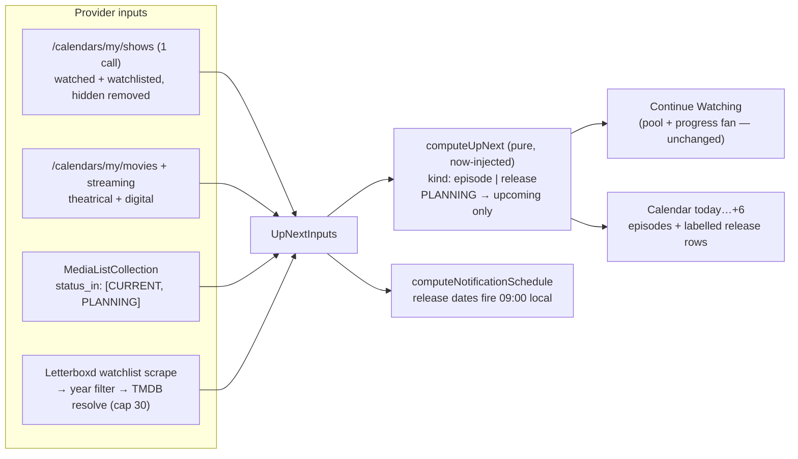

# Unreleased Items in the Agenda - Plan

## Goal Capsule

- **Objective:** A show you have never watched an episode of, and a film that
  is not out yet, can reach the Calendar section and fire a release
  notification. Today neither can, structurally — both halves of Up Next are
  seeded from *watched* lists.
- **Authority:** AGENTS.md overrides this plan where they conflict (theme
  tokens, `cn()`, kebab-case, Effect containment, `lib/time` for every
  aired/unaired judgment, React Compiler — no manual memo). Owner decisions
  (2026-07-27, recorded per requirement below) override the plan.
- **Landing strategy:** one branch, one PR.
- **Stop conditions:** stop and surface if (a) the Trakt streaming-releases
  calendar path cannot be confirmed against a live response (fall back is
  stated in KTD-4, not a blocker), (b) the Letterboxd resolve fan exceeds the
  budget in U6's measurement gate, or (c) any change would need a Worker proxy
  rule beyond the existing Letterboxd GET allowlist.

---

## Product Contract

### Summary

Calendar (today … today+6) stops being a mirror of what you already watch. It
gains three new sources of *unreleased* entries — Trakt watchlist, AniList
PLANNING, Letterboxd watchlist — and gains a second entry kind: a **film
release**, which has a date and a release kind but no episode. Release
notifications cover the widened set through the existing batch and toggle.

### Problem Frame

The agenda is seeded from watched lists on both sides:

- Trakt: `getWatchedShows()` → `selectUpNextPool()` (top 20 by
  `last_watched_at`) → per-show `progress/watched` → `next_episode`
  (`src/state/queries/up-next.ts:79`).
- AniList: `getCurrentAnime()`, hardcoded `status: CURRENT`
  (`src/lib/providers/anilist/reads.ts:88`).

So a series premiering next Tuesday that you have watchlisted cannot appear,
and neither can a film releasing next Tuesday. There is no Trakt watchlist read
in the codebase at all — the "Your Watchlist" feed row is a Letterboxd scrape.

Two pieces of the answer already exist and are unused here: `releaseCalendar`
(`theatrical` / `digital` / `physical`, plan 0029) is normalized onto
`NormalizedMediaItem` but consumed only by the details screen, and
`lib/time/has-aired` already parses a bare `YYYY-MM-DD` as **local** midnight
with `isDateOnly` suppressing a bogus `00:00` time badge.

### Requirements

**Agenda contents**

- R1. Calendar's window stays **today … today+6** (owner decision: fold into
  the existing section, do not add a second longer-horizon section and do not
  widen the window). The week strip's 7 cells are unchanged.
- R2. Calendar includes entries the user has not started: Trakt watchlisted
  shows, AniList PLANNING anime, and unreleased films from the Trakt and
  Letterboxd watchlists.
- R3. A film contributes **one entry per release kind**, labelled distinctly
  (owner decision): "In theaters" and "Streaming" are separate rows with
  separate dates, not one row that moves. Physical is carried by the same
  mechanism but is not surfaced in v1 (see Scope Boundaries).
- R4. Continue Watching is **unchanged**. Nothing unreleased and nothing
  unstarted may reach it — it means "aired, waiting, quick-loggable."
- R5. An unreleased entry offers no quick-log. (Already true by construction:
  Calendar cards pass no `action` — `episode-card.tsx:24`.)
- R6. Cross-provider duplicates collapse to one entry, by TMDB id, on the same
  precedence as today (AniList wins for anime).
- R7. Per-provider partial failure is preserved: a failing watchlist source
  contributes an error entry and zero entries, never an empty or thrown
  section.
- R8. Hidden items stay hidden — the new entries pass through
  `useVisibleEntries` like every other.

**Notifications**

- R9. Unreleased entries fire local notifications through the **existing batch
  and the existing single toggle** (owner decision) — no second switch. The
  7-day window and the 50-item cap are shared, unchanged.
- R10. A release date is a calendar day with no time. Its notification fires at
  **09:00 local on release day** (owner decision), never at the local midnight
  `parseLocalInstant` yields — correct as an ordering key, hostile as an alert.
  A release whose 09:00 has already passed today is not scheduled (R2 of plan
  0020 — no immediate-fire burst).

**Sources**

- R11. Trakt: `/calendars/my/shows` **replaces** the progress-fan as the source
  of Calendar's Trakt half (owner decision — see KTD-2 for the behaviour change
  this accepts). Films come from `/calendars/my/movies` and the
  digital/streaming calendar.
- R12. AniList: the existing list request widens to `status_in: [CURRENT,
  PLANNING]`. PLANNING entries reach Calendar only, never Continue Watching and
  never the "Your Anime" row (KTD-3 — this is the regression this feature is
  most likely to cause).
- R13. Letterboxd: the existing watchlist scrape, filtered to plausibly
  unreleased films before any resolve happens (KTD-5).

### Scope Boundaries

**Out of scope**

- A longer-horizon "Coming Soon" surface. R1 is a deliberate owner decision: a
  film three months out is invisible until it is 7 days out.
- Physical/disc releases as their own agenda row. `releaseCalendar.physical`
  keeps flowing; only theatrical and digital render (R3).
- Serializd watchlist as a source (would need a new read and a widened Worker
  allowlist — explicitly excluded by the owner's source selection).
- Writing to any watchlist. This feature is read-only; adding an item to a
  watchlist stays a provider-side action.
- Per-item notification muting, and any change to the notification cap/window.

---

## Planning Contract

### Key Technical Decisions

- **KTD-1. `UpNextEntry` becomes a discriminated union on `kind`.** Today
  `episode: UpNextEpisode` is required and `episodeLabel()` always renders
  `E{n}` (`up-next/types.ts:36`, `ui/episode-card.tsx:32`). A film release has
  a date and a release kind and no episode. Making `episode` optional would put
  a null check in every consumer and force none of them; a union
  (`kind: 'episode'` carrying `episode`, `kind: 'release'` carrying
  `release: { kind: 'theatrical' | 'digital' | 'physical'; date: string }`)
  makes the exhaustive switch a type error to omit. A shared
  `entryInstant(entry)` accessor replaces the ~6 direct
  `entry.episode.firstAired` reads so ordering, bucketing and badging never
  re-derive it per call site. Rejected: a parallel `CalendarReleaseEntry[]`
  alongside `calendar` — the week strip, hidden-items filter, dedupe and sort
  would each need to merge two lists in the right order, which is four places
  to get it wrong for no type-safety gain.

- **KTD-2. `/calendars/my/shows` replaces the progress-fan for Calendar's Trakt
  half.** The endpoint returns episodes for shows "watched **or watchlisted**",
  already minus shows hidden from the user's Trakt calendar, in **one call**,
  max 33 days. This is strictly better than the current path for this section:
  the 20-show pool cap means shows past the cap *never* reach Calendar today —
  an admitted limitation (`up-next/compute.ts:29`). Continue Watching keeps the
  pool + `progress/watched` fan untouched (R4), because the calendar endpoint
  returns only *upcoming* airings and cannot answer "your next unwatched
  episode that already aired."
  **Accepted behaviour change (owner-confirmed):** Calendar now shows the
  episode airing this week even if the user is several episodes behind, rather
  than strictly their next unwatched one. This is what a schedule should show,
  and matches the section's own stated framing — "a schedule, not a mirror of
  the aired/upcoming split" (`compute.ts:158`).
  Rejected: `/sync/watchlist` + per-item resolution (reintroduces the fan the
  calendar endpoint exists to avoid, and forfeits Trakt's hidden-from-calendar
  setting).

- **KTD-3. AniList status must survive normalization, and PLANNING is
  Calendar-only.** `normalizeCurrentAnimeEntry` currently **drops** `status`
  (`anilist/normalize.ts:151`) even though the query selects it, and the single
  `currentAnimeEntries` query feeds both the "Your Anime" row and Up Next
  (`state/queries/anilist.ts:82`). Widening the query naively causes two
  regressions, the second severe:
  1. the "Your Anime" row lists plan-to-watch titles as currently watching;
  2. a PLANNING anime that is *already airing* (progress 0 → `next = 1`,
     `airing.episode = 5`) takes the `next < airing.episode` branch
     (`compute.ts:133`) and classifies as **`aired`** — pouring the user's
     whole plan-to-watch backlog into Continue Watching.
  So: carry `status` onto `AniListCurrentEntry`, keep the row filtered to
  `CURRENT`, and gate `anilistEntry` so a PLANNING entry can only ever produce
  an `upcoming` entry — a PLANNING series that is mid-run yields *nothing*
  (you have not started it; it is not "up next", and episode 1 airing weeks ago
  is not a calendar event).

- **KTD-4. Film dates: Trakt calendars first, TMDB `releaseCalendar` second.**
  `/calendars/my/movies` (theatrical) and the digital/streaming calendar are
  watchlist-driven and pre-dated, so they need no per-item resolve. The exact
  streaming path is the one detail the published docs summarise inconsistently;
  it is confirmed against a live response in U3, and if it does not exist under
  the assumed path the digital date falls back to TMDB
  `releaseCalendar.digital` for those films — the same field the details screen
  already renders, so no new normalization either way. `/calendars/my/dvd`
  supplies `physical` for completeness (not rendered, R3).

- **KTD-5. Letterboxd resolves a filtered subset, never the whole watchlist.**
  The scrape yields `{ slug, title, year }` and **no dates and no TMDB id**
  (`letterboxd/watchlist.ts:16`), so each film costs a TMDB `searchMovie` *plus*
  a `getMediaCatalogue` — 2 calls — to learn its `releaseCalendar`. A 400-film
  watchlist would spend 800 calls to find, typically, zero films releasing in a
  7-day window. Mitigation, in order: filter to `year == null || year >=
  currentYear` **before** resolving; cap the resolve at 30 films; cache the
  title+year → TMDB id mapping indefinitely and the catalogue on the feed's
  existing stale window. Title matching is a known hazard
  (`docs/solutions/trakt-text-search-wrong-movie-match.md`) — the resolve
  requires an exact-ish title match *and* a year match, and drops the candidate
  rather than guessing. U6 carries a measurement gate: if a representative
  watchlist still exceeds ~30 resolves after filtering, Letterboxd ships
  degraded (Trakt-watchlist films only) and that is stated in the PR rather
  than silently shipped as a fan.

- **KTD-6. Dedupe extends to films, on the existing key.** `dedupeByTmdb`
  handles anime today (`compute.ts:191`). A film on both the Trakt and
  Letterboxd watchlists is one TMDB id; entries also dedupe on
  `(tmdbId, release.kind)` so a theatrical row and a digital row for the same
  film both survive while a duplicate theatrical row does not.

- **KTD-7. The notification candidate widens rather than forks.**
  `NotificationCandidate` has required `season` and `episode`
  (`compute-schedule.ts:13`). It gains the same `kind` discriminant so a
  release candidate carries its release kind instead, keeping one batch, one
  hash guard and one cap (R9). `itemId` stays the sole routing key (plan 0020
  KTD-6), so tap-through needs no change. The 09:00 rule (R10) lives in one
  helper next to the compute, `now`-injected and unit-tested like the rest of
  the feature — not inside a provider read.

### High-Level Technical Design

### Assumptions

- Trakt's my-calendars respect the user's hidden-shows setting server-side, so
  Shinobu adds no hiding logic beyond the existing `useVisibleEntries` (R8).
- `status_in` is accepted on `MediaListCollection` alongside the existing
  arguments, so R12 stays one request and does not double the 30 req/min spend
  (`docs/solutions/anilist-rate-limit-retry-storm.md`).
- The Trakt my-calendars endpoints are authed reads counting against the same
  budget as `/sync/*`; three extra calls per Up Next gather is well inside 1000
  per 5 minutes (`docs/solutions/trakt-watched-endpoints-2026-api-changes.md`),
  and it *removes* nothing from Continue Watching's existing spend.

---

## Implementation Units

### U1. `UpNextEntry` becomes a union

**Goal:** `kind: 'episode' | 'release'`, plus the `entryInstant(entry)`
accessor; every consumer updated to an exhaustive switch.
**Requirements:** R3, KTD-1.
**Files:** `src/features/up-next/types.ts`, `badges.ts`, `compute.ts`,
`ui/episode-card.tsx`, `use-up-next-sections.ts`.
**Approach:** mechanical, no behaviour change — land it before any new source
so the later units add data rather than reshape it. `episodeLabel()` becomes
`entryLabel()`: episodes keep `S1E4 · Title`, releases read "In theaters" /
"Streaming". `calendarBadges` reads `entryInstant`, so a date-only release
gets its accent day badge and — via the existing `isDateOnly` guard — no time
badge.
**Test scenarios:** `entryLabel` for both kinds and for the seasonless AniList
case; `entryInstant` for episode vs release; `calendarWeek` bucketing a
date-only release on the correct local day.

### U2. AniList PLANNING, gated

**Goal:** `status_in: [CURRENT, PLANNING]`; `status` carried onto
`AniListCurrentEntry`; PLANNING confined to `upcoming`.
**Requirements:** R12, KTD-3.
**Files:** `src/lib/providers/anilist/reads.ts`, `normalize.ts`,
`src/state/queries/anilist.ts`, `src/features/up-next/compute.ts`.
**Approach:** the "Your Anime" row filters to `CURRENT` at its selector so one
request still feeds both consumers. In `anilistEntry`, a PLANNING entry that
would classify as `aired` returns `null` instead.
**Test scenarios:** PLANNING + unaired → `upcoming`; PLANNING + already-airing
(the Continue Watching flood case) → excluded; CURRENT behaviour byte-identical
to today; the "Your Anime" selector excludes PLANNING.

### U3. Trakt my-calendars reads

**Goal:** `getMyShowsCalendar`, `getMyMoviesCalendar`, and the digital/streaming
read, with normalizers.
**Requirements:** R11, KTD-2, KTD-4.
**Files:** `src/lib/providers/trakt/reads.ts`, `normalize.ts`, `api.ts`.
**Approach:** Effect reads like their siblings. **Confirm the streaming path
against a live response before wiring it**; on absence, fall back per KTD-4 and
record the finding in `docs/solutions/`.
**Test scenarios:** normalizers over fixture payloads for each calendar; a
malformed row drops rather than throwing; date range formatting.

### U4. Trakt half of Calendar switches source

**Goal:** Calendar's Trakt entries come from the calendar reads; Continue
Watching's pool fan is untouched.
**Requirements:** R2, R4, R11, KTD-2.
**Files:** `src/state/queries/up-next.ts`, `src/features/up-next/types.ts`,
`compute.ts`.
**Approach:** `TraktUpNextInput` keeps feeding Continue Watching; a new
calendar input array feeds the upcoming split. The pool fan no longer
contributes upcoming entries — removing the double-source ambiguity rather than
merging two.
**Test scenarios:** a watchlisted, never-watched show reaches Calendar; a show
past the 20-show pool cap reaches Calendar (the fixed limitation); an aired
next episode still reaches Continue Watching and *not* Calendar.

### U5. Film release entries

**Goal:** theatrical and digital rows from the Trakt movie calendars, deduped.
**Requirements:** R3, R6, KTD-6.
**Files:** `src/features/up-next/compute.ts`, `src/state/queries/up-next.ts`.
**Test scenarios:** one film yields two labelled entries; duplicate theatrical
across sources collapses; a film already released contributes nothing;
ordering interleaves releases and episodes strictly by instant.

### U6. Letterboxd watchlist films (measurement-gated)

**Goal:** year-filtered, capped, cached resolve to `releaseCalendar`.
**Requirements:** R13, KTD-5.
**Files:** `src/state/queries/letterboxd.ts`, `src/state/queries/up-next.ts`,
a new resolve module under `src/features/up-next/`.
**Approach:** filter → cap 30 → `searchMovie` + `getMediaCatalogue`, requiring
title *and* year agreement, dropping ambiguous matches. **Gate:** measure the
post-filter candidate count on a real watchlist; if it exceeds the cap
routinely, ship Letterboxd degraded and say so in the PR (KTD-5).
**Test scenarios:** year filter keeps `null`/current/future and drops past;
cap respected; a title-only match with a wrong year is dropped, not guessed;
resolve failure degrades to no entry, never a thrown section.

### U7. Notifications for releases

**Goal:** release candidates in the existing batch, firing 09:00 local.
**Requirements:** R9, R10, KTD-7.
**Files:** `src/features/notifications/compute-schedule.ts`, its test.
**Approach:** widen `NotificationCandidate` with the `kind` discriminant; the
09:00 rule is a pure `now`-injected helper. Copy: "Dune: Part Three is out
today" for a release vs the existing "S2E5 aired — ready to watch."
**Test scenarios:** a release dated today after 09:00 is not scheduled; before
09:00 it is, at 09:00 exactly; the hash guard changes when a release date
moves; the 50-cap still holds nearest-first across mixed kinds.

### U8. Partial failure and hidden items

**Goal:** every new source settles independently; new entries respect hiding.
**Requirements:** R7, R8.
**Files:** `src/state/queries/up-next.ts`, `use-up-next-sections.ts`.
**Test scenarios:** each new source failing in isolation degrades only its own
contribution; a hidden film release does not render.

---

## Verification

- `bun test` — every unit's scenarios above, notably the two regression
  guards: PLANNING-already-airing never reaching Continue Watching (KTD-3), and
  the 09:00 boundary in both directions (R10).
- `bun typecheck` — the `kind` union makes a missed consumer a compile error,
  which is the point of KTD-1.
- `bun lint`, `bun check:classnames`.
- Manual: a watchlisted show premiering this week appears in Calendar with no
  quick-log; a film releasing this week appears twice, labelled; a PLANNING
  anime mid-run appears nowhere; Continue Watching is visibly unchanged.
- No native rebuild required — this is JS/TS only (hot reload).

## Follow-Ups

- A longer-horizon surface, if R1's 7-day fold proves too tight in use.
- Physical/disc rows (`releaseCalendar.physical` already flows).
- Serializd watchlist as a fourth source.
