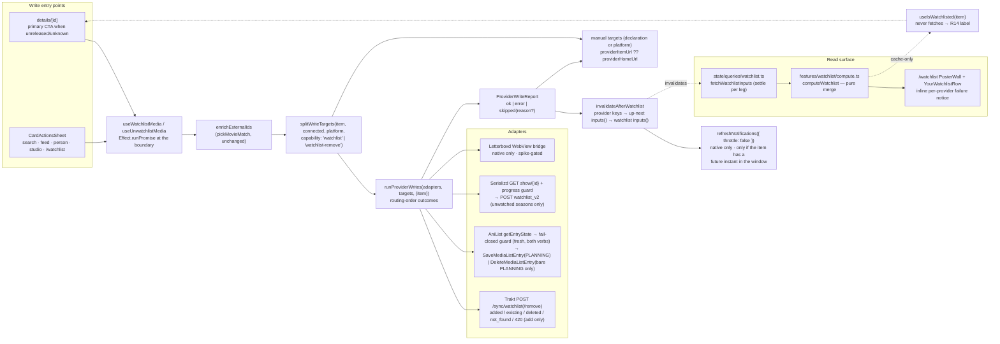

# Watchlist Read and Write - Plan

> **Revision 2026-07-28.** This plan was written write-only (`0031-watchlist-writes.md`)
> and assumed OQ-1(a). Three owner decisions on 2026-07-28 reversed that:
> **OQ-1 → (b)** build the cross-provider read surface too; **OQ-2 → write**, widen the
> Serializd Worker allowlist; **OQ-3 → removal is in scope.** Requirement and KTD
> numbering from the original is preserved; reversed items are rewritten in place and
> say so, and new material is appended rather than renumbered. Everything the original
> settled that survived — the three-state capability declaration, the AniList
> fail-closed guard, the in-place write-core extraction, the no-dead-end manual rows —
> is unchanged.

## Goal Capsule

Shinobu can record what you *have* watched. It cannot record what you *want*
to watch, and it cannot show you what you already told your trackers you want.
This plan adds both halves.

- **Objective (write):** one action on any unseen item — a film releasing in
  November, a 1997 film never seen, a manga never started — records the
  want-to-watch intent on every connected provider that applies to it, in
  parallel, reporting which provider took it and which did not. Today the
  strongest expression of that intent is a details screen that renders an
  accented countdown (`ReleaseTimeline`, plan 0029) directly above a greyed-out
  `Not yet released` button (`src/features/log-media/log-media-button.tsx:186`)
  — the one screen where the intent forms and nothing can act on it.
- **Objective (read):** one surface — `/watchlist`, plus the home row that
  summarizes it — merges every connected provider's watchlist into one list, so
  the add has somewhere to land and the app stops shipping a provider-branded
  read screen (`/watchlist/letterboxd`) as its only watchlist.
- **Objective (removal):** the surface can un-watchlist, on every provider whose
  API supports it, degrading to a manual provider link where it does not. This
  is only honest *because* the read surface exists — a merged entry knows which
  providers hold it, so a Remove row never acts against an item that was never
  added.
- **Authority:** AGENTS.md overrides this plan where they conflict (theme
  tokens, `cn()`, `components/button`, kebab-case, Effect containment,
  `lib/time` for every aired/unaired judgment, React Compiler — no manual
  memo). Owner decisions (2026-07-27 and 2026-07-28, recorded per requirement
  below) override the plan. **Plan 0030 has landed** (commit `76b8152`) and owns
  the agenda; this plan must not restate, contradict, or re-open it — see R9,
  R28 and the regression tests that name
  `docs/solutions/anilist-shared-list-query-status-gate.md` by file.
- **Landing strategy:** one branch, a **three-PR stack**, because the 2026-07-28
  decisions roughly tripled the scope and a single PR would put a Worker
  security-contract edit, a data-loss guard and a new route in one review.
  - **PR A — the write verb** (U1–U8). Ships complete and useful on its own.
  - **PR B — the Serializd write** (U9–U10). Contains the only Worker allowlist
    edit in this plan and is reviewed as a security-contract change on its own,
    per AGENTS.md § Web & CORS.
  - **PR C1 — the read surface** (U11–U15). Depends on A; independent of B.
  - **PR C2 — removal** (U16). Depends on C1. Split out because its AniList leg
    is the only data-destroying code in the plan (`DeleteMediaListEntry`, R36)
    and it must not review alongside a new screen — the same reason PR B is
    split for the Worker contract.
  The Letterboxd unit (U6) is spike-gated and ships degraded — manual link only —
  if the spike fails; that degradation is stated in the PR, never silently
  absorbed.
- **Stop conditions:** (a) the Letterboxd in-page watchlist endpoint cannot be
  captured from the authenticated WebView, **or is found to be a toggle**
  (fall back is KTD-6, degrade to a manual target, not a blocker);
  (b) `SaveMediaListEntry` with fields omitted is found to null them (KTD-2's
  guard means the mutation only ever runs where no entry exists, so nothing is
  at risk — record and continue);
  (c) **Serializd's `watchlist_v2` is confirmed to clear watched state on
  partly-watched shows and the season-filter guard does not prevent it** —
  including the case where the guard *cannot see* the watched season at all,
  i.e. U10 step 1 finds that a season marked watched wholesale is absent from
  `/progress`'s `watchedSeasons` (KTD-10) — that *does* block the Serializd
  write, which reverts to `'manual'`
  by a one-token registry flip; PR B degrades, PRs A and C are unaffected;
  (d) the Serializd `items[]` element shape cannot be confirmed against a real
  account before the read normalizer is written (KTD-9 named risk) — the
  Serializd *read* is already out of v1, so this only blocks a follow-up.

---

## Product Contract

### Summary

The write surface gains a second verb: **want-to-watch**. Given a
`NormalizedMediaItem` and nothing else, it routes to every connected provider
applicable to that item's type *and declared capable of the watchlist verb*,
fires in parallel, and reports per-provider outcomes in routing order. The write
path itself stays membership-read-free and idempotent-by-provider: it never
issues a per-item membership query (KTD-3, unchanged).

The read surface is a separate, standing, cached aggregate: `/watchlist` and the
home row merge Trakt's `/sync/watchlist`, AniList's PLANNING slice and
Letterboxd's scraped watchlist into one deduped list. It is what makes the add
visible, and it supplies the only honest membership state in the app — which is
what unblocks **removal** as a third verb.

The verb applies to anything unseen, regardless of whether it has a release date
— which makes it structurally distinct from plan 0030's agenda, not a superset
of it. **Watchlist is not the agenda** stays true on both sides: the read surface
produces `WatchlistEntry`, never `UpNextEntry`, and never feeds `computeUpNext`.

### Problem Frame

`useLogMedia` (`src/features/log-media/use-log-media.ts:494`) is the only
cross-provider write in the app, and every part of it presumes a *watch* has
happened: `planLogWrite` runs a reconcile pass (`reconcile.ts:36`), resolves a
canonical episode via the plan-0027 ani.zip round trip
(`use-log-media.ts:244`), and carries `watchedAt`, `tags` and `rewatch`
(`fan-out.ts:32-44`). None of that has a want-to-watch analogue.

The gate that produces the dead end is explicit:

```
filmReleaseStatus(item) → 'unreleased' | 'unknown'
  → canLog = false                    (log-media-button.tsx:130-137)
  → <Button disabled label="Not yet released" />   (:186, :200)
```

and for MANGA or any series whose next episode Trakt cannot name, the button
`return null`s entirely (`log-media-button.tsx:71-79`) — so the items with the
strongest want-to-watch case are exactly the ones with no control at all.

On the read side the dead end is different and just as visible: the app's only
watchlist screen is `/watchlist/letterboxd`, provider-branded, single-source,
and invisible to a Trakt-only or AniList-only user, who gets **no watchlist row
at all** today (`src/app/(tabs)/index.tsx:191` gates the row on
`letterboxdUsername != null`).

Four pieces of the answer already exist and are unused here.

1. The AniList mutation already takes status as a variable
   (`anilist/writes.ts:91-95`), so `PLANNING` needs no new GraphQL document —
   only a new exported function plus the guard read it requires
   (`getEntryState`, `anilist/reads.ts:334`), which is already implemented.
2. The whole dead-end machinery from plan 0022 — `manualRowsFor`,
   `manualLinkForOutcome`, `providerItemUrl ?? providerHomeUrl`
   (`manual-log-links.ts:15-41`) — is payload-agnostic and reusable verbatim.
3. **Plan 0030 already widened the AniList list read to
   `status_in: [CURRENT, PLANNING]`** (`anilist/reads.ts:96`) and already carries
   `status` through normalization (`anilist/normalize.ts:149,173`). PLANNING
   entries are therefore *already in the cached payload* under
   `anilistQueryKeys.currentAnimeEntries()`. The read surface's AniList leg is a
   selector, not a query, and costs **zero** extra requests.
4. The Trakt paginated-sync loop already exists as `getWatchedPages<Raw>`
   (`trakt/reads.ts:204`), private and "watched"-named; the watchlist read
   generalizes it rather than writing a second short-page-terminates loop.

What does *not* exist: any declaration that a provider can accept a watchlist
write at all. `ProviderDescriptor` carries exactly `id, label, mediaTypes,
canRead, canWrite, unsupportedWritePlatforms?` (`lib/providers/types.ts:23-38`)
and routing reads a single capability flag (`routing.ts:55`).

### Requirements

**The write verb**

- R1. One user action records want-to-watch on **every connected provider
  applicable to the item's type and capable of the verb**, fired in parallel.
  It is never a per-provider action the user picks a target for (owner
  decision, 2026-07-27).
- R2. The verb applies to **anything unseen**, not only unreleased things. All
  three `filmReleaseStatus` outcomes — `released`, `unreleased`, `unknown` —
  are valid targets (owner decision). `release-gate.ts` is never called as a
  gate on this path; it is consulted only for CTA *placement* (R11).
- R3. The payload is the `NormalizedMediaItem` and **nothing else** — no
  `episodes`, no `entryEpisodes`, no season, no `watchedAt`, no `tags`, no
  `rewatch`. (Q8; KTD-7.)
- R4. Watchlisting a TV show is **show-level** as a *product* contract. Seasons
  and episodes are not user-visible watchlist targets even where a provider
  accepts them (Trakt does — blueprint §L19254). This is a deliberate narrowing,
  not an API limitation. **Amended 2026-07-28:** show-level is not always one
  call. Serializd's watchlist is *season-keyed* (`season_ids` is required on both
  writes), so its adapter enumerates seasons via `GET /show/{tmdbId}` and then
  writes — 2 requests, and the season ids it sends are filtered by KTD-10's
  guard. The narrowing holds at the surface; the transport is per-provider.
  (Q8; KTD-7, KTD-10.)

**Capability and routing**

- R5. Watchlist targets are **not** derived from `canWrite`. The provider
  descriptor gains a distinct, **three-state** declaration —
  `watchlistWrite: 'write' | 'manual' | 'none'` — and routing derives watchlist
  targets from that declaration only. A boolean is wrong here: `false` at the
  same filter position as `canWrite` (`routing.ts:53-56`) would remove the
  provider from the target list entirely, so it would appear in neither
  `writable` nor `manual` and produce **no outcome at all** — the silent drop
  AGENTS.md's no-dead-end rule forbids. `'manual'` is the existing mechanism
  the registry already describes for Letterboxd on web ("Routing still lists
  Letterboxd as an applicable target … it's just routed to the manual-log
  fallback", `registry.ts:38-40`). (Q1; KTD-1.)
- R6. **REVERSED by the 2026-07-28 owner decision on OQ-2.** The original R6
  read: *"Serializd declares `watchlistWrite: 'manual'` … no corroborated
  endpoint in any of the three consumer projects the plan-0017 Appendix was
  compiled from, and the only route in is a widening of the Worker path+method
  allowlist."* Both premises have been overturned by research, and the owner
  authorised the widening.

  Serializd now declares `watchlistWrite: 'write'` and
  `watchlistRemove: 'write'` (R33). The endpoints are
  `POST watchlist_v2 { show_id, season_ids }` and
  `POST watchlist/remove_v2 { show_id, season_ids, async }`, both **exact-match,
  POST-only** additions to `worker/serializd-proxy.ts`'s `RULES` — two literals,
  never a `startsWith('watchlist')` prefix, which would also grant
  `watchlist/random` and every future `watchlist/*` sight-unseen. On native no
  transport change is needed at all (`transport.ts` has no allowlist).

  **Provenance, stated plainly because the owner's cited source is a dead end:**
  `Velocidensity/serializd-py` — the spec the owner pointed at — has **zero**
  watchlist support. At `HEAD` (latest commit 2026-07-18) it implements exactly
  the nine calls the current allowlist already covers, and `grep -rin
  "watchlist\|bookmark"` returns nothing; there is no open issue or PR adding
  one. It is a valid corroborator for the *transport* (base URL, app headers,
  bearer scheme, `{"message": …}` error convention) and nothing else. The
  endpoints were instead derived from three independent, corroborating sources:
  (A) Serializd's own Next.js bundle, verbatim axios lines; (B) a Django
  `DEBUG=True` URLconf leak at `GET /api/__nope__` enumerating all 251 patterns;
  (C) live 401-vs-404 probes with controls. All three go in the plan-0017
  amendment and in a new `docs/solutions/serializd-watchlist-endpoints.md`
  (R23), because both (A) and (B) are fragile — the bundle hash rotates on every
  frontend release and the DEBUG leak closes on any deploy. (KTD-9; U9.)

  `'none'` still has no declaring provider; the state exists so a future
  provider with no watchlist concept at all (a music or games domain) can be
  excluded outright rather than shown a link that means nothing. (Q1; KTD-1.)
- R7. Letterboxd declares `'write'` only if U6's spike succeeds, and its write
  still inherits `unsupportedWritePlatforms: ['web']` from the same
  fingerprint wall that bans the diary write — three spike rounds, four
  transports, all 403-challenged (`docs/solutions/letterboxd-web-proxy.md`). So
  it is a manual target on web always, and a manual target on **all** platforms
  if the spike fails (`'manual'`) — never absent, never an error. (Q1, Q6.)

**Data integrity**

- R8. An AniList write **never overwrites an existing list status**. If the
  viewer's entry exists with any status, or with `progress > 0`, the write is
  refused as a reasoned skip. Setting `PLANNING` over `CURRENT` is data loss.
  (Q2; KTD-2.)
- R9. The new PLANNING entries this feature creates must not re-open plan
  0030's Continue Watching hole: an AniList PLANNING entry that is already
  mid-run stays excluded from Up Next (`up-next.ts:186`, `compute.ts:229-235`,
  `docs/solutions/anilist-shared-list-query-status-gate.md`). A regression
  test names this explicitly. **Amended 2026-07-28:** now that this plan both
  *creates* and *displays* PLANNING entries, R9 is doubly load-bearing — see R28
  for the display-side half and its three-way regression test. The gate at
  `compute.ts:229-235` and the `CURRENT` filter at `state/queries/anilist.ts
  :153-160` are **behaviourally frozen by this plan**: not one line changes.
  (KTD-2, KTD-11.)
- R10. Title+year → id resolution reuses `enrichExternalIds` and
  `pickMovieMatch` unchanged. It is **never** relaxed to "top hit" — a wrong
  match would watchlist a different film on the user's real trackers
  (`docs/solutions/trakt-text-search-wrong-movie-match.md`).
- R21. **NEW (2026-07-28).** A Serializd watchlist write **never clears watched
  state**. Serializd's own copy is explicit — *"You can't mark a show / season as
  'Watched' and 'Watchlisted' at the same time"* — so writing every season id of
  a partly-watched show plausibly clears those seasons' watched flags. The
  adapter reads progress first and sends **only season ids with no watched
  episodes and not present in `watchedSeasons` at all**. A show with no unwatched
  seasons is a reasoned skip ("already watched on Serializd"), never a write. The
  guard is **fail-closed**, exactly like KTD-2's: a failed progress read is an
  `error` outcome, never a write. **The guard does not consume
  `getWatchedEpisodeKeys`** — that helper flattens `watchedSeasons` into
  `${season}-${episode}` keys and therefore *drops* a season whose
  `watchedEpisodes` array is empty or absent (`progress.ts:31-36`), which is
  exactly the shape a season marked watched wholesale (`POST /watched_v2`,
  no episode rows) may take. KTD-10 specifies the raw read the guard uses
  instead. The same conservatism applies to **removal** (R34), which is not
  assumed hazard-free. (KTD-10; U9, U10.)

**Surfaces (write)**

- R11. The details screen renders the want-to-watch CTA as a **sibling** of
  `LogMediaButton`, not a branch inside it — that component returns `null` for
  MANGA and for series with no nameable next episode, which are valid targets.
  The release-status consult that decides placement is **film-like-only**,
  exactly as `log-media-button.tsx:132` guards it
  (`item.type === 'MOVIE' || (item.type === 'ANIME' && item.isFilm === true)`):
  `filmReleaseStatus` takes only `releaseDate`/`year` and would answer
  `'unknown'` for a currently-airing series, which must never suppress episode
  logging. For a film-like item whose status is `unreleased` or `unknown` the
  want-to-watch CTA is the **primary** control and the disabled log button is
  not rendered (owner placement call); the gate is one exported predicate used
  by both the details screen and the sheet, never a second copy at the call
  site. (Q5.)
- R12. `CardActionsSheet` gains a row on the call sites where the item is
  plausibly unseen: search, home feed, person, studio. It is **not** shown on
  the diary (every row is already watched). **Amended 2026-07-28:** the original
  also excluded `/watchlist/letterboxd` on the grounds that "every row is already
  on that provider's watchlist". Once the surface is cross-provider that
  reasoning inverts — a film on the Letterboxd watchlist and *not* on Trakt's is
  exactly where an add is most useful. So on `/watchlist` the sheet shows the
  add row **only when `useIsWatchlisted` is not already true for every applicable
  connected provider**, and always shows the **Remove** row (R35). The sheet
  stays mounted through the write and renders the same result block the details
  CTA does — it is a multi-provider network write, not the local MMKV toggle the
  hide row performs (`card-actions-sheet.tsx:171-185`), and the app has no
  toast, so closing on tap would drop the partial-failure report entirely.
  (Q5, Q6.)
- R13. Up Next / Calendar cards get **no** add affordance. Every Calendar
  entry sourced from a watchlist is already watchlisted, and `EpisodeCard`
  passes no `action` by construction (plan 0030 R5). (Q5.)
- R14. The CTA reads **"Add to watchlist"** (**"Add to reading list"** for
  read-intent items) and morphs in place to **"On your watchlist"** via
  `morphLabel`. **Amended 2026-07-28 — the truth source changes.** The original
  derived the settled label from the *mutation report*
  (`failed.length === 0 && (succeeded.length > 0 || reasonedSkips.length > 0)`),
  read cross-mount via `useMutationState`. That machinery is retired in PR C:
  the settled label is instead derived from `useIsWatchlisted(item)` (R31), a
  **cache-only, never-fetching** selector over the watchlist inputs. That makes
  the label correct after an app restart, correct on a second device, and correct
  for an item added on the provider's own site — none of which session-scoped
  mutation state could ever be, and it retires KTD-3's honest caveat rather than
  living with it. Until PR C lands, PR A derives it from the shared mutation
  state as originally specified; the swap is ~15 lines and is deliberate,
  bounded churn, not an oversight.

  The rules that survive the swap: an already-there result is a *reasoned skip*,
  not an `ok` (R16), and must settle the label like a success; a **mixed** report
  (one `ok`, one `error`) must not settle it, because the settled label would
  assert a completeness that is false and would double as a retry lock. A mixed
  report keeps the CTA actionable — label unchanged, the result block naming the
  failed provider — and re-tapping re-fires the whole write, which is safe
  because Trakt then reports `existing: 1`, AniList skips at branch 2, and
  Serializd's season filter re-derives from fresh progress. No tagline names a
  provider; no copy anywhere says "fan out". Provider names appear only in
  *results*.

**Failure and idempotency**

- R15. Per-provider partial failure is surfaced verbatim in the existing
  outcome vocabulary: `ok` | `error(message)` | `skipped(reason?)`, one entry
  per applicable provider, **in routing order**, not completion order
  (`docs/solutions/better-all-result-keys-completion-order.md`). No new status
  member. (Q3, Q6; KTD-3.)
- R16. Idempotency is reported from the **write response**, not from a
  membership read: Trakt's `existing.movies === 1` and AniList's guard branch
  both yield a reason-carrying skip ("already on your watchlist"). No
  cross-provider membership query is issued **on the write path**. Serializd has
  no such signal — its POST siblings are boolean-success by convention
  (`client.py:356-360`) — so its already-there case is reported from KTD-10's
  progress guard where it can be, and from a plain `ok` otherwise; a repeated
  Serializd add is upsert-shaped and harmless. **A partial Serializd add is
  reported as partial, never as a bare `ok`:** when the guard filtered any season
  out, the outcome carries a reason naming what was left alone ("S1–S2 are
  already watched on Serializd"), rendered by U8's reasoned-skip family. Without
  that line the user asks to watchlist a show, gets one season, and — with no
  Serializd read leg (R32) — nothing ever corrects the impression. **Note the boundary:** R31's
  `useIsWatchlisted` reads the *standing cached surface*; it is not a membership
  query and it never fetches. (Q3; KTD-3.)
- R17. An unsupported or manual-declared target surfaces an **upfront manual
  row** — `providerItemUrl(provider, item) ?? providerHomeUrl(provider)`, per
  plan 0022 R4 — rendered before any tap, so Letterboxd-on-web is visible as a
  manual target rather than silently absent. A **failed** or reasoned-skip
  *outcome* keeps `manualLinkForOutcome`'s existing semantics unchanged:
  `providerItemUrl` only, **no home-URL fallback**, and no link rendered when
  none can be built (`manual-log-links.ts:32-41` — that docblock is normative
  and this plan does not touch it). Reason-less skips get no link. Either way:
  never a silent drop, never a dead-end error. (Q6; plan 0022 R4/R5/R6.)
- R18. Double-fire is defended in order: a **shared** pending guard, the
  settled state, and provider-side upsert semantics. Both of the first two are
  keyed on the item, not on a component instance — a `mutationKey` on
  `useWatchlistMedia` read back through `useMutationState`, because per-mount
  `useMutation` state does not span the card instance and the sheet instance
  over it, which is exactly the case pressto's per-instance press debounce
  misses. **The pending guard survives R14's truth-source swap unchanged** — it
  is about concurrency, not about evidence, and no read surface makes two
  simultaneous taps safe. Provider-side upsert semantics are load-bearing only
  where they are *verified*: Trakt's `existing` and AniList's branch 2 are,
  Letterboxd's are not (KTD-6), Serializd's are inferred from convention (R16).

**Agenda coherence**

- R19. A successful write invalidates the provider keys **and**
  `upNextQueryKeys.inputs()` **and** (PR C) `watchlistQueryKeys.inputs()`, in
  that order — invalidating the gatherer keys alone re-serves cached provider
  payloads for up to 15 minutes (`up-next.ts:129`, `letterboxd.ts:200`). On
  native it then calls `refreshNotifications` — but **only when the added item
  actually carries a release/air instant inside the notification window**,
  judged with the same `entryInstant`/`hasAired` helpers R20 relies on.
  Notifications are not query-driven (`features/notifications/refresh.ts:27,44`),
  so the refresh is a full `fetchUpNextInputs` regather (`refresh.ts:78` calls the
  gather function directly, not the cached `inputs()` query) on keys the step
  before just invalidated: `watchedShows` + up to 20 `showProgress` + 3
  `my-calendar` + AniList + Letterboxd. Per R20 most adds cannot produce a
  notification candidate at all, so paying that on every tap — with
  `throttle: false`, deliberately bypassing the 15-minute `THROTTLE_MS` that
  exists to prevent exactly this — is not justified. When the instant test
  passes, the call is `{ throttle: false }` (the schedule genuinely changed);
  when it fails, no call is made and the throttled foreground path picks it up.
  (Q7; KTD-5.)
- R20. **Watchlist is not the agenda, and this plan adds no agenda filter.**
  Calendar's window stays today … today+6 (plan 0030 R1, unchanged). An item
  reaches Calendar iff it has a release/air instant inside that window, which a
  genuinely old film — the 1997 example — never does: `entryInstant`
  (`up-next/entry.ts:19`) yields nothing to place. Note the counterpart so no
  one "enforces" R20 with a filter: a film already out theatrically whose
  *digital* release lands next Tuesday is `released` by `filmReleaseStatus` and
  still has a future instant, because Calendar sources both
  `/calendars/my/movies` and `/calendars/my/streaming` (`MOVIE_CALENDARS`,
  `state/queries/up-next.ts:174`) and both return watchlisted films. It
  appearing on the agenda after a watchlist add is correct plan-0030 behaviour,
  not a regression. (Settled decision 2.)
- R22. **NEW (2026-07-28).** The new Trakt watchlist read is **never a second
  Calendar source.** Plan 0030 KTD-2 explicitly rejected `/sync/watchlist` +
  per-item resolution for Calendar in favour of `/calendars/my/*`, to avoid the
  resolve fan and to inherit Trakt's hidden-from-calendar setting. Adding the
  read now creates exactly the double-source ambiguity plan 0030 U4 was written
  to remove. So: **the watchlist read feeds the watchlist surface only; Calendar's
  Trakt half stays `/calendars/my/*`.** `computeWatchlist` never returns
  `UpNextEntry`, and `fetchWatchlistInputs` is never called by
  `fetchUpNextInputs`. (KTD-11.)

**Serializd write deliverables**

- R23. **NEW (2026-07-28).** The Serializd write is not just an adapter. The
  following are **required deliverables of U9**, not follow-ups, because the
  Worker allowlist is a documented security contract:
  1. The two exact-match POST rules in `worker/serializd-proxy.ts`, with the
     comment naming this plan and the plan-0017 amendment.
  2. The new paths added to the **named existing tests** in
     `worker/serializd-proxy.test.ts` — there is no "six blocks" structure to
     extend, so the deliverable is enumerated by test name:
     `allowlist › passes allowlisted path+method pairs through to upstream`,
     `allowlist › a wrong method on an allowlisted path is 405`,
     `allowlist › unlisted paths and traversal tricks are 404, never forwarded`,
     `request hardening › rejects a body over 64 KB with 413`,
     `request hardening › forwards the app headers + Authorization only`,
     `response relay › never relays an HTML upstream body verbatim`,
     `response relay › emits no Access-Control-Allow-Origin`,
     `no secret logging › a failing forward logs neither body nor Authorization`.
     The load-bearing assertion is: `watchlist/random`, `watchlist`,
     `watchlist/add`, `watchlist_v2/extra` and the percent-encoded
     `watchlist_v2%2F..%2Flogin` all → **404**, which is what proves this is not
     a prefix grant. **Do not assert `watchlist_v2/../login` → 404** — that case
     is a trap: `handleSerializdProxy` derives its sub-path from
     `new URL(request.url).pathname`, and the URL parser normalizes dot segments
     *before* the handler sees them, so that request arrives as sub-path `login`,
     matches the existing `login` POST rule and is **forwarded with a 200**.
     (`isUnsafePath`'s `..` check is unreachable through a normal pathname; the
     two existing traversal cases at `serializd-proxy.test.ts:79-92` pass only
     because they normalize *outside* the `/api/serializd/` prefix and the slice
     yields `''`.) What blocks traversal here is URL normalization plus
     exact-match rules — say that, rather than asserting a 404 that is false.
  3. An amendment section in `docs/plans/0017-serializd-provider.md` (contents
     specified in U9).
  4. The one-parenthetical edit to AGENTS.md § Web & CORS's Serializd bullet,
     adding `watchlist_v2` and `watchlist/remove_v2` to the POST list, plus the
     sentence *"Each addition is exact-match, never a prefix — `watchlist/random`
     and `compare_watchlist/*` exist upstream and are deliberately not granted."*
     That sentence is what stops the next widening from being a `startsWith`.
  5. `docs/solutions/serializd-watchlist-endpoints.md` recording the discovery
     method and the probe transcript, per AGENTS.md § Compound Knowledge — the
     URLconf leak is precisely the "non-obvious" finding that file class exists
     for, and both evidence sources can close at any time.

**The read surface**

- R24. **NEW (2026-07-28), answering OQ-1 with (b).** There is one
  cross-provider watchlist surface, at **`/watchlist`**, and one home row that
  summarizes it. Neither carries a provider mark. `/watchlist/letterboxd` becomes
  a redirect to `/watchlist` (the pattern `src/app/redirect.tsx` establishes) —
  that URL has shipped on web and is `routes.letterboxdWatchlist` today, so
  deleting it outright breaks bookmarks and deep links. No new tab and no new
  sidebar entry: the watchlist is a destination arrived at from the row that
  summarizes it, like the Letterboxd grid is today, and adding a fifth trigger
  would crowd the `role="search"` tab that is deliberately last so it can combine
  with the platform search affordance (`_layout.tsx:50-52`). (KTD-11.)
- R25. The home row (`YourWatchlistRow`, `feed-rows.tsx:67`) loses its
  `username` prop and its `provider="letterboxd"`, keeps `collapseKey
  ="your-watchlist"`, and changes its mount gate from `letterboxdUsername != null`
  (`src/app/(tabs)/index.tsx:191`) to "any connected provider contributes a
  watchlist read". Consequence worth naming: a Trakt-only or AniList-only user
  gets a watchlist row for the first time.
- R26. The pipeline is **gather → pure compute → render**, modelled beat-for-beat
  on Up Next. `state/queries/watchlist.ts` gathers per-provider
  `WatchlistInput[]` with `source` stamped at the boundary (nothing downstream
  can re-derive which provider a row came from); `features/watchlist/compute.ts`
  is pure, unit-tested, no React and no Effect. Legs: **one** Trakt call,
  `type=all`, under one `settle`. (**Corrected 2026-07-28:** an earlier draft
  split movies and shows into two `settle` calls "so a shows outage cannot delete
  every film" — but `/sync/watchlist` is *one* endpoint, so there is no
  independent shows outage to isolate; the split bought nothing and added a
  second request to the ~7-concurrent mount-time burst
  `docs/solutions/trakt-transient-network-errors.md` diagnoses. It is one leg.)
  AniList as a **selector over the already-cached entry**, zero extra requests
  warm; and Letterboxd from the **infinite** `watchlistPages(username)` entry —
  `pages.flat()`, not the page-1 key — so `onEndReached` grows the merge input
  instead of stranding pages 2..N outside it, and pages 29+ re-merge against the
  Trakt leg rather than rendering as visible duplicates of rows already on
  screen. (Cold, that entry is one page, so the cost is unchanged;
  `fetchLetterboxdReleaseInputs` keeps its separate page-1 entry untouched.) The
  `settle`/`none` helpers are
  **lifted** from `up-next.ts:337-351` to a shared `state/queries/settle.ts`, not
  copied — a partial-failure contract diverging across two copies is the exact
  failure KTD-4's argument warns about. (KTD-11.)
- R27. **Dedupe is a merge, not a suppression** — the one place this deliberately
  differs from `dedupeByTmdb` (`up-next/compute.ts:290`). Up Next drops the Trakt
  twin of an AniList entry because only one card can be quick-logged; here both
  providers are equally true statements about the same film and the user wants to
  see it is on both, so collisions collapse into one `WatchlistEntry` whose
  `sources` is the union. Key precedence: (1) `externalIds.tmdb` + effective
  movie/tv kind (`animeEffectiveMovieTvType`, the same pairing discipline
  `dedupeReleases` uses so a movie id can never collide with a series id);
  (2) `externalIds.imdb`; (3) normalized `title|year`, **exact year only,
  film-like only**. Leg 3 is the honest weak one and it is never fuzzy: the
  Letterboxd scrape yields `{slug, title, year}` with no TMDB id, and an
  unmatchable duplicate **stands** rather than being guessed at. No TMDB resolve
  fan is run to close it — explicitly forbidden by
  `docs/solutions/letterboxd-watchlist-release-resolve-cost.md` (2 calls/film,
  and here there is no year filter to cut 600 films to 1). The cost of not doing
  it is a possible duplicate row, which is the same best-effort degradation Up
  Next's dedupe already accepts.
- R28. **The read surface touches Continue Watching, the "Your Anime" row and
  Calendar in exactly zero lines.** `fetchCurrentAnime`'s `CURRENT` filter
  (`state/queries/anilist.ts:153-160`) stays; `anilistEntry`'s PLANNING gate
  (`features/up-next/compute.ts:229-235`) stays; `UP_NEXT_WINDOW_DAYS`,
  `inCalendarWindow`, `MOVIE_CALENDARS`, `fetchLetterboxdReleaseInputs` and
  `worthMapping` all stay. PLANNING reaches the new surface through a **third
  selector over the same cached entry** — a sibling slice, never a widening of an
  existing consumer. The regression test is three-way and names the doc by file:
  *"a PLANNING entry reaches the watchlist surface and nowhere in Up Next
  (`anilist-shared-list-query-status-gate.md`)"* — it asserts `fetchPlannedAnime`
  returns it, `computeUpNext` returns nothing for it, and `fetchCurrentAnime`'s
  output over the same fixture is byte-identical to before. That single test is
  what stops a future "simplification" from deleting the `compute.ts:233` gate on
  the grounds that PLANNING is displayed now anyway. (R9; KTD-11.)
- R29. **Partial failure on the merged grid is one list plus an inline notice,
  not a `SuspenseSection` per source.** This is a deliberate, structural
  divergence from AGENTS.md § Loading & Error States, argued rather than slipped
  in: **dedupe requires every source in hand before anything can render**, so
  there is no per-source subtree to wrap. The home feed can give each row its own
  boundary because each row *is* one provider; a merged grid cannot. So failures
  are captured by `settle` and returned as `errors`, never thrown — one leg
  failing yields that leg's rows missing, not a blank grid — and a one-line
  inline notice above the wall reads `Couldn't load your Trakt watchlist.` with a
  retry, styled like the diary's failure banner. It names a provider **in a
  result**, which is exactly where AGENTS.md permits provider names. The notice
  is informational and dismissible-by-retry only; it is **not** a per-provider
  toggle — hide/collapse operates on items and sections, never providers. The
  route-level `ErrorBoundary` stays for render-time faults, and the home row's
  single `SuspenseSection` still hides the row if the whole slot rejects.
  (KTD-12.)
- R30. **Hidden ids are provider-scoped, so the merge must filter over every
  contributing id.** Hidden ids look like `trakt-123` / `letterboxd-slug`
  (`hidden-items.ts:8-11`), and a merged entry has one canonical id but several
  contributing ids — so hiding a film from the Letterboxd row and then seeing its
  Trakt twin reappear in the merged grid is a real bug the merge would introduce.
  An entry drops if **any** id in `sourceIds` is hidden, and `CardActionsSheet`'s
  hide action stores the canonical `entry.item.id` (always in `sourceIds`). This
  is extracted as a shared `visibleByIds` in `state/prefs/hidden-items.ts`, not
  written a third time, preserving the identity contract **in its stronger
  form**: return `rows` itself whenever the filter removed **nothing** — not
  merely when the hidden set is empty. That is `visibleEntries`'s contract today
  (`use-up-next-sections.ts:44`: `if (visible.length === entries.length) return
  entries;`) and it is the load-bearing half — `visibleItems` short-circuits only
  on `hidden.length === 0`, so adopting *that* weaker contract would hand Up Next
  a fresh array on every render as soon as the user hides one unrelated item
  anywhere, re-breaking exactly the React Compiler memoization plan 0024 KTD4
  fixed, on Continue Watching and Calendar — the two surfaces R28 promises to
  leave untouched. `visibleEntries` becomes a one-liner over it and is
  behaviourally unaffected, because suppression leaves one id per entry.

  **Hides are one global, provider-scoped set, and that is stated rather than
  discovered.** `hiddenItem.<id>` is read by every surface, so hiding a PLANNING
  anime from `/watchlist` writes `anilist-<id>` and that show is then also
  suppressed in the "Your Anime" row (`useVisibleItems`, `feed-rows.tsx:52-64`)
  and in Continue Watching / Calendar once the user starts it. This plan
  **accepts** that — a hide is a statement about the item, not about a surface,
  which is the recorded preference — and asserts it in a test rather than leaving
  it to a bug report. (KTD-13.)
- R31. **`useIsWatchlisted(item): boolean | undefined` is cache-only and never
  fetches.** It selects over the already-cached `watchlistQueryKeys.inputs()`
  entry, reusing `computeWatchlist`'s key derivation so "is this the same film"
  is answered by one function and not two. Three-state, honestly: `true` → *On
  your watchlist*; `false` → *Add to watchlist*; `undefined` (surface never
  opened, cache cold) → *Add to watchlist*, i.e. today's behaviour. It must
  **never** trigger a fetch — an item-level membership fetch is precisely the
  per-item cost KTD-3 correctly rejected, and nothing here re-opens it.
  (KTD-14.)
- R32. **The Serializd read is out of v1.** Its endpoint is now known and is the
  cheapest of the four (`GET user/{username}/watchlistpage_v2/{page}?sort_by=…`,
  1 request/page with a server-supplied `totalPages`, and it needs **no Worker
  change** — it already matches the existing `user/` GET prefix rule and
  `url.search` is already appended). It is out because its `items[]` element
  shape is UNVERIFIED (envelope confirmed live; every reachable profile returned
  an empty list) and because writing a normalizer against a guess is how a data
  contract rots. **Consequence, stated in the PR rather than absorbed:** with
  R6's write shipping and R32 deferring the read, Shinobu writes to a Serializd
  watchlist it cannot show back. That is the same "zero observable read-side
  effect" asymmetry the original OQ-2 flagged; it is now the only remaining one.
  **A second consequence, per R35:** with no read leg, Serializd can never appear
  in a `WatchlistEntry`'s `sources`, so its `watchlistRemove` declaration stays
  `'manual'` until that leg lands — the remove surfaces an upfront
  `Remove on Serializd` link rather than an unreachable adapter. U9 still ships
  `removeFromSerializdWatchlist` (it is the Worker rule's only justification and
  U10 probes it), but it is deliberately **not on a live path in v1**, and U16's
  test list says so rather than implying coverage.
  Named in Follow-Ups with the exact next step (confirm `items[]` against a real
  account, then one more leg in `fetchWatchlistInputs`). Note `sort_by` is
  **mandatory** — omitting it is a 500, not a default — and only
  `date_added_desc` is a verified value.

**Removal**

- R33. **NEW (2026-07-28), answering OQ-3.** Removal is in scope. **This
  reverses the original Scope Boundary**, whose stated reason was: *"With no
  membership read, a remove affordance cannot honestly know whether there is
  anything to remove."* R24's surface supplies exactly that membership state, so
  the objection is discharged — and the owner's rationale is accepted: a
  cross-provider watchlist you can see but cannot remove from is a dead end.
  The capability declaration splits into two verbs on the same axis:
  `watchlistWrite` and `watchlistRemove`, each `'write' | 'manual' | 'none'`.
  The original Follow-Up anticipated `isManualWriteTarget` becoming verb-aware;
  removal is a *second* verb on the same axis, so pre-splitting is now the
  cheaper option. (KTD-15.)
- R34. Removal endpoints, per provider:
  - **Trakt** — `POST /sync/watchlist/remove`, confirmed, symmetric with the add
    in every respect that matters: same body from the existing `idsFor(item)`
    (`trakt/writes.ts:26`), same `traktAuthedRequest` wrapper. `deleted.
    {movies,shows} === 0` with `not_found` empty → the item was not on the list →
    a **reasoned skip**, the exact mirror of the add's `existing: 1`. **No 420 on
    remove** — the account-limit error is add-only.
  - **AniList** — `DeleteMediaListEntry(id: Int): Deleted`, confirmed by live
    introspection 2026-07-28. It takes the MediaList **entry id, not `mediaId`**,
    and nothing in the codebase selects it today; see R36.
  - **Serializd** — `POST watchlist/remove_v2 { show_id, season_ids, async }`,
    same allowlist edit as the add (R6). **NAMED RISK — remove is not assumed
    hazard-free.** An earlier draft sent *all* season ids on the grounds that
    "removal only clears watchlist flags"; that is an unevidenced assertion about
    the same API whose add-side semantics KTD-10 calls the single most important
    thing to probe. On a model where a season holds exactly one of
    watched/watchlisted, an implementation of remove as "set these seasons to
    none" would clear watched state on every watched season whose id is sent. So
    remove applies the **same filter as the add** (only seasons with no watched
    episodes), and U10 gains a step that observes the remove path directly. Until
    that step runs, Serializd's `watchlistRemove` stays `'manual'` — which it is
    in v1 anyway, for the separate reason in R32/R35.
  - **Letterboxd** — gated on U6's spike; see R37.
- R35. The remove affordance lives on `/watchlist` and its `CardActionsSheet`
  only — never on details, never on a search or feed card. It is offered against
  a `WatchlistEntry`, which knows its `sources`, so it routes **only to the
  providers that actually hold the item**. On success the row disappears from the
  merged grid by invalidation, not by an optimistic patch (KTD-11's
  no-optimistic-patch rule).

  **`known-absent` and `unknown` are different, and absence from `sources` is not
  proof of non-membership.** `sources` records "providers whose read leg returned
  this item", so three connected-and-applicable cases can never appear in it:
  Serializd (no read leg in v1, R32), AniList for MANGA (OQ-4a defers that read),
  and **any provider whose leg errored on this gather** (R29 renders the grid with
  that leg's rows missing). Dropping those silently would (a) make
  `removeFromSerializdWatchlist` unreachable code while a user who added through
  Shinobu can never remove and is never told, and (b) let a Trakt-leg failure
  produce a `Removed` label while the film is still on the user's Trakt
  watchlist — a false completeness claim of exactly the kind R14 forbids. So:
  a connected, applicable provider that is not in `sources` and whose membership
  is **unknown** renders an **upfront manual `Remove on X` row** (R17's
  mechanism), and the settled `Removed` label is withheld whenever any applicable
  provider's membership was unknown. Only a provider with a healthy read leg that
  did *not* return the item is treated as known-absent and skipped without a row.
- R36. **An AniList removal is destructive beyond the watchlist and carries the
  mirror of KTD-2's guard — including its freshness rule.**
  `DeleteMediaListEntry` destroys the *whole* entry — score, notes, custom lists,
  progress — so it runs only against an entry that is **bare PLANNING with
  nothing in it**. Two corrections to an earlier draft, both because "the mirror
  of KTD-2" has to mean the whole of KTD-2:

  1. **The guard is a fresh in-effect read, never the cached surface.**
     `deleteAniListEntry` calls `getEntryState(deps, { mediaId })` immediately
     before deleting; branch 0 (the read fails) → `error`, no mutation. Reading
     status/progress off the cached `WatchlistEntry` would be a stale guard —
     the surface carries `WATCHLIST_STALE_MS` (15 min), so a user who starts a
     show on anilist.co at 10:05 and taps Remove at 10:07 would have the 10:00
     PLANNING/0 snapshot evaluated and the whole entry destroyed, progress, score
     and all. That is precisely what KTD-2's explicit prohibition forbids for the
     add. **The delete also uses the id returned by that fresh read**, never the
     cached `entryId`, which can point at an entry since re-created.
  2. **The refusal set is wider than status+progress.** A PLANNING entry with
     `progress: 0` can still carry a score, notes, `repeat`, `startedAt` and
     custom-list membership — which is exactly the entry shape KTD-2 refuses to
     *write over* on the add side, so deleting it outright would be the same loss
     by another route. The fresh read therefore selects
     `mediaListEntry { id status progress repeat score notes startedAt
     customLists }` and removal is refused — reasoned skip plus a manual
     `Remove on AniList` link — for any non-zero score, non-empty notes, non-empty
     custom lists, `repeat > 0`, a `startedAt`, `progress > 0`, or a status other
     than `PLANNING`. AniList has no "un-status" that preserves an entry, so an
     entry carrying user content is a legitimately manual case, not a delete.

  **Cost, corrected:** an AniList remove is **1 read + 1 mutation**, the same as
  the add. `entryId` carried onto `AniListCurrentEntry` (U12) is a *hint* that
  saves nothing here and is never the guard's evidence; the widening of
  `getCurrentAnime`'s selection stays only because the surface benefits from
  having it, not as a cost argument.
- R37. **Letterboxd removal is gated on U6's spike classifying the control, and
  so is the add.** The site's control is a *toggle* ("Add to watchlist" / "In
  watchlist"), so the same endpoint plausibly removes on second invocation. If
  the spike shows a toggle, **both** Letterboxd verbs stay `'manual'` on all
  platforms by default. One narrow exception is permitted and must be argued in
  the PR if taken: a toggle is *conditionally* safe from `/watchlist` **only**,
  where the row's presence is itself the membership evidence and the row
  disappears on success — but it stays banned on the add CTA, where
  `useIsWatchlisted` may legitimately be `undefined`. Taking that exception
  requires the spike to have recorded how the response distinguishes *added* from
  *removed*; without that, no. Web is banned regardless — no Worker POST rule
  (`docs/solutions/letterboxd-web-proxy.md`).
- R38. Removal reuses the write verb's whole contract verbatim: one
  `runProviderWrites` call, per-provider outcomes in routing order, upfront manual
  rows for `'manual'` providers, `manualLinkForOutcome` semantics unchanged, the
  shared `mutationKey` pending guard. It is a second caller of the same core, not
  a second core. Copy: **"Remove from watchlist"**, morphing to **"Removed"**;
  no provider name in the label.

### Scope Boundaries

**Out of scope**

- **A Serializd watchlist read.** R32 — deferred on an unverified `items[]`
  element shape, not on cost (it is the cheapest of the four) and not on the
  allowlist (it needs no change). Named in Follow-Ups with its exact next step.
- **Bulk / multi-item watchlisting or removal.** AniList's real budget is 30
  req/min (`docs/solutions/anilist-rate-limit-retry-storm.md`); a single tap
  costing two requests is fine, a batch is not. `UpdateMediaListEntries(…, ids)`
  exists and is deliberately unused.
- **Rewatch intent.** "Want to watch again" is a different verb against
  already-watched items and is not modelled.
- **Trakt watchlist ordering.** `PUT /sync/watchlist/{list_item_id}` (notes) and
  `POST /sync/watchlist/reorder` both exist and are out of scope. The reason
  `rank` matters at all is that `sort_by=rank` is Trakt's default and reordering
  is a Trakt-side concept Shinobu must not silently reorder — so `rank` and the
  list-item `id` are read and preserved, never written.
- **A manga PLANNING read.** `getCurrentAnime` hardcodes `type: ANIME`
  (`reads.ts:96`), so a want-to-read manga written by this plan is still not
  shown back. This is a **real residual hole in OQ-1(b)** and it is raised as
  OQ-4, not silently absorbed. Cost to close: one more request
  (`MediaListCollection(type: MANGA, status_in: [PLANNING])`).
- **A TMDB resolve fan over the Letterboxd watchlist** to complete dedupe. R27;
  forbidden by `letterboxd-watchlist-release-resolve-cost.md`.
- **Auto-paging the whole Letterboxd watchlist** to make dedupe complete on
  mount. A 601-film watchlist is 22 sequential fetches ≈ 2.6 MB and it would land
  on mobile data every time. **This is not truncation:** the grid still pages the
  whole list behind `onEndReached` exactly as `/watchlist/letterboxd` does today,
  and each fetched page re-enters the merge (R26/U14) — what is out of scope is
  fetching them *eagerly*.
- **Renaming the log path's mechanism word.** `todos/010` owns that; this plan
  deliberately leaves `fan-out.ts` and `fanOutLog`'s file path alone.

---

## Planning Contract

### Key Technical Decisions

- **KTD-1. `ProviderDescriptor` gains a `watchlistWrite` declaration; routing
  derives watchlist targets from it, never from `canWrite`.** Today the
  descriptor has one write axis (`types.ts:23-38`) and `providersForLog` reads
  `provider.canWrite` at `routing.ts:55`. Four providers give four different
  answers to the watchlist verb — Trakt confirmed and transport-ready, AniList
  confirmed but guard-gated, Letterboxd endpoint-unverified and web-banned,
  Serializd confirmed but guard-gated *and* proxy-gated — and none of those
  answers is derivable from `canWrite`. That is precisely the "providers are not
  assumed symmetric" case `types.ts:19-22` describes.

  **The field is three-state, not boolean** — `watchlistWrite: 'write' |
  'manual' | 'none'` — because *applicability* and *transport* are different
  axes and the boolean conflates them. `canWrite` sits inside the target
  filter (`routing.ts:53-56`), so a `false` there deletes the provider before
  `splitLogTargets` (`:83-85`) ever sees it, and the manual split is derived
  from `isManualWriteTarget(platform)` alone. A boolean `watchlistWrite:false`
  would therefore make (if U6 fails) Letterboxd vanish from the report on every
  platform with no row and no link — the exact silent drop R17 and AGENTS.md
  forbid, and it is this plan's *shipping default*. So:

  - `providersForLog` generalizes to `providersForWrite(item, connected,
    capability: WriteCapability)`, `WriteCapability = 'log' | 'watchlist' |
    'watchlist-remove'` (the third member added by KTD-15).
    For `'log'` line 55 reads `canWrite` unchanged; for the watchlist verbs it
    admits any provider whose declaration is **not** `'none'`.
  - `splitWriteTargets(item, connected, platform, capability)` then classifies
    each surviving target: **manual** when `declaration === 'manual'` **or**
    `isManualWriteTarget(provider, platform)`; **writable** otherwise.
  - Absent means only "this provider's `mediaTypes` don't apply" (or `'none'`).

  `effectiveTypes` (`routing.ts:31-40`) — the anime-film widening,
  the `hasMovieTvIds` gate, the AniList reverse-widening — is shared unchanged.
  Rejected: a boolean plus a hardcoded "…but Letterboxd is also
  manual" list at the split — that is the `if (provider === …)` at a call site
  AGENTS.md bans. Rejected: reusing `canWrite` — it would route Letterboxd a
  payload whose path is unverified, and it
  makes "capable of logging" and "capable of watchlisting" impossible to
  degrade independently. Rejected: a separate `providersForWatchlist` that
  re-derives type widening — an anime film would then reach Letterboxd through
  two different type rules, a divergence bug waiting for its first edit.
  **Platform axis:** `unsupportedWritePlatforms` stays one flat list consumed by
  `isManualWriteTarget(provider, platform)` (`routing.ts:66-69`) — Letterboxd's
  watchlist write is blocked on web for the *same* reason as its diary write, so
  sharing the field is true today. KTD-15 revisits the *verb* axis, not this one.

- **KTD-2. The AniList write is read-then-decide, and the decision is
  *refuse*, never overwrite.** `MediaList.status` is a single enum-valued
  field (confirmed by live introspection of `graphql.anilist.co`, 2026-07-27,
  re-confirmed 2026-07-28: `MediaListStatus = CURRENT, PLANNING, COMPLETED,
  DROPPED, PAUSED, REPEATING`) — exclusivity is a schema fact, not folklore, and
  `PLANNING` is the correct status for manga want-to-read too (one enum, no
  per-type variant). The guard reads `getEntryState(deps, { mediaId })` — already
  implemented — and branches, in order, inside the effect:
  0. **The guard read itself fails** (network, 429, 5xx) → `error` outcome for
     AniList, message "could not check your AniList entry", mutation **never
     issued**, R17's outcome link attached. This guard is **fail-closed**, and
     that is a deliberate divergence: the log path's documented rule ("a failed
     state read counts as 'doesn't have it': the write is the user's actual
     intent", `use-log-media.ts:283-286`) is safe there because the worst case
     is a duplicate history row, and catastrophic here because the worst case is
     a status clobber. Do not transfer it.
  1. `entry == null` → write `SaveMediaListEntry(mediaId, status: PLANNING)`.
  2. `entry.status === 'PLANNING'` → skip, reason "already on your AniList
     planning list".
  3. `entry != null` in **any** other shape — any status, any progress, or
     even `status: null, progress: 0` — → skip, reason "AniList already tracks
     this" (naming the status when there is one).

  So the rule is simply: **an entry that exists is never written over.** An
  earlier draft carved out branch 4 (`status == null, progress === 0`, an entry
  created by a score or a custom-list add) as writable; that is exactly the
  entry whose *only* content is a score, notes, or custom-list membership, so
  it is the one branch that would exercise the unverified omit-field behaviour
  below — and it would destroy precisely the fields that entry exists for.
  Refusing it costs a user with a scored-but-unstarted entry one skip message;
  writing it risks silent data loss. The guard also must not be weakened to
  "only skip if `CURRENT`": `PAUSED` and `DROPPED` carry progress the user
  chose to keep, and `COMPLETED` is exactly the "you already saw this" case a
  want-to-watch write must never contradict.

  **NAMED RISK — omit-field semantics:** whether `SaveMediaListEntry(mediaId,
  status)` with `progress`, `score`, `notes`, `startedAt`, `customLists`,
  `private` and `repeat` *omitted* preserves or nulls those stored fields is
  UNVERIFIED; the schema cannot answer it (2026-07-28 introspection re-confirms
  every arg is nullable) and `docs.anilist.co` 403s to automated fetch. Fallback:
  with branch 3 as specified the mutation only ever runs against a
  **non-existent** entry, so there is no stored field of any kind to lose — the
  app never exercises the hazardous path. If a future change reintroduces a
  write-over-existing branch, it stays gated on U5's widened probe. Verification
  step in U5.

  **Cost, stated honestly:** `getEntryState` called inside the effect is a
  fresh GraphQL request — it does not consult the TanStack cache; only the
  *hook* layer does that (`use-log-media.ts:320-323`), and
  `useAniListEntryStateQuery` sets no `staleTime` (`state/queries/anilist.ts
  :244-250`) so even a `fetchQuery` against `entryState` would refetch. So an
  AniList watchlist add costs **1 read + 1 write**, and that is unavoidable.
  **Explicit prohibition:** the guard is always a fresh in-effect read — never
  `queryClient.getQueryData`/`fetchQuery` against `entryState`, whatever a cost
  argument suggests, **and specifically not R31's `useIsWatchlisted`**, which is
  a cached aggregate built for a label and is exactly the stale source this
  prohibition names. A stale guard (the user logged episodes on another device
  minutes ago) is a silent clobber, which is the failure this whole KTD exists
  to prevent. Rejected: prompting the user to confirm the
  overwrite — a modal offering to destroy watch progress is a dialog whose
  correct answer is always "no", and it would put provider semantics in a
  component. Rejected: writing `PLANNING` and restoring `progress` afterwards
  — two writes, a torn window between them, and it still moves a `COMPLETED`
  series out of Completed.

- **KTD-3. The *write path* issues no membership read. Its cost premise for a
  *standing read surface* was over-stated and is corrected here.**

  The decision survives verbatim: no per-item membership query on the write
  path, idempotency reported from the write response. What a per-item membership
  read would cost, on top of each write: AniList 1 (KTD-2's guard is already
  paid, but it answers only AniList), Trakt 1–N against a whole-list endpoint
  with no per-item membership route, Letterboxd 0 for a page-1 heuristic that is
  *wrong* for anything added more than ~28 films ago or 22+ sequential HTML
  fetches ≈ 2.6 MB for a correct answer
  (`docs/solutions/letterboxd-watchlist-release-resolve-cost.md`), Serializd 1
  page. That is per item, on every tap, in the mount-time burst window
  `docs/solutions/trakt-transient-network-errors.md` warns about. Still rejected.

  **CORRECTED 2026-07-28 — the standing-surface premise.** The original cited
  that same table as evidence that a cross-provider read surface was expensive.
  It is not, and the revision must not re-cite it that way:
  - Trakt's whole watchlist is **~1 request, cached** for a median list (1 per
    250 items; R26 is one `type=all` leg). Not "1–N added to the mount-time
    burst".
  - AniList's PLANNING slice is **0 extra requests warm** — plan 0030 already
    widened the read to `status_in: [CURRENT, PLANNING]` — but **2 cold**
    (`viewer()` then the list, `state/queries/anilist.ts:122-139`), since the
    slice is a selector over that cached entry and cannot conjure it.
  - Letterboxd is **0 warm** (shared infinite entry) / 1 cold for page 1.
  - Total with everything connected: **0 warm from home**; **up to 4 on a fully
    cold open** (a deep link to `/watchlist`, or a start where home never
    mounted), dropping to 3 whenever the AniList `viewer()` id is restored from
    the persisted cache, which is the normal case. State it as cold-vs-warm, not
    as a single number.

  These are different orders of magnitude: 1–N+1 requests *per item write*,
  paid on every tap, versus 2–3 requests *per surface open*, amortized across
  hundreds of items, off the write path entirely. That distinction is why R24 is
  affordable where a read-backed toggle was not, and it is written down here so
  KTD-3 does not read as contradicted by R24.

  Still rejected: a **read-backed per-item toggle** that fetches — it re-opens
  the per-item cost above. Still rejected: a **partial toggle reading only
  AniList** — "on your watchlist" meaning "on one of your four watchlists" is
  exactly the lie the partial-failure contract exists to prevent; R31 avoids it
  by reading the merged aggregate or nothing at all.

- **KTD-4. The generic write core is extracted in place, not copied.**
  `fanOutLog` (`fan-out.ts:98-154`) is payload-agnostic except for one line
  (`rewatch: variables.rewatch === true`, `:152`). Its body becomes
  `runProviderWrites<V>(adapters, targets, variables)` returning
  `ProviderWriteReport { outcomes, succeeded, failed, skipped }`;
  `LogWriteResult` → `ProviderWriteResult`, `ProviderLogOutcome` →
  `ProviderWriteOutcome`, and `LogMediaResult = ProviderWriteReport & {
  rewatch: boolean }` with `useLogMedia` splicing `plan.rewatch` back in — it
  already holds it (`use-log-media.ts:559`). `fanOutLog` stays as a thin
  wrapper over `runProviderWrites` so `useLogMedia`'s import is untouched.
  Zero behaviour change, one line moved. **This pays off three times now, not
  once:** the add verb, the Serializd adapter and the remove verb (R38) are all
  callers of the same core. Rejected: a parallel `watchlist-fan-out.ts` — the
  non-obvious content of that file is not the parallelism but the
  completion-order → routing-order rebuild (`:133-137`, the `better-all` trap)
  and the "target without an adapter is a loud error, not a silent skip" rule
  (`:110-116`), both asserted in `fan-out.test.ts`. Re-deriving them in a second
  file is how a partial-failure contract silently diverges. **The file path and
  the symbol `fanOutLog` are left alone** so `todos/010`'s rename stays a
  one-file exercise; every *new* shared identifier uses a neutral root that
  carries no mechanism word at all (`runProviderWrites`, `ProviderWriteReport`).
  A name like `fanOutWrites` would have defeated the point.

- **KTD-5. Invalidation is a sibling function, and it now also owns the read
  keys.** `invalidateAfterLog` (`use-log-media.ts:386-453`) is 68 lines of
  watch-history keys — `watchedShows`, `history`, `showProgress`, `listActivity`,
  diary, progress — of which a watchlist add touches almost none.
  `invalidateAfterWatchlist(queryClient, item, succeeded)` invalidates, per
  succeeded provider:
  - **Trakt** → `traktQueryKeys.myCalendarRoot()`, a **new prefix builder**,
    because the existing key is `[...all, 'my-calendar', type, startDate, days]`
    and a write path cannot know `startDate`/`days` (computed in
    `calendarRange()`, `up-next.ts:139`) — naming a per-window key here would be
    a bug. **Plus (PR C) `traktQueryKeys.watchlistRoot()`**, a second prefix
    builder for the same reason: the write cannot know the read's
    `type/sortBy/sortHow`.
  - **AniList** → `currentAnimeEntries()` **and** the derived `currentAnime()`
    (the exact trap `use-log-media.ts:410-413` documents) **and (PR C) the third
    derived key `plannedAnime()`**, which inherits the same trap; plus
    `entryState(mediaId)`, so KTD-2's guard does not mis-fire next time.
    **Three derived keys, not two — on both this path and the log path.**
  - **Letterboxd** → `watchlist(username)` **and** the separately-keyed
    `watchlistPages(username)`, under the same null-username guard as
    `use-log-media.ts:423-429`.
  - **Serializd** → **CORRECTED 2026-07-28.** The original said "nothing, because
    no Serializd watchlist read exists", and used that as an independent argument
    for keeping Serializd manual. **A Serializd watchlist read does exist**
    (`user/{username}/watchlistpage_v2/{page}`, R32) — it is simply out of v1. So
    the invalidation entry is `nothing *yet*`, with a named TODO tied to R32
    rather than a claim of non-existence, and it must also invalidate the
    **progress** key the KTD-10 guard reads, since a watchlist write changes what
    that guard would next observe.

  Then, and only then, `upNextQueryKeys.inputs()`, then
  `watchlistQueryKeys.inputs()`. **`invalidateAfterLog` gains one key too:**
  Trakt auto-removes watched items from the watchlist server-side (blueprint,
  confirmed: *"watching 1 episode will remove the entire show or season"*), so
  logging must invalidate `traktQueryKeys.watchlistRoot()` — otherwise a user
  logs an episode and the show sits in Shinobu's watchlist surface for the full
  15-minute stale window despite being gone on Trakt. AniList is the opposite and
  self-corrects (`logToAniList` writes `CURRENT`/`COMPLETED`, `anilist/writes.ts
  :82-86`, so the entry leaves PLANNING) — **but only if `plannedAnime()` is in
  the invalidation list**, which is the third-derived-key trap again. Letterboxd
  auto-removal on diary-log is UNVERIFIED and needs no action: the scrape simply
  shows it gone on the next fetch.

  **No optimistic cache patch on any of this.** Inserting a synthetic row into a
  *deduped merge* is hard to reverse on failure and can produce a phantom
  duplicate if the real row comes back under a different key. Invalidate and let
  the refetch land — it is 2–3 requests and the surface is usually not even
  mounted at write time.

  Rejected: one `invalidateAfterWrite(kind, …)` with a switch — the bodies now
  share three statements out of a dozen, and co-locating them makes the log
  path's plan-0016/0019/0027 comment trail unreadable. Rejected: invalidating
  `inputs()` alone — every leg goes through `fetchQuery` against 15-minute stale
  windows, so nothing would move for up to 15 minutes.

- **KTD-6. Letterboxd's watchlist endpoint is unknown; the bridge is
  spike-gated, and the spike now gates two verbs.** The WebView bridge's request
  type is diary-shaped by construction (`LetterboxdWebRequest`,
  `letterboxd/deps.ts:55-70`) and the injected script hardcodes
  `POST /api/v0/production-log-entries` with `X-CSRF-TOKEN: window.supermodelCSRF`
  (`webview-bridge.ts:134-139`). Generalizing it — a discriminated union on
  `kind` (`'diary' | 'watchlist-add' | 'watchlist-remove'`), extra branches in
  `buildSubmitScript`, siblings of `interpretDiaryResponse` — is ~120 lines and
  cheap. **NAMED RISK:** the endpoint itself is UNVERIFIED.
  `docs/solutions/letterboxd-no-api-fallback.md` lists
  `POST /film/{slug}/add-to-watchlist/` **in its superseded cookie-replay
  section**, whose sibling row (`/s/save-diary-entry`) was proven dead — it 404'd
  from inside the authenticated WebView because the site had migrated. Do not
  assert a path. Verification step in U6: hook `window.fetch`/`XMLHttpRequest` in
  the mounted authenticated WebView, drive the site's own watchlist button both
  directions, relay `{method, url, headers, body}` over the existing postMessage
  channel, record in `docs/solutions/letterboxd-watchlist-write.md`.

  The capture must record **idempotency semantics**, not just the path and
  payload: the site's own control is a *toggle* ("Add to watchlist" / "In
  watchlist"), so the same endpoint plausibly removes on second invocation. If it
  does, a repeat tap would silently delete the film from the user's real
  Letterboxd watchlist while Shinobu reported `ok` — user-data destruction from a
  UI claiming success, and none of R18's defences catch it (the pending guard is
  per in-flight call, the settled state is derived from a cache that may be
  `undefined`, and "provider upsert semantics" is the thing in question). So the
  spike must classify the endpoint as **add-only**, **toggle**, or **add +
  separate remove**, and record how the response says which happened.

  Fallback if nothing can be captured, **or if the capture shows a toggle**:
  both Letterboxd verbs ship `'manual'` on all platforms — R17's link, not an
  error, and explicitly not the page-1 cache heuristic, which mispredicts and
  would then *remove* rather than duplicate. R37 records the one narrow exception
  (toggle invoked from `/watchlist` only, where the row is the evidence) and the
  conditions under which it may be taken. Rejected: adding a POST rule to
  `worker/letterboxd-proxy.ts` — the header comment states a POST rule may only
  be added if a re-spike returns `challenged: false`, and three rounds have not.

- **KTD-7. The watchlist payload is show-level and episode-blind, which
  deletes the entire plan-0027 chain.** `NormalizedMediaItem` has no episode
  granularity (`types/media.ts:39-95`); episodes live only in the *write
  variables* (`log-media-button.tsx:145-155`) and `RoutableItem` has never
  seen an episode number (`routing.ts:5`). So the watchlist routing call is a
  strictly simpler signature: no `nonSeasonOneEpisodes`, no `LogDomains`, no
  `translateEntryEpisodes`, no `mappingSkips`. Concrete payoff worth stating:
  an AniList-origin watchlist add never fetches the ~1 MB ani.zip document
  that `use-log-media.ts:235` works hard to avoid. The item-level anime-film
  fork (`animeEffectiveMovieTvType`, `routing.ts:22`) still applies.

  **Amended 2026-07-28 — one provider's transport is not episode-blind.**
  Serializd's watchlist is season-keyed, so `season_ids` is required on both
  writes and "show-level" there means *all seasons*. The adapter therefore does
  `GET /show/{tmdbId}` to enumerate seasons (already allowlisted, and exactly
  what `client.py:172-176` does for `log_show`) and then writes — **2 requests
  minimum**, 3 once KTD-10's progress guard is included. This is contained
  entirely inside the Serializd adapter: `RoutableItem` is unchanged, the payload
  crossing the routing boundary is still `{ item }` (R3), and no other adapter
  learns about seasons. Rejected: season-level watchlisting as a *user-facing*
  affordance even though Trakt and Serializd both accept it — it forks the
  affordance across the season picker and the details screen for an intent users
  express at show level.

- **KTD-8. No confirm sheet — one tap plus an inline result line.**
  `LogConfirmSheet` (`log-confirm-sheet.tsx:284-449`) earns its existence on an
  editable payload (provider picker, `WatchedAtField`, tags), on stakes (a
  dated public diary artifact), and on latency (its own comment justifies
  itself against a multi-second reconcile round trip, `:431-432`). The
  watchlist payload is `{ item }` (R3), the entry is a reversible bookmark —
  now *actually* reversible, per R33 — and the write is one small POST per
  provider with no reconcile in front of it, so the sheet would be a modal whose
  only content is the button already tapped. The CTA is a `components/button`
  with `loading` (AGENTS.md mandates it for any awaiting button) plus a result
  block. That block is *modelled on* `log-media-button.tsx:222-244` but is not
  that block verbatim: dropping the sheet also drops the two plan-0022 renderers
  that live only inside `LogConfirmSheet` — `manualRowsFor`
  (`log-confirm-sheet.tsx:191`, the upfront manual rows) and
  `splitSkippedOutcomes` (`:318`, reasoned skips with their own links). The
  button block renders only `succeeded`, a lumped "already had it", `failed`, and
  `errorOutcomeLinks`, so reusing it as-is would leave Letterboxd-on-web —
  a manual target that produces no outcome at all — rendering *nothing*, and
  would strip reasoned skips of their links. So the watchlist CTA must render all
  three families: upfront manual rows, per-outcome errors, and reasoned skips
  (U8). **Removal reuses the same block** (R38) with different copy, which is a
  third argument against a sheet. Rejected: reusing `LogConfirmSheet` with every
  field optional — a component with two disjoint modes and a degenerate
  targets-only render, the variant explosion AGENTS.md's button rule exists to
  stop. Rejected: a second `WatchlistOutcomeLink` component — `OutcomeLink` takes
  a `verb?: string` prop instead (default `'Log on'` → `'Add on'` /
  `'Remove on'`), 20 identical lines not duplicated.

- **KTD-9. NEW — the Serializd endpoints are trusted on three corroborating
  sources, and the allowlist grant is two literals.** The owner's cited spec
  (`Velocidensity/serializd-py`) does not cover the watchlist at all, so it
  cannot be the source and the amendment must say so rather than cite it (R6).
  The evidence actually used:
  - **(A) Serializd's own Next.js bundle**, verbatim:
    `a5=(e,a)=>l.post("/api/watchlist_v2",{season_ids:a,show_id:e})` and
    `a8=function(e,a){let t=…;return l.post("/api/watchlist/remove_v2",
    {show_id:e,season_ids:a,async:t})}`.
  - **(B) A Django `DEBUG=True` URLconf leak** — `GET /api/__nope__` returns the
    debug 404 listing all 251 patterns, including `api/watchlist_v2`,
    `api/watchlist/remove_v2` and `api/user/<username>/watchlistpage_v2/<page>`.
    Server-side ground truth for path existence.
  - **(C) Live unauthenticated probes** with controls — a real route answers
    `401 {"message":"You must be logged in"}`, a non-route answers the Django HTML
    404. `POST watchlist_v2 → 401`; `GET/PUT/DELETE watchlist_v2 → 405`;
    `watchlist/remove` (no `_v2`) → 404.

  The grant, in `worker/serializd-proxy.ts`'s `RULES` (`:33-42`), is exactly two
  entries placed in the POST block so the "explicit POSTs precede the prefix
  GETs" convention holds:

  ```ts
  // Watchlist (plan 0031 / plan 0017 amendment). Exact matches, POST-only:
  // Serializd itself answers 405 to GET/PUT/DELETE on watchlist_v2, so the
  // single-method rule mirrors upstream rather than narrowing it.
  { match: (p) => p === 'watchlist_v2', method: 'POST' },
  { match: (p) => p === 'watchlist/remove_v2', method: 'POST' },
  ```

  **What actually blocks traversal, said precisely** (because R23.2's assertion
  list depends on it): `handleSerializdProxy` slices its sub-path out of
  `new URL(request.url).pathname`, and the URL parser has already resolved dot
  segments by then — `/api/serializd/watchlist_v2/../login` arrives as sub-path
  `login`. So `isUnsafePath`'s `..` check is effectively unreachable through a
  normal pathname; what keeps the grant narrow is **URL normalization plus
  exact-match rules**, and the only traversal shapes worth asserting are
  percent-encoded ones (`watchlist_v2%2F..%2Flogin`, which keeps `%2F` in
  `pathname` and matches no rule → 404).

  **Exact `===`, never `startsWith('watchlist')`** — a prefix rule would also
  open `watchlist/random` (a real route) and every future `watchlist/*` endpoint
  sight-unseen. Two literals is the minimum grant that satisfies the owner's ask.
  **No rule is added for the read** (`user/{u}/watchlistpage_v2/{page}` already
  matches the `user/` GET prefix and `url.search` is already appended at `:110`);
  a redundant rule would be dead code that reads like a wider grant than it is.
  `user_information` is *not* covered by that prefix and is not granted.

  **Invariant preservation, summarized** (full table in U9's deliverable):
  every AGENTS.md § Web & CORS invariant is preserved *by construction*, because
  the edit touches one array and adds no code path. Serializd-only path+method →
  yes, two literals through the unchanged `isUnsafePath` (`:45-53`) and the
  unchanged `RULES.find`→404 / method-mismatch→405 flow (`:91-93`). No
  `Access-Control-Allow-Origin` → untouched (`jsonResponse`, `:55-66`). No
  cookies, `Authorization` only → untouched, header assembly at `:103-108` is
  path-agnostic and the response is rebuilt from scratch so upstream
  `Set-Cookie` never survives. 64 KB cap / 30 s timeout → untouched and the
  payloads are sub-1 KB even for a 40-season show. Stateless, no logging →
  untouched, no logging statement exists on any path including the `catch`.
  Traversal → handled by normalization + exact match, per the paragraph above.
  Force JSON + `nosniff` → untouched and **actively needed here**: Serializd was
  observed answering a bare-text `500` for a missing query param and Django HTML
  404s, and `:127-132` rewrites any non-JSON body to `{"error":"upstream error"}`.
  Verification is "add the new paths to the eight named existing tests" (R23.2),
  not "write new machinery".

  **NAMED RISK — evidence fragility.** The bundle hash rotates on every Serializd
  frontend release and the `DEBUG=True` leak closes on any deploy, so both
  discovery routes can vanish. The `_v2` suffixes across `watched_v2`,
  `watchlist_v2`, `watchlist/remove_v2`, `watchlistpage_v2`, `notifications_v2`,
  `activity_v3` are direct evidence that Serializd versions by renaming and
  retiring; a `_v3` is the most likely future breakage. Mitigation: capture
  everything in `docs/solutions/serializd-watchlist-endpoints.md` now, while both
  are open, including the re-probe instruction. **Standing rollback:** flip the
  registry's Serializd `watchlistWrite`/`watchlistRemove` from `'write'` to
  `'manual'` — a one-token change that moves it to R17's upfront manual row on
  every platform, with no silent absence because R5's declaration is three-state.
  The Worker rules may stay in place through such a rollback (inert without a
  caller) or be reverted with the same two-line diff. The amendment names that
  flip explicitly, so a `_v3` migration is a one-line change rather than an
  incident.

  **What breaks if a path 404s in production:** on native, `serializdHttp` maps it
  to `ProviderNetworkError` → the fan-out reports Serializd as `error`, other
  providers still land, and R17 attaches a manual `Add on Serializd` link. On web
  it is identical, with the proxy's force-JSON rule ensuring the Django HTML
  never reaches the app origin. If the allowlist rule itself is typo'd, the
  Worker 404s before any upstream call. No dead end in any case.

- **KTD-10. NEW — Serializd's watchlist is mutually exclusive with watched, so
  the write is read-then-decide, exactly like KTD-2.** This is the hazard the
  original plan did not know about, and it is the same *shape* as the AniList
  status clobber: a write that silently destroys state the user created.

  The evidence is Serializd's own copy, from the bundle:
  `'You can\'t mark a show / season as "Watched" and "Watchlisted" at the same
  time'`, alongside `"Added {{count}} season(s) to watchlist!"`,
  `"Removed all seasons from watchlist!"` and `"Specials not affected."`. Since
  `season_ids` is required and the site's show-level control is `addAllToWatchlist`
  (every season id), **writing all season ids to `watchlist_v2` on a partly-watched
  show plausibly clears those seasons' watched flags.**

  The guard, drafted to mirror KTD-2's branch structure, inside the effect:
  0. **The progress read fails** (network, 401, 5xx) → `error` outcome for
     Serializd, message "could not check your Serializd progress", **no write
     issued**, R17's outcome link attached. **Fail-closed**, for the same reason
     KTD-2 is: the log path's "a failed state read counts as 'doesn't have it'"
     rule is safe there and catastrophic here.
  1. Enumerate seasons via `GET /show/{tmdbId}` (see the enumeration reader
     below); read progress via the **raw** `GET /user/{u}/show/{tmdbId}/progress`
     body — **not** `getWatchedEpisodeKeys`.
  2. `seasonIds = eligible seasons that are not watched`. Write
     `POST watchlist_v2 { show_id, season_ids: seasonIds }`.
  3. `seasonIds` empty → **skip**, reason "already watched on Serializd". Never
     a write. A *partial* filter (some seasons dropped) is reported with its
     reason attached to the `ok`, per R16 — never a bare success.

  **"Not watched" is read from the raw progress body, and the helper cannot
  express it.** `getWatchedEpisodeKeys` (`progress.ts:21-40`) flattens
  `watchedSeasons[{seasonNumber, watchedEpisodes[]}]` into a
  `Set<'${season}-${episode}'>` and therefore **drops any season whose
  `watchedEpisodes` is empty or absent** — a season marked watched wholesale
  (Serializd's own season-level control is `POST /watched_v2 {season_ids,
  show_id}`, plan 0017 Appendix L295, which writes no episode rows) is then
  indistinguishable from a season never touched, and the guard would send it and
  clear it. That is the guard failing **open** in the exact scenario it exists
  for. So a season counts as watched if **it appears in `watchedSeasons` at all**,
  or if its watched-episode count is ≥ the `episodeCount` the show payload reports
  for it. Only a season absent from `watchedSeasons` with zero watched episodes
  is eligible. **`seasonNumber` ↔ `id` is the join the guard depends on** —
  progress is keyed by season *number*, the write by Serializd season *id* — and
  it comes from the show payload.

  **Eligible-season set, specified rather than left implicit:** season 0 /
  specials are **excluded** (Serializd's own copy says "Specials not affected",
  so a specials id is at best a no-op and at worst a 4xx that fails the whole
  add), and year-based seasons (`isYearBasedSeason`, `season-id.ts:12`) are
  **excluded** for the same reason the log path treats them as a permanent skip.
  U10 records what a specials id actually does.

  **The enumeration reader is a U9 deliverable, not an assumed one.** No
  show-details read exists in the repo — `src/lib/providers/serializd/` has only
  `resolveSeasonId` (`season-id.ts:31`), one `GET /show/{tmdbId}/season/{n}` *per
  season*. U9 must name and build the reader (function, file, `RawShowResponse`
  interface, test), and U10 must capture a real `GET /show/{tmdbId}` body to
  confirm it carries per-season **ids** and `episodeCount`. If it does not, the
  fallback is `resolveSeasonId` per season and the add costs **2 + N** requests
  (twelve for a ten-season show), which changes the cost model in the Assumptions
  and is a reason to reconsider, not a silent degradation.

  So the conservative rule is: **a season the user has any watched episode in is
  never sent to the watchlist.** This is *more* conservative than the site's own
  show-level button, deliberately — the site is entitled to clear its own state
  because the user pressed its own control; Shinobu is not, because the user
  pressed a cross-provider "Add to watchlist" with no idea Serializd models it
  per-season.

  **NAMED RISK — the destructive behaviour is UNVERIFIED and account-bound.**
  It is inferred from product copy, not observed. Verification step in U10,
  mirroring U5's shape: on a throwaway account, mark S1 watched, watchlist S2 via
  the API, re-read progress, and report whether S1's watched flag survived; then
  repeat with S1 *included* in `season_ids` to observe the destructive case
  directly. **This is the single most important thing to probe before shipping
  PR B** and it is stop-condition (c). Fallback if the destructive behaviour is
  confirmed *and* the season filter does not prevent it (e.g. the API clears at
  show level regardless of `season_ids`): Serializd's declaration reverts to
  `'manual'` — the one-token rollback of KTD-9 — and PR B ships as documentation
  plus inert Worker rules, or is dropped. Fallback if it is confirmed *harmless*:
  the season filter stays anyway, because it also produces the honest
  "already watched" skip in branch 3, which is better copy than a silent `ok`.

  Rejected: sending all season ids and accepting the risk — that is the exact
  trade KTD-2 refuses on AniList, and it would be inconsistent to refuse it there
  and take it here. Rejected: prompting the user — provider semantics in a
  component, and a dialog whose correct answer is always "no". Rejected: reading
  progress from the TanStack cache to save a request — same prohibition as
  KTD-2's: a stale guard is a silent clobber.

- **KTD-11. NEW — the read surface generalizes what exists: one route, one row,
  gather → pure compute → render.** `/watchlist/letterboxd` keeps its whole
  skeleton (`PosterWall`, `CenteredNotice`, `GridFooter`, route-level
  `ErrorBoundary`, `CardActionsSheet`) and becomes `/watchlist`, swapping only
  its data source and its header — the `<ProviderIcon id="letterboxd" />` goes,
  because a merged surface must not carry one provider's mark. The old path
  survives as a redirect (R24). The gather/compute/render split is modelled
  beat-for-beat on Up Next, and the compute module is pure: no React, no Effect,
  unit-tested against fixtures. `computeWatchlist` produces:

  ```ts
  interface WatchlistEntry {
    id: string;                 // stable list key — the canonical item's id
    item: NormalizedMediaItem;  // the precedence winner
    sources: ProviderId[];      // every provider holding it, routing order
    sourceIds: string[];        // every contributing id, for R30's filter
    addedAt?: string;           // Trakt listed_at / AniList createdAt; absent sorts last
  }
  ```

  Item precedence within a merged entry: AniList wins for anime (it holds the
  user's anime state and the airing schedule — the same rationale as
  `dedupeByTmdb`), Trakt wins over Letterboxd for movies/TV (richer metadata and
  external ids), Letterboxd contributes only when nothing else matched. Sort:
  `addedAt` descending, undated last, stable — Letterboxd's page order is already
  most-recently-added-first, so undated Letterboxd rows land in a sane block
  rather than scattered.

  Three normalization details that are easy to get wrong and are specified here
  so they are not rediscovered:
  - **`lastUpdated` for Trakt watchlist rows must come from `listed_at`,** not
    `nowIso`. `normalizeMovie` hardcodes `lastUpdated: nowIso`
    (`normalize.ts:169`), which would make every row's timestamp identical and
    destroy the merge ordering.
  - **`rank` and the list-item `id` stay out of `NormalizedMediaItem`** — they
    are provider-shaped. If a surface needs them, wrap; the precedent is
    `AniListCurrentEntry` (`anilist/normalize.ts:138`), a wrapper chosen for
    exactly this reason.
  - **`season`/`episode` rows return `null` and drop** rather than throwing, the
    same tolerance `normalizeSearchResult` has.

  Caching: `WATCHLIST_STALE_MS = 15 * 60_000`, matching `CALENDAR_STALE_MS` and
  `CATALOGUE_STALE_MS`. A watchlist changes only when the user changes it, and
  the user's own changes are event-driven — KTD-5 invalidates precisely — so
  staleness only covers other-device changes, which 15 minutes plus
  pull-to-refresh covers.

  **Registration — `activeSectionKeys`, not a `feedOptions` slot, and the two are
  mutually exclusive.** `FeedQueryConfig.queryFn` is
  `() => Promise<NormalizedMediaItem[]>` and every `UnifiedFeedResult` slot is
  `NormalizedMediaItem[]` (`use-unified-feed.ts:64-70`); the watchlist query
  resolves `WatchlistEntry[]`, so it cannot be a feed slot without breaking that
  contract or storing a second cache entry. It is also the wrong place on cost
  grounds: `useUnifiedFeed` is mounted on exactly one non-home surface —
  `src/app/details/[id].tsx:507` — so a feed slot would run
  `fetchWatchlistInputs` on **every details-screen open** past the stale window,
  which is precisely why the sibling comment at `use-unified-feed.ts:202-204`
  keeps Up Next out of `activeFeedConfigs`. So: register
  `watchlistQueryKeys.inputs()` in `activeSectionKeys` (`:206`) for
  pull-to-refresh only, **and drop that function's `trakt`/`anilist` early return
  (`:210-212`)** so a Letterboxd-only user — the one user who has this row today
  — is covered. Details-screen resolution is handled separately by
  `findInWatchlistCache` (U14), not by joining the feed.

  **Persistence.** `watchlistQueryKeys.inputs()` joins `PERSISTED_PREFIXES`
  (`state/queries/persist.ts:107-133`) with a `BUSTER` bump to `v3` — the
  established procedure for a new persisted shape (`:31-35`). Without it this is
  the one home row that pops in as a skeleton after every cold start while the
  rest of the feed restores together, and `useIsWatchlisted` is `undefined` on
  the first details screen after a restart, which would make KTD-14's
  "correct after an app restart" claim false. `WatchlistInputs` is arrays only —
  no `Set`-shaped value (`docs/solutions/persisted-query-cache-set-corruption.md`).

  Rejected: **a fifth tab / sidebar item** — it would put a bookmark list at the
  same altitude as Home, Diary, Search and Settings, and crowd the deliberately
  last `role="search"` tab. Rejected: **per-provider screens**
  (`/watchlist/trakt`, `/watchlist/anilist`) — four symmetric providers, one user
  intent; provider-branded read surfaces are what the app is moving away from,
  and it collides with the recorded preference that hide/collapse operates on
  items and sections, never providers. Rejected: **a filter chip inside Diary** —
  same grid, opposite tense. Rejected: **row-only, no screen** — a Trakt
  watchlist is routinely hundreds of items and the paginated grid already exists.
  Rejected: **sectioning by provider** to dodge dedupe cost — it shows the same
  film twice under two headings and re-brands the surface by provider, which is
  the thing R24 removes; R27's exact-match merge with a standing duplicate on
  no-match is the honest middle.

- **KTD-12. NEW — partial failure on the merged grid is one list plus an inline
  notice, and that is a structural divergence from AGENTS.md, not a shortcut.**
  AGENTS.md § Loading & Error States says to give each independently-fetched
  section its own `SuspenseSection`. That default rests on an assumption this
  surface breaks: that each section can render independently. **Dedupe needs
  every source in hand before anything renders**, so there is no per-source
  subtree to wrap — wrapping the *whole grid* in one boundary would blank it when
  one provider fails, which is worse than the default, and wrapping per-source
  is not expressible. So the grid captures failures via `settle` and renders the
  rows it has, with an inline `Couldn't load your Trakt watchlist.` notice + retry
  above the wall. The notice names a provider **in a result**, which is where
  AGENTS.md permits naming. The home *row* keeps its single `SuspenseSection`
  unchanged — one row, one slot, the default applies there. This divergence is
  called out in the PR body and reviewed on its merits; it is not precedent for
  dropping boundaries anywhere the sections *are* independent.

- **KTD-13. NEW — `visibleByIds` is extracted, not copied a third time.** R30's
  filter is Up Next's `visibleEntries` (`use-up-next-sections.ts:36`) generalized
  from one id per entry to many:

  ```ts
  export function visibleByIds<T>(
    rows: readonly T[], hidden, idsOf: (row: T) => readonly string[],
  ): readonly T[]
  ```

  in `state/prefs/hidden-items.ts`, **preserving the identity contract in its
  stronger form**: return the same array reference whenever the filter removed
  nothing — comparing the filtered length against the input length, not merely
  short-circuiting on an empty hidden set (R30 explains why the weaker
  `visibleItems` contract would regress Up Next's plan-0024-KTD4 memoization).
  `visibleEntries` and
  `useVisibleWatchlistEntries` both become one-liners over it. Up Next is
  behaviourally unaffected because suppression leaves exactly one id per entry.
  Rejected: applying `useVisibleItems` to the merged entries' canonical items —
  that is the bug R30 describes, where a film hidden from the Letterboxd row
  reappears as its Trakt twin.

- **KTD-14. NEW — the settled-button machinery splits: keep the pending guard,
  replace the settled label's truth source.** R18's shared `mutationKey` +
  `useMutationState` **pending** read stays exactly as specified — pressto's
  debounce is per-component-instance, a card and the sheet over it are two
  instances, and no read surface makes two simultaneous taps safe. What goes is
  the *settled state* as cross-mount session evidence (R14 original): it is
  replaced by R31's cache-only `useIsWatchlisted`.

  What that buys, precisely: the label becomes **derived from data, not from a
  mutation result**, so it is correct after an app restart, correct on a device
  that added the item elsewhere, and correct for an item added on letterboxd.com
  — none of which session-scoped state could ever be. It **retires** KTD-3's
  honest caveat ("it evaporates on app restart") rather than living with it, and
  it retires OQ-1(a)'s core complaint. The `morphLabel` morph stays and is in
  fact *more* appropriate: it is now an in-place text change driven by user
  state, which is exactly what AGENTS.md reserves `MorphText` for. R14's
  mixed-report rule stays but its reasoning simplifies — the label is no longer
  asserting completeness on the mutation's behalf, it reports what the cache
  knows, and the failed-provider line in the result block carries the rest.

  **The prohibition that keeps this honest:** `useIsWatchlisted` never fetches.
  `undefined` is a first-class answer meaning "we have not read the watchlist",
  rendered as today's `Add to watchlist`. The moment it is allowed to fetch it
  becomes the per-item membership read KTD-3 rejected. And it is **never** the
  source for KTD-2's or KTD-10's guards, which are fresh in-effect reads by rule.

- **KTD-15. NEW — removal is a second verb on the capability axis, so the
  declaration pre-splits.** The original plan's Follow-Ups anticipated
  `isManualWriteTarget` becoming verb-aware "if the two write verbs' platform
  support ever diverges". Removal makes that concrete: Letterboxd's add and
  remove are gated by the *same* spike but can legitimately resolve differently
  (R37's toggle case makes remove safe from the surface and add unsafe), and
  Trakt's remove has no 420 while its add does. So `ProviderDescriptor` carries
  **two** three-state fields, `watchlistWrite` and `watchlistRemove`, and
  `WriteCapability` gains `'watchlist-remove'`. `unsupportedWritePlatforms`
  stays one flat list — the *platform* axis has not diverged (Letterboxd is
  web-banned for every write verb by the same fingerprint wall) — and
  `isManualWriteTarget(provider, platform)` stays one function. Verb splits;
  platform does not. Rejected: one `watchlistVerbs: Set<…>` field — a set at the
  filter position has the same silent-drop failure mode as the boolean KTD-1
  rejects. Rejected: deriving remove from write (`canRemove = write === 'write'`)
  — that is exactly the symmetry assumption `types.ts:19-22` warns against, and
  R37 is a live counterexample on day one.

- **KTD-16. NEW — the Trakt watchlist read always paginates explicitly, against
  a documented conflict.** [trakt-api discussion
  #681](https://github.com/trakt/trakt-api/discussions/681) lists `/sync/watchlist`
  among the endpoints whose pagination becomes **required**, with the default
  dropping to **100 items** when no params are sent (April 2026) and the max
  limit cut from 1,000 to **250** on 2026-06-15. The Apiary blueprint still
  badges the action `📄 Pagination Optional` as of its 2026-06-19 update. **This
  is a different announcement from the one the repo already documents** —
  `docs/solutions/trakt-watched-endpoints-2026-api-changes.md` covers #775
  (watched endpoints); #681 is not referenced anywhere in the repo. Therefore:
  **always send `page` and `limit`, `limit ≤ 250`, loop until a short page.**
  Never rely on "returns everything", whatever the blueprint badge says. U11
  writes the sibling `docs/solutions/` file, or the next person reads
  "Pagination Optional" off the blueprint and ships a read that silently
  truncates at 100.

  The loop is **generalized, not copied**: `getWatchedPages<Raw>`
  (`trakt/reads.ts:204`, private, `WATCHED_MAX_PAGES = 10`) already implements the
  short-page-terminates contract and the cap; it becomes `getPagedSync`. A second
  hand-rolled loop is how that contract diverges.

  **NAMED RISK — `extended` drift.** `extended=full,images` is supported per the
  blueprint's global table, and #775's image removal was scoped to
  `/sync/watched/*` and `/users/:id/watched/*` — watchlist is not named. This is
  UNVERIFIED against a live watchlist response. Fallback is already in the
  codebase and costs nothing: `useTraktMediaImages` recovers art per rendered
  artless card (`state/queries/trakt.ts:123`). Verification step in U11: record
  the observed `extended` behaviour in the same solutions file.

### High-Level Technical Design



### Assumptions

- Trakt's `POST /sync/watchlist` accepts the same `ids` object
  `logToTrakt` already builds (`trakt/writes.ts:26-37`) and returns
  `{ added, existing, not_found, list }` — confirmed against the Apiary
  blueprint (§L19254), retrieved 2026-07-27.
- Trakt's `POST /sync/watchlist/remove` is symmetric and returns
  `{ deleted, not_found, list }` — confirmed 2026-07-28. No 420 on remove.
- Trakt's `GET /sync/watchlist/{type}/{sort_by}/{sort_how}` returns flat list-item
  rows carrying `rank`, `id` (list-item id), `listed_at`, `type` and a nested
  `movie`/`show` — confirmed from blueprint examples. The rating/vote `sort_by`
  members are **VIP-only and silently fall back to `rank`** for non-VIP, so no UI
  ever promises "sorted by IMDb rating".
- An AniList watchlist add costs **two** requests — the fail-closed guard read
  plus the mutation — from every entry point, including the card sheet where no
  details-screen query is mounted. That sits inside the real 30 req/min
  (`docs/solutions/anilist-rate-limit-retry-storm.md`); it is not free, and the
  guard is never sourced from the cache to make it look free (KTD-2).
- An AniList watchlist **read** costs **zero extra** requests *warm* — plan 0030
  already widened `getCurrentAnime` to `status_in: [CURRENT, PLANNING]`
  (`reads.ts:96`) and `AniListCurrentEntry` already carries `status` through
  normalization, so it is one cached request with three slices — and **2 cold**
  (`viewer()` then the list, `state/queries/anilist.ts:122-139`). "Zero" is a
  warm-path claim and is never stated unqualified (KTD-3).
- A Serializd watchlist add costs **three** requests: `GET show/{tmdbId}`
  (seasons), the progress read (KTD-10 guard), and the POST. Only the last needs
  a new allowlist rule. **This assumes `GET /show/{tmdbId}` carries per-season
  `id` + `episodeCount`, which is UNVERIFIED** (the dossier's evidence is
  `client.py`'s `log_show`, not an observed body); if it does not, the fallback is
  `resolveSeasonId` per season and the cost is **2 + N** (KTD-10). U10 captures
  the body.
- Two extra Trakt POSTs per user action are inside 1000 per 5 minutes, and the
  1-call-per-second POST limit is already handled by `withRateLimitRetry`
  (`trakt/api.ts:12-22`).
- Trakt auto-removes a watchlisted item once it is watched (blueprint: one
  episode removes the whole show), so no un-watchlist call is needed on the log
  path — but the log path **must** invalidate `watchlistRoot()` (KTD-5).
- Web AniList sessions use the implicit grant and have no refresh token
  (`docs/solutions/web-cors-anilist.md`), so a 401 on the watchlist write means
  "reconnect", not "refresh" — the existing wrapper already encodes this.
- Serializd's POST siblings are boolean-success by convention
  (`client.py:356-360` maps non-2xx to `{"message": …}`), so the watchlist writes
  carry **no** `added`/`existing` idempotency signal like Trakt's.

---

## Implementation Units

> **PR A** = U1–U8. **PR B** = U9–U10. **PR C1** = U11–U15. **PR C2** = U16.
> Within C1, U11–U13 land before U14, and U14's `useIsWatchlisted` lands before
> U15's label swap.

### U1. Generalize the write core and the outcome vocabulary

**Goal:** `fan-out.ts` exposes a payload-generic `runProviderWrites<V>` and a
verb-neutral outcome vocabulary, with `useLogMedia` behaviour byte-identical.
**Requirements:** KTD-4, R15.
**Files:** `src/features/log-media/fan-out.ts`, `use-log-media.ts`,
`manual-log-links.ts` → `manual-write-links.ts`, `outcome-link.tsx`,
`fan-out.test.ts` — **plus every other consumer of the renamed symbols, all in
this unit so it typechecks green on its own:**
`src/features/up-next/ui/quick-log-state.ts` (+ `.test.ts`, `LogMediaResult`),
`src/lib/providers/serializd/writes.ts` (`LogWriteResult`),
`src/lib/providers/mapping/episode-translation.ts` (comment reference to
`ProviderLogOutcome`), `src/features/log-media/log-confirm-sheet.tsx`
(`ProviderLogOutcome` + the three `manual-log-links` imports),
`log-media-button.tsx:15` (`errorOutcomeLinks`),
`manual-log-links.test.ts` → `manual-write-links.test.ts`,
`use-log-media.test.ts` (`LogAdapter`, and its dynamic import of
`manual-log-links`), `invalidate-after-log.test.ts`.
**Approach:** rename `LogWriteResult` → `ProviderWriteResult`,
`ProviderLogOutcome` → `ProviderWriteOutcome`, `LogAdapter` →
`WriteAdapter<V>`; split `LogMediaResult` into `ProviderWriteReport` plus a
`{ rewatch: boolean }` intersection spliced by `useLogMedia` from
`plan.rewatch`. `fanOutLog` remains as a one-line wrapper over
`runProviderWrites` (KTD-4) so `use-log-media.ts`'s call site is unchanged and
`todos/010`'s rename scope does not grow. Add `verb?: string` (default
`'Log on'`) to `OutcomeLink`. The renderers `manualRowsFor`,
`manualLinkForOutcome` and `splitSkippedOutcomes` move file but keep their
**semantics exactly** — in particular `manualLinkForOutcome` gains no home-URL
fallback (R17).
Keep the completion-order → routing-order rebuild and the
missing-adapter-throws rule untouched. **Mechanical, no behaviour change —
land it before any new adapter so later units add data rather than reshape
it.**
**Test scenarios:** existing `fan-out.test.ts` passes unmodified except for
type names; routing-order rebuild still asserted with a deliberately
out-of-order completion; a target with no adapter still throws loudly;
`LogMediaResult.rewatch` still true for a parity rewatch.

### U2. Declare the watchlist capabilities and derive their targets

**Goal:** `ProviderDescriptor` carries `watchlistWrite` **and**
`watchlistRemove`, and routing resolves both verbs' targets from them through
the same pure, unit-tested split functions.
**Requirements:** R5, R6, R7, R3, R4, R33, KTD-1, KTD-7, KTD-15.
**Files:** `src/lib/providers/types.ts`, `registry.ts`, `routing.ts`,
`routing.test.ts`, `src/features/log-media/use-log-targets.ts` (`:3,35,38`),
`src/features/log-media/use-log-media.ts` (`:27,201`),
`src/features/log-media/enrich.test.ts` (`providersForLog`).
**Approach:** add `watchlistWrite` and `watchlistRemove`, each
`'write' | 'manual' | 'none'`, with a docblock naming why they are not
`canWrite`, **why they are not booleans** (KTD-1: a boolean at the filter
position is a silent drop) and **why they are two fields, not one** (KTD-15:
R37 is a live day-one counterexample to symmetry). Initial declarations:
Trakt `write`/`write`; AniList `write`/`write`; Serializd `manual`/`manual` in
PR A, flipped to `write`/`write` by U9 in PR B; Letterboxd `manual`/`manual`
until U6's spike, per R37. So the branch is shippable at any point *and* no
provider is ever absent from the report.
Generalize `providersForLog` → `providersForWrite(item, connected,
capability)` (for the watchlist verbs, admit any declaration other than
`'none'`), `splitLogTargets` → `splitWriteTargets(item, connected, platform,
capability)` computing `manual = declaration === 'manual' ||
isManualWriteTarget(id, platform)` and `writable` as the rest,
`resolveLogWriteTargets` → `resolveWriteTargets(item, connected, options)` with
`options.capability`; `effectiveTypes` is shared unchanged. No `Platform.OS` at
any call site — platform stays data, passed as `process.env.EXPO_OS`.
**Test scenarios:** a movie with all four connected → watchlist `writable`
Trakt, `manual` Letterboxd, on **both** platforms while Letterboxd is
`'manual'`, and `writable` Trakt + Letterboxd on native / `manual` Letterboxd
on web once it is `'write'`; a TV show → `writable` Trakt, Serializd per its
declaration (present in one list or the other, never dropped); an anime *film*
→ Trakt + AniList writable, Letterboxd per its declaration, Serializd absent
(TV-only), mirroring the log routing for the same item; MANGA → AniList only,
no manual rows; the `'watchlist-remove'` capability resolves independently of
`'watchlist'` for a provider declaring them differently; no item ever yields a
provider that is in neither list while its `mediaTypes` apply; the log
capability's targets for every one of those items unchanged from today.

### U3. Trakt watchlist add adapter

**Goal:** `addToTraktWatchlist` writes `POST /sync/watchlist` and reports
already-there from the response.
**Requirements:** R1, R16, R15.
**Files:** `src/lib/providers/trakt/writes.ts`, `http.ts`, `writes.test.ts`.
**Approach:** reuse `idsFor` verbatim and `traktAuthedRequest` (401 →
coalesced refresh and rate-limit retry come free); add a
`TraktSyncWatchlistResponse` interface; map `added.{movies,shows} === 0 &&
existing.{...} === 1` → `skipped('already on your watchlist')`,
`not_found` non-empty → `error`. Add an explicit **420** branch in
`trakt/http.ts`: today it falls into the generic non-2xx path and would
surface as "Trakt responded 420"; it means the account's watchlist limit is
exceeded (`X-Account-Limit`, `X-Upgrade-URL`), and it is a new failure mode
`logToTrakt` never had to handle. It is **not** retried: 420 is a permanent
account-limit failure, not a rate limit, so a retry can only fail again. Record the
420 shape in `docs/solutions/` when first observed against a live account.
**Test scenarios:** movie add → 201 with `added.movies: 1` → `ok`; re-add →
`existing.movies: 1` → reasoned skip; `not_found.movies` non-empty → error
naming the item; 420 → a specific limit-exceeded message, no retry; 429 →
one bounded retry via `withRateLimitRetry`.

### U4. AniList watchlist adapter and the exclusive-status guard

**Goal:** `planOnAniList` writes `PLANNING` only where nothing is destroyed.
**Requirements:** R8, R9, R16, R36, KTD-2.
**Files:** `src/lib/providers/anilist/writes.ts`, `reads.ts`,
`writes.test.ts`, `src/features/up-next/compute.test.ts`.
**Approach:** widen `getEntryState`'s selection to
`mediaListEntry { id status progress repeat }` — **the `id` is now required, not
speculative**: `DeleteMediaListEntry` takes the MediaList entry id, not
`mediaId` (R34/R36), and nothing in the codebase selects it today. Implement
KTD-2's branches 0–3 inside the effect — never in a component, never against
the TanStack cache, and specifically never against `useIsWatchlisted` (KTD-2's
prohibition: the guard is a fresh read every time, and the read failing is
branch 0's `error`, not a fall-through to the write). Reuse the existing
mutation document with `status: PLANNING` and `progress`/`repeat` omitted; it
only ever runs when no entry exists. Add the R9 regression test in the Up Next
suite naming the gate it protects
(`docs/solutions/anilist-shared-list-query-status-gate.md`), since this
feature multiplies PLANNING entries.
**Test scenarios:** no entry → writes PLANNING; entry already `PLANNING` →
skip, no mutation issued; entry `CURRENT` with `progress: 5` → skip, mutation
**never** issued, reason names `CURRENT`; entry `COMPLETED` → skip; entry
`DROPPED` with progress → skip; entry with `status: null, progress: 0` (score
or custom-list only) → **skip**, mutation never issued (KTD-2's collapsed
branch 3); the guard read rejects (429/500/network) → **no mutation issued**
and the outcome is `error`, never a write; `getEntryState` returns the entry
`id` and it is threaded into `AniListEntryState`; a mid-run PLANNING entry
appears **nowhere** in Up Next, in particular never in Continue Watching.

### U5. AniList progress-preservation verification

**Goal:** the unverified `SaveMediaListEntry` omit-**field** behaviour is
recorded as fact rather than assumed — for every field, not just `progress`.
**Requirements:** KTD-2 (named risk).
**Files:** `docs/solutions/anilist-planning-status-clobbers-progress.md` (new).
**Approach:** against a real connected AniList account on a throwaway entry:
set `status: CURRENT, progress: 5` **plus `score`, `notes`, `startedAt` and a
custom list**; send `SaveMediaListEntry(mediaId, status: PLANNING)` with all of
those omitted; re-query `mediaListEntry { status progress score notes
startedAt customLists repeat }` and report each. The wider selection is the
point: an entry that exists *only* because of a score or a custom-list add is
the shape U4's collapsed branch 3 refuses, and if that refusal were ever
relaxed this probe is the evidence it would have to be relaxed against.
**This is a manual, account-bound step — it cannot be automated in CI.** If any
field is nulled, note that U4 already refuses every case where it would matter
(the mutation only ever runs with no entry present) and no code change follows;
if all are preserved, note that a future softening of the guard is *still* not
permitted for the `COMPLETED` case.
**Test scenarios:** none automatable — the deliverable is the recorded finding
and a link to it from `writes.ts`'s guard docblock.

### U6. Letterboxd watchlist endpoint spike, then the bridge union (gated)

**Goal:** either a working native-only Letterboxd watchlist add (and possibly
remove), or a documented, deliberate degradation to a manual target.
**Requirements:** R7, R17, R37, KTD-6.
**Files:** `docs/solutions/letterboxd-watchlist-write.md` (new),
`src/lib/providers/letterboxd/deps.ts`, `webview-bridge.ts`, `writes.ts`,
`src/lib/providers/registry.ts`.
**Approach:** **spike first, adapter second.** In the mounted authenticated
WebView on a film page, evaluate a script that hooks `window.fetch` and
`XMLHttpRequest`, drive the site's own watchlist control **in both directions**
(add, then remove), and relay `{method, url, headers, body}` over the existing
postMessage channel; record method, path, payload and response shape for each.
**Do not write an adapter against the `/film/{slug}/add-to-watchlist/` row in
`docs/solutions/letterboxd-no-api-fallback.md`** — it is in that file's
superseded section and its sibling row was proven dead. Only if the capture
succeeds: turn `LetterboxdWebRequest` into a discriminated union
(`{ kind: 'diary', … } | { kind: 'watchlist-add' | 'watchlist-remove',
filmPath, filmLid }`), branch `buildSubmitScript`, add siblings of
`interpretDiaryResponse`, and flip the registry declarations.
**NAMED RISK — idempotency semantics:** the spike must classify the endpoint as
*add-only*, *toggle*, or *add + separate remove*, and record how the response
says which happened — the site's own control reads "Add to watchlist" / "In
watchlist", so a toggle is the likelier shape. If it is a toggle, **both**
Letterboxd verbs stay `'manual'` by default: a second tap on the add CTA would
remove the film while Shinobu reported success (KTD-6), and the page-1 watchlist
cache is **not** an acceptable mitigation, because a wrong heuristic there
removes rather than duplicates. R37's narrow exception — toggle invoked from
`/watchlist` only — may be taken **only** if the spike recorded response
discrimination, and must be argued in the PR. If it is add-only but duplicates,
the page-1 cache is acceptable as a heuristic pre-check, never a blocking
full-list read. Web stays banned regardless — no Worker rule is added
(`docs/solutions/letterboxd-web-proxy.md`).
**Test scenarios:** with the declarations `'manual'`, a film on native yields
Letterboxd as a *manual* row with an `Add on Letterboxd` link and no adapter
call; with them `'write'`, the bridge builds the watchlist script rather than the
diary script and a diary write is byte-identical to today; on web Letterboxd
is a manual target in both configurations; `getLetterboxdWebFetch()` returning
`undefined` on web still short-circuits before any request.

### U7. `useWatchlistMedia`, invalidation and notification refresh

**Goal:** one cross-provider mutation hook with the log path's partial-failure
contract and correct agenda coherence.
**Requirements:** R1, R2, R3, R15, R16, R17, R18, R19, R20, KTD-3, KTD-5.
**Files:** new `src/features/watchlist-media/` —
`use-watchlist-media.ts`, `invalidate.ts`, `targets.ts`, plus tests. Reads
`src/state/queries/{trakt,anilist,letterboxd,up-next}.ts`,
`src/features/notifications/refresh.ts`.
**Approach:** `useWatchlistMedia` mirrors `useLogMedia`'s shape —
`Effect.runPromise` inside `mutationFn`, never an `Effect<…>` in the hook
signature, and carrying a **`mutationKey` keyed on the item id** so R18's
pending guard can be read back with `useMutationState` from any mount — per-mount
`useMutation` state does not span a card and the sheet over it.
`planWatchlistWrite` is enrich → `splitWriteTargets(…, 'watchlist')` →
`runProviderWrites`; there is no reconcile pass and no episode resolution
(KTD-7). The directory is deliberately **not** the existing
`src/features/watchlist/` (which PR C fills with the read surface's compute
module and `poster-wall.tsx`); colliding them would make "watchlist" mean both a
read surface and a write verb. Add `traktQueryKeys.myCalendarRoot()` as a prefix
builder (KTD-5) — invalidating a per-window key would be a bug.

`invalidateAfterWatchlist` **and** the notification refresh run inside
`mutationFn` after `runProviderWrites`, never in `onSuccess` — for the reason
`invalidate-after-log` already records (`use-log-media.ts:386`: they run on the
*enriched* item), and for a second one this plan adds: the sheet entry point
can unmount before `onSuccess` would fire, and a hook observer that is gone
never runs its callback. Order is: provider keys, then
`upNextQueryKeys.inputs()`, then — on native only, and **only when the added
item carries a release/air instant inside the notification window** (R19,
judged with `entryInstant`/`hasAired`) — `refreshNotifications(createRefreshDeps
(queryClient), { throttle: false })`. That call is a full `fetchUpNextInputs`
regather against keys just invalidated, so bypassing `THROTTLE_MS` for an item
that cannot produce a candidate is pure cost. Nothing about this verb is
persisted, so no `BUSTER` bump and no `Set`-shaped cache value
(`docs/solutions/persisted-query-cache-set-corruption.md`).
**Test scenarios:** all providers ok → outcomes in routing order, all `ok`;
one provider throws → that provider `error`, the others `ok`, the report names
it; a manual target never enters the adapter map; a released 1997 film added
successfully invalidates the same keys, changes **nothing** in the computed
agenda, and issues **no** `refreshNotifications` call; a film with a digital
release three days out does issue it, with `throttle: false`; invalidation
asserted to include both `currentAnimeEntries()` and the derived
`currentAnime()`, and both `watchlist(username)` and `watchlistPages(username)`;
invalidation still runs when the calling component unmounts before the write
resolves; no `refreshNotifications` on web; the shared pending guard blocks a
second call issued from a **different mounted instance** of the same item, not
just the same one.

### U8. Entry points and copy

**Goal:** the CTA exists where the intent forms, and nowhere it is incoherent.
**Requirements:** R11, R12, R13, R14, R17, R18, KTD-8.
**Files:** new `src/features/watchlist-media/watchlist-media-button.tsx`;
`src/app/details/[id].tsx`, `src/features/card-actions/card-actions-sheet.tsx`,
`src/features/card-actions/use-card-actions.ts`,
`src/features/log-media/outcome-link.tsx`,
`src/features/log-media/release-gate.ts` (export the placement predicate);
plus the sheet call site that opts **out** — `src/app/(tabs)/diary.tsx`. The new
`CardActionsSheet` prop defaults **on**, so `search.tsx`, `(tabs)/index.tsx`,
`person/[id].tsx` and `studio/[id].tsx` need no edit.
**Approach:** a **sibling** component, never a branch inside `LogMediaButton`
(which `return null`s for exactly the items that need this most,
`log-media-button.tsx:71-79`). `components/button` with `loading` +
`loadingLabel`; `morphLabel` for the in-place `Add to watchlist` → `On your
watchlist` change. **In PR A** the settled condition is R14's original
(`failed.length === 0 && (succeeded.length > 0 || reasonedSkips.length > 0)`)
read from the shared mutation state; **U15 replaces that truth source with
`useIsWatchlisted`** and deletes the settled-result derivation, keeping the
pending guard. Write the component so the label's source is a single expression
behind one local, so the swap is the ~15 lines it should be.

The result surface renders **three** families, because dropping the confirm
sheet drops two of plan 0022's renderers (KTD-8):
1. **Upfront manual rows** — `manualRowsFor(manual, item)` from
   `splitWriteTargets(...).manual`, rendered *before any tap*, with
   `providerItemUrl ?? providerHomeUrl`. This is what makes Letterboxd-on-web
   (and Serializd, until U9 flips it) visible at all: they are excluded from the
   fan-out, so they produce no outcome, and without this row they would render
   nothing (R17).
2. **Failed outcomes** — `Failed on …` plus `errorOutcomeLinks(result.outcomes,
   item)` as `OutcomeLink verb="Add on"`.
3. **Reasoned skips** — `splitSkippedOutcomes(result.outcomes).reasonedSkips`
   as individual lines, each with its own `OutcomeLink verb="Add on"`, never
   lumped. The all-skip report (every applicable provider already had it) has
   its own copy — `Already on {labels}.` — rather than inheriting the log
   button's suffix-to-a-success-line rendering, because it is the most common
   repeat interaction and must not render as nothing.

On the details screen the release-status consult is **placement only and
film-like-only** (R11): reuse an exported predicate rather than re-deriving
`isFilmLike` + `filmReleaseStatus` at the call site — unguarded,
`filmReleaseStatus` answers `'unknown'` for an airing series with no
`releaseDate`, which would suppress `LogMediaButton` and delete episode logging
from exactly the shows people watch. Film-like + `unreleased`/`unknown` → this
CTA is primary and the log button is not rendered; everything else → the log
button renders as today and the CTA sits beneath it. The same predicate governs
`CardActionsSheet`, which renders `LogMediaButton` wholesale.

In `CardActionsSheet` the row **stays mounted through the write**: tapping it
flips it to a `loading` button in place and renders the same three-family
result surface, closing only on an all-`ok` report. It cannot close on tap like
the hide row (`card-actions-sheet.tsx:171-185`): that is a synchronous local
MMKV write with no per-provider outcome, this is a multi-provider network
write, the app has no toast component, and the user is typically on search or
the feed with no details screen mounted — so closing would surface a Trakt 420,
an expired Letterboxd session or a manual row to nobody. Never a
second stacked sheet. Every composed `className` through `cn()`; theme tokens
only; no navigation happens here, so `usePushRoute` is irrelevant.
**Test scenarios:** an unreleased film's details screen shows the
want-to-watch CTA as primary and no disabled log button; an **airing TV series
with no release date** still renders `LogMediaButton` (the placement consult
never fires for it); a MANGA details screen — where `LogMediaButton` renders
nothing — still shows the CTA; a released film shows both; **on web, a film's
CTA shows an `Add on Letterboxd` manual row before any tap**; an all-skip
report renders `Already on …` with a link per reasoned skip; a mixed report
leaves the label unchanged and names the failed provider; the sheet row stays
open and renders the report when a provider fails; the diary sheet shows no
row; search/feed/person/studio sheets do; label copy contains no provider name
and no mechanism word.

### U9. Serializd watchlist adapter, the Worker allowlist widening, and its paperwork

**Goal:** Serializd is a real watchlist write target on both platforms, and the
security contract it widens is amended, tested and documented in the same PR.
**Requirements:** R6, R21, R23, R33, R34, KTD-9, KTD-10, KTD-7.
**Files:** `src/lib/providers/serializd/writes.ts`, `progress.ts` (read only),
`season-id.ts`, `writes.test.ts`, `src/lib/providers/registry.ts`;
`worker/serializd-proxy.ts`, `worker/serializd-proxy.test.ts`;
`docs/plans/0017-serializd-provider.md` (amendment section);
`AGENTS.md` (§ Web & CORS, Serializd bullet, one parenthetical + one sentence);
`docs/solutions/serializd-watchlist-endpoints.md` (new).
**Approach:** **paperwork and Worker tests land in the same commit as the
adapter** — the allowlist is the reviewed artifact, the adapter is the caller.

1. **Worker.** Add exactly the two exact-match POST rules of KTD-9, in the POST
   block, with the comment shown there. Nothing else in the file changes. Extend
   the eight **named** existing tests per R23.2; the load-bearing new assertion is
   that `watchlist/random`, `watchlist`, `watchlist/add`, `watchlist_v2/extra`
   and the percent-encoded `watchlist_v2%2F..%2Flogin` all → **404**. **Do not
   assert `watchlist_v2/../login` → 404** — URL normalization turns it into
   `login`, an allowlisted POST that forwards (R23.2).
2. **Adapter.** `addToSerializdWatchlist` = KTD-10's branches 0–3:
   the new show-enumeration reader → the **raw** progress read → filter to
   eligible, unwatched seasons →
   `serializdHttp(deps, '/watchlist_v2', { method: 'POST', auth: true, body:
   { show_id, season_ids } })`. Empty filter → reasoned skip; partial filter →
   `ok` carrying the reason (R16). Failed progress read → `error`, fail-closed,
   **no write**.
   **New deliverable — the enumeration reader.** `getSerializdShow(deps,
   { tmdbId })` in `src/lib/providers/serializd/show.ts` with a
   `RawShowResponse { seasons?: Array<{ id?: number; seasonNumber?: number;
   episodeCount?: number }> }` interface and its own test; nothing in
   `src/lib/providers/serializd/` reads show details today (only `resolveSeasonId`,
   one request per season), so this is a named unit deliverable, not an assumed
   helper. If U10's captured body lacks per-season ids, fall back to
   `resolveSeasonId` per season and record the 2 + N cost.
   `removeFromSerializdWatchlist` posts `watchlist/remove_v2 { show_id,
   season_ids, async: true }` with the **same filtered set as the add** — remove
   is not assumed hazard-free (R34's named risk), and U10 step 5 probes it. No
   `added`/`existing` signal exists, so success is boolean (R16).
3. **Registry.** Flip Serializd's `watchlistWrite` from `'manual'` to `'write'`.
   **`watchlistRemove` stays `'manual'` in v1** — with no Serializd read leg
   (R32) it can never appear in a `WatchlistEntry`'s `sources`, so a `'write'`
   declaration would be an unreachable adapter behind a silent drop (R35); the
   upfront `Remove on Serializd` link is the honest surface until the read lands.
   Note in the docblock that reverting this one token is
   the standing rollback (KTD-9) and that the Worker rules are inert without it.
4. **Amendment** in `docs/plans/0017-serializd-provider.md`, stating at minimum:
   (a) what changed and who authorised it — owner decision 2026-07-28 answering
   this plan's OQ-2; that this is the **second** widening of the plan-0017
   contract and still not a general licence; (b) the precise grant, quoted as the
   diff, **plus** the explicit statement that the *read* path required no grant
   because `user/{username}/watchlistpage_v2/{page}` was already inside the
   pre-existing `user/` GET prefix; (c) why the paths are trusted, since plan
   0017's Appendix was compiled from consumer projects and this one is not —
   **serializd-py does not cover the watchlist at all**, and the evidence is
   (A) the web bundle, (B) the Django URLconf, (C) live 401-vs-404 probes, with
   the verbatim bundle lines recorded so the decision is re-openable against
   evidence rather than memory; (d) the season-level correction to plan 0017's
   write model; (e) the mutual-exclusivity named risk and KTD-10's guard;
   (f) the re-probe instruction and the standing rollback.
5. **AGENTS.md**, exactly R23.4 — the parenthetical plus the never-a-prefix
   sentence. Everything else in the bullet stays byte-identical.
6. **`docs/solutions/serializd-watchlist-endpoints.md`** — the discovery method
   and probe transcript, per AGENTS.md § Compound Knowledge, including the fact
   that `sort_by` is mandatory on the read (omitting it is a 500) and that only
   `date_added_desc` is a verified value.

**Test scenarios:** a partly-watched show → only unwatched season ids are sent,
asserted against the request body, and the outcome carries the partial reason; a
season present in `watchedSeasons` with an **empty** `watchedEpisodes` array is
treated as watched and **not** sent (the season-level-watched case
`getWatchedEpisodeKeys` cannot see); a show with specials → season 0 is never
sent; a year-based season is never sent; a fully-watched show → reasoned skip,
**no POST issued**; the progress read rejects → `error` outcome, **no POST
issued**; `GET /show/{id}` rejects → `error`, no POST; a movie never routes to
Serializd (TV-only `mediaTypes`); Worker: `POST watchlist_v2` and `POST
watchlist/remove_v2` forward, `GET watchlist_v2` → 405, the five unlisted
`watchlist*` shapes → 404, no `Access-Control-Allow-Origin` on the new paths, no
`Cookie` forwarded on the new paths, a >64 KB body on `watchlist_v2` → 413, a
failing `watchlist_v2` forward logs neither body nor `Authorization`, and an
upstream `500 text/html` on `watchlist_v2` → status 500 with body
`{"error":"upstream error"}` and `nosniff`.

### U10. Serializd watched/watchlisted mutual-exclusivity verification

**Goal:** the KTD-10 named risk is recorded as fact rather than inferred from
product copy, before PR B ships. Mirrors U5's shape.
**Requirements:** R21, KTD-10 (named risk); stop-condition (c).
**Files:** `docs/solutions/serializd-watchlist-clears-watched.md` (new), linked
from the adapter's guard docblock and from the plan-0017 amendment.
**Approach:** against a real connected Serializd account on a throwaway show:
(0) capture the verbatim `GET /show/{tmdbId}` body and confirm it carries
per-season **`id`** and `episodeCount` — the KTD-10 guard's `seasonNumber` ↔ `id`
join and U9's enumeration reader both depend on it, and the fallback
(`resolveSeasonId` per season, 2 + N requests) is chosen here or not at all;
(1) mark S1 watched **using the site's season-level control** (not
episode-by-episode) and record the **verbatim** `GET /user/{username}/show/
{tmdbId}/progress` body — *"a season marked watched wholesale is visible in
`/progress`"* is an explicit **precondition of stop-condition (c)**, because if
such a season is absent from `watchedSeasons` the guard has no input that can see
it and fails open; (2) `POST watchlist_v2` with **only S2's id**; (3) re-read
progress and report whether S1's watched state survived. Then, deliberately,
(4) repeat with **S1 included** in `season_ids` and report again — that is the
destructive case, observed directly rather than inferred. Then (5) **probe the
remove path**: with S1 watched, `POST watchlist/remove_v2` with S1's id
**included**, re-read progress, and report whether S1 survived — R34's named risk
is not discharged by assumption. Also record what a **specials (season 0)** id
does when sent (accepted, ignored, or 4xx — the answer decides whether an
ineligible id can fail an otherwise-valid add). Record the exact response body of
every write (Serializd's POSTs are boolean-success by convention, so whatever
structure exists is worth capturing).
**This is a manual, account-bound step — it cannot be automated in CI.**
Outcomes: if (3) preserves S1 and (4) destroys it, KTD-10's filter is exactly
right and ships as specified. If (3) *also* destroys S1 — i.e. the API clears at
show level regardless of `season_ids` — the filter does not protect anything and
**stop-condition (c) fires**: Serializd's declarations revert to `'manual'` by
the one-token flip, and PR B ships as documentation plus inert Worker rules, or
is dropped. If neither destroys anything, keep the filter anyway (it produces
the honest "already watched" skip in branch 3, which is better copy than a silent
`ok`) and record that the exclusivity is a UI convention, not an API one.
**Test scenarios:** none automatable — the deliverable is the recorded finding
and stop-condition (c) resolved either way before PR B merges.

### U11. Trakt watchlist read, generalized pagination, and the #681 record

**Goal:** `getTraktWatchlist` returns `NormalizedMediaItem[]` from an explicitly
paginated `/sync/watchlist`, and the pagination-drift conflict is documented.
**Requirements:** R26, R34, KTD-16, KTD-11.
**Files:** `src/lib/providers/trakt/reads.ts`, `normalize.ts`, `writes.ts`
(remove adapter), `src/state/queries/trakt.ts`, plus tests;
**`src/features/log-media/use-log-media.ts` + `invalidate-after-log.test.ts`** —
`invalidateAfterLog` gains `traktQueryKeys.watchlistRoot()` in the **same unit
that creates the key** (KTD-5), not in a later one;
`docs/solutions/trakt-watchlist-pagination-2026.md` (new).
**Approach:** generalize `getWatchedPages<Raw>` (`reads.ts:204`) to
`getPagedSync` rather than writing a second loop (KTD-16 / T2) — it already
implements short-page-terminates and a page cap. Add:

```ts
export function getWatchlist(
  deps: TraktDeps,
  params: { type?: 'all' | 'movies' | 'shows'; sortBy?: …; sortHow?: 'asc' | 'desc' } = {},
): Effect.Effect<NormalizedMediaItem[], ProviderError>
// → /sync/watchlist/{type}/{sortBy}/{sortHow}?extended=full,images&page=N&limit=250
```

**Always** send `page` and `limit`, `limit ≤ 250` (KTD-16). Add
`normalizeWatchlistRow(row, nowIso)` in `normalize.ts` delegating to the
existing `normalizeMovie`/`normalizeShow` exactly as `normalizeTrendingMovie`
does (`:194`), with the two deltas KTD-11 specifies: `lastUpdated` from
`listed_at`, and `season`/`episode` rows → `null` (dropped, not thrown). Keep
`rank` and the list-item `id` out of `NormalizedMediaItem`. Query keys:
`watchlistRoot()` (prefix, for invalidation) and
`watchlist(type, sortBy, sortHow)`, mirroring the `myCalendarRoot()` shape U7
introduced. Add `removeFromTraktWatchlist` here (R34): `POST
/sync/watchlist/remove`, same `idsFor`, `deleted === 0 && not_found` empty →
reasoned skip, no 420 branch. Write
`docs/solutions/trakt-watchlist-pagination-2026.md` recording discussion #681
(pagination required, default 100, max limit 250 from 2026-06-15), its conflict
with the blueprint's `📄 Pagination Optional` badge as of 2026-06-19, and that
this is a **different** announcement from #775 which
`trakt-watched-endpoints-2026-api-changes.md` already covers; record the
observed `extended=full,images` behaviour on watchlist rows in the same file
(KTD-16's named risk).
**Test scenarios:** a 2-page fixture (250 + 40) → one flat array, two requests,
the loop terminating on the short page; a full-length page followed by an empty
one terminates; `season` and `episode` rows drop without throwing; `lastUpdated`
equals `listed_at`, not the injected `nowIso`, and two rows added on different
days sort correctly; `removeFromTraktWatchlist` with `deleted.movies: 1` → `ok`,
with `deleted: 0` and empty `not_found` → reasoned skip; `watchlistRoot()` is a
prefix of `watchlist('all', …)`; `invalidateAfterLog` invalidates
`watchlistRoot()` (a logged show must not sit in the watchlist surface for the
full stale window while Trakt has already removed it).

### U12. AniList PLANNING selector, entry ids, and the plan-0030 amendments

**Goal:** PLANNING entries reach a new selector at **zero** request cost, the
removal path has entry ids, and the two docs that now say something false are
amended.
**Requirements:** R26, R28, R36, KTD-11.
**Files:** `src/state/queries/anilist.ts`, `src/lib/providers/anilist/reads.ts`,
`normalize.ts`, plus tests; `src/features/up-next/compute.test.ts`;
**`src/features/log-media/use-log-media.ts` + `invalidate-after-log.test.ts`** —
`invalidateAfterLog` gains the third derived key `anilistQueryKeys.plannedAnime()`
in the same unit that creates it (KTD-5: a `CURRENT` write must move the entry out
of the PLANNING slice, which only happens if that key is invalidated);
`docs/plans/0030-unreleased-agenda.md` (R12 amendment);
`docs/solutions/anilist-shared-list-query-status-gate.md` (amendment).
**Approach:** add `fetchPlannedAnime(queryClient)` as a **sibling of
`fetchCurrentAnime`** (`state/queries/anilist.ts:153`), reading the same cached
`fetchCurrentAnimeEntries` and filtering `status === 'PLANNING'`, with derived
key `anilistQueryKeys.plannedAnime()` beside `currentAnime()`. **Do not add a
query.** The network key stays `currentAnimeEntries()`; cost is **0 extra
requests**, which is the whole reason plan 0030 chose `status_in` over a second
read. Widen `getCurrentAnime`'s list selection (`reads.ts:99-107`) to include
the entry `id` and carry it onto `AniListCurrentEntry` as `entryId: number` — a
convenience for the surface, explicitly **not** the removal guard's evidence
(R36). Add `deleteAniListEntry(deps, { mediaId })`: it performs a **fresh
in-effect `getEntryState` read first** (branch 0 — the read fails → `error`, no
mutation), deletes by the id that read returned, and refuses — reasoned skip plus
a manual link — anything that is not a **bare** `PLANNING` entry: `progress > 0`,
`repeat > 0`, a non-zero `score`, non-empty `notes`, a `startedAt`, or any custom
list. `getEntryState`'s selection widens to
`mediaListEntry { id status progress repeat score notes startedAt customLists }`
for that reason. Never keyed on the cached `entryId` and never guarded by the
cached surface — a stale guard here destroys the whole entry (R36).

**Amendments, both required because tests cite these docs by name:**
- Plan 0030 **R12** currently reads *"PLANNING entries reach Calendar **only**,
  never Continue Watching and never the 'Your Anime' row."* That literal text is
  now false. Amend to: *"PLANNING entries reach Calendar **and the
  cross-provider watchlist surface**; never Continue Watching and never the
  'Your Anime' row."* Nothing else in plan 0030 changes.
- `docs/solutions/anilist-shared-list-query-status-gate.md` says PLANNING is
  *for* Calendar; add the second consumer and restate the invariant in the
  consumer-agnostic form: **the gate is about what PLANNING may reach, not about
  how many things read it.**

**Test scenarios:** `fetchPlannedAnime` returns only PLANNING entries and
`fetchCurrentAnime`'s output over the same fixture is **byte-identical to
before** (R28); `computeUpNext`'s output over that fixture is byte-identical,
with a mid-run PLANNING entry in **neither** section; the three-way test named
in R28 — one test asserting the entry appears in `computeWatchlist`, not in
`computeUpNext`, and not in `fetchCurrentAnime` — with the doc filename in the
test name; `entryId` is threaded through normalization; `deleteAniListEntry`
refuses a `CURRENT` entry, a `PLANNING` entry with `progress > 0`, and a
`PLANNING` `progress: 0` entry carrying a score / notes / a custom list, issuing
no mutation in any of them; the guard read failing → `error`, no mutation; the
guard is asserted to issue a **fresh request** even when the watchlist surface
cache holds a stale `PLANNING` snapshot for the same item, and the delete uses
the id that fresh read returned rather than the cached `entryId`.

### U13. The gather + compute layer

**Goal:** one cached `WatchlistInputs` gatherer and one pure `computeWatchlist`
merge, with partial failure captured and hidden-items handled correctly.
**Requirements:** R22, R26, R27, R29, R30, KTD-11, KTD-12, KTD-13.
**Files:** new `src/state/queries/watchlist.ts`, `src/state/queries/settle.ts`
(lifted from `up-next.ts:337-351`), `src/features/watchlist/compute.ts`,
`src/features/watchlist/use-watchlist-entries.ts`, plus tests; edits to
`src/state/queries/up-next.ts` (import the lifted helpers),
`src/state/prefs/hidden-items.ts` (`visibleByIds`),
`src/features/up-next/use-up-next-sections.ts` (`visibleEntries` → one-liner),
**`src/state/session/index.ts`** and **`src/state/queries/persist.ts`**.
**Approach:** lift `settle`/`none` to `state/queries/settle.ts` and have
`up-next.ts` import them — **lifted, not copied** (R26). `fetchWatchlistInputs
(queryClient, connected)` runs `Promise.all` over legs, each settled
independently: **one** Trakt call (`type=all`, R26), AniList via
`fetchPlannedAnime` (0 extra warm / 2 cold), Letterboxd from the **infinite**
`letterboxdQueryKeys.watchlistPages(username)` entry as `pages.flat()` so
`onEndReached` grows the merge input (0 warm / 1 cold), no Serializd leg (R32).
Each result maps to `WatchlistInput[]` with `source` stamped at the boundary, as
`releaseInput()` does (`up-next.ts:209`). `errors` mirrors
`UpNextInputs['errors']` and additionally drives R35's `unknown`-membership
handling on the remove path.

**Two cross-cutting registrations that belong here, in the unit that creates the
key:**
- `src/state/session/index.ts` — `useDisconnectProvider` purges
  `queryClient.removeQueries({ queryKey: [id] })` plus one explicit exception,
  because "every query root is a provider id" has exactly one violator today
  (`UP_NEXT_QUERY_ROOT`, `:51-64`). `watchlistQueryKeys.all` is the **second**
  violator, so it purges alongside — via a shared `WATCHLIST_QUERY_ROOT` module
  mirroring `up-next-cache.ts`. Without it, disconnecting Trakt leaves that
  account's rows in the merged surface for the 15-minute window and reconnecting
  as a different account serves the previous account's watchlist.
- `src/state/queries/persist.ts` — add `watchlistQueryKeys.inputs()` to
  `PERSISTED_PREFIXES` and bump `BUSTER` to `v3` (KTD-11).

`computeWatchlist` is pure — no React, no Effect — implementing R27's three-leg
key precedence, the union of `sources`, the collection of `sourceIds`, the item
precedence (AniList for anime, Trakt over Letterboxd otherwise), and the
`addedAt`-descending / undated-last stable sort. `visibleByIds` goes in
`hidden-items.ts` per KTD-13 with the identity contract preserved.
`watchlistQueryKeys.inputs()` gets `WATCHLIST_STALE_MS = 15 * 60_000` and is
registered in `activeSectionKeys` (`use-unified-feed.ts:206`) — **not** as a
`feedOptions` slot, and the function's `trakt`/`anilist` early return (`:210-212`)
is dropped so a Letterboxd-only user is covered (KTD-11).
**Explicitly not done here (R22):** `fetchWatchlistInputs` is never called by
`fetchUpNextInputs`, `computeWatchlist` never returns `UpNextEntry`, and
Calendar's Trakt half stays `/calendars/my/*`.
**Test scenarios:** the same film from Trakt and Letterboxd merges into one entry
with `sources: ['trakt','letterboxd']` and both ids in `sourceIds`; a TMDB movie
id and a TMDB series id with the same number do **not** merge; a Letterboxd film
whose `title|year` matches nothing stands as its own entry (never guessed);
`year` mismatch by one does not merge; an anime present on both AniList and
Trakt merges with the **AniList** item winning; sort places undated Letterboxd
rows after every dated row, stably; one leg rejecting yields that leg's rows
missing plus an `errors` entry naming the provider, and the other legs' rows
present; **a second Letterboxd page's films appear in the merged grid**, and a
page-2 film that is also on Trakt merges rather than duplicating; hiding the
Letterboxd id of a merged entry drops the whole entry (R30's regression);
`visibleByIds` returns the **same array reference** when nothing is hidden **and
when the hidden set is non-empty but matches none of the rows** (the identity
contract that keeps Up Next memoized, R30); hiding an anime from the watchlist
grid also removes it from `fetchCurrentAnime`'s row output (the accepted global
scope of hides, R30); Up Next's `visibleEntries` output is unchanged over its
existing fixtures; disconnecting Trakt empties the merged surface.

### U14. The `/watchlist` surface, the home row, and `useIsWatchlisted`

**Goal:** one cross-provider watchlist screen and row, with the inline
partial-failure notice, plus the cache-only membership selector.
**Requirements:** R24, R25, R29, R31, KTD-11, KTD-12, KTD-14.
**Files:** `src/app/watchlist/letterboxd.tsx` → `src/app/watchlist/index.tsx`
plus a one-line redirect stub at the old path; `src/lib/routes.ts`
(`letterboxdWatchlist` → `watchlist`); `src/features/feed/feed-rows.tsx`
(`YourWatchlistRow`, `:67-88`); `src/app/(tabs)/index.tsx:191` (the mount gate);
`src/state/queries/use-unified-feed.ts` (`activeSectionKeys` registration only —
**no feed slot**, KTD-11); **`src/app/details/[id].tsx`** (the by-id resolution
chain); `src/features/watchlist/use-is-watchlisted.ts` (new).
**Approach:** the screen keeps its whole skeleton — `PosterWall`,
`CenteredNotice`, `GridFooter`, route-level `ErrorBoundary`, `CardActionsSheet`
— and swaps only its data source and header (the `<ProviderIcon id="letterboxd" />`
goes; a merged surface must not carry one provider's mark). The old route
becomes a redirect (R24), following `src/app/redirect.tsx`. `YourWatchlistRow`
drops `username` and `provider="letterboxd"`, keeps `collapseKey`, and points
`onViewAll` at `routes.watchlist`; its mount gate becomes "any connected provider
contributes a watchlist read", which is what finally gives a Trakt-only or
AniList-only user a watchlist row (R25). The row calls
`useSuspenseWatchlistQuery()` directly, mounted under its **existing single**
`SuspenseSection`; pull-to-refresh reaches it through the `activeSectionKeys`
registration (KTD-11), **not** through a `feedOptions` slot — the slot contract
is `NormalizedMediaItem[]` and `useUnifiedFeed` is also mounted by the details
screen, so a slot would both break the type and run the gather on every details
open.

**Details-screen resolution is handled explicitly, not as a side effect.**
`src/app/details/[id].tsx:517-522` resolves an id by scanning the feed slots and
then the search / diary / TMDB caches, and anything unresolved renders the
**"Not found"** screen (`:579-586`). Today every watchlist card resolves because
`yourWatchlist` *is* a feed slot; after R25 the merged row carries Trakt- and
AniList-sourced items that belong to no slot and no other cache. So U14 adds a
`findInWatchlistCache(queryClient, id)` sibling of `findInSearchCache` /
`findInDiaryCache`, reading `watchlistQueryKeys.inputs()` and matching against
**every contributing item**, not just the merge's precedence winner — otherwise a
hidden-list link to a `letterboxd-<slug>` item whose winner is the Trakt twin
404s too.

The screen renders R29's inline notice above the wall — one line per failed
provider, with a retry, styled like the diary's failure banner — and **not** a
`SuspenseSection` per source (KTD-12's argument goes in the file's docblock, so
the next reader does not "fix" it back to the AGENTS.md default). The Letterboxd
infinite query stays behind `onEndReached` — **never auto-paged** to complete
dedupe — and each fetched page re-enters `computeWatchlist` through the gather's
`pages.flat()` input (R26), so the screen keeps paging a 600-film watchlist as it
does today instead of truncating to page 1, and appended films merge against the
Trakt leg rather than duplicating rows already on screen.

**`invalidateAfterWatchlist` gains `watchlistQueryKeys.inputs()` here**, in
`src/features/watchlist-media/invalidate.ts` (+ its test), not in U16 — otherwise
a successful add between this unit and removal never refreshes the surface it was
built to land on. Same rule as U11/U12: the key is registered by the unit that
creates it.

`useIsWatchlisted(item): boolean | undefined` selects over the already-cached
`watchlistQueryKeys.inputs()` entry, reusing `computeWatchlist`'s key derivation
so "is this the same film" is one function. **It never fetches** — no
`fetchQuery`, no `enabled` query, `getQueryData`/`select` over an
already-populated entry only. Its docblock states that prohibition and names
KTD-3 as the reason.
**Test scenarios:** `/watchlist/letterboxd` redirects to `/watchlist`;
`/watchlist` renders a merged grid from a fixture spanning three providers with
no provider mark in the header; a Trakt-only user sees the home row (today they
see none); one leg failing renders the grid plus one notice naming that provider,
and retrying re-runs only the gather; the row appears under one
`SuspenseSection` and hides entirely if the whole slot rejects;
`useIsWatchlisted` returns `undefined` against a cold cache and issues **zero**
requests (asserted on the query client's fetch spy); it returns `true` for a
merged entry reachable by any of its `sourceIds`; hidden entries are excluded
from both the row and the grid; **a Trakt-only watchlist item opens its details
screen** (not "Not found"), and so does a Letterboxd-sourced item whose merge
winner is its Trakt twin; opening a details screen issues **no**
`fetchWatchlistInputs` call.

### U15. The settled-label truth-source swap

**Goal:** the CTA's settled label is derived from data, not from session
mutation state, and the now-dead machinery is deleted.
**Requirements:** R14 (amended), R18, R31, KTD-14.
**Files:** `src/features/watchlist-media/watchlist-media-button.tsx`,
`src/features/watchlist-media/use-watchlist-media.ts` (the settled-state read
only — the `mutationKey` and the pending read stay).
**Approach:** replace the single label-source expression U8 isolated with
`useIsWatchlisted(item)`, mapping `true → 'On your watchlist'`, `false |
undefined → 'Add to watchlist'` (or the read-intent copy). Delete the
`useMutationState` *settled-result* derivation and its tests; **keep** the
`useMutationState` *pending* read and its "second mounted instance" test
verbatim (KTD-14). R14's mixed-report rule survives with simpler reasoning: the
label reports what the cache knows; the failed-provider line in the result block
carries the rest. Update the button's docblock to name KTD-14 and the
never-fetches prohibition.
**Test scenarios:** an item known to be on the watchlist renders the settled
label on **first mount, with no mutation ever fired** (the app-restart case the
old machinery could not do); an item added on the provider's own site renders
settled after the surface's cache is populated; a cold cache renders the
unsettled label and fires no request; a mixed report still does not assert
completeness; the shared pending guard still blocks a second call from a
different mounted instance.

### U16. The removal verb

**Goal:** un-watchlisting ships across the surface, routed only to providers
that actually hold the item, degrading to a manual link where the API cannot.
**Requirements:** R33, R34, R35, R36, R37, R38, KTD-15.
**Files:** `src/features/watchlist-media/use-unwatchlist-media.ts` (new) and its
tests; `src/features/card-actions/card-actions-sheet.tsx`,
`use-card-actions.ts`; `src/app/watchlist/index.tsx`;
`src/lib/providers/{trakt,anilist,serializd,letterboxd}/writes.ts` (adapters from
U11/U12/U9/U6); `src/features/watchlist-media/invalidate.ts`.
**Approach:** `useUnwatchlistMedia` is a **second caller of the same core**, not
a second core (R38): enrich → `splitWriteTargets(…, 'watchlist-remove')` →
`runProviderWrites` → the same three-family result surface with
`OutcomeLink verb="Remove on"`. It takes a `WatchlistEntry`, not a bare item, so
it can restrict writes to `entry.sources` — a remove never fires against a
provider whose membership is unknown. **But absence from `sources` is not proof
of absence (R35):** a connected, applicable provider with no read leg (Serializd
in v1; AniList for MANGA) or whose leg errored on this gather renders an upfront
manual `Remove on X` row, and the settled `Removed` label is withheld while any
applicable provider's membership was unknown. Invalidation reuses
`invalidateAfterWatchlist`'s body with the same key list; **no optimistic patch**
(KTD-5) — the row leaves the grid when the refetch lands. The affordance is the
`/watchlist` `CardActionsSheet` only; `CardActionsSheet` also gains R12's amended
add-row rule for that surface (show the add row only when `useIsWatchlisted` is
not already true for every applicable connected provider).
**Test scenarios:** an entry with `sources: ['trakt']` routes its **write** only
to Trakt even with all four connected, while a connected Serializd (no read leg)
renders an upfront manual `Remove on Serializd` row and the settled label is
withheld (R35); an entry gathered while the Trakt leg errored renders a manual
`Remove on Trakt` row rather than reporting `Removed`; Trakt `deleted: 0` + empty
`not_found` → reasoned skip ("wasn't on your watchlist"); AniList bare `PLANNING`
with `progress: 0` → deletes, by the id from a **fresh** guard read; AniList
`CURRENT` → **refused**, no mutation issued, reason names the status; AniList
`PLANNING` with `progress > 0` → refused; AniList `PLANNING`/`progress: 0`
carrying a score, notes or a custom list → **refused** with a manual link; a
stale cached `PLANNING` snapshot does not satisfy the guard (a fresh read is
issued and its answer wins); Serializd's remove adapter exists but is **not on a
live path in v1** (`watchlistRemove: 'manual'`, R32) and its unit test asserts
the filtered season set, not surface behaviour; Letterboxd is a manual
`Remove on Letterboxd` row while its declaration is `'manual'`, on every
platform; on success the entry is gone from
`computeWatchlist`'s output after invalidation, with no optimistic patch in
between; no remove affordance renders on details, search, feed, person or studio.

---

## Verification

- `bun test` — every unit's scenarios above, notably the five guards that
  matter:
  1. U4's `CURRENT`-entry case asserting the AniList mutation is **never
     issued**, and U4's failed-guard-read case asserting the same.
  2. U9's partly-watched Serializd case asserting only unwatched season ids are
     sent — including a season watched at *season level* (empty
     `watchedEpisodes`), which is the case `getWatchedEpisodeKeys` cannot see —
     and its failed-progress-read case asserting **no POST**.
  3. U12/U28's three-way regression — a mid-run PLANNING entry appears in
     `computeWatchlist`, in **neither** Up Next section, and **not** in
     `fetchCurrentAnime` — with
     `anilist-shared-list-query-status-gate.md` named in the test name.
  4. U13's hidden-items case: hiding a merged entry by its *Letterboxd* id drops
     the entry, so the Trakt twin cannot reappear.
  5. U16's AniList-remove refusals, which are R36's mirror of guard 1 —
     including the fresh-guard-read assertion (a stale cached `PLANNING`
     snapshot never authorizes a delete) and the score/notes/custom-list
     refusal.
- `bun typecheck` — `WriteCapability` threading through `routing.ts` makes a
  missed call site a compile error, which is the point of KTD-1; the third
  member (`'watchlist-remove'`) makes a missed removal call site one too; the
  `ProviderWriteReport` / `LogMediaResult` split makes a dropped `rewatch` one
  as well.
- `bun lint`, `bun check:classnames`, `bun check:router-push`.
- **Worker (PR B):** the eight named existing tests in
  `worker/serializd-proxy.test.ts` extended with the new paths (R23.2 lists them
  by name — there is no "six blocks" structure), with the five unlisted
  `watchlist*` shapes asserting 404 — the assertion that proves the grant is not
  a prefix. `watchlist_v2/../login` is **not** among them: it normalizes to
  `login` and forwards.
- Manual (native, real accounts): watchlist an unreleased film from its details
  screen with Trakt + AniList connected → both report `ok`, the label morphs in
  place, and the item appears on Trakt's own watchlist **and in `/watchlist`
  after the invalidation lands**; tap again → Trakt reports already-there,
  AniList skips at branch 2, no duplicate; watchlist a series the user is midway
  through on AniList → AniList skips with the status-naming reason and the
  entry's progress is unchanged when re-opened on anilist.co; watchlist a
  partly-watched show with Serializd connected → only unwatched seasons are sent
  and the watched seasons' progress is unchanged when re-opened on serializd.com
  (this is U10's finding re-checked in the real flow); watchlist a 1997 film →
  success, it appears in `/watchlist`, the Calendar is unchanged (R20) and no
  notification regather is triggered; remove it from `/watchlist` → the row
  disappears after invalidation and it is gone on the provider's own site.
- Manual (web): Letterboxd appears as a manual `Add on Letterboxd` row
  **before any tap**, never an error, and no request reaches
  `/api/letterboxd/*`; a Serializd TV watchlist add succeeds **through the
  Worker** and no `Access-Control-Allow-Origin` header is present on the
  response; `/watchlist/letterboxd` redirects to `/watchlist`. Run
  `bun run dev:worker` alongside `bun web` for any `/api/*` path
  (`docs/solutions/local-web-dev-proxy-middleware.md`).
- U5's AniList probe, U6's Letterboxd capture and **U10's Serializd
  exclusivity probe** are account-bound manual steps; their findings land in
  `docs/solutions/` in the same PR, per AGENTS.md § Compound Knowledge. U10
  gates PR B via stop-condition (c).
- No native rebuild required — this is JS/TS only (hot reload). The Worker edit
  needs `bun run dev:worker` restarted locally and a Worker deploy in
  production; no `metro.config.js` change, so `bun web` does not need
  restarting.

## Open Questions for the Owner

- **OQ-1 — write-only, or a cross-provider watchlist read surface?**
  **ANSWERED 2026-07-28 → (b), read + write.** Owner's words: *"Read+write we
  will be updating your anime to be the planned anime"* — i.e. AniList's
  contribution to the read surface is the PLANNING list. Recorded rather than
  deleted so the reasoning stays legible: option (a) was "accept that nothing
  shows the add back; the settled label is the only in-app evidence", and its
  fatal flaw was that the label was session state, gone after a restart.
  Option (b) removes that flaw entirely (KTD-14) and turns out to be far cheaper
  than KTD-3's original cost table implied — 0 warm from home, up to 4 on a fully
  cold open (KTD-3,
  corrected). **Hard constraint attached to the answer, and honoured by R28:**
  this must not re-open plan 0030's hole. Continue Watching, the "Your Anime"
  row and Calendar are behaviourally untouched; the PLANNING gate at
  `compute.ts:229-235` and the selector filter at `state/queries/anilist.ts
  :153-160` stay exactly as they are, with a regression test naming the doc.
- **OQ-2 — Serializd a link, or a write?** **ANSWERED 2026-07-28 → write, widen
  the Worker proxy.** Owner's words: *"Do what you have to do to make adding to
  serializd watchlist work. If that means updating the proxy then do it."* R6 is
  rewritten accordingly and the original R6 (`'manual'`) is recorded as reversed.
  One correction to the decision's premise, stated plainly rather than
  papered over: the cited spec — `Velocidensity/serializd-py` — **does not cover
  the watchlist at all** (zero hits for watchlist/bookmark at HEAD; nine calls,
  all already allowlisted). It is a dead end as a spec and is not cited as one.
  The endpoints come from three other corroborating sources (KTD-9), all recorded
  in the plan-0017 amendment and a new `docs/solutions/` file, because both
  primary sources are fragile.
- **OQ-3 — removal.** **ANSWERED 2026-07-28 → in scope.** Un-watchlisting ships
  with the read surface, on every provider whose API supports it, degrading to a
  manual provider link where it does not (R33–R38). The original rationale for
  deferring — "no membership read, so a Remove button cannot honestly know
  whether there is anything to remove" — is discharged by R24's surface, which is
  exactly the honest membership state removal was waiting for.
- **OQ-4 — NEW. Manga PLANNING has no read surface. Ship the asymmetry, or pay
  one request?** `getCurrentAnime` hardcodes `type: ANIME` (`reads.ts:96`), so
  the zero-cost PLANNING selector is anime-only. AniList's registry entry
  declares ANIME **and** MANGA, and R14 promises "Add to **reading list**" copy —
  so this plan will happily write a manga to PLANNING and then never show it
  back. That is precisely the OQ-1(a) complaint the owner rejected, surviving in
  one corner. **(a)** Ship the read surface anime-only in v1 and state the
  asymmetry in the PR — cheapest, and it is the plan's current assumption.
  **(b)** Pay **+1 request** for `MediaListCollection(type: MANGA, status_in:
  [PLANNING])`, adding one request to the cold path (KTD-3's corrected table) and a fourth
  leg to `fetchWatchlistInputs`. It is a real charge against the 30 req/min
  budget but a small one, and it is the only thing standing between "want-to-read
  is a supported verb" and "want-to-read is a write-only verb". This plan assumes
  **(a)** and files (b) in Follow-Ups.
- **OQ-5 — NEW. Serializd write without a Serializd read: ship, or wait?**
  R6's write ships in PR B; R32 defers the read on an unverified `items[]`
  element shape (the envelope is confirmed live, the elements are a guess, and
  every reachable public profile returned an empty list). So Shinobu will write
  to a Serializd watchlist it cannot show back — the same asymmetry the original
  OQ-2 flagged, now the only one left. **(a)** Ship PR B as planned and close the
  gap in a follow-up once `items[]` is confirmed against a real account — the
  write still has value (it is recorded on the tracker the user actually uses)
  and the read is a one-leg addition afterwards. **(b)** Hold PR B until the
  element shape is confirmed and ship both together. This plan assumes **(a)**
  and names the asymmetry in the PR body.

## Follow-Ups

- **Serializd watchlist read** (R32): confirm the `items[]` element shape
  against a real account, then add a fourth leg to `fetchWatchlistInputs`. It
  needs **no** Worker change (the `user/` GET prefix already covers
  `watchlistpage_v2`), and `serializdNextPage` (`diary.ts:29-34`) is already
  written against the exact `{ totalPages }` envelope. Cheapest of the four
  reads. Closes OQ-5's asymmetry.
- **Manga PLANNING read** (OQ-4b): one `MediaListCollection(type: MANGA,
  status_in: [PLANNING])` request and a fifth leg.
- **Letterboxd removal via the toggle exception** (R37), if U6's capture records
  response discrimination and the owner wants it — from `/watchlist` only.
- **Trakt watchlist ordering** — `PUT /sync/watchlist/{list_item_id}` (notes) and
  `POST /sync/watchlist/reorder` exist. Out of scope; the reason to keep `rank`
  and the list-item id in the raw layer is so a future feature does not have to
  re-fetch for them.
- **Serializd `_v3` migration watch** — the `_v2`/`_v3` suffix pattern is direct
  evidence Serializd versions by renaming and retiring. The standing rollback is
  the one-token registry flip (KTD-9); the re-probe instruction is in
  `docs/solutions/serializd-watchlist-endpoints.md`.
- If the two write verbs' **platform** support ever diverges (the *verb* axis is
  already split by KTD-15), `unsupportedWritePlatforms` becomes verb-aware at
  `isManualWriteTarget(provider, platform)` — one function, deliberately not
  pre-split now.
