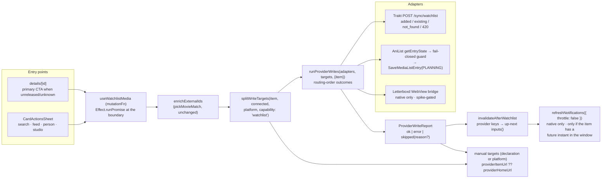

# Watchlist Writes - Plan

## Goal Capsule

Shinobu can record what you *have* watched. It cannot record what you *want*
to watch. This plan adds the missing half of the write surface.

- **Objective:** one action on any unseen item — a film releasing in
  November, a 1997 film never seen, a manga never started — records the
  want-to-watch intent on every connected provider that applies to it, in
  parallel, reporting which provider took it and which did not. Today the
  strongest expression of that intent is a details screen that renders an
  accented countdown (`ReleaseTimeline`, plan 0029) directly above a greyed-out
  `Not yet released` button (`src/features/log-media/log-media-button.tsx:186`)
  — the one screen where the intent forms and nothing can act on it.
- **Authority:** AGENTS.md overrides this plan where they conflict (theme
  tokens, `cn()`, `components/button`, kebab-case, Effect containment,
  `lib/time` for every aired/unaired judgment, React Compiler — no manual
  memo). Owner decisions (2026-07-27, recorded per requirement below) override
  the plan. Plan 0030 owns the read side of the agenda; this plan must not
  restate or contradict it.
- **Landing strategy:** one branch, one PR. The Letterboxd unit (U6) is
  spike-gated and ships degraded — manual link only — if the spike fails; that
  degradation is stated in the PR, never silently absorbed.
- **Stop conditions:** (a) the Letterboxd in-page watchlist endpoint cannot be
  captured from the authenticated WebView, **or is found to be a toggle**
  (fall back is KTD-6, degrade to a manual target, not a blocker);
  (b) `SaveMediaListEntry` with fields omitted is found to null them (KTD-2's
  guard means the mutation only ever runs where no entry exists, so nothing is
  at risk — record and continue); (c) the owner answers
  OQ-1 with (b), a cross-provider watchlist *read* surface — that is a
  separate plan of comparable size and **does** block this one's scope.

---

## Product Contract

### Summary

The write surface gains a second verb: **want-to-watch**. Given a
`NormalizedMediaItem` and nothing else, it routes to every connected provider
applicable to that item's type *and declared capable of the watchlist verb*,
fires in parallel, and reports per-provider outcomes in routing order. It is
write-only and idempotent-by-provider: there is no cross-provider membership
read, no toggle, and no removal. The verb applies to anything unseen,
regardless of whether it has a release date — which makes it structurally
distinct from plan 0030's agenda, not a superset of it.

### Problem Frame

`useLogMedia` (`src/features/log-media/use-log-media.ts:494`) is the only
cross-provider write in the app, and every part of it presumes a *watch* has
happened: `planLogWrite` runs a reconcile pass (`reconcile.ts:36`), resolves a
canonical episode via the plan-0027 ani.zip round trip
(`use-log-media.ts:244`), and carries `watchedAt`, `tags` and `rewatch`
(`fan-out.ts:32-44`). None of that has a want-to-watch analogue.

The gate that produces the dead end is explicit:

```
filmReleaseStatus(item) → 'unreleased' | 'unknown'
  → canLog = false                    (log-media-button.tsx:130-137)
  → <Button disabled label="Not yet released" />   (:186, :200)
```

and for MANGA or any series whose next episode Trakt cannot name, the button
`return null`s entirely (`log-media-button.tsx:71-79`) — so the items with the
strongest want-to-watch case are exactly the ones with no control at all.

Two pieces of the answer already exist and are unused here. The AniList
mutation already takes status as a variable (`anilist/writes.ts:91-95`), so
`PLANNING` needs no new GraphQL document — only a new exported function plus
the guard read it requires (`getEntryState`, `anilist/reads.ts:334`), which is
already implemented (KTD-2 costs it honestly: it is a fresh request, not a
cache hit). And the
whole dead-end machinery from plan 0022 — `manualRowsFor`,
`manualLinkForOutcome`, `providerItemUrl ?? providerHomeUrl`
(`manual-log-links.ts:15-41`) — is payload-agnostic and reusable verbatim.

What does *not* exist: any declaration that a provider can accept a watchlist
write at all. `ProviderDescriptor` carries exactly `id, label, mediaTypes,
canRead, canWrite, unsupportedWritePlatforms?` (`lib/providers/types.ts:23-38`)
and routing reads a single capability flag (`routing.ts:55`).

### Requirements

**The verb**

- R1. One user action records want-to-watch on **every connected provider
  applicable to the item's type and capable of the verb**, fired in parallel.
  It is never a per-provider action the user picks a target for (owner
  decision).
- R2. The verb applies to **anything unseen**, not only unreleased things. All
  three `filmReleaseStatus` outcomes — `released`, `unreleased`, `unknown` —
  are valid targets (owner decision). `release-gate.ts` is never called as a
  gate on this path; it is consulted only for CTA *placement* (R11).
- R3. The payload is the `NormalizedMediaItem` and **nothing else** — no
  `episodes`, no `entryEpisodes`, no season, no `watchedAt`, no `tags`, no
  `rewatch`. (Q8; KTD-7.)
- R4. Watchlisting a TV show is **show-level**. Seasons and episodes are not
  watchlist targets even where a provider accepts them (Trakt does — blueprint
  §L19254). This is a deliberate narrowing, not an API limitation. (Q8.)

**Capability and routing**

- R5. Watchlist targets are **not** derived from `canWrite`. The provider
  descriptor gains a distinct, **three-state** declaration —
  `watchlistWrite: 'write' | 'manual' | 'none'` — and routing derives watchlist
  targets from that declaration only. A boolean is wrong here: `false` at the
  same filter position as `canWrite` (`routing.ts:53-56`) would remove the
  provider from the target list entirely, so it would appear in neither
  `writable` nor `manual` and produce **no outcome at all** — the silent drop
  AGENTS.md's no-dead-end rule forbids. `'manual'` is the existing mechanism
  the registry already describes for Letterboxd on web ("Routing still lists
  Letterboxd as an applicable target … it's just routed to the manual-log
  fallback", `registry.ts:38-40`). (Q1; KTD-1.)
- R6. Serializd declares `watchlistWrite: 'manual'`: TV-only, no corroborated
  endpoint in any of the three consumer projects the plan-0017 Appendix was
  compiled from, and the only route in is a widening of the Worker path+method
  allowlist — a load-bearing security contract (AGENTS.md § Web & CORS). It is
  therefore never an adapter target, but it **does** stay in the report as a
  manual row with an `Add on Serializd` link, on every platform. No provider
  declares `'none'` today; the state exists so a future provider that has no
  watchlist concept at all (a music or games domain) can be excluded outright
  rather than shown a link that means nothing. (Q1; KTD-1; OQ-2.)
- R7. Letterboxd declares `'write'` only if U6's spike succeeds, and its write
  still inherits `unsupportedWritePlatforms: ['web']` from the same
  fingerprint wall that bans the diary write — three spike rounds, four
  transports, all 403-challenged (`docs/solutions/letterboxd-web-proxy.md`). So
  it is a manual target on web always, and a manual target on **all** platforms
  if the spike fails (`'manual'`) — never absent, never an error. (Q1, Q6.)

**Data integrity**

- R8. An AniList write **never overwrites an existing list status**. If the
  viewer's entry exists with any status, or with `progress > 0`, the write is
  refused as a reasoned skip. Setting `PLANNING` over `CURRENT` is data loss.
  (Q2; KTD-2.)
- R9. The new PLANNING entries this feature creates must not re-open plan
  0030's Continue Watching hole: an AniList PLANNING entry that is already
  mid-run stays excluded from Up Next (`up-next.ts:186`,
  `docs/solutions/anilist-shared-list-query-status-gate.md`). A regression
  test names this explicitly. (KTD-2.)
- R10. Title+year → id resolution reuses `enrichExternalIds` and
  `pickMovieMatch` unchanged. It is **never** relaxed to "top hit" — a wrong
  match would watchlist a different film on the user's real trackers
  (`docs/solutions/trakt-text-search-wrong-movie-match.md`).

**Surfaces**

- R11. The details screen renders the want-to-watch CTA as a **sibling** of
  `LogMediaButton`, not a branch inside it — that component returns `null` for
  MANGA and for series with no nameable next episode, which are valid targets.
  The release-status consult that decides placement is **film-like-only**,
  exactly as `log-media-button.tsx:132` guards it
  (`item.type === 'MOVIE' || (item.type === 'ANIME' && item.isFilm === true)`):
  `filmReleaseStatus` takes only `releaseDate`/`year` and would answer
  `'unknown'` for a currently-airing series, which must never suppress episode
  logging. For a film-like item whose status is `unreleased` or `unknown` the
  want-to-watch CTA is the **primary** control and the disabled log button is
  not rendered (owner placement call); the gate is one exported predicate used
  by both the details screen and the sheet, never a second copy at the call
  site. (Q5.)
- R12. `CardActionsSheet` gains a row on the call sites where the item is
  plausibly unseen: search, home feed, person, studio. It is **not** shown on
  the diary (every row is already watched) nor on `/watchlist/letterboxd`
  (every row is already on that provider's watchlist). The sheet stays mounted
  through the write and renders the same result block the details CTA does —
  it is a multi-provider network write, not the local MMKV toggle the hide row
  performs (`card-actions-sheet.tsx:171-185`), and the app has no toast, so
  closing on tap would drop the partial-failure report entirely. (Q5, Q6.)
- R13. Up Next / Calendar cards get **no** add affordance. Every Calendar
  entry sourced from a watchlist is already watchlisted, and `EpisodeCard`
  passes no `action` by construction (plan 0030 R5). (Q5.)
- R14. The CTA reads **"Add to watchlist"** (**"Add to reading list"** for
  read-intent items) and morphs in place to **"On your watchlist"** via
  `morphLabel` when — and only when — the report is
  `failed.length === 0 && (succeeded.length > 0 || reasonedSkips.length > 0)`.
  An already-there result is a *reasoned skip*, not an `ok` (R16), and it is
  the single most common repeat interaction, so it must settle the label like a
  success; a **mixed** report (one `ok`, one `error`) must not, because the
  settled label would assert a completeness that is false and would double as a
  retry lock. A mixed report keeps the CTA actionable — label unchanged, the
  result block naming the failed provider — and re-tapping re-fires the whole
  write, which is safe because Trakt then reports `existing: 1` and AniList
  skips at branch 2. No tagline names a provider; no copy anywhere says "fan
  out". Provider names appear only in *results*.

**Failure and idempotency**

- R15. Per-provider partial failure is surfaced verbatim in the existing
  outcome vocabulary: `ok` | `error(message)` | `skipped(reason?)`, one entry
  per applicable provider, **in routing order**, not completion order
  (`docs/solutions/better-all-result-keys-completion-order.md`). No new status
  member. (Q3, Q6; KTD-3.)
- R16. Idempotency is reported from the **write response**, not from a
  membership read: Trakt's `existing.movies === 1` and AniList's guard branch
  both yield a reason-carrying skip ("already on your watchlist"). No
  cross-provider membership query is issued. (Q3; KTD-3.)
- R17. An unsupported or manual-declared target surfaces an **upfront manual
  row** — `providerItemUrl(provider, item) ?? providerHomeUrl(provider)`, per
  plan 0022 R4 — rendered before any tap, so Letterboxd-on-web and Serializd
  are visible as manual targets rather than silently absent. A **failed** or
  reasoned-skip *outcome* keeps `manualLinkForOutcome`'s existing semantics
  unchanged: `providerItemUrl` only, **no home-URL fallback**, and no link
  rendered when none can be built (`manual-log-links.ts:32-41` — that docblock
  is normative and this plan does not touch it). Reason-less skips get no
  link. Either way: never a silent drop, never a dead-end error. (Q6; plan
  0022 R4/R5/R6.)
- R18. Double-fire is defended in order: a **shared** pending guard, the
  settled state, and provider-side upsert semantics. Both of the first two are
  keyed on the item, not on a component instance — a `mutationKey` on
  `useWatchlistMedia` read back through `useMutationState`, because per-mount
  `useMutation` state does not span the card instance and the sheet instance
  over it, which is exactly the case pressto's per-instance press debounce
  misses. Provider-side upsert semantics are load-bearing only where they are
  *verified*: Trakt's `existing` and AniList's branch 2 are, Letterboxd's are
  not (KTD-6).

**Agenda coherence**

- R19. A successful write invalidates the provider keys **and**
  `upNextQueryKeys.inputs()`, in that order — invalidating `inputs()` alone
  re-serves cached provider payloads for up to 15 minutes
  (`up-next.ts:129`, `letterboxd.ts:200`). On native it then calls
  `refreshNotifications` — but **only when the added item actually carries a
  release/air instant inside the notification window**, judged with the same
  `entryInstant`/`hasAired` helpers R20 relies on. Notifications are not
  query-driven (`features/notifications/refresh.ts:27,44`), so the refresh is
  a full `fetchUpNextInputs` regather (`refresh.ts:78` calls the gather
  function directly, not the cached `inputs()` query) on keys the step before
  just invalidated: `watchedShows` + up to 20 `showProgress` + 3 `my-calendar`
  + AniList + Letterboxd. Per R20 most adds cannot produce a notification
  candidate at all, so paying that on every tap — with `throttle: false`,
  deliberately bypassing the 15-minute `THROTTLE_MS` that exists to prevent
  exactly this — is not justified. When the instant test passes, the call is
  `{ throttle: false }` (the schedule genuinely changed); when it fails, no
  call is made and the throttled foreground path picks it up. (Q7; KTD-5.)
- R20. **Watchlist is not the agenda, and this plan adds no agenda filter.**
  Calendar's window stays today … today+6 (plan 0030 R1, unchanged). An item
  reaches Calendar iff it has a release/air instant inside that window, which a
  genuinely old film — the 1997 example — never does: `entryInstant`
  (`up-next/entry.ts:19`) yields nothing to place. Note the counterpart so no
  one "enforces" R20 with a filter: a film already out theatrically whose
  *digital* release lands next Tuesday is `released` by `filmReleaseStatus` and
  still has a future instant, because Calendar sources both
  `/calendars/my/movies` and `/calendars/my/streaming` (`MOVIE_CALENDARS`,
  `state/queries/up-next.ts:174`) and both return watchlisted films. It
  appearing on the agenda after a watchlist add is correct plan-0030 behaviour,
  not a regression. (Settled decision 2.)

### Scope Boundaries

**Out of scope**

- **Removal / un-watchlisting.** With no membership read (KTD-3), a remove
  affordance cannot honestly know whether there is anything to remove, and a
  "Remove" button that reports success against an item that was never added is
  worse than no button. Recourse: the "View on {Provider}" rows the card
  sheet already renders (plan 0023) and the same `providerItemUrl` links R17
  produces. Doubling the verb surface is deferred until a read surface exists
  to justify it. (Q4.)
- **A cross-provider watchlist read surface.** Today the only in-app watchlist
  read is Letterboxd's (`YourWatchlistRow`, `feed-rows.tsx:67`;
  `/watchlist/letterboxd`). Outside the 7-day Calendar window a successful
  Trakt or AniList add has no Shinobu surface that shows it back. Named as
  OQ-1 rather than silently resolved.
- **A Serializd watchlist *write*.** R6 — it ships as a manual target (a link,
  not an adapter), never absent. A devtools capture of the watchlist toggle is
  filed as a follow-up; no allowlist edit is made on a guess.
- **Bulk / multi-item watchlisting.** AniList's real budget is 30 req/min
  (`docs/solutions/anilist-rate-limit-retry-storm.md`); a single tap costing
  two requests is fine, a batch is not.
- **Rewatch intent.** "Want to watch again" is a different verb against
  already-watched items and is not modelled.
- **Renaming the log path's mechanism word.** `todos/010` owns that; this plan
  deliberately leaves `fan-out.ts` and `fanOutLog`'s file path alone.

---

## Planning Contract

### Key Technical Decisions

- **KTD-1. `ProviderDescriptor` gains a `watchlistWrite` declaration; routing
  derives watchlist targets from it, never from `canWrite`.** Today the
  descriptor has one write axis (`types.ts:23-38`) and `providersForLog` reads
  `provider.canWrite` at `routing.ts:55`. Four providers give four different
  answers to the watchlist verb — Trakt confirmed and transport-ready, AniList
  confirmed but guard-gated, Letterboxd endpoint-unverified and web-banned,
  Serializd with no known endpoint at all — and none of those answers is
  derivable from `canWrite`. That is precisely the "providers are not assumed
  symmetric" case `types.ts:19-22` describes.

  **The field is three-state, not boolean** — `watchlistWrite: 'write' |
  'manual' | 'none'` — because *applicability* and *transport* are different
  axes and the boolean conflates them. `canWrite` sits inside the target
  filter (`routing.ts:53-56`), so a `false` there deletes the provider before
  `splitLogTargets` (`:83-85`) ever sees it, and the manual split is derived
  from `isManualWriteTarget(platform)` alone. A boolean `watchlistWrite:false`
  would therefore make Serializd and (if U6 fails) Letterboxd vanish from the
  report on every platform with no row and no link — the exact silent drop R17
  and AGENTS.md forbid, and it is this plan's *shipping default*. So:

  - `providersForLog` generalizes to `providersForWrite(item, connected,
    capability: WriteCapability)`, `WriteCapability = 'log' | 'watchlist'`.
    For `'log'` line 55 reads `canWrite` unchanged; for `'watchlist'` it
    admits any provider whose declaration is **not** `'none'`.
  - `splitWriteTargets(item, connected, platform, capability)` then classifies
    each surviving target: **manual** when `declaration === 'manual'` **or**
    `isManualWriteTarget(provider, platform)`; **writable** otherwise.
  - Absent means only "this provider's `mediaTypes` don't apply" (or `'none'`).

  `effectiveTypes` (`routing.ts:31-40`) — the anime-film widening,
  the `hasMovieTvIds` gate, the AniList reverse-widening — is shared unchanged.
  Rejected: a boolean plus a hardcoded "…but Serializd/Letterboxd are also
  manual" list at the split — that is the `if (provider === …)` at a call site
  AGENTS.md bans. Rejected: reusing `canWrite` — it would route Serializd a payload no
  endpoint exists for and Letterboxd one whose path is unverified, and it
  makes "capable of logging" and "capable of watchlisting" impossible to
  degrade independently. Rejected: a separate `providersForWatchlist` that
  re-derives type widening — an anime film would then reach Letterboxd through
  two different type rules, a divergence bug waiting for its first edit.
  **Platform axis, deliberately not split:** `unsupportedWritePlatforms` stays
  one flat list consumed by `isManualWriteTarget(provider, platform)`
  (`routing.ts:66-69`). Letterboxd's watchlist write is blocked on web for the
  *same* reason as its diary write, so sharing the field is true today; if the
  two ever diverge, that one function is the place to widen.

- **KTD-2. The AniList write is read-then-decide, and the decision is
  *refuse*, never overwrite.** `MediaList.status` is a single enum-valued
  field (confirmed by live introspection of `graphql.anilist.co`, 2026-07-27)
  — exclusivity is a schema fact, not folklore, and `PLANNING` is the correct
  status for manga want-to-read too (one enum, no per-type variant). The guard
  reads `getEntryState(deps, { mediaId })` — already implemented — and branches,
  in order, inside the effect:
  0. **The guard read itself fails** (network, 429, 5xx) → `error` outcome for
     AniList, message "could not check your AniList entry", mutation **never
     issued**, R17's outcome link attached. This guard is **fail-closed**, and
     that is a deliberate divergence: the log path's documented rule ("a failed
     state read counts as 'doesn't have it': the write is the user's actual
     intent", `use-log-media.ts:283-286`) is safe there because the worst case
     is a duplicate history row, and catastrophic here because the worst case is
     a status clobber. Do not transfer it.
  1. `entry == null` → write `SaveMediaListEntry(mediaId, status: PLANNING)`.
  2. `entry.status === 'PLANNING'` → skip, reason "already on your AniList
     planning list".
  3. `entry != null` in **any** other shape — any status, any progress, or
     even `status: null, progress: 0` — → skip, reason "AniList already tracks
     this" (naming the status when there is one).

  So the rule is simply: **an entry that exists is never written over.** An
  earlier draft carved out branch 4 (`status == null, progress === 0`, an entry
  created by a score or a custom-list add) as writable; that is exactly the
  entry whose *only* content is a score, notes, or custom-list membership, so
  it is the one branch that would exercise the unverified omit-field behaviour
  below — and it would destroy precisely the fields that entry exists for.
  Refusing it costs a user with a scored-but-unstarted entry one skip message;
  writing it risks silent data loss. The guard also must not be weakened to
  "only skip if `CURRENT`": `PAUSED` and `DROPPED` carry progress the user
  chose to keep, and `COMPLETED` is exactly the "you already saw this" case a
  want-to-watch write must never contradict.

  **NAMED RISK — omit-field semantics:** whether `SaveMediaListEntry(mediaId,
  status)` with `progress`, `score`, `notes`, `startedAt`, `customLists`,
  `private` and `repeat` *omitted* preserves or nulls those stored fields is
  UNVERIFIED; the schema cannot answer it (all args nullable) and
  `docs.anilist.co` 403s to automated fetch. Fallback: with branch 3 as
  specified the mutation only ever runs against a **non-existent** entry, so
  there is no stored field of any kind to lose — the app never exercises the
  hazardous path. If a future change reintroduces a write-over-existing branch,
  it stays gated on U5's widened probe. Verification step in U5.

  **Cost, stated honestly:** `getEntryState` called inside the effect is a
  fresh GraphQL request — it does not consult the TanStack cache; only the
  *hook* layer does that (`use-log-media.ts:320-323`), and
  `useAniListEntryStateQuery` sets no `staleTime` (`state/queries/anilist.ts
  :244-250`) so even a `fetchQuery` against `entryState` would refetch. So an
  AniList watchlist add costs **1 read + 1 write**, and that is unavoidable.
  **Explicit prohibition:** the guard is always a fresh in-effect read — never
  `queryClient.getQueryData`/`fetchQuery` against `entryState`, whatever a cost
  argument suggests. A stale guard (the user logged episodes on another device
  minutes ago) is a silent clobber, which is the failure this whole KTD exists
  to prevent. Rejected: prompting the user to confirm the
  overwrite — a modal offering to destroy watch progress is a dialog whose
  correct answer is always "no", and it would put provider semantics in a
  component. Rejected: writing `PLANNING` and restoring `progress` afterwards
  — two writes, a torn window between them, and it still moves a `COMPLETED`
  series out of Completed.

- **KTD-3. Write-only and optimistic: no cross-provider membership read, no
  toggle.** What a membership *read* would cost, per provider, on top of the
  write: AniList 1 (KTD-2's guard is already paid, but it answers only AniList),
  Trakt
  1–N (`GET /sync/watchlist/{type}` is a whole-list, mandatorily paginated
  read — `docs/solutions/trakt-watched-endpoints-2026-api-changes.md` — with
  no per-item membership endpoint and no existing query key), Letterboxd 0 for
  a page-1 heuristic that is *wrong* for anything added more than ~28 films
  ago or 22+ sequential HTML fetches ≈ 2.6 MB for a correct answer
  (`docs/solutions/letterboxd-watchlist-release-resolve-cost.md`), Serializd
  unknown. That is 1–N+1 requests for a partly-wrong answer, added to the
  mount-time burst `docs/solutions/trakt-transient-network-errors.md` warns
  about.

  What the write itself costs, per entry point, with everything connected:
  from the **details screen** 1 AniList read + 1 AniList write + 1 Trakt POST
  (+1 Letterboxd bridge call on native); from the **card sheet** (R12) the
  same, since nothing there has fetched `entryState(mediaId)` and no
  details-screen query is mounted. Both sit inside AniList's real 30 req/min
  (`docs/solutions/anilist-rate-limit-retry-storm.md`), but the card feed is
  where a burst of taps is plausible, so R18's shared pending guard matters
  more there than on details.

  So the button's settled state is derived from the **mutation result** (R14),
  and idempotency is reported from the write response: Trakt's `added: 0 /
  existing: 1` is a confirmed already-there signal at zero extra cost, and
  AniList's branch 2 rides the guard read that is required anyway. The settled
  state is keyed on the item via `mutationKey` + `useMutationState`, not on a
  component instance (R18) — but it is still *session* state: it evaporates on
  app restart, which is precisely why OQ-1(a) is a real question and not a
  formality. Rejected: a read-backed toggle showing true
  cross-provider membership — costs the above, is still wrong for Letterboxd
  without paying 2.6 MB, needs a brand-new Trakt query root (a cross-provider
  cache orphan, `docs/solutions/persisted-query-cache-set-corruption.md`), and
  buys nothing the existing provider link does not. Rejected: a partial toggle
  reading only AniList — "on your watchlist" that means "on one of your four
  watchlists" is exactly the lie the partial-failure contract exists to
  prevent.

- **KTD-4. The generic write core is extracted in place, not copied.**
  `fanOutLog` (`fan-out.ts:98-154`) is payload-agnostic except for one line
  (`rewatch: variables.rewatch === true`, `:152`). Its body becomes
  `runProviderWrites<V>(adapters, targets, variables)` returning
  `ProviderWriteReport { outcomes, succeeded, failed, skipped }`;
  `LogWriteResult` → `ProviderWriteResult`, `ProviderLogOutcome` →
  `ProviderWriteOutcome`, and `LogMediaResult = ProviderWriteReport & {
  rewatch: boolean }` with `useLogMedia` splicing `plan.rewatch` back in — it
  already holds it (`use-log-media.ts:559`). `fanOutLog` stays as a thin
  wrapper over `runProviderWrites` so `useLogMedia`'s import is untouched.
  Zero behaviour change, one line moved. Rejected: a parallel `watchlist-fan-out.ts` — the non-obvious content
  of that file is not the parallelism but the completion-order → routing-order
  rebuild (`:133-137`, the `better-all` trap) and the "target without an
  adapter is a loud error, not a silent skip" rule (`:110-116`), both asserted
  in `fan-out.test.ts`. Re-deriving them in a second file is how a
  partial-failure contract silently diverges. **The file path and the symbol
  `fanOutLog` are left alone** so `todos/010`'s rename stays a one-file
  exercise; every *new* shared identifier uses a neutral root that carries no
  mechanism word at all (`runProviderWrites`, `ProviderWriteReport`), so the
  new caller in `features/watchlist-media/` adds nothing to `todos/010`'s
  scope. A name like `fanOutWrites` would have defeated the point: it carries
  the very word `todos/010` exists to retire, and it would be imported from a
  second feature directory, growing the rename instead of shrinking it.

- **KTD-5. Invalidation is a sibling function, sharing exactly one key.**
  `invalidateAfterLog` (`use-log-media.ts:386-453`) is 68 lines of watch-history
  keys — `watchedShows`, `history`, `showProgress`, `listActivity`, diary,
  progress — of which a watchlist add touches almost none.
  `invalidateAfterWatchlist(queryClient, item, succeeded)` invalidates, per
  succeeded provider: Trakt → a **new prefix builder** `traktQueryKeys
  .myCalendarRoot()`, because the existing key is
  `[...all, 'my-calendar', type, startDate, days]` and a write path cannot know
  `startDate`/`days` (computed in `calendarRange()`, `up-next.ts:139`) —
  naming a per-window key here would be a bug; AniList →
  `currentAnimeEntries()` **and** the derived `currentAnime()` (the exact trap
  `use-log-media.ts:410-413` documents) plus `entryState(mediaId)`, so KTD-2's
  guard does not mis-fire next time; Letterboxd → `watchlist(username)` **and**
  the separately-keyed `watchlistPages(username)`, under the same null-username
  guard as `use-log-media.ts:423-429`; Serializd → nothing, because no
  Serializd watchlist read exists (an independent argument for R6). Then, and
  only then, `upNextQueryKeys.inputs()`. Rejected: one
  `invalidateAfterWrite(kind, …)` with a switch — the two bodies share a single
  statement, and co-locating them makes the log path's plan-0016/0019/0027
  comment trail unreadable. Rejected: invalidating `inputs()` alone — every leg
  of `fetchUpNextInputs` goes through `fetchQuery` against 15-minute stale
  windows, so the agenda would not move for up to 15 minutes.

- **KTD-6. Letterboxd's watchlist endpoint is unknown; the bridge is
  spike-gated.** The WebView bridge's request type is diary-shaped by
  construction (`LetterboxdWebRequest`, `letterboxd/deps.ts:55-70`) and the
  injected script hardcodes `POST /api/v0/production-log-entries`
  (`webview-bridge.ts:134-139`). Generalizing it — a discriminated union on
  `kind`, a second branch in `buildSubmitScript`, a sibling of
  `interpretDiaryResponse` — is ~80 lines and cheap. **NAMED RISK:** the
  endpoint itself is UNVERIFIED. `docs/solutions/letterboxd-no-api-fallback.md`
  lists `POST /film/{slug}/add-to-watchlist/` **in its superseded
  cookie-replay section**, whose sibling row (`/s/save-diary-entry`) was proven
  dead — it 404'd from inside the authenticated WebView because the site had
  migrated. Do not assert a path. Verification step in U6: hook
  `window.fetch`/`XMLHttpRequest` in the mounted authenticated WebView, drive
  the site's own watchlist button, relay `{method, url, headers, body}` over
  the existing postMessage channel, record in
  `docs/solutions/letterboxd-watchlist-write.md`. The capture must record
  **idempotency semantics**, not just the path and payload: the site's own
  control is a *toggle* ("Add to watchlist" / "In watchlist"), so the same
  endpoint plausibly removes on second invocation. If it does, a repeat tap
  would silently delete the film from the user's real Letterboxd watchlist
  while Shinobu reported `ok` — user-data destruction from a UI claiming
  success, and none of R18's defences catch it (the pending guard is per
  in-flight call, the settled state is session-scoped, and "provider upsert
  semantics" is the thing in question). So the spike must also record how the
  response distinguishes *added* from *removed*, and the adapter must
  interpret it. Fallback if nothing can be captured, **or if the capture shows
  a toggle**: Letterboxd's `watchlistWrite` ships `'manual'` and the provider
  is a manual target on all platforms — R17's link, not an error, and
  explicitly not the page-1 cache heuristic, which mispredicts and would then
  *remove* rather than duplicate.
  Rejected: adding a POST rule to `worker/letterboxd-proxy.ts` — the header
  comment states a POST rule may only be added if a re-spike returns
  `challenged: false`, and three rounds have not.

- **KTD-7. The watchlist payload is show-level and episode-blind, which
  deletes the entire plan-0027 chain.** `NormalizedMediaItem` has no episode
  granularity (`types/media.ts:39-95`); episodes live only in the *write
  variables* (`log-media-button.tsx:145-155`) and `RoutableItem` has never
  seen an episode number (`routing.ts:5`). So the watchlist routing call is a
  strictly simpler signature: no `nonSeasonOneEpisodes`, no `LogDomains`, no
  `translateEntryEpisodes`, no `mappingSkips`. Concrete payoff worth stating:
  an AniList-origin watchlist add never fetches the ~1 MB ani.zip document
  that `use-log-media.ts:235` works hard to avoid. The item-level anime-film
  fork (`animeEffectiveMovieTvType`, `routing.ts:22`) still applies. Rejected:
  season-level watchlisting even though Trakt accepts it — it forks the
  affordance across the season picker and the details screen for an intent
  users express at show level.

- **KTD-8. No confirm sheet — one tap plus an inline result line.**
  `LogConfirmSheet` (`log-confirm-sheet.tsx:284-449`) earns its existence on an
  editable payload (provider picker, `WatchedAtField`, tags), on stakes (a
  dated public diary artifact), and on latency (its own comment justifies
  itself against a multi-second reconcile round trip, `:431-432`). The
  watchlist payload is `{ item }` (R3), the entry is a reversible bookmark, and
  the write is one small POST per provider with no reconcile in front of it —
  so the sheet would be a modal whose only content is the button already
  tapped. The CTA is a `components/button` with `loading` (AGENTS.md mandates
  it for any awaiting button) plus a result block. That block is *modelled on*
  `log-media-button.tsx:222-244` but is not that block verbatim: dropping the
  sheet also drops the two plan-0022 renderers that live only inside
  `LogConfirmSheet` — `manualRowsFor` (`log-confirm-sheet.tsx:191`, the upfront
  manual rows) and `splitSkippedOutcomes` (`:318`, reasoned skips with their
  own links). The button block renders only `succeeded`, a lumped
  "already had it", `failed`, and `errorOutcomeLinks`, so reusing it as-is
  would leave Letterboxd-on-web and Serializd — manual targets that produce no
  outcome at all — rendering *nothing*, and would strip reasoned skips of their
  links. So the watchlist CTA must render all three families: upfront manual
  rows, per-outcome errors, and reasoned skips (U8). Rejected: reusing
  `LogConfirmSheet` with every field optional — a component with two disjoint
  modes and a degenerate targets-only render, the variant explosion AGENTS.md's
  button rule exists to stop. Rejected: a second `WatchlistOutcomeLink`
  component — `OutcomeLink` takes a `verb?: string` prop instead (default
  `'Log on'` → `'Add on'`), 20 identical lines not duplicated.

### High-Level Technical Design



### Assumptions

- Trakt's `POST /sync/watchlist` accepts the same `ids` object
  `logToTrakt` already builds (`trakt/writes.ts:26-37`) and returns
  `{ added, existing, not_found, list }` — confirmed against the Apiary
  blueprint (§L19254), retrieved 2026-07-27.
- An AniList watchlist add costs **two** requests — the fail-closed guard read
  plus the mutation — from every entry point, including the card sheet where no
  details-screen query is mounted. That sits inside the real 30 req/min budget
  (`docs/solutions/anilist-rate-limit-retry-storm.md`); it is not free, and the
  guard is never sourced from the cache to make it look free (KTD-2).
- Two extra Trakt POSTs per user action are inside 1000 per 5 minutes, and the
  1-call-per-second POST limit is already handled by `withRateLimitRetry`
  (`trakt/api.ts:12-22`).
- Trakt auto-removes a watchlisted item once it is watched (blueprint: one
  episode removes the whole show), so no un-watchlist call is needed on the log
  path and no cached membership state has to be reconciled after a log.
- Web AniList sessions use the implicit grant and have no refresh token
  (`docs/solutions/web-cors-anilist.md`), so a 401 on the watchlist write means
  "reconnect", not "refresh" — the existing wrapper already encodes this.

---

## Implementation Units

### U1. Generalize the write core and the outcome vocabulary

**Goal:** `fan-out.ts` exposes a payload-generic `runProviderWrites<V>` and a
verb-neutral outcome vocabulary, with `useLogMedia` behaviour byte-identical.
**Requirements:** KTD-4, R15.
**Files:** `src/features/log-media/fan-out.ts`, `use-log-media.ts`,
`manual-log-links.ts` → `manual-write-links.ts`, `outcome-link.tsx`,
`fan-out.test.ts` — **plus every other consumer of the renamed symbols, all in
this unit so it typechecks green on its own:**
`src/features/up-next/ui/quick-log-state.ts` (+ `.test.ts`, `LogMediaResult`),
`src/lib/providers/serializd/writes.ts` (`LogWriteResult`),
`src/lib/providers/mapping/episode-translation.ts` (comment reference to
`ProviderLogOutcome`), `src/features/log-media/log-confirm-sheet.tsx`
(`ProviderLogOutcome` + the three `manual-log-links` imports),
`log-media-button.tsx:15` (`errorOutcomeLinks`),
`manual-log-links.test.ts` → `manual-write-links.test.ts`,
`use-log-media.test.ts` (`LogAdapter`, and its dynamic import of
`manual-log-links`), `invalidate-after-log.test.ts`.
**Approach:** rename `LogWriteResult` → `ProviderWriteResult`,
`ProviderLogOutcome` → `ProviderWriteOutcome`, `LogAdapter` →
`WriteAdapter<V>`; split `LogMediaResult` into `ProviderWriteReport` plus a
`{ rewatch: boolean }` intersection spliced by `useLogMedia` from
`plan.rewatch`. `fanOutLog` remains as a one-line wrapper over
`runProviderWrites` (KTD-4) so `use-log-media.ts`'s call site is unchanged and
`todos/010`'s rename scope does not grow. Add `verb?: string` (default
`'Log on'`) to `OutcomeLink`. The renderers `manualRowsFor`,
`manualLinkForOutcome` and `splitSkippedOutcomes` move file but keep their
**semantics exactly** — in particular `manualLinkForOutcome` gains no home-URL
fallback (R17).
Keep the completion-order → routing-order rebuild and the
missing-adapter-throws rule untouched. **Mechanical, no behaviour change —
land it before any new adapter so later units add data rather than reshape
it.**
**Test scenarios:** existing `fan-out.test.ts` passes unmodified except for
type names; routing-order rebuild still asserted with a deliberately
out-of-order completion; a target with no adapter still throws loudly;
`LogMediaResult.rewatch` still true for a parity rewatch.

### U2. Declare the watchlist capability and derive its targets

**Goal:** `ProviderDescriptor` carries `watchlistWrite`, and routing resolves
watchlist targets from it through the same pure, unit-tested split functions.
**Requirements:** R5, R6, R7, R3, R4, KTD-1, KTD-7.
**Files:** `src/lib/providers/types.ts`, `registry.ts`, `routing.ts`,
`routing.test.ts`, `src/features/log-media/use-log-targets.ts` (`:3,35,38`),
`src/features/log-media/use-log-media.ts` (`:27,201`),
`src/features/log-media/enrich.test.ts` (`providersForLog`).
**Approach:** add `watchlistWrite: 'write' | 'manual' | 'none'` to the
descriptor with a docblock naming why it is not `canWrite` **and why it is not
a boolean** (KTD-1: a boolean at the filter position is a silent drop). Set
`'write'` for Trakt and AniList, `'manual'` for Serializd (R6), and `'manual'`
for Letterboxd until U6's spike flips it to `'write'` — so the branch is
shippable at any point *and* Letterboxd is never absent from the report.
Generalize `providersForLog` → `providersForWrite(item, connected,
capability)` (for `'watchlist'`, admit any declaration other than `'none'`),
`splitLogTargets` → `splitWriteTargets(item, connected, platform, capability)`
computing `manual = declaration === 'manual' || isManualWriteTarget(id,
platform)` and `writable` as the rest, `resolveLogWriteTargets` →
`resolveWriteTargets(item, connected, options)` with `options.capability`;
`effectiveTypes` is shared unchanged. No `Platform.OS` at any call site —
platform stays data, passed as `process.env.EXPO_OS`.
**Test scenarios:** a movie with all four connected → watchlist `writable`
Trakt, `manual` Letterboxd, on **both** platforms while Letterboxd is
`'manual'`, and `writable` Trakt + Letterboxd on native / `manual` Letterboxd
on web once it is `'write'`; a TV show → `writable` Trakt, `manual` Serializd
(present, never dropped); an anime *film* → Trakt + AniList writable,
Letterboxd per its declaration, mirroring the log routing for the same item;
MANGA → AniList only, no manual rows; no item ever yields a provider that is
in neither list while its `mediaTypes` apply; the log capability's targets for
every one of those items unchanged from today.

### U3. Trakt watchlist adapter

**Goal:** `addToTraktWatchlist` writes `POST /sync/watchlist` and reports
already-there from the response.
**Requirements:** R1, R16, R15.
**Files:** `src/lib/providers/trakt/writes.ts`, `http.ts`, `writes.test.ts`.
**Approach:** reuse `idsFor` verbatim and `traktAuthedRequest` (401 →
coalesced refresh and rate-limit retry come free); add a
`TraktSyncWatchlistResponse` interface; map `added.{movies,shows} === 0 &&
existing.{...} === 1` → `skipped('already on your watchlist')`,
`not_found` non-empty → `error`. Add an explicit **420** branch in
`trakt/http.ts`: today it falls into the generic non-2xx path and would
surface as "Trakt responded 420"; it means the account's watchlist limit is
exceeded (`X-Account-Limit`, `X-Upgrade-URL`), and it is a new failure mode
`logToTrakt` never had to handle. It is **not** retried: 420 is a permanent
account-limit failure, not a rate limit, so a retry can only fail again. Record the
420 shape in `docs/solutions/` when first observed against a live account.
**Test scenarios:** movie add → 201 with `added.movies: 1` → `ok`; re-add →
`existing.movies: 1` → reasoned skip; `not_found.movies` non-empty → error
naming the item; 420 → a specific limit-exceeded message, no retry; 429 →
one bounded retry via `withRateLimitRetry`.

### U4. AniList watchlist adapter and the exclusive-status guard

**Goal:** `planOnAniList` writes `PLANNING` only where nothing is destroyed.
**Requirements:** R8, R9, R16, KTD-2.
**Files:** `src/lib/providers/anilist/writes.ts`, `reads.ts`,
`writes.test.ts`, `src/features/up-next/compute.test.ts`.
**Approach:** widen `getEntryState`'s selection to
`mediaListEntry { id status progress repeat }` (the `id` is also what a future
`DeleteMediaListEntry` would need) and implement KTD-2's branches 0–3 inside
the effect — never in a component, and never against the TanStack cache
(KTD-2's prohibition: the guard is a fresh read every time, and the read
failing is branch 0's `error`, not a fall-through to the write). Reuse the
existing mutation document with `status: PLANNING` and `progress`/`repeat`
omitted; it only ever runs when no entry exists. Add the R9 regression test
in the Up Next suite naming the gate it protects
(`docs/solutions/anilist-shared-list-query-status-gate.md`), since this
feature multiplies PLANNING entries.
**Test scenarios:** no entry → writes PLANNING; entry already `PLANNING` →
skip, no mutation issued; entry `CURRENT` with `progress: 5` → skip, mutation
**never** issued, reason names `CURRENT`; entry `COMPLETED` → skip; entry
`DROPPED` with progress → skip; entry with `status: null, progress: 0` (score
or custom-list only) → **skip**, mutation never issued (KTD-2's collapsed
branch 3); the guard read rejects (429/500/network) → **no mutation issued**
and the outcome is `error`, never a write; a mid-run PLANNING entry appears
**nowhere** in Up Next, in particular never in Continue Watching.

### U5. AniList progress-preservation verification

**Goal:** the unverified `SaveMediaListEntry` omit-**field** behaviour is
recorded as fact rather than assumed — for every field, not just `progress`.
**Requirements:** KTD-2 (named risk).
**Files:** `docs/solutions/anilist-planning-status-clobbers-progress.md` (new).
**Approach:** against a real connected AniList account on a throwaway entry:
set `status: CURRENT, progress: 5` **plus `score`, `notes`, `startedAt` and a
custom list**; send `SaveMediaListEntry(mediaId, status: PLANNING)` with all of
those omitted; re-query `mediaListEntry { status progress score notes
startedAt customLists repeat }` and report each. The wider selection is the
point: an entry that exists *only* because of a score or a custom-list add is
the shape U4's collapsed branch 3 refuses, and if that refusal were ever
relaxed this probe is the evidence it would have to be relaxed against.
**This is a manual, account-bound step — it cannot be automated in CI.** If any
field is nulled, note that U4 already refuses every case where it would matter
(the mutation only ever runs with no entry present) and no code change follows;
if all are preserved, note that a future softening of the guard is *still* not
permitted for the `COMPLETED` case.
**Test scenarios:** none automatable — the deliverable is the recorded finding
and a link to it from `writes.ts`'s guard docblock.

### U6. Letterboxd watchlist endpoint spike, then the bridge union (gated)

**Goal:** either a working native-only Letterboxd watchlist add, or a
documented, deliberate degradation to a manual target.
**Requirements:** R7, R17, KTD-6.
**Files:** `docs/solutions/letterboxd-watchlist-write.md` (new),
`src/lib/providers/letterboxd/deps.ts`, `webview-bridge.ts`, `writes.ts`,
`src/lib/providers/registry.ts`.
**Approach:** **spike first, adapter second.** In the mounted authenticated
WebView on a film page, evaluate a script that hooks `window.fetch` and
`XMLHttpRequest`, drive the site's own watchlist control, and relay
`{method, url, headers, body}` over the existing postMessage channel; record
method, path, payload and response shape. **Do not write an adapter against
the `/film/{slug}/add-to-watchlist/` row in
`docs/solutions/letterboxd-no-api-fallback.md`** — it is in that file's
superseded section and its sibling row was proven dead. Only if the capture
succeeds: turn `LetterboxdWebRequest` into a discriminated union
(`{ kind: 'diary', … } | { kind: 'watchlist', filmPath, filmLid }`), branch
`buildSubmitScript`, add a sibling of `interpretDiaryResponse`, and flip
`watchlistWrite: 'write'` in the registry. **NAMED RISK — idempotency
semantics:** the spike must classify the endpoint as *add-only*, *toggle*, or
*add + separate remove*, and record how the response says which happened — the
site's own control reads "Add to watchlist" / "In watchlist", so a toggle is
the likelier shape. If it is a toggle, Letterboxd stays `'manual'`: a second
tap would remove the film while Shinobu reported success (KTD-6), and the
page-1 watchlist cache is **not** an acceptable mitigation for that, because a
wrong heuristic there removes rather than duplicates. If it is add-only but
duplicates, the page-1 cache is acceptable as a heuristic pre-check, never a
blocking full-list read. Web stays banned regardless — no Worker rule is added
(`docs/solutions/letterboxd-web-proxy.md`).
**Test scenarios:** with the declaration `'manual'`, a film on native yields
Letterboxd as a *manual* row with an `Add on Letterboxd` link and no adapter
call; with it `'write'`, the bridge builds the watchlist script rather than the
diary script and a diary write is byte-identical to today; on web Letterboxd
is a manual target in both configurations; `getLetterboxdWebFetch()` returning
`undefined` on web still short-circuits before any request.

### U7. `useWatchlistMedia`, invalidation and notification refresh

**Goal:** one cross-provider mutation hook with the log path's partial-failure
contract and correct agenda coherence.
**Requirements:** R1, R2, R3, R15, R16, R17, R18, R19, R20, KTD-3, KTD-5.
**Files:** new `src/features/watchlist-media/` —
`use-watchlist-media.ts`, `invalidate.ts`, `targets.ts`, plus tests. Reads
`src/state/queries/{trakt,anilist,letterboxd,up-next}.ts`,
`src/features/notifications/refresh.ts`.
**Approach:** `useWatchlistMedia` mirrors `useLogMedia`'s shape —
`Effect.runPromise` inside `mutationFn`, never an `Effect<…>` in the hook
signature, and carrying a **`mutationKey` keyed on the item id** so R18's
pending guard and R14's settled state can be read back with `useMutationState`
from any mount — per-mount `useMutation` state does not span a card and the
sheet over it. `planWatchlistWrite` is enrich → `splitWriteTargets(…,
'watchlist')` → `runProviderWrites`; there is no reconcile pass and no episode
resolution (KTD-7). The directory is deliberately **not** the existing
`src/features/watchlist/` (that holds the read surface's `poster-wall.tsx`);
colliding them would make "watchlist" mean both a read screen and a write
verb. Add `traktQueryKeys.myCalendarRoot()` as a prefix builder (KTD-5) —
invalidating a per-window key would be a bug.

`invalidateAfterWatchlist` **and** the notification refresh run inside
`mutationFn` after `runProviderWrites`, never in `onSuccess` — for the reason
`invalidate-after-log` already records (`use-log-media.ts:386`: they run on the
*enriched* item), and for a second one this plan adds: the sheet entry point
can unmount before `onSuccess` would fire, and a hook observer that is gone
never runs its callback. Order is: provider keys, then
`upNextQueryKeys.inputs()`, then — on native only, and **only when the added
item carries a release/air instant inside the notification window** (R19,
judged with `entryInstant`/`hasAired`) — `refreshNotifications(createRefreshDeps
(queryClient), { throttle: false })`. That call is a full `fetchUpNextInputs`
regather against keys just invalidated, so bypassing `THROTTLE_MS` for an item
that cannot produce a candidate is pure cost. Nothing about this verb is
persisted, so no `BUSTER` bump and no `Set`-shaped cache value
(`docs/solutions/persisted-query-cache-set-corruption.md`).
**Test scenarios:** all providers ok → outcomes in routing order, all `ok`;
one provider throws → that provider `error`, the others `ok`, the report names
it; a manual target never enters the adapter map; a released 1997 film added
successfully invalidates the same keys, changes **nothing** in the computed
agenda, and issues **no** `refreshNotifications` call; a film with a digital
release three days out does issue it, with `throttle: false`; invalidation
asserted to include both `currentAnimeEntries()` and the derived
`currentAnime()`, and both `watchlist(username)` and `watchlistPages(username)`;
invalidation still runs when the calling component unmounts before the write
resolves; no `refreshNotifications` on web; the shared pending guard blocks a
second call issued from a **different mounted instance** of the same item, not
just the same one.

### U8. Entry points and copy

**Goal:** the CTA exists where the intent forms, and nowhere it is incoherent.
**Requirements:** R11, R12, R13, R14, R17, R18, KTD-8.
**Files:** new `src/features/watchlist-media/watchlist-media-button.tsx`;
`src/app/details/[id].tsx`, `src/features/card-actions/card-actions-sheet.tsx`,
`src/features/card-actions/use-card-actions.ts`,
`src/features/log-media/outcome-link.tsx`,
`src/features/log-media/release-gate.ts` (export the placement predicate);
plus the two sheet call sites that opt **out** —
`src/app/(tabs)/diary.tsx` and `src/app/watchlist/letterboxd.tsx`. The new
`CardActionsSheet` prop defaults **on**, so `search.tsx`, `(tabs)/index.tsx`,
`person/[id].tsx` and `studio/[id].tsx` need no edit.
**Approach:** a **sibling** component, never a branch inside `LogMediaButton`
(which `return null`s for exactly the items that need this most,
`log-media-button.tsx:71-79`). `components/button` with `loading` +
`loadingLabel`; `morphLabel` for the in-place `Add to watchlist` → `On your
watchlist` change, applied only under R14's condition (`failed.length === 0 &&
(succeeded.length > 0 || reasonedSkips.length > 0)`) and read from the shared
mutation state (U7), so it survives a remount within the session and is not
asserted while a provider failed.

The result surface renders **three** families, because dropping the confirm
sheet drops two of plan 0022's renderers (KTD-8):
1. **Upfront manual rows** — `manualRowsFor(manual, item)` from
   `splitWriteTargets(...).manual`, rendered *before any tap*, with
   `providerItemUrl ?? providerHomeUrl`. This is what makes Letterboxd-on-web
   and Serializd visible at all: they are excluded from the fan-out, so they
   produce no outcome, and without this row they would render nothing (R17).
2. **Failed outcomes** — `Failed on …` plus `errorOutcomeLinks(result.outcomes,
   item)` as `OutcomeLink verb="Add on"`.
3. **Reasoned skips** — `splitSkippedOutcomes(result.outcomes).reasonedSkips`
   as individual lines, each with its own `OutcomeLink verb="Add on"`, never
   lumped. The all-skip report (every applicable provider already had it) has
   its own copy — `Already on {labels}.` — rather than inheriting the log
   button's suffix-to-a-success-line rendering, because it is the most common
   repeat interaction and must not render as nothing.

On the details screen the release-status consult is **placement only and
film-like-only** (R11): reuse an exported predicate rather than re-deriving
`isFilmLike` + `filmReleaseStatus` at the call site — unguarded,
`filmReleaseStatus` answers `'unknown'` for an airing series with no
`releaseDate`, which would suppress `LogMediaButton` and delete episode logging
from exactly the shows people watch. Film-like + `unreleased`/`unknown` → this
CTA is primary and the log button is not rendered; everything else → the log
button renders as today and the CTA sits beneath it. The same predicate governs
`CardActionsSheet`, which renders `LogMediaButton` wholesale.

In `CardActionsSheet` the row **stays mounted through the write**: tapping it
flips it to a `loading` button in place and renders the same three-family
result surface, closing only on an all-`ok` report. It cannot close on tap like
the hide row (`card-actions-sheet.tsx:171-185`): that is a synchronous local
MMKV write with no per-provider outcome, this is a multi-provider network
write, the app has no toast component, and the user is typically on search or
the feed with no details screen mounted — so closing would surface a Trakt 420,
an expired Letterboxd session or a manual Serializd row to nobody. Never a
second stacked sheet. Every composed `className` through `cn()`; theme tokens
only; no navigation happens here, so `usePushRoute` is irrelevant.
**Test scenarios:** an unreleased film's details screen shows the
want-to-watch CTA as primary and no disabled log button; an **airing TV series
with no release date** still renders `LogMediaButton` (the placement consult
never fires for it); a MANGA details screen — where `LogMediaButton` renders
nothing — still shows the CTA; a released film shows both; **on web, a film's
CTA shows an `Add on Letterboxd` manual row before any tap**; an all-skip
report renders `Already on …` with a link per reasoned skip; a mixed report
leaves the label unchanged and names the failed provider; the sheet row stays
open and renders the report when a provider fails; the diary sheet shows no
row; the Letterboxd watchlist grid shows no row; search/feed/person/studio
sheets do; label copy contains no provider name and no mechanism word.

---

## Verification

- `bun test` — every unit's scenarios above, notably the three guards that
  matter: U4's `CURRENT`-entry case asserting the AniList mutation is **never
  issued**, U4's failed-guard-read case asserting the same, and U4's Up Next
  regression asserting a mid-run PLANNING entry reaches no surface.
- `bun typecheck` — `WriteCapability` threading through `routing.ts` makes a
  missed call site a compile error, which is the point of KTD-1; the
  `ProviderWriteReport` / `LogMediaResult` split makes a dropped `rewatch` one
  too.
- `bun lint`, `bun check:classnames`, `bun check:router-push`.
- Manual (native, real accounts): watchlist an unreleased film from its details
  screen with Trakt + AniList connected → both report `ok`, the label morphs in
  place, and the item appears on Trakt's own watchlist; tap again → Trakt
  reports already-there, AniList skips at branch 2, no duplicate; watchlist a
  series the user is midway through on AniList → AniList skips with the
  status-naming reason and the entry's progress is unchanged when re-opened on
  anilist.co; watchlist a 1997 film → success, the Calendar is unchanged (R20)
  and no notification regather is triggered.
- Manual (web): Letterboxd appears as a manual `Add on Letterboxd` row
  **before any tap**, never an error, and no request reaches
  `/api/letterboxd/*`; Serializd appears the same way for a TV show. Run
  `bun run dev:worker` alongside `bun web` for any `/api/*` path
  (`docs/solutions/local-web-dev-proxy-middleware.md`).
- U5's AniList probe and U6's Letterboxd capture are account-bound manual
  steps; their findings land in `docs/solutions/` in the same PR, per AGENTS.md
  § Compound Knowledge.
- No native rebuild required — this is JS/TS only (hot reload).

## Open Questions for the Owner

- **OQ-1 — write-only, or a cross-provider watchlist read surface?** Outside
  the 7-day Calendar window there is no Shinobu surface that shows a Trakt or
  AniList add back: a user who watchlists a 1997 film from a person page gets a
  confirmation and then cannot find the item anywhere in the app. **(a)**
  Accept it — the value is "it is recorded in the tracker I actually use", the
  existing "View on {Provider}" rows are the escape hatch, and the settled
  label state (KTD-3) becomes the only in-app evidence — which raises it from
  nice-to-have to load-bearing, *and* caps how load-bearing it can be: it is
  shared across mounts (R18) but still session state, so it is gone after a
  restart. Cheapest, and consistent with Shinobu being a
  harness rather than a store. **(b)** Extend the single-provider "Your
  Watchlist" row into a cross-provider one — this needs a Trakt
  `/sync/watchlist` read that does not exist and an AniList PLANNING selector,
  i.e. a read-side feature of comparable size to this whole plan, and it
  re-opens the request-budget question KTD-3 closed. This plan assumes **(a)**
  and treats (b) as a separate plan.
- **OQ-2 — Serializd a link, or a write?** R6 makes it a manual target.
  Promoting it to a write means a
  reverse-engineered endpoint capture *followed by* two new POST rules in
  `worker/serializd-proxy.ts` — an AGENTS.md edit plus a plan-0017 amendment,
  reviewed as a security-contract change, for a provider whose watchlist add
  would have **zero observable read-side effect in Shinobu** (no Serializd
  watchlist read exists). If the owner wants it, it is gated behind the capture
  first, never an allowlist entry written on a guess.
- **OQ-3 — removal, later.** Q4 is out of scope here because there is no
  honest membership state to remove against. If OQ-1 resolves to (b), removal
  becomes cheap and should be revisited in that plan, not retrofitted here.

## Follow-Ups

- `/src/app/watchlist/letterboxd.tsx` is a provider-branded, read-only
  watchlist screen. Once this verb ships, a film watchlisted from Shinobu that
  landed on Trakt but not Letterboxd (added on web) will not appear there — a
  visible asymmetry this plan creates. Name it in the PR; fix it with OQ-1(b),
  not with a patch to that screen.
- Serializd watchlist devtools capture, filed regardless of OQ-2's answer, so
  the decision is re-openable with evidence.
- Trakt `/sync/watchlist` **read** and an AniList PLANNING selector, if OQ-1
  resolves to (b).
- Un-watchlisting, conditioned on the above.
- If the two write verbs' platform support ever diverges,
  `unsupportedWritePlatforms` becomes verb-aware at
  `isManualWriteTarget(provider, platform)` — one function, deliberately not
  pre-split now.
