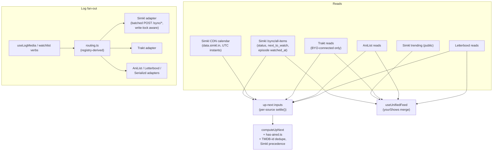
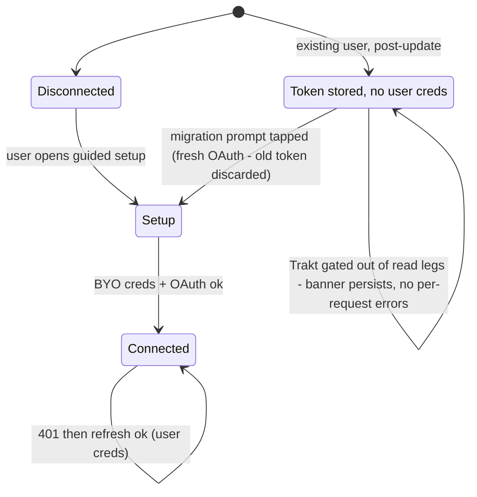

# Simkl Provider and Trakt Detachment - Plan

## Goal Capsule

- **Objective:** Simkl becomes a first-class symmetric provider (TV + movies + anime; reads, writes, watchlist, calendar), the Up Next/calendar feature stops depending on Trakt, and Trakt is demoted to a bring-your-own-everything provider — the app ships **no** Trakt credentials; Trakt activates only when the user supplies their own client id and secret through the existing guided setup.
- **Why now:** Trakt capped free accounts at one connected Community App effective 2026-07-22 ($60/yr VIP to lift), after a 100–300% VIP price hike in 2025 and breaking API changes in June 2026. The owner refuses to fund this and wants structural independence (owner decision, 2026-07-31).
- **Authority:** AGENTS.md overrides this plan where they conflict. The provider registry model (plan 0005), the fan-out partial-failure contract, and the `hasAired` instants contract are load-bearing and not renegotiable here.
- **Execution profile:** designed for autonomous execution (`/goal` or workflow) in dependency order U1→U10. Each unit is one landable commit; run the Verification Contract gates per unit, not only at the end.
- **Stop conditions:** stop and surface (do not guess) if: a Simkl endpoint materially disagrees with the shapes recorded in the Planning Contract; the live-account probe in U4 shows Simkl's status model destroys watched state on watchlist writes; or the Trakt migration UX (U9) would require silently clearing user sessions.

## Owner decisions

**2026-07-31:**

- Full detachment from Trakt. The app never ships Trakt credentials of any kind; the owner will not register or supply a Trakt API app. Trakt survives as opt-in BYO-everything, visible in the connect UI, gated on the guided setup.
- Simkl replaces Trakt as the tracker that "just works": the owner registered a Simkl app; `EXPO_PUBLIC_SIMKL_CLIENT_ID`/`_SECRET` are in `.env.template` and `.env.local` already.
- Anime routes to Simkl too — the fan-out works everywhere Simkl is applicable, not just TV/movies.
- Up Next/calendar must not depend on Trakt.
- No pre-implementation spike phase. Simkl's API is documented (https://api.simkl.org); the browser-origin CORS question was settled during planning (see KTD-9). Remaining endpoint unknowns are implementation-time verifications inside their units.
- History migration is out of scope: Simkl's own site imports from Trakt; Shinobu builds nothing for it.

---

## Product Contract

### Summary

Add `simkl` as the fifth provider: PKCE OAuth connect, history/progress/watchlist/calendar reads, batched mark-watched and watchlist writes joining the `useLogMedia` fan-out for TV, movies, and anime. Rebuild Up Next on Simkl inputs (server-computed `next_to_watch` + CDN calendar) merged with the existing AniList/Letterboxd legs, with Trakt as an optional extra rather than the spine. Move the home feed's trending rows off Trakt. Then remove the bundled Trakt env credentials, make the guided BYO setup Trakt's only activation path, and give existing Trakt users a visible migration path instead of a silent logout.

### Problem Frame

Trakt is Shinobu's only TV+movie symmetric provider and the sole source for Up Next's calendar legs and the home feed's always-fetched trending rows — 1,435 references across 134 files. Trakt's 2026 policy turn (one-Community-App cap, VIP price hike, unannounced breaking API changes) makes that structural dependence a liability the owner is unwilling to fund. Simkl offers a documented, free-for-non-commercial API with full write parity, native anime support, and a public calendar — but the registry model is only aspirationally dynamic: adding a provider touches ~10 hand-enumerated adapter maps, and removing Trakt's bundled credentials breaks token refresh for existing users and the trending rows for everyone, unless both are handled deliberately.

### Requirements

**Simkl as a provider**

- R1. `simkl` joins `ProviderId` and the registry with `mediaTypes: ['TV', 'MOVIE', 'ANIME']`, `canRead: true`, `canWrite: true`.
- R2. Connect is one-tap on native and web via OAuth PKCE using the bundled `EXPO_PUBLIC_SIMKL_CLIENT_ID`; no client secret is sent by the app. A Simkl 401 surfaces reconnect — there is no refresh flow (tokens live ~5 years).
- R3. `useLogMedia` fans out to Simkl: whole-item watched for movies, episode-level watched (with `watched_at`) for TV and anime, batched into single array-shaped `POST /sync/history` calls.
- R4. Anime routes to Simkl wherever it routes to AniList: anime series as TV-shaped writes, anime films as movie-shaped writes (Simkl joins Trakt/Letterboxd for films, unlike Serializd).
- R5. Watchlist add fans out to Simkl (`POST /sync/add-to-list`, `plantowatch`); watchlist remove ships `'manual'` until the remove endpoint and Simkl's single-status semantics are verified live (then flips to `'write'` inside U4).
- R6. Simkl reads join the unified feed: watched history, episode progress, watchlist (after live shape verification, mirroring the Serializd bar), and the connected-account username.
- R7. Simkl failures obey the partial-failure contract and get a `providerItemUrl` deep link like every other provider.
- R8. Simkl works on web directly — no Worker proxy, no native-only degradation (evidence: KTD-9).

**Up Next and feed independence**

- R9. Up Next works with only Simkl connected: episode progress via `next_to_watch` from `/sync/all-items`, air instants via the CDN calendar, all through `lib/time/has-aired.ts` unchanged.
- R10. With Trakt and Simkl both connected, Up Next and the feed dedupe by TMDB id; Simkl wins metadata conflicts (it is the primary calendar source).
- R11. The home feed's trending rows no longer require Trakt credentials — they move to Simkl's public endpoints. "Feed is never empty" survives detachment.

**Trakt detachment**

- R12. `EXPO_PUBLIC_TRAKT_CLIENT_ID`/`_SECRET` are removed from `src/lib/providers/trakt/config.ts` and `.env.template`; the guided BYO setup renders unconditionally and is Trakt's only activation path.
- R13. An existing Trakt session (stored MMKV token, no stored user credentials) must not die silently: the app detects the token-without-credentials state, gates Trakt out of every read leg (reads degrade immediately but visibly — an absent leg plus a persistent migration prompt, never per-request errors), and the prompt says "Trakt now requires your own API app — reconnect to resume syncing". Entering credentials routes into a fresh OAuth connect; the stored token is bound to the removed client id and is not reusable.
- R14. Trakt's registry capabilities are otherwise unchanged — connected BYO users keep full symmetric read/write.

**Knowledge capture**

- R15. `docs/solutions/web-cors-simkl.md` records the CORS probe (evidence + re-probe commands, per the web-cors convention); a Simkl rate-limit/write-lock solution doc records the 10 GET/s, 1 POST/s, 20-second write-lock discipline; AGENTS.md's provider sections are updated for Simkl and Trakt's BYO status.

### Scope Boundaries

**Deferred to follow-up work**

- Simkl ratings sync (`/sync/ratings`) — Shinobu has no ratings surface yet.
- Rewatch sessions (`?allow_rewatch=yes`) — revisit when a re-log UX exists.
- Simkl watchlist statuses beyond `plantowatch` (`watching`/`hold`/`dropped`) — Shinobu's watchlist verb maps to one status today.
- Local-notification scheduling off Simkl calendar data (todos/006 territory).
- The Simkl branch in `providerHasWatch` (`use-log-media.ts` reconcile): needs
  the unfiltered `/sync/all-items` read squared with the KTD-5 activities-gated
  refetch discipline, plus the AniDB-domain compare for anime (KTD-6 — the same
  ani.zip reverse map the write adapter uses). Until then Simkl always counts
  as "doesn't have it" in reconcile, so the write fires — never a false
  in-sync skip.

**Outside this product's identity**

- Any Trakt payment path or bundled Trakt credential — permanently out (owner decision).
- A Trakt→Simkl history migration tool — Simkl's site owns imports.
- A general backend or a third Worker proxy for Simkl — not needed (KTD-9) and not licensed.

---

## Planning Contract

### Key Technical Decisions

- KTD-1 **PKCE, no secret.** Simkl's docs offer confidential auth-code (secret at token exchange, "never embed client-side") and public PKCE. Shinobu is a public client with no backend, so the adapter uses PKCE: `GET /oauth/authorize` with `code_challenge`, `POST /oauth/token` with `code_verifier`. The client secret is not needed at all: delete `EXPO_PUBLIC_SIMKL_CLIENT_SECRET` from `.env.template` (and drop it from `.env.local`) — a real secret under the bundle-public `EXPO_PUBLIC_` prefix is one careless read away from shipping, and a leaked secret re-arms the code-interception attack PKCE exists to prevent.
- KTD-2 **No refresh wrapper for Simkl.** Tokens are long-lived (`expires_in` ≈ 5 years) with no documented refresh grant. Simkl's `api.ts` layer maps 401 → `ProviderAuthError` → disconnect state, skipping the Trakt-style refresh/coalescing machinery entirely. Simpler is correct here.
- KTD-3 **Batch, don't loop, and respect the write lock.** All Simkl write endpoints take arrays; Simkl enforces a ~20-second per-user write lock (`400 rate_limit` on collision) plus 1 POST/s. The Simkl write adapter batches everything a single fan-out produces into one call per verb, and the retry predicate treats the write-lock 400 like a rate-limit error (no blind retry storm — the AniList lesson, `docs/solutions/anilist-rate-limit-retry-storm.md`).
- KTD-4 **Calendar is CDN JSON intersected client-side.** `https://data.simkl.in/calendar/v2/{tv,anime,movie_release}.json` (rolling ~34-day window, UTC instants, rate-quota-exempt, never cache-busted) crossed with the user's `/sync/all-items` (watching/plantowatch) yields "my upcoming episodes" locally — there is no server-side "my calendar". Dates are full ISO instants with `Z`, exactly what `has-aired.ts` consumes; the utility itself does not change. Probe (2026-07-31): `tv.json` is ~1.5 MB with 5-hour cache headers and `access-control-allow-origin: *` — fetch it once per staleTime window and keep the parsed result in the query cache, never per-render.
- KTD-5 **`/sync/activities` is the invalidation signal.** Poll it cheaply; refetch `/sync/all-items` (with `extended=full&episode_watched_at=yes` where episode detail is needed) only on delta, honoring the app-wide staleTime floors.
- KTD-6 **ID strategy: widen `externalIds` with `mal` and `simkl`.** Movies/TV write by `tmdb`/`imdb` directly in `ids` payloads. Anime writes key by `mal`/`anidb` — Simkl numbers anime episodes by AniDB convention (absolute), so episode-level anime writes route through the existing `src/lib/providers/mapping/` (anizip) remap, not naive TMDB season/episode pairs. Fallback resolution via `GET /search/id` (or the cheaper `GET /redirect` Location-parse).
- KTD-7 **Detachment is a config change, not code removal.** `traktClientId()`/`traktClientSecret()` stop reading env and return only user-stored credentials; the `provider-config.ts` merge, `auth.ts` refresh, and registry entry are untouched. `ConnectTraktButton` drops its `hasEnvCredentials` branch — the Steps wizard is always the path. A new derived session state ("connected token, missing credentials") drives the R13 migration prompt instead of letting `refreshSession` 400 with empty creds and clear the session silently.
- KTD-8 **Trending moves to Simkl, and it is not the only unauthenticated Trakt read.** The unified feed's always-fetched trending rows ride `traktDeps()` (API key on every call); they move to Simkl's public trending endpoints — Simkl over TMDB because U3 already builds the Simkl fetch+normalize surface and the Simkl client id ships in every build while `EXPO_PUBLIC_TMDB_TOKEN` is optional. If Simkl trending proves too thin for feed cards at implementation time, the fallback is TMDB trending, with the stated precondition that a build without the TMDB token then ships an empty trending state deliberately. Beyond trending, `src/state/queries/mapping.ts` (`cachedTraktLookup`, `movieSearchQuery`, the `cachedSeasonLayout` Trakt fallback — the Letterboxd film metadata bridge) and `src/state/queries/media-details.ts`'s Trakt failover also ride `traktDeps()` with `.catch(() => null)` — U7 migrates those to Simkl `/search/id`/TMDB equivalents and makes the media-details Trakt leg conditional on credentials, or detachment silently degrades them for everyone without BYO creds.
- KTD-9 **Web is direct — no proxy.** Probe (2026-07-31, curl with a foreign `Origin` against `api.simkl.com`): GET `/search/tv` returned `access-control-allow-origin: *`, `access-control-allow-methods: GET,PUT,POST,DELETE,OPTIONS`, `access-control-allow-headers: *`; an OPTIONS preflight for `POST /sync/history` with `authorization` in requested headers returned the same wildcards. The CDN host was probed separately the same day: `data.simkl.in/calendar/v2/tv.json` also returns `access-control-allow-origin: *`. Simkl is the first fully browser-callable provider including writes; U10 records this as `docs/solutions/web-cors-simkl.md`. Confirm the token-exchange POST from a browser origin during U2 (expected fine under the same wildcard policy).
- KTD-10 **Two-tracker TV merge follows the movie precedent.** `yourShows` is single-sourced (Trakt) today; movies already merge across providers with TMDB-id dedupe (`features/watchlist/compute.ts`, Up Next's `dedupeByTmdb`). The same dedupe extends to TV history and calendar rows, with Simkl precedence (R10).

### High-Level Technical Design

Data flow after the change (Simkl legs new, Trakt legs unchanged but optional):

Trakt session states after detachment (drives U9):

### Assumptions

- Simkl's registered redirect URIs accept both the app scheme (`shinobu://redirect`) and the web origins, like Trakt's did; verified byte-for-byte at U2 against the developer app settings (the owner's app: simkl.com/settings/developer/8260606).
- `anilist` ids are accepted by `/search/id` for lookups but not assumed valid in write payloads; anime writes use `mal`/`anidb` (KTD-6).
- The Simkl account's single-status model (an item holds one of watching/plantowatch/completed…) means marking watched may move an item out of `plantowatch`. Treated as expected Simkl semantics, but U4 verifies read-only against a live account before the watchlist-remove verb ships as `'write'` (the Serializd lesson: `docs/solutions/serializd-watchlist-clears-watched.md`).

### Sequencing

U1 → U2 → {U3, U4} → U5 → {U6, U7} → U8 → U9 → U10. Trakt credential removal (U9) lands only after trending (U7) and Up Next (U8) are Trakt-free — detachment must never be the commit that breaks the feed.

---

## Implementation Units

| U-ID | Title | Key files | Depends on |
|---|---|---|---|
| U1 | Contract and registry widening | `src/lib/providers/{types,registry,routing,external-urls}.ts`, `src/types/media.ts` | — |
| U2 | Simkl lib foundation: config, http, PKCE auth | `src/lib/providers/simkl/{config,deps,http,auth}.ts` | U1 |
| U3 | Simkl reads and normalize | `src/lib/providers/simkl/{reads,normalize}.ts` | U2 |
| U4 | Simkl writes | `src/lib/providers/simkl/writes.ts` | U2 |
| U5 | Session and connect UI | `src/state/session/*`, `src/components/connect-simkl-button.tsx`, `src/state/queries/simkl.ts` | U1, U2 |
| U6 | Write fan-out integration | `src/features/log-media/use-log-media.ts`, `src/features/watchlist-media/*` | U4, U5 |
| U7 | Unified feed and trending migration | `src/state/queries/{use-unified-feed,watchlist}.ts` | U3, U5 |
| U8 | Up Next rebuild | `src/state/queries/{up-next,up-next-cache}.ts`, `src/features/up-next/*` | U3, U7 |
| U9 | Trakt detachment and migration UX | `src/lib/providers/trakt/config.ts`, `src/components/connect-trakt-button.tsx`, `src/state/session/*` | U7, U8 |
| U10 | Knowledge capture and conventions | `docs/solutions/*`, `AGENTS.md`, `.env.template` | U9 |

### U1. Contract and registry widening

- **Goal:** the type system and registry know Simkl; routing fans anime to it.
- **Requirements:** R1, R4, R7.
- **Files:** `src/lib/providers/types.ts` (ProviderId union), `src/types/media.ts` (`externalIds` gains `mal?: number`, `simkl?: number`), `src/lib/providers/registry.ts`, `src/lib/providers/routing.ts` (+ `routing.test.ts`), `src/lib/providers/external-urls.ts` (+ test), `src/features/trackers/provider-style.ts`, `src/global.css` (`bg-provider-simkl` token), `src/components/provider-icon.tsx` + SVG asset.
- **Approach:** registry entry lands capability-gated — `{ mediaTypes: ['TV','MOVIE','ANIME'], canRead: false, canWrite: false, watchlistWrite: 'manual', watchlistRemove: 'manual' }` with comments citing the flip gates: U7 flips `canRead`, U6 flips `canWrite` + `watchlistWrite: 'write'`, U4's probe gates `watchlistRemove`. A mid-sequence build can at worst connect Simkl, but routing never fans a write to a stub adapter (Letterboxd 0033 verify-then-flip precedent). `effectiveTypes` needs no special case — Simkl matches `'ANIME'` directly; the anime-film comment in `routing.ts` gains the Simkl sentence (included for films, unlike Serializd). `simklUrl` keys by simkl id with slug fallback from `externalIds`.
- **Test scenarios:** U1 asserts the gated state — Simkl appears in no fan-out while `canRead`/`canWrite` are false; MANGA never routes to Simkl; `providerItemUrl('simkl', …)` builds from simkl id; exhaustive-switch compile coverage for the widened union. The full fan-out expectations (anime series → AniList + Simkl + Trakt/Serializd; anime film → AniList + Simkl + Trakt + Letterboxd, never Serializd; TV → Trakt + Serializd + Simkl) land with the U6/U7 capability flips.
- **Verification:** `bun test` routing/external-urls suites green; `bun typecheck` proves every exhaustive `Record<ProviderId, …>` site was found (the compile errors are the to-do list for U5–U7).

### U2. Simkl lib foundation: config, http, PKCE auth

- **Goal:** an Effect-based Simkl transport with auth, matching the per-provider file anatomy.
- **Requirements:** R2, R8.
- **Files:** `src/lib/providers/simkl/config.ts`, `deps.ts`, `http.ts`, `auth.ts`, `index.ts`, `.test.ts` siblings.
- **Approach:** `config.ts` carries `https://api.simkl.com`, `https://data.simkl.in`, and the mandatory `client_id`/`app-name`/`app-version` params (RN-import-free, Serializd precedent). `http.ts` maps failures to the four shared tagged errors; 401 → `ProviderAuthError` with no refresh path (KTD-2); `400 rate_limit` and 429 → `ProviderRateLimitError`. `auth.ts` builds the PKCE authorize URL (verifier/challenge via expo-crypto) and exchanges the code without a secret (KTD-1); the verifier plus a random `state` are stored per-flow (sessionStorage on web, in-memory/MMKV on native), `state` is validated on callback, and both are deleted once the exchange resolves or fails; redirect URIs follow `trakt/redirect-uri.ts` patterns. Confirm browser-origin token exchange works while here (KTD-9 note).
- **Execution note:** verify the registered redirect URIs against the owner's Simkl app settings before wiring; a byte-for-byte mismatch was Trakt's classic failure (`docs/solutions/trakt-oauth-setup.md`). While live, pin down empirically whether the 10 GET/s cap is per user token or aggregate per client_id (one bundled id serves every install; if aggregate, adoption has a suspension ceiling — record the answer and the implied ceiling in the U10 rate-limit doc).
- **Test scenarios:** authorize URL carries challenge + registered redirect; token exchange sends `code_verifier`, never a secret; mismatched `state` → no exchange; verifier and state cleared after the exchange settles; 401 maps to `ProviderAuthError` (no refresh attempt); write-lock 400 maps to `ProviderRateLimitError`; standard params attached on every request including CDN calls.
- **Verification:** `bun test` on the new suite; a manual PKCE round-trip against the real app (native sim) lands a token in MMKV.

### U3. Simkl reads and normalize

- **Goal:** history, progress, watchlist, calendar, trending, and profile reads as effects returning `NormalizedMediaItem`.
- **Requirements:** R6, R9, R11 (data half).
- **Files:** `src/lib/providers/simkl/reads.ts`, `normalize.ts`, tests; touch `src/lib/providers/mapping/` only if the anizip surface needs a mal/anidb accessor.
- **Approach:** `/sync/all-items/{type}` with `extended=full&episode_watched_at=yes` (per-episode timestamps + server-computed `next_to_watch`); `/sync/activities` for delta invalidation (KTD-5); CDN calendar fetch (KTD-4 — no cache-busting, plain params); verify whether `next_to_watch` carries an air datetime — if not, episodes that aired before the rolling ~34-day window (catch-up viewing, the common Up Next case) date via the monthly archive calendar files; public trending; `/users/settings` for username (note: POST-shaped read — verify before wiring the queryFn). `normalize.ts` maps the three Simkl types onto `MediaType` (`anime_type: "movie"` → `isFilm`), fills `externalIds` (simkl/tmdb/imdb/tvdb/mal), and emits air dates as ISO instants untouched (the `has-aired.ts` contract).
- **Test scenarios:** all-items fixture → normalized items with correct type/isFilm/externalIds; anime with `anime_type: "movie"` becomes `isFilm: true`; calendar fixture entries keep `Z` instants verbatim; activities delta comparison logic; pagination-shape guard (all-items treated as full snapshot — assert no silent truncation by checking `X-Pagination-*` absence handling).
- **Verification:** `bun test`; a live read against the owner's account returns a sane feed in the dev client.

### U4. Simkl writes

- **Goal:** batched, write-lock-aware history and watchlist writes.
- **Requirements:** R3, R4, R5.
- **Files:** `src/lib/providers/simkl/writes.ts` + test.
- **Approach:** one `POST /sync/history` per fan-out with `movies[]`/`shows[]`/`anime[]` arrays (episode-level `seasons[].episodes[]`, `watched_at` threaded); `POST /sync/add-to-list` with `to: 'plantowatch'`; ids per KTD-6 with the anizip remap for anime episode numbers. Returns `ProviderWriteResult` (`ok`/`skipped`) per the fan-out contract.
- **Execution note:** before flipping `watchlistRemove` to `'write'`: confirm the remove endpoint's exact path from the api.simkl.org reference, then run the read-only single-status probe on a live account (does marking watched evict `plantowatch`? does a watchlist remove touch watched state?). Record findings; flip the registry field in this unit only if both checks pass — otherwise it stays `'manual'` with a comment and a deferred follow-up. The probe also decides two adjacent behaviors: (a) `use-log-media`'s derived `removeWatchedFromWatchlist` fires a second write right after a film log — inside Simkl's ~20s write lock; if the probe confirms watched evicts `plantowatch`, exempt Simkl from the derived removal (the server already did it), otherwise defer it past the lock window, never back-to-back. (b) Where an anime film lands: prefer `anime[]` with mal/anidb ids if a tmdb-keyed `movies[]` entry doesn't resolve to the same catalog item.
- **Test scenarios:** a mixed fan-out (movie + TV episode + anime episode) produces exactly one history POST with three arrays, not three POSTs; anime episode numbers pass through the remap; `watched_at` serialized ISO; write-lock 400 → `ProviderRateLimitError`, not retried into a storm; watchlist add uses `plantowatch`; ids prefer simkl > tmdb/imdb for movies/TV, mal/anidb for anime.
- **Verification:** `bun test`; one live logged episode appears on the Simkl profile.

### U5. Session and connect UI

- **Goal:** Simkl is connectable, disconnectable, and visible everywhere providers appear.
- **Requirements:** R2, R6 (username).
- **Files:** `src/state/session/provider-config.ts`, `use-oauth-callback.ts`, `src/state/queries/simkl.ts` (deps builder, `simklQueryKeys`, query hooks + Suspense variants), `src/components/connect-simkl-button.tsx`, `src/features/trackers/connect-buttons.ts`, `use-provider-username.ts`, `src/app/redirect.tsx` if the callback route needs the new provider branch.
- **Approach:** one-tap connect (bundled client id — no BYO wizard for Simkl); the OAuth callback exchange handler mounts on the registered redirect route, not the initiating screen (the Trakt bug); on web, Simkl's registered redirect URI carries a static `?oauth=simkl` marker so `useOAuthCallback` can branch before consuming `code` — unmarked `?code=` returns stay Trakt's for backward compatibility, since both providers redirect to the site origin; token in MMKV under the provider-keyed store; query keys scoped `['simkl', …]` so disconnect purges cleanly (AniList lesson). Button uses `components/button` with `loading` through the round-trip.
- **Test scenarios:** deps builder pulls client id from env with user-override precedence; callback exchanges once and strips the code from history (web); marked Simkl returns route to the Simkl exchange, unmarked returns stay Trakt; disconnect clears token + invalidates `['simkl']` scope; connect-button registry renders for `simkl`.
- **Verification:** connect → username renders in trackers screen → disconnect, on iOS sim and web; `bun check:router-push` stays green.

### U6. Write fan-out integration

- **Goal:** Simkl participates in every write path the registry claims.
- **Requirements:** R3, R4, R5, R7.
- **Files:** `src/features/log-media/use-log-media.ts` (`LOG_ADAPTERS`, `providerHasWatch`, `invalidateAfterLog`, `CANONICAL_EPISODE_PROVIDERS` decision), `src/features/watchlist-media/use-watchlist-media.ts` + `use-unwatchlist-media.ts` (adapter maps + their exact-key test assertions), write-picker surfaces from plan 0032 (registry-derived — verify no hardcoded provider list).
- **Approach:** wire the U4 adapters into each hand-enumerated map and flip the registry to `canWrite: true`, `watchlistWrite: 'write'` (the U1 gate); Simkl invalidation targets `['simkl']` keys + the unified feed/up-next caches; partial failure surfaces Simkl by name with its `providerItemUrl` fallback row.
- **Test scenarios:** logging TV with Trakt+Serializd+Simkl connected fires all three, one failing doesn't mask the others; anime film log includes Simkl in the picker's preselected targets; watchlist remove renders Simkl as a manual row (until U4 flips it); adapter-map key assertions updated.
- **Verification:** `bun test`; a real log lands on Simkl and the toast/sheet behavior matches plan 0032/0033 idioms.

### U7. Unified feed and trending migration

- **Goal:** Simkl history feeds the home surfaces; trending and the mapping/metadata bridges stop needing Trakt.
- **Requirements:** R6, R10, R11.
- **Files:** `src/state/queries/use-unified-feed.ts`, `src/state/queries/watchlist.ts` (`WATCHLIST_READ_PROVIDERS`), `src/state/queries/mapping.ts`, `src/state/queries/media-details.ts`, `src/features/watchlist/compute.ts`, `src/features/feed/feed-rows.tsx` if slots change.
- **Approach:** `yourShows` becomes a merge (Trakt when connected + Simkl when connected) deduped by TMDB id, Simkl precedence (KTD-10); Simkl joins `WATCHLIST_READ_PROVIDERS` only after the U3 live read verified item shape (same bar Serializd was held to — if unverified at this point, exclude with the R32-style comment); trending rows switch to Simkl public endpoints via `simklDeps()` with no auth (KTD-8); the mapping layer's Trakt legs (`cachedTraktLookup`, `movieSearchQuery`, `cachedSeasonLayout` fallback) move to Simkl `/search/id`/TMDB equivalents and `media-details.ts` passes its Trakt leg only when Trakt credentials resolve (KTD-8); this unit flips `canRead: true` in the registry (the U1 gate).
- **Test scenarios:** same show in Trakt and Simkl history renders once, Simkl metadata wins; Simkl-only user sees populated yourShows; trending renders with zero providers connected and no Trakt creds in env; watchlist merge includes Simkl `plantowatch` items exactly once; Letterboxd watchlist films and season layouts resolve with no Trakt credentials.
- **Verification:** `bun test`; dev client with a fresh profile (no Trakt creds) shows non-empty trending.

### U8. Up Next rebuild

- **Goal:** Up Next/calendar is provider-plural with Simkl as a first-class leg; Trakt becomes optional input, not the spine.
- **Requirements:** R9, R10.
- **Files:** `src/state/queries/up-next.ts`, `up-next-cache.ts`, `src/features/up-next/compute.ts` + `types.ts`, `src/features/release-timeline/*` where release inputs are typed to Trakt.
- **Approach:** add `simklInputs()` (all-items `next_to_watch` + per-episode progress) and `simklCalendarInputs()`/release legs (CDN calendar intersected with the user's items client-side, KTD-4), each wrapped in `settle()` like every existing leg; rename/retype the input bundle so legs are provider-keyed rather than `trakt*`-named; extend `dedupeByTmdb`/`dedupeReleases` merge with Simkl precedence; `computeUpNext` and `has-aired.ts` contracts unchanged.
- **Execution note:** this is a restructuring of one dense 380-line file, not an append — keep the per-leg staleTime/concurrency tuning that exists, and land it as its own commit with the compute tests as the safety net.
- **Test scenarios:** Simkl-only → populated up-next with correct aired/unaired classification across a timezone boundary (instants, not dates); both providers → one row per show, Simkl air time shown; Trakt-only (BYO user) → unchanged behavior; neither → AniList/Letterboxd legs still work; finale flags from calendar metadata survive normalize; a calendar entry without the user tracking it never appears; a tracked show whose next episode aired before the rolling calendar window still classifies as aired; a tracked show absent from the calendar file entirely degrades to progress-only, never hidden.
- **Verification:** `bun test`; iOS sim visual check of Up Next with Simkl-only account (per repo practice, verify UI on iOS, not the starving Android AVD).

### U9. Trakt detachment and migration UX

- **Goal:** no bundled Trakt credentials; existing users get a path, not a logout.
- **Requirements:** R12, R13, R14.
- **Files:** `src/lib/providers/trakt/config.ts`, `src/state/session/provider-config.ts` (only if the merge needs the env leg removed rather than nulled), `src/components/connect-trakt-button.tsx`, the trackers screen for the migration banner, `src/lib/providers/trakt/auth.ts` (guard, not rewrite).
- **Approach:** per KTD-7 — env reads deleted; `ConnectTraktButton` renders the Steps wizard unconditionally; a derived `traktNeedsCredentials` state (token exists ∧ user credentials absent) gates Trakt out of `providersForFeed`/up-next read legs, short-circuits `refreshSession` before it can 400 with empty creds and clear the session, and drives a persistent, dismiss-until-tapped banner ("reconnect to resume syncing"). The stored token is evidence-of-prior-connection only — every Trakt request carries `trakt-api-key`, which is exactly the removed credential, so reads cannot survive detachment, and the token is bound to the old client id; entering credentials always routes into a fresh OAuth round-trip (the state diagram in the Planning Contract is the contract).
- **Test scenarios:** token + no creds → refresh not attempted, Trakt absent from feed/up-next read legs, `traktNeedsCredentials` true, banner state set; token + creds → refresh path unchanged; no token → plain disconnected, no banner; entering valid creds from the banner routes into a fresh OAuth connect and discards the old token; `.env.template` has no Trakt entries; a fresh checkout with no Trakt env vars typechecks and boots.
- **Verification:** `bun test`; dev-client simulation of the migrating user (seed a token, remove creds) shows the banner and never a silent logout.

### U10. Knowledge capture and conventions

- **Goal:** the compound-knowledge trail matches reality.
- **Requirements:** R15.
- **Files:** `docs/solutions/web-cors-simkl.md`, `docs/solutions/simkl-rate-limits-and-write-lock.md`, `AGENTS.md`, `.env.template`, `docs/plans/README.md` if it indexes plans.
- **Approach:** the CORS doc follows the convention contract (verified date + method, findings per endpoint, consequences, exact re-runnable curl probes — seed it with the 2026-07-31 probe from KTD-9 and the U2 token-exchange confirmation); the rate-limit doc records 10 GET/s / 1 POST/s / 20s write lock / batching discipline / activities-before-all-items; AGENTS.md: Simkl joins the provider list ("five symmetric, opt-in providers"), Trakt's entry gains the BYO-everything status and the community-app-cap context, the anime fan-out sentence gains Simkl.
- **Test expectation:** none — documentation unit; `bun lint` still passes (markdown untouched by lint, but AGENTS.md examples must not contradict oxlint rules).
- **Verification:** docs read true against the shipped code; a cold reader of AGENTS.md learns Simkl exists and Trakt is BYO.

---

## Verification Contract

| Gate | Command | Applies to |
|---|---|---|
| Lint | `bun lint` | every unit |
| Types (exhaustive maps are the checklist) | `bun typecheck` | every unit, load-bearing after U1 |
| Unit tests | `bun test` | every unit with test scenarios |
| className discipline | `bun check:classnames` | U5, U6, U9 (UI units) |
| Navigation guard | `bun check:router-push` | U5, U6, U9 |
| Live Simkl round-trip | manual: connect, log one episode, see it on simkl.com | U2, U4, U6 |
| Degraded-state proof | manual: fresh profile, no Trakt env — trending populated, Up Next works Simkl-only | U7, U8, U9 |
| Migration proof | manual: seeded token without creds — banner, no silent logout | U9 |

UI verification runs on the iOS simulator (Argent tooling); the Android AVD is unreliable on this host and is not a gate.

## Definition of Done

- All ten units landed in dependency order, each gate green at its unit.
- A user with only Simkl connected can: connect one-tap, see their shows/history/watchlist in the feed, log movies/TV/anime (films fan movie-shaped), and get a timezone-correct Up Next — with Trakt env credentials absent from the build.
- An existing Trakt user upgrading across this change sees the migration banner and retains a working session path; no code path silently clears a Trakt session.
- Trending renders with zero providers connected.
- `watchlistRemove` for Simkl is either `'write'` with the live probe recorded, or `'manual'` with the gate documented — never `'write'` unverified.
- Docs of R15 exist and match behavior; `.env.template` carries the Simkl client id only — no Trakt entries and no Simkl secret.
- Letterboxd watchlist films, season layouts, and detail-screen failover still resolve with no Trakt credentials in the build.
- No abandoned experiments in the diff: dead Trakt-env branches, unused Simkl scaffolding, or leftover debug logging removed before done is declared.

## Open Questions

All deferred (non-blocking) — resolved inside their owning units, none change the architecture:

1. Exact watchlist-remove endpoint path/method (U4; docs page exists but wasn't fetched during planning).
2. Whether `anilist` ids are accepted in write payloads or only `/search/id` reads (U4; plan assumes reads-only per KTD-6).
3. 400-write-lock vs 429-rate-cap semantics for the retry predicate (U2; both map to `ProviderRateLimitError` either way).
4. `/users/settings` being POST-shaped for a read (U3; affects queryFn wiring only).
5. Custom-scheme redirect grammar in Simkl's app registration (U2; PIN flow is the documented fallback if deep-link redirects are rejected).

## Sources & Research

- Simkl API: https://api.simkl.org (introduction, authentication, guides/sync, api-reference/calendar, api-rules) — Apiary docs frozen, retiring Oct 2026; do not consult them.
- CORS probe evidence: planning-session curl, 2026-07-31 (KTD-9) — to be enshrined in `docs/solutions/web-cors-simkl.md`.
- Trakt policy context: forums.trakt.tv "An update to Community App connections" (2026-07-22 cap); VIP repricing coverage (2025).
- Repo precedent: `docs/plans/0005-provider-capability-model.md` (registry), `0031`/`0032`/`0033` (watchlist verbs, picker/toast idioms, verify-then-flip discipline), `docs/solutions/trakt-oauth-setup.md`, `anilist-rate-limit-retry-storm.md`, `up-next-airing-classification.md`, `serializd-watchlist-clears-watched.md`, `web-cors-trakt.md` (doc contract).
- Provider anatomy template: `src/lib/providers/serializd/` (fullest recent example) and `src/lib/providers/anilist/` (implicit-grant auth shape).
