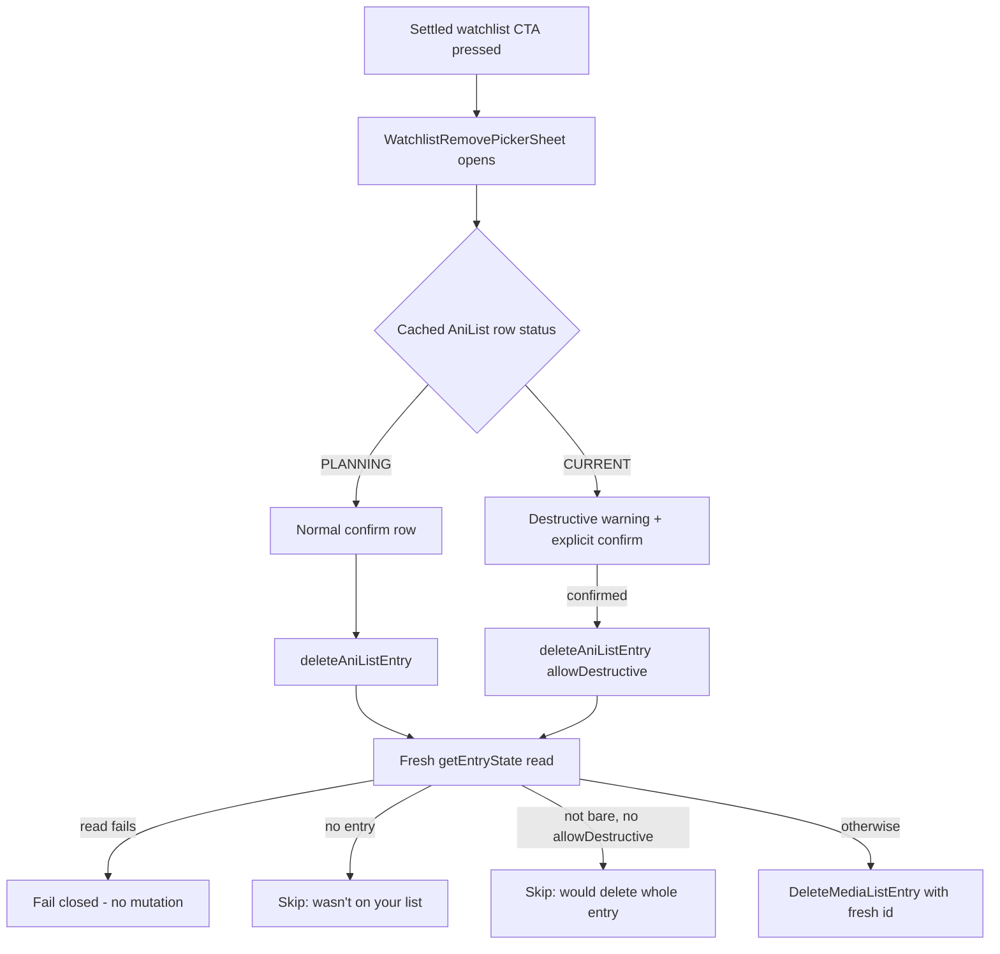
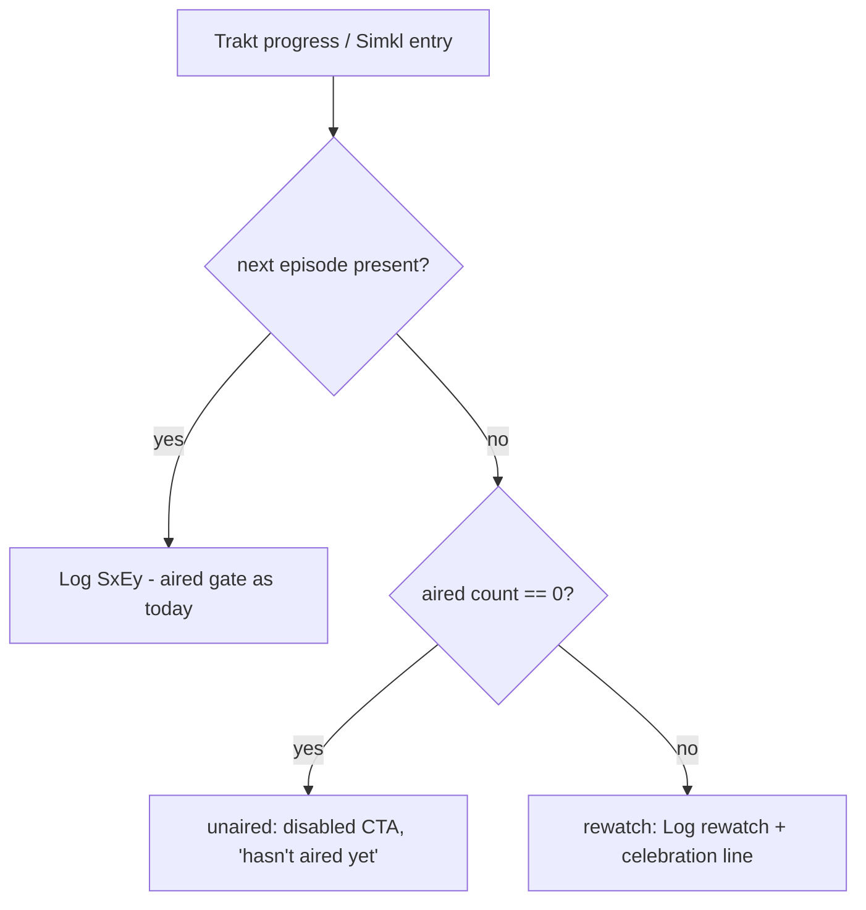

# Details Sheets, Links, Years, and Watchlist CURRENT - Plan

## Goal Capsule

- **Objective:** Six owner-requested fixes on the details/watchlist surfaces: (1) anime counts as watchlisted when CURRENT *or* PLANNING on AniList, reads and removal both; (2) the actor credit sheet drops its biography; (3) studio pills get a long-press sheet with open-in-provider links; (4) "Open in AniList" deep-links to resolved numeric-id pages and hides on miss — never a dead-end search; (5) person/studio filmography rows show release years; (6) a show with zero aired episodes reads "hasn't aired yet" instead of finished/rewatchable.
- **Authority:** AGENTS.md overrides this plan where they conflict. Non-negotiable inherited contracts: the AniList status gate (`docs/solutions/anilist-shared-list-query-status-gate.md`), the R36 fresh-read/fresh-id delete invariants (plan 0031), `src/lib/providers/external-urls.ts` purity (loaded under plain bun by `scripts/check-external-urls.ts`), and the `hasAired` timezone contract.
- **Execution profile:** designed for delegated autonomous execution in dependency order U1→U7. Units are independent except U1→U2 and U4→U5; each is one landable commit. Run Verification Contract gates per unit.
- **Stop conditions:** stop and surface (do not guess) if: AniList's `Page { staff/studios(search:) }` shapes disagree with the Planning Contract; the destructive-remove flow would require weakening the fresh-read/fresh-id invariants; or Letterboxd's `/studio/{slug}/` URL shape turns out not to exist for probe-tested studios.

---

## Product Contract

### Summary

One batch plan covering six independent details/watchlist fixes: widen the anime watchlist to CURRENT (reads plus confirm-guarded destructive removal), remove the credit-sheet biography, add a studio long-press sheet, resolve AniList people/studio links by id (hide on miss), render filmography release years, and give zero-aired shows an honest "hasn't aired yet" state.

### Problem Frame

Owner-reported friction from daily use (2026-08-01). An anime being actively watched doesn't count as watchlisted, so it's absent from `/watchlist`. The actor sheet's biography crowds out the sheet's actual payload (the role). Studios have no long-press affordance at all. "Open in AniList" builds a name-search URL; most TMDB names aren't on AniList, so it lands on an empty search. Filmography rows carry no year even though the data is fetched. And a show whose episodes haven't aired hits Trakt's `next_episode: null` branch and presents as "🎉 You've watched every aired episode" with a rewatch CTA — a lie for an unaired show.

### Requirements

**Anime watchlist: CURRENT counts**

- R1. An anime with AniList status CURRENT or PLANNING is watchlisted: it appears in `/watchlist` and the details-screen watchlist CTA reflects membership.
- R2. The three existing status gates change in zero lines — `fetchCurrentAnime`'s CURRENT filter, Up Next's PLANNING-to-Calendar confinement, and the "Your Anime" row. Widening is a new selector, never an edit to an existing one (preserves plan 0031 R28 and the status-gate solution doc).
- R3. A CURRENT AniList entry can be removed from the watchlist. AniList has no "un-status" that preserves an entry, so removal deletes the whole entry — progress, rewatch count, score, notes, dates, custom lists — and must be preceded by an explicit destructive confirm that says so (owner decision 2026-08-01, reversing plan 0031 R36's status clause).
- R4. Bare-PLANNING removal keeps its current silent path; the destructive confirm appears only when the entry is not bare.
- R5. R36's other two invariants are preserved verbatim: a fresh in-effect `getEntryState` read immediately before any delete, and the delete uses the id from that fresh read — never a cached `entryId` or the 15-minute-stale watchlist aggregate.

**Actor credit sheet**

- R6. The credit sheet no longer renders the person biography. The meta line, unclamped role text, "View filmography" row, and provider-links section stay (narrows plan 0028 R1; consistent with its A1 "bio is a supplement, not the payload").
- R7. The sheet keeps its person query — it warms the `/person` route cache and feeds the meta line.

**Studio sheet**

- R8. Long-pressing a studio pill on the details screen opens a studio sheet: studio name, a "View studio" navigation row, and open-in-provider links. Plain press still navigates to the studio route (reverses plan 0028's "studio pills: nothing to expand" scope boundary).
- R9. Letterboxd studio link is a pure URL builder (`letterboxd.com/studio/{slug}/`) reusing the existing Letterboxd slug rules.
- R10. The studio sheet's AniList link follows the id-resolution rules below.

**AniList links resolve or hide**

- R11. "Open in AniList" for people and studios deep-links to the numeric-id page (`anilist.co/staff/{id}`, `anilist.co/studio/{id}`). The name-search URL shape is removed.
- R12. Ids resolve for free when the source payload already carries them (AniList anime credits ship staff and studio ids — carry them through normalization); otherwise via an unauthenticated GraphQL name search whose result is validated by the house matcher (`pickPersonMatch`), cached long, and fired lazily on sheet open — never per-pill on render.
- R13. When no confident match resolves, the AniList action is hidden. No fallback to search, no near-name links (same never-relax-to-top-hit rule as plan 0031 R10).

**Filmography years**

- R14. Person filmography rows show each title's release year merged with the existing character/job subtitle; the role text is not displaced.
- R15. Studio filmography rows show the release year as the subtitle (the slot is currently empty).
- R16. Undated items show no year; their existing sorts-first position stays.

**Zero-aired shows**

- R17. A show with zero aired episodes never presents as finished: no "Log rewatch" CTA, no "🎉 You've watched every aired episode" line, no rewatch confirm-sheet copy.
- R18. It shows a disabled log CTA reading that the show hasn't aired yet (the series analogue of `filmReleaseStatus`, plan 0029 KTD5).
- R19. Zero-aired stays distinct from unknown-air-date: the deliberate permissive rule that a null air date does not block a log is untouched (`docs/solutions/simkl-only-tv-details-trakt-gated.md`).

### Scope Boundaries

- **Not touched:** Calendar/Up Next sources (PLANNING confinement stays exactly as-is); the `/person` route's full biography (`ExpandableText` stays); bulk watchlist removal (30 req/min budget, out per plan 0031); Trakt/Serializd/Simkl person or studio links (no such pages — `providerPersonUrl` already returns `null` for them).
- **Deferred to Follow-Up Work:** an AniList staff-id carry-through for *people* in anime credits mirrors the studio-id carry (R12) — do it if it falls out naturally in U4, otherwise defer; a richer studio sheet (logo, description) — `NormalizedStudio` has neither field today.

---

## Planning Contract

### Key Technical Decisions

- **KTD1 — Fourth selector, not a widened filter.** `src/state/queries/anilist.ts` gains `fetchWatchlistAnime()` selecting CURRENT ∪ PLANNING from the already-cached `currentAnimeEntries` payload (zero extra requests — plan 0030 already fetches both statuses in one query). `fetchPlannedAnime`, `fetchCurrentAnime`, and the Up Next gate are untouched; the three-way regression test in `src/state/queries/anilist.test.ts` becomes four-way. Amend `docs/solutions/anilist-shared-list-query-status-gate.md`'s amendment section to record that CURRENT→watchlist widening does not violate the gate (the gate restricts what PLANNING may reach, not CURRENT).
- **KTD2 — Destructive removal is an explicit opt-in flag, warned generically.** `deleteAniListEntry` gains an `allowDestructive` mode that bypasses only the refusal clause (`refusalClause`, `writes.ts:244`) — the fresh-read branch, the fresh-id rule, the no-entry skip, and the fail-closed error path are shared and unchanged. The remove picker shows a destructive warning with generic copy ("deletes your whole AniList entry — progress, score, notes") whenever the cached AniList row's status is CURRENT, without a pre-confirm network read; the adapter's own fresh read remains the authority at delete time. If the fresh state turned bare-PLANNING meanwhile, the delete proceeds (it was safe anyway). Alternative rejected: a fresh read on picker-open to preview exact losses — one extra request per open against a 30 req/min budget for copy precision the generic warning already covers.
- **KTD3 — AniList resolution lives in the query layer; `external-urls.ts` stays pure.** The purity contract (no react-native imports; `scripts/check-external-urls.ts` loads it under plain bun) forbids async resolution there. `external-urls.ts` gains only id-keyed pure builders — `anilistStaffUrl(id)`, `anilistStudioUrl(id)`, `letterboxdStudioUrl(name)` — and loses `anilistPersonUrl`'s search shape (tests updated). Resolution is a TanStack query in `src/state/queries/anilist.ts` over the public `anilistRequest` (unauthenticated works — CORS-open per `docs/solutions/web-cors-anilist.md`), `staleTime` 24 h (name→id is effectively immutable, same tier as `tmdbQueryKeys.person`), `enabled` only while a sheet is open. `NormalizedStudio` gains `anilistId?`, populated by `normalizeStudios` in `src/lib/providers/anilist/credits.ts` (the id is already in the payload and currently discarded) — AniList-sourced studios skip the search entirely.
- **KTD4 — Three-state series status, discriminated by the aired count carried through normalization.** `normalizeWatchedProgress` (`src/lib/providers/trakt/normalize.ts`) currently discards `aired`; carry it on `TraktShowProgressResult` (a plain number — safe for the MMKV-persisted cache, which only needs codecs for exotic types). `nextEpisodeFromProgress` becomes three-state: `next != null` → next episode; `next == null && aired === 0` → `unaired`; `next == null && aired > 0` → rewatch wrap. The Simkl leg uses the aired arithmetic that already exists (`total - notAiredEpisodes`, cf. `simklAiredByCount` in `src/state/queries/up-next.ts`). This is the "carry the discriminating field through normalization first, filter per consumer second" rule from the status-gate solution doc, and the series analogue of `filmReleaseStatus`.
- **KTD5 — Years ride the existing subtitle channel.** `MediaCarousel`'s `subtitles: Record<itemId, string>` → `MediaCard.subtitle` already exists. Person rows merge the year into the character/job string built by `normalizeCreditRows` (`src/lib/providers/tmdb/normalize.ts`); studio rows build a year-only map in the route. `item.year` is already populated by `normalizeKindedItem` for both — no query change.

### High-Level Technical Design

AniList watchlist removal, after this plan (U2):

Series log-CTA status derivation (U7):

---

## Implementation Units

### U1. AniList CURRENT joins the watchlist read

- **Goal:** CURRENT anime appear in `/watchlist` and read as watchlisted on details.
- **Requirements:** R1, R2.
- **Dependencies:** none.
- **Files:** `src/state/queries/anilist.ts`, `src/state/queries/watchlist.ts`, `src/state/queries/anilist.test.ts`, `src/state/queries/watchlist.test.ts`.
- **Approach:** add `fetchWatchlistAnime()` (KTD1) beside the existing selectors; `anilistInputs()` in `watchlist.ts` consumes it instead of `fetchPlannedAnime`. `useIsWatchlisted` matches against watchlist inputs, so the details CTA follows automatically. Keep `fetchPlannedAnime` exported if Calendar still uses it; delete it only if `anilistInputs` was its sole consumer.
- **Patterns to follow:** the existing selector trio in `anilist.ts` (pure filters over one cached read); the three-way regression test shape in `anilist.test.ts`.
- **Test scenarios:**
  - A mixed CURRENT+PLANNING cached payload: `fetchWatchlistAnime` returns both; `fetchPlannedAnime` still returns PLANNING only; `fetchCurrentAnime` still returns CURRENT only (four-way regression).
  - `anilistInputs()` yields watchlist inputs for a CURRENT entry (item identity, `source: 'anilist'`).
  - Up Next's PLANNING confinement test still passes untouched.
- **Verification:** `bun test`; manually confirm a CURRENT anime shows in `/watchlist` and its details CTA reads watchlisted. Amend the status-gate solution doc in the same commit.

### U2. Destructive un-watchlist for CURRENT AniList entries

- **Goal:** removing a CURRENT anime from the watchlist works, behind an explicit destructive confirm.
- **Requirements:** R3, R4, R5.
- **Dependencies:** U1.
- **Files:** `src/lib/providers/anilist/writes.ts`, `src/lib/providers/anilist/writes.test.ts`, `src/features/watchlist-media/use-unwatchlist-media.ts`, `src/features/watchlist-media/watchlist-picker-sheet.tsx`, `src/features/watchlist-media/copy.ts`, `src/features/watchlist-media/copy.test.ts`.
- **Approach:** KTD2. `deleteAniListEntry` takes `allowDestructive?: boolean`; when set, skip only the `refusalClause` check. The remove picker inspects the cached AniList row's status: CURRENT → render the destructive warning and an explicit confirm (reuse the existing confirm-sheet vocabulary — `log-confirm-sheet.tsx` is the destructive-confirm precedent; extend the picker's existing mode/content pattern rather than stacking a second sheet). PLANNING → today's path, byte-for-byte. Warning copy lives in `copy.ts` as a pure builder (no provider name in the CTA label; the provider name may appear in the warning body per the results-row rule).
- **Execution note:** write the `writes.test.ts` cases first — the 765-line existing suite pins the refusal guard; the new mode must thread through it without loosening any existing branch.
- **Test scenarios:**
  - `allowDestructive` + fresh read returns CURRENT with progress/score → mutation issued with the fresh id.
  - `allowDestructive` + fresh read fails → fail closed, no mutation (unchanged branch).
  - `allowDestructive` + no entry → skip "wasn't on your AniList list" (unchanged).
  - No `allowDestructive` + non-bare entry → refusal skip, exact existing message (regression).
  - Fresh read id differs from cached `entryId` hint → mutation uses the fresh id.
  - Copy builder: CURRENT status → destructive warning text; PLANNING → none.
- **Verification:** `bun test`; manual: remove a CURRENT anime → confirm appears, confirming deletes on AniList; remove a bare-PLANNING one → no new friction.

### U3. Credit sheet drops the biography

- **Goal:** the actor sheet stops rendering the bio.
- **Requirements:** R6, R7.
- **Dependencies:** none.
- **Files:** `src/features/person/person-credit-sheet.tsx`.
- **Approach:** remove the biography `Text` block inside `CreditBiography` and rename/reshape what remains (meta line + loading skeleton). Re-check the early-return guard that currently keys on meta *and* bio both being empty — it must now key on meta alone. The person query stays (R7). Shrink the skeleton to match the shorter content.
- **Test scenarios:** none — pure JSX removal with no decision logic; the sheet's pure helpers are untouched. `Test expectation: none — presentational removal.`
- **Verification:** `bun lint`, `bun check:classnames`; manual: long-press an actor — role, meta line, filmography row, links render; no bio; no blank gap when the person has no meta.

### U4. AniList ids: carry, resolve, and deep-link

- **Goal:** "Open in AniList" for people (and studios, consumed in U5) deep-links by id or hides.
- **Requirements:** R11, R12, R13.
- **Dependencies:** none.
- **Files:** `src/lib/providers/external-urls.ts`, `src/lib/providers/external-urls.test.ts`, `src/lib/providers/anilist/reads.ts`, `src/state/queries/anilist.ts`, `src/lib/providers/anilist/credits.ts`, `src/types/media.ts`, `src/features/provider-links/person-links-section.tsx`, `scripts/check-external-urls.ts` (register new builders in the liveness probe).
- **Approach:** KTD3. New unauthenticated reads in `reads.ts`: `searchAniListStaff(name)` and `searchAniListStudio(name)` over `Page(perPage: 5) { staff/studios(search:) { id name } }`, normalized to `{ id, name }[]`. Query hooks in `state/queries/anilist.ts` with 24 h `staleTime`, `enabled: open && name !== ''`; match via `pickPersonMatch` (already generic over `{ name }`); result is the id or null. `external-urls.ts`: add `anilistStaffUrl(id)` / `anilistStudioUrl(id)`; delete the `anilistPersonUrl` search shape and its pinned tests. `PersonLinksSection` accepts the resolved id (or resolves internally given the open flag) and omits the AniList pill while unresolved or on miss — the section already returns `null` when no links exist, so hide is the natural state. `NormalizedStudio` gains `anilistId?` populated in `credits.ts`.
- **Patterns to follow:** existing unauthenticated reads (`searchMedia`, `getTrendingAnime`); the retry predicate inherits — never override it for rate limits (`docs/solutions/anilist-rate-limit-retry-storm.md`).
- **Test scenarios:**
  - `anilistStaffUrl(123)` → `https://anilist.co/staff/123`; `anilistStudioUrl(21)` → `https://anilist.co/studio/21`.
  - Search normalization: page payload → `{ id, name }[]`; empty page → `[]`.
  - Matcher: exact-name hit resolves the id; no confident match → null (never top-hit).
  - `normalizeStudios` carries `anilistId` from the credits payload.
  - Removed search-URL tests are deleted, not skipped.
- **Verification:** `bun test`; `bun check:links` passes with the new id-keyed builders probed (use known-stable ids in the probe fixtures); manual: an actor AniList knows deep-links to their staff page; an obscure TMDB-only actor shows no AniList pill.

### U5. Studio long-press sheet

- **Goal:** studios get the same long-press affordance people have.
- **Requirements:** R8, R9, R10.
- **Dependencies:** U4 (AniList id resolution and `anilistStudioUrl`).
- **Files:** new `src/features/studio/studio-sheet.tsx` (and `index.ts`), new `src/features/provider-links/studio-links-section.tsx`, `src/app/details/[id].tsx` (StudiosList), `src/lib/providers/external-urls.ts`, `src/lib/providers/external-urls.test.ts`, `scripts/check-external-urls.ts`.
- **Approach:** mirror the person-credit-sheet wiring: sheet state owned next to `StudiosList`, `onLongPress` on the pill's existing single pressable (no nested gesture buttons — 0028 KTD1), plain press keeps navigating. Sheet content: studio name, "View studio" row (`routes.studio(tmdbId)` / `routes.studioLookup(name)` via `usePushRoute`), `StudioLinksSection` looping connected providers over a new `providerStudioUrl` — Letterboxd via `letterboxdStudioUrl(name)` (slug from the exported `letterboxdPersonSlug` rules), AniList via the U4 resolution (id → `anilistStudioUrl`, hidden while unresolved/miss; AniList-sourced studios use `anilistId` directly, no query). Other providers return `null`. Android pill-border gotcha: any border/radius stays on an inner `View`, not the pressable (`docs/solutions/pressto-border-not-drawn-on-android.md`). Sheet gotchas: content detent clipping and scroller-swap docs apply.
- **Test scenarios:**
  - `letterboxdStudioUrl('A24')` → `https://letterboxd.com/studio/a24/`; diacritics/middle-dot names slug per the existing slug tests' conventions.
  - `providerStudioUrl` returns `null` for trakt/serializd/simkl; returns links for letterboxd always and anilist only with an id.
  - Long-press wiring: none (JSX) — covered by manual QA.
- **Verification:** `bun test`, `bun check:links`, `bun check:router-push`; manual on iOS: long-press a studio pill → sheet with name, View studio, Letterboxd link; AniList link present for an anime studio, absent for a TMDB-only company; plain press still navigates once (no double-push).

### U6. Release years in filmography rows

- **Goal:** person and studio filmography rows show the title's release year.
- **Requirements:** R14, R15, R16.
- **Dependencies:** none.
- **Files:** `src/lib/providers/tmdb/normalize.ts`, `src/lib/providers/tmdb/normalize.test.ts`, `src/app/studio/[id].tsx`.
- **Approach:** KTD5. Person: in `normalizeCreditRows`, prefix the year onto the existing details string (`"2019 · as Tanjiro"`; year omitted when `item.year` is unset). Studio: build `subtitles` in the route from `item.year` and pass to `MediaCarousel`. Match the `·` join convention already used by `metaLine` and the card-actions sheet.
- **Test scenarios:**
  - Dated cast credit → details string starts with the year and keeps the full character text.
  - Multiple characters joined with `", "` still render after the year.
  - Undated credit → details string unchanged (no year, no stray separator).
  - Studio subtitle map: dated item → year string; undated item → absent key.
- **Verification:** `bun test`; manual: person page rows read "2019 · as X"; studio page rows show years; unreleased titles show role-only/no subtitle and still sort first.

### U7. Zero-aired shows read "hasn't aired yet"

- **Goal:** a show with zero aired episodes never offers finish/rewatch; the CTA says it hasn't aired.
- **Requirements:** R17, R18, R19.
- **Dependencies:** none.
- **Files:** `src/lib/providers/trakt/normalize.ts`, `src/lib/providers/trakt/normalize.test.ts` (or `reads.test.ts` per existing placement), `src/features/log-media/series-next-episode.ts`, `src/features/log-media/series-next-episode.test.ts`, `src/features/log-media/use-series-next-episode.ts`, `src/features/log-media/log-media-button.tsx`.
- **Approach:** KTD4. Carry `aired` on `TraktShowProgressResult`. `nextEpisodeFromProgress` and `nextEpisodeFromSimklEntry` return a discriminated result adding an `unaired` state (Simkl: aired count = `totalEpisodes - notAiredEpisodes`; treat missing counts as not-unaired so the permissive default survives). Button: `unaired` → disabled CTA labeled "Hasn't aired yet" (morphLabel keeps working), and the 🎉 line plus rewatch confirm-sheet strings are gated to the rewatch state only. Do not touch the null-air-date permissive rule inside the aired checks (R19). The anime path already disables correctly ("Episode 1 not yet aired") — leave it.
- **Execution note:** start from failing `series-next-episode.test.ts` cases for the zero-aired inputs; the file is a pure module with an existing suite to extend.
- **Test scenarios:**
  - Trakt: `next_episode: null`, `aired: 0` → `unaired` (not rewatch).
  - Trakt: `next_episode: null`, `aired: 12` → rewatch (regression).
  - Trakt: `aired` absent (old cached payloads) → rewatch, as today (persisted-cache backward compatibility).
  - Trakt: next episode present with null `first_aired` → still logable (R19 regression).
  - Simkl: `nextToWatch: null`, `totalEpisodes: 8`, `notAiredEpisodes: 8` → `unaired`.
  - Simkl: `nextToWatch: null`, `notAiredEpisodes: 0` → rewatch (regression).
  - Simkl: missing `notAiredEpisodes` → rewatch path unchanged.
- **Verification:** `bun test`; manual: an announced-but-unaired show's details page shows a disabled "Hasn't aired yet" CTA and no celebration line; a genuinely finished show still offers "Log rewatch".

---

## Verification Contract

| Gate | Command | Applies to |
|---|---|---|
| Unit tests | `bun test` | every unit; U1, U2, U4, U5, U6, U7 add/extend colocated `*.test.ts` (pure modules, no renderer) |
| Lint | `bun lint` | every unit |
| className discipline | `bun check:classnames` | U2, U3, U5 (JSX-touching units) |
| Navigation guard | `bun check:router-push` | U5 |
| Link liveness | `bun check:links` | U4, U5 (new URL builders registered in the probe) |

Manual QA per unit is listed in each unit's Verification line; run on the iOS simulator (the Android AVD starves on this host). Behavioral gates that cannot be unit-tested (sheet presentation, long-press, morph labels) are manual-only by repo convention — tests never render.

---

## Definition of Done

- All seven units landed in dependency order, each passing the Verification Contract gates for its row.
- The four-way AniList selector regression test exists and passes; the status-gate solution doc carries the CURRENT-widening amendment.
- No remaining reference to the AniList search-URL shape (`/search/staff?search=`) in `src/` or tests.
- `todos/014-pending-p2-watchlist-read-and-write.md` amended to reflect the CURRENT read/removal scope shipped here.
- Abandoned experiments removed from the diff; no dead exports left behind (e.g. `fetchPlannedAnime` deleted if orphaned, kept if Calendar consumes it).
- Manual QA pass on iOS covering: CURRENT anime in watchlist + destructive remove, bio-less credit sheet, studio sheet with both link kinds, deep-linked AniList staff page, filmography years on both routes, and an unaired show's disabled CTA.
