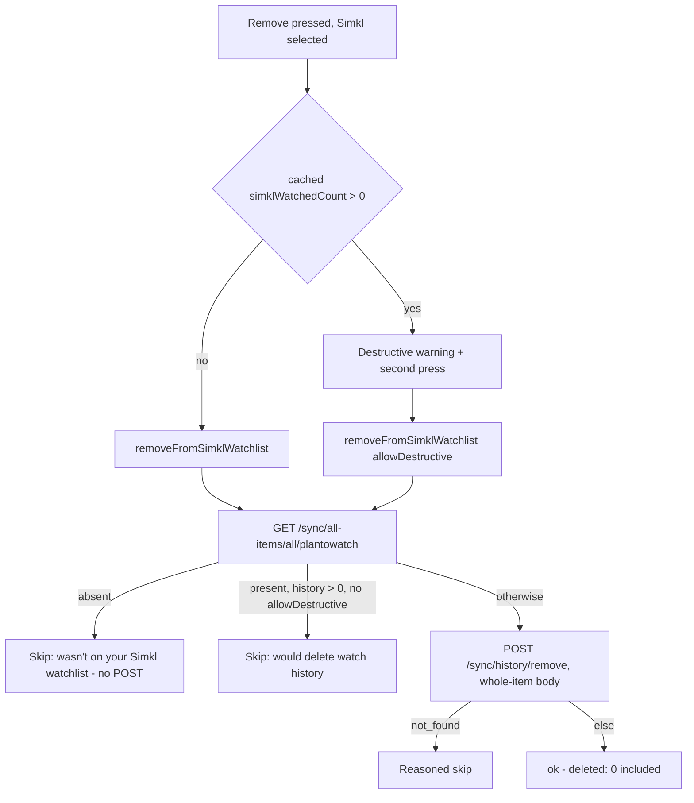

# Simkl Watchlist Removal - Plan

## Goal Capsule

- **Objective:** Make "Remove from watchlist" a real write on Simkl instead of the
  "Can't be removed from Shinobu yet" deep-link row it renders today — without
  letting Simkl's only un-track endpoint silently delete watch history and pull a
  show out of Continue Watching and This week.
- **Authority:** AGENTS.md overrides this plan where they conflict. Inherited
  non-negotiables: plan 0031 R36's fresh-read/fresh-id delete invariants, the
  per-provider partial-failure contract, plan 0022's never-a-dead-end rule, and
  Simkl's rate-limit/write-lock discipline
  (`docs/solutions/simkl-rate-limits-and-write-lock.md`).
- **Stop conditions:** stop and surface if a status-only Simkl removal turns out to
  exist after all (it would make the guard unnecessary), or if flipping the token
  would require weakening R36.

---

## Product Contract

### Problem Frame

Owner-reported, 2026-08-01. The removal picker for a Simkl-watchlisted show offers
"Remove on Simkl — Can't be removed from Shinobu yet", a deep link out to the
website. Simkl is the first-class provider now (plan 0034), so the one verb it
can't perform is the one users hit most.

The reason it shipped gated is real: `POST /sync/history/remove` is the only
un-track Simkl documents, and a whole-item body deletes the plan-to-watch entry,
the watch history **and** the rating together. Because the Simkl library is what
feeds Continue Watching and This week, an unguarded flip would let a watchlist
edit make a show the user is actually watching disappear from both.

### Requirements

- R1. Removing a Simkl-held item from the watchlist is a real fan-out write, with
  the same per-provider outcome reporting every other removal target has.
- R2. A removal never destroys watch history without the user having been told, in
  the picker, exactly what is lost — including that the show leaves Continue
  Watching and This week with it.
- R3. The destructive case takes the **same** two-press confirm AniList's CURRENT
  entries already take (plan 0035 R3); no second confirm mechanism is invented.
- R4. What actually gets destroyed is judged by a fresh in-effect read immediately
  before the write, never by the 15-minute-stale watchlist gather (R36 applied to
  a second provider). The cached value drives the *warning* only.
- R5. The derived post-log removal (a watched film leaves every watchlist, plan
  0033 U7) must not fire a Simkl write.
- R6. Docs stating Simkl's removal is gated, or that the providers are three and
  equal, are corrected in the same change.

### Scope Boundaries

- **Not touched:** which statuses feed Continue Watching (`watching`) and This week
  (`watching` ∪ `plantowatch`) — plan 0034 U8/KTD-4 stand; Serializd's removal
  (still `'manual'`, still blocked on its read leg, R32); bulk removal.
- **Deliberately not built:** a "move to another status instead of deleting"
  fallback. It would leave the item in the user's library after they asked for it
  to leave their watchlist, which is a different verb wearing this one's label.

---

## Planning Contract

### Key Technical Decisions

- **KTD1 — Guard the hazard, don't avoid it.** Plan 0034 gated `watchlistRemove`
  on a live probe "confirming the un-track doesn't destroy watched state". The
  docs answer that outright: it does, always, and there is no status-only variant
  (`docs/solutions/simkl-watchlist-remove-deletes-history.md`). So the gate can
  never clear on its own terms. What makes the flip safe instead is that the
  hazard is *narrow* — under one-status-per-item a `plantowatch` row normally
  holds nothing — and *detectable*: one live read separates the harmless case from
  the destructive one. Rejected alternative: keep it manual forever, which fails
  R1 for a first-class provider over an edge case.
- **KTD2 — The fresh read is `GET /sync/all-items/all/plantowatch`, and it earns
  three things at once.** It proves membership, it measures what would be lost,
  and — because an item a log just promoted is simply absent from it — it turns
  the derived-removal write-lock collision into a no-POST skip. One GET against a
  10 GET/s budget, per explicit user press.
- **KTD3 — `deleted: 0` stops being a skip.** The old adapter read `deleted: 0` as
  "wasn't in your library". With membership proven by the guard read, a
  plan-to-watch row simply has no history rows to delete, so zero is the *normal*
  answer for a clean removal. `not_found` remains the failure signal.
- **KTD4 — The warning hint rides the gather as `simklWatchedCount`, exactly like
  `anilistStatus`.** Stamped on every Simkl row including zero, carried through
  `computeWatchlist` (the Simkl row is often not the precedence winner), read by
  `destructiveRemoveWarning`. A hint, never evidence — KTD2's read is the
  authority, per plan 0035 KTD2's precedent of not paying a network read for copy
  precision.
- **KTD5 — The derived path drops Simkl by filtering `providers`, and returns early
  when that leaves nothing.** `resolveWriteTargets` treats an empty `providers`
  array as "no opt-out given" and falls back to every routed target, so passing
  `[]` would do the opposite of what it looks like.

### High-Level Technical Design

---

## Execution

One landable commit. Gates: `bun test --isolate`, `bun typecheck`, `bun lint`,
`bun check:classnames`, `bun check:router-push`, `bun check:links`, plus a device
run of the removal on a real Simkl account.

| # | Change |
| --- | --- |
| 1 | `simkl/writes.ts` — fresh-read guard, `allowDestructive`, `deleted: 0` is ok |
| 2 | `registry.ts` — `simkl.watchlistRemove: 'write'` |
| 3 | `use-unwatchlist-media.ts` — the adapter, threading `allowDestructive` |
| 4 | `watchlist/types.ts` + `compute.ts` + `state/queries/watchlist.ts` — the `simklWatchedCount` hint |
| 5 | `watchlist-media/copy.ts` + `watchlist-picker-sheet.tsx` — the Simkl warning branch |
| 6 | `remove-watched-from-watchlist.ts` — Simkl excluded (KTD5) |
| 7 | Docs — new solution doc, rate-limit doc's open item resolved, `plan.md` 1.2 amendment |
| 8 | Follow-up found during the device pass (below) |

### U8 — Parked shows go dark on their own details screen

Surfaced by the owner mid-implementation, on the same Batman entry this plan's
guard was built for: a show reading "10 / 20 episodes" had no log button and no
season checkmarks, because `useSimklWatchingEntryQuery` read the `watching`
snapshot only and a `plantowatch`-parked show isn't in it. Same root state as
R2's hazard, opposite surface.

- The hook falls back to the `plantowatch` snapshot on a miss (both are entries
  other surfaces already cache; the fallback query is `enabled` only when the
  first answered `null`).
- `nextEpisodeFromSimklEntry`'s pointer-less branch stops claiming "rewatch"
  when a *known* aired count exceeds `currentProgress` — without which the
  fallback would have offered a rewatch of S1E1 for a 10-of-20 show.

Evidence, and the general rule it generalizes to:
`docs/solutions/simkl-parked-shows-have-no-next-to-watch.md`.

## Follow-Up Work

- Serializd's `watchlistRemove` is still `'manual'`, still waiting on its watchlist
  read leg (plan 0031 R32) — unchanged by this plan.
- If Simkl ever ships a status-only removal, the guard read becomes optional and
  the destructive branch can be deleted outright.
